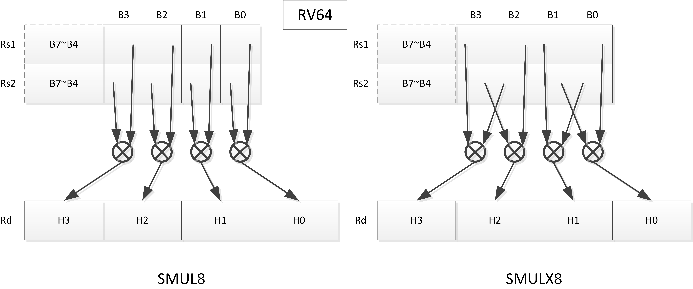

= RISC-V "P" Extension Proposal
Version 0.9.8-draft-20210927
This document is in the Development state. Assume anything can change.
:doctype: book
:encoding: utf-8
:lang: en
:toc: left
:toclevels: 4
:numbered:
:stem: latexmath
:xrefstyle: short
:le: &#8804;
:rarr: &#8658;
:imagesdir: images
:title-logo-image: image:risc-v_logo.png[pdfwidth=3.25in,align=center]

[preface]
== Revision History

[cols="^.^10,^.^15,^.^15,<.^60", options="header"]
|===
|Rev.|Revision Date|Author|Revised Content
| v0.9.8 | 2021/09/27 | Chuanhua Chang
a|
* Removed ADD64 and SUB64 from RV64 Zpsfoperand
| v0.9.7 | 2021/09/15 | Chuanhua Chang
a|
* Added Zbpbo extension for RVB overlaps.
* Added notes for Zbpbo-replaced instructions.
| v0.9.6 | 2021/09/08 | Chuanhua Chang
a|
* Merged Zprvsfextra into Zpn
* Removed CLO* instructions based on github issue #60
* Changed intrinsic prefix from \\__rv__ to \__rv_
| v0.9.5 | 2021/06/17 | Chuanhua Chang
a|
* Synced RV32 paired register scheme with Zdinx.
| v0.9.4 | 2021/04/29 | Chuanhua Chang
a|
* Fixed few typos and enhanced precision descriptions on imtermediate results.
* Fixed/Changed data types for some intrinsic functions.
* Removed "RV32 Only" for Zpsfoperand.
| v0.9.3 | 2021/03/25 | Chuanhua Chang
a|
* Changed Zp64 name to Zpsfoperand.
* Added Zprvsfextra for RV64 only instructions.
* Removed SWAP16 encoding. It is an alias for PKBT16.
* Fixed few typos and enhanced precision descriptions on imtermediate results.
| v0.9.2 | 2021/02/02 | Chuanhua Chang
a|
* Changed major opcode "GE80B 1111111" to "OP-P 1110111".
* Added Zpn for instructins not belonging to Zpsfoperand.
* Fixed several typos and inconsistencies. 
| v0.9.1 | 2021/01/26 | Chuanhua Chang
| Maintainance update; fixed several format issues and typos.
| v0.9   | 2020/09/04 | Chuanhua Chang
| Fixed several typos and encoding inconsistencies between encoding table and instruction format.
| v0.8   | 2020/08/07 | Chuanhua Chang
a|
* Changed ucode (0x801) CSR to vxsat CSR (0x009)
* Changed intrinsic prefix from \\__nds__ to \\__rv__
| v0.7   | 2020/07/14 | Chuanhua Chang
a|
* Added endian-related data layout descriptions for RV32 register pair of 64-bit operand.
* Removed khm32/khmx32 errors from the encoding table.
| v0.6   | 2020/06/01 | Chuanhua Chang
a|
* Fixed descriptions/pseudo code for all unsigned halving operations to reduce confusion.
* Added intXLEN_t and uintXLEN_t as data types for intrinsic functions.
| v0.5.4 | 2020/03/02 | Chuanhua Chang
| Added P subset extensions (<<pext_subset>>)
| v0.5.3 | 2019/11/8 | Chuanhua Chang
| Adjusted BPICK encoding along with the following 20 instructions:
STAS16, RSTAS16, KSTAS16, URSTAS16, UKSTAS16, STSA16, RSTSA16, KSTSA16,
URSTSA16, UKSTSA16, STAS32, RSTAS32, KSTAS32, URSTAS32, UKSTAS32, STSA32,
RSTSA32, KSTSA32, URSTSA32, UKSTSA32. (<<pext_encode>>)
| v0.5.2 | 2019/10/17 | Chuanhua Chang
| Fixed SRAIW.u operation typo. (<<sraiw_u>>)
| v0.5.1 | 2019/10/8 | Chuanhua Chang
| Fixed SLLI32 encoding. (<<slli32>>)
| v0.5.0 | 2019/4/26 | Chuanhua Chang
| Initial Release.
|===

<<<
== Introduction

Digital Signal Processing (DSP), has emerged as an important technology for modern
electronic systems. A wide range of modern applications employ DSP algorithms to
solve problems in their particular domains, including sensor fusion, servo motor
control, audio decode/encode, speech synthesis and coding, MPEG4 decode, medical
imaging, computer vision, embedded control, robotics, human interface, etc.

The proposed P instruction set extension increases the DSP algorithm processing
capabilities of the RISC-V CPU IP products. With the addition of the RISC-V P instruction
set extension, the RISC-V CPUs can now run these various DSP applications with lower
power and higher performance.

<<<
== Shorthand Definitions and Terminology

=== Shorthand Definitions

* r.H == rH1: r[31:16], r.L == r.H0: r[15:0]
* r.B3: r[31:24], r.B2: r[23:16], r.B1: r[15:8], r.B0: r[7:0]
* r.B[x]: r[(x*8+7):(x*8+0)]
* r.H[x]: r[(x*16+15):(x*16+0)]
* r.W[x]: r[(x*32+31):(x*32+0)]
* r.D[x]: r[(x*64+63):(x*64+0)]
* r[xU]: the upper 32-bit of a 64-bit number; xU represents the GPR number that contains this upper part 32-bit value.
* r[xL]: the lower 32-bit of a 64-bit number; xL represents the GPR number that contains this lower part 32-bit value.
* r[xU].r[xL]: a 64-bit number that is formed from a pair of GPRs.
* s>>: signed arithmetic right shift.
* u>>: unsigned logical right shift.
* u<<: logical left shift, shifting in 0 from the right side.
* SAT.Qn(): Saturate to the range of [-2^n^, 2^n^-1], if saturation happens, set OV flag.
* SAT.Um(): Saturate to the range of [0, 2^m^-1], if saturation happens, set OV flag.
* ROUND(): Indicate “rounding”, i.e., add 1 to the most significant discarded bit for right shift or MSW-type multiplication instructions.
* SUM(): Summation of all data elements.
* Sign or Zero Extending functions:
** SEm(data): Sign-Extend data to m-bit.
** SE_XLEN(data): Sign-Extend data to XLEN-bit.
** ZEm(data): Zero-Extend data to m-bit.
** ZE_XLEN(data): Zero-Extend data to XLEN-bit.
* ABS(x): Calculate the absolute value of “x”.
* CONCAT(x,y): Concatinate “x” and “y” to form a value.
* u<: Unsigned less than comparison.
* u{le}: Unsigned less than & equal comparison.
* u>: Unsigned greater than comparison.
* s<: Signed less than comparison.
* s{le}: Signed less than & equal comparison.
* s>: Signed greater than comparison.
* s*: Signed multiplication.
* u*: Unsigned multiplication.
* su*: Signed and Unsigned multiplication.

=== Terminology

* GPR: General purpose register.
* Q-format (Qm.n): It describes a signed binary fixed point number format. "m" is the number of bits, including the sign bit and integer bits, before a notional binary point, and "n" is the number of fraction bits that follow it. This notation represents a signed binary fixed point value in the range of -2^(m-1) (inclusive) and 2^(m-1) (exclusive), with 2^(m+n) unique values available in that range. For example, Q1.15 represents a number in the range of -1 (inclusive) and 1 (exclusive), with 65536 unique values available in that range.
* Qn: A shorthand format for Q1.n. For example, Q7, Q15, Q31, Q63.
* Um: It represents an unsigned binary number in the range of 0 and (2^m)-1.

<<<
== RISC-V P Extension Instruction Summary

=== SIMD Data Processing Instructions

==== 16-bit Addition & Subtraction Instructions

Based on the combination of the types of the two 16-bit arithmetic operations, the SIMD 16-bit add/subtract instructions can be classified into 6 main categories: Addition (two 16-bit addition), Subtraction (two 16-bit subtraction), Crossed Add & Sub (one addition and one subtraction), and Crossed Sub & Add (one subtraction and one addition), Straight Add & Sub (one addition and one subtraction), and Straight Sub & Add (one subtraction and one addition).

Based on the way of how an overflow condition is handled, the SIMD 16-bit add/subtract instructions can be classified into 5 groups: Wrap-around (dropping overflow), Signed Halving (keeping overflow by dropping 1 LSB bit), Unsigned Halving, Signed Saturation (clipping overflow), and Unsigned Saturation.

Together, there are 30 SIMD 16-bit add/subtract instructions.

.SIMD 16-bit Add/Subtract Instructions
[cols="^.^1,<.^2,<.^2,<.^4",options="header",]
|===
^.^|No. ^.^|Mnemonic ^.^|Instruction ^.^|Operation
|1 |ADD16 rd, rs1, rs2 |16-bit Addition a|
....
rd.H[x] = rs1.H[x] + rs2.H[x];

(RV32: x=1..0, RV64: x=3..0)
....
|2 |RADD16 rd, rs1, rs2 |16-bit Signed Halving Addition a|
....
a17[x] = SE17(rs1.H[x]);
b17[x] = SE17(rs2.H[x]);
t17[x] = a17[x] + b17[x];
rd.H[x] = t17[x] s>> 1;

(RV32: x=1..0, RV64: x=3..0)
....
|3 |URADD16 rd, rs1, rs2 |16-bit Unsigned Halving Addition a|
....
a17[x] = ZE17(rs1.H[x]);
b17[x] = ZE17(rs2.H[x]);
t17[x] = a17[x] + b17[x];
rd.H[x] = t17[x] u>> 1;

(RV32: x=1..0, RV64: x=3..0)
....
|4 |KADD16 rd, rs1, rs2 |16-bit Signed Saturating Addition a|
....
a17[x] = SE17(rs1.H[x]);
b17[x] = SE17(rs2.H[x]);
t17[x] = a17[x] + b17[x];
rd.H[x] = SAT.Q15(t17[x]);

(RV32: x=1..0, RV64: x=3..0)
....
|5 |UKADD16 rd, rs1, rs2 |16-bit Unsigned Saturating Addition a|
....
a17[x] = ZE17(rs1.H[x]);
b17[x] = ZE17(rs2.H[x]);
t17[x] = a17[x] + b17[x];
rd.H[x] = SAT.U16(t17[x]);

(RV32: x=1..0, RV64: x=3..0)
....
|6 |SUB16 rd, rs1, rs2 |16-bit Subtraction a|
....
rd.H[x] = rs1.H[x] - rs2.H[x];

(RV32: x=1..0, RV64: x=3..0)
....
|7 |RSUB16 rd, rs1, rs2 |16-bit Signed Halving Subtraction a|
....
a17[x] = SE17(rs1.H[x]);
b17[x] = SE17(rs2.H[x]);
t17[x] = a17[x] - b17[x];
rd.H[x] = t17[x] s>> 1;

(RV32: x=1..0, RV64: x=3..0)
....
|8 |URSUB16 rd, rs1, rs2 |16-bit Unsigned Halving Subtraction a|
....
a17[x] = ZE17(rs1.H[x]);
b17[x] = ZE17(rs2.H[x]);
t17[x] = a17[x] - b17[x];
rd.H[x] = t17[x] u>> 1;

(RV32: x=1..0, RV64: x=3..0)
....
|9 |KSUB16 rd, rs1, rs2 |16-bit Signed Saturating Subtraction a|
....
a17[x] = SE17(rs1.H[x]);
b17[x] = SE17(rs2.H[x]);
t17[x] = a17[x] - b17[x];
rd.H[x] = SAT.Q15(t17[x]);

(RV32: x=1..0, RV64: x=3..0)
....
|10 |UKSUB16 rd, rs1, rs2 |16-bit Unsigned Saturating Subtraction a|
....
a17[x] = ZE17(rs1.H[x]);
b17[x] = ZE17(rs2.H[x]);
t17[x] = a17[x] - b17[x];
rd.H[x] = SAT.U16(t17[x]);

(RV32: x=1..0, RV64: x=3..0)
....
|11 |CRAS16 rd, rs1, rs2 |16-bit Cross Add & Sub a|
....
rd.H[x] = rs1.H[x] + rs2.H[x-1]; 
rd.H[x-1] = rs1.H[x-1] – rs2.H[x];

(RV32: x=1, RV64: x=1,3)
....
|12 |RCRAS16 rd, rs1, rs2 |16-bit Signed Halving Cross Add & Sub a|
....
ah17[x] = SE17(rs1.H[x]);
bh17[x] = SE17(rs2.H[x]);
al17[x] = SE17(rs1.H[x-1]);
bl17[x] = SE17(rs2.H[x-1]);
e17[x] = ah17[x] + bl17[x];
f17[x] = al17[x] – bh17[x];
rd.H[x]   = e17[x] s>> 1; 
rd.H[x-1] = f17[x] s>> 1;

(RV32: x=1, RV64: x=1,3)
....
|13 |URCRAS16 rd, rs1, rs2 |16-bit Unsigned Halving Cross Add & Sub a|
....
ah17[x] = ZE17(rs1.H[x]);
bh17[x] = ZE17(rs2.H[x]);
al17[x] = ZE17(rs1.H[x-1]);
bl17[x] = ZE17(rs2.H[x-1]);
th17[x] = ah17[x] + bl17[x];
tl17[x] = al17[x] – bh17[x];
rd.H[x]   = th17[x] u>> 1;
rd.H[x-1] = tl17[x] u>> 1;

(RV32: x=1, RV64: x=1,3)
....
|14 |KCRAS16 rd, rs1, rs2 |16-bit Signed Saturating Cross Add & Sub a|
....
ah17[x] = SE17(rs1.H[x]);
bh17[x] = SE17(rs2.H[x]);
al17[x] = SE17(rs1.H[x-1]);
bl17[x] = SE17(rs2.H[x-1]);
th17[x] = ah17[x] + bl17[x];
tl17[x] = al17[x] – bh17[x];
rd.H[x]   = SAT.Q15(th17[x]);
rd.H[x-1] = SAT.Q15(tl17[x]);

(RV32: x=1, RV64: x=1,3)
....
|15 |UKCRAS16 rd, rs1, rs2 |16-bit Unsigned Saturating Cross Add & Sub a|
....
ah17[x] = ZE17(rs1.H[x]);
bh17[x] = ZE17(rs2.H[x]);
al17[x] = ZE17(rs1.H[x-1]);
bl17[x] = ZE17(rs2.H[x-1]);
th17[x] = ah17[x] + bl17[x];
tl17[x] = al17[x] – bh17[x];
rd.H[x]   = SAT.U16(th17[x]);
rd.H[x-1] = SAT.U16(tl17[x]);

(RV32: x=1, RV64: x=1,3)
....
|16 |CRSA16 rd, rs1, rs2 |16-bit Cross Sub & Add a|
....
rd.H[x] = rs1.H[x] - rs2.H[x-1]; 
rd.H[x-1] = rs1.H[x-1] + rs2.H[x];

(RV32: x=1, RV64: x=1,3)
....
|17 |RCRSA16 rd, rs1, rs2 |16-bit Signed Halving Cross Sub & Add a|
....
ah17[x] = SE17(rs1.H[x]);
bh17[x] = SE17(rs2.H[x]);
al17[x] = SE17(rs1.H[x-1]);
bl17[x] = SE17(rs2.H[x-1]);
th17[x] = ah17[x] - bl17[x];
tl17[x] = al17[x] + bh17[x];
rd.H[x]   = th17[x] s>> 1;
rd.H[x-1] = tl17[x] s>> 1;

(RV32: x=1, RV64: x=1,3)
....
|18 |URCRSA16 rd, rs1, rs2 |16-bit Unsigned Halving Cross Sub & Add a|
....
ah17[x] = ZE17(rs1.H[x]);
bh17[x] = ZE17(rs2.H[x]);
al17[x] = ZE17(rs1.H[x-1]);
bl17[x] = ZE17(rs2.H[x-1]);
th17[x] = ah17[x] - bl17[x];
tl17[x] = al17[x] + bh17[x];
rd.H[x]   = th17[x] u>> 1;
rd.H[x-1] = tl17[x] u>> 1;

(RV32: x=1, RV64: x=1,3)
....
|19 |KCRSA16 rd, rs1, rs2 |16-bit Signed Saturating Cross Sub & Add a|
....
ah17[x] = SE17(rs1.H[x]);
bh17[x] = SE17(rs2.H[x]);
al17[x] = SE17(rs1.H[x-1]);
bl17[x] = SE17(rs2.H[x-1]);
th17[x] = ah17[x] - bl17[x];
tl17[x] = al17[x] + bh17[x];
rd.H[x]   = SAT.Q15(th17[x]);
rd.H[x-1] = SAT.Q15(tl17[x]);

(RV32: x=1, RV64: x=1,3)
....
|20 |UKCRSA16 rd, rs1, rs2 |16-bit Unsigned Saturating Cross Sub & Add a|
....
ah17[x] = ZE17(rs1.H[x]);
bh17[x] = ZE17(rs2.H[x]);
al17[x] = ZE17(rs1.H[x-1]);
bl17[x] = ZE17(rs2.H[x-1]);
th17[x] = ah17[x] - bl17[x];
tl17[x] = al17[x] + bh17[x];
rd.H[x]   = SAT.U16(th17[x]);
rd.H[x-1] = SAT.U16(tl17[x]);

(RV32: x=1, RV64: x=1,3)
....
|21 |STAS16 rd, rs1, rs2 |16-bit Straight Add & Sub a|
....
rd.H[x] = rs1.H[x] + rs2.H[x];
rd.H[x-1] = rs1.H[x-1] – rs2.H[x-1];

(RV32: x=1, RV64: x=1,3)
....
|22 |RSTAS16 rd, rs1, rs2 |16-bit Signed Halving Straight Add & Sub a|
....
ah17[x] = SE17(rs1.H[x]);
bh17[x] = SE17(rs2.H[x]);
al17[x] = SE17(rs1.H[x-1]);
bl17[x] = SE17(rs2.H[x-1]);
th17[x] = ah17[x] + bh17[x];
tl17[x] = al17[x] - bl17[x];
rd.H[x]   = th17[x] s>> 1;
rd.H[x-1] = tl17[x] s>> 1;

(RV32: x=1, RV64: x=1,3)
....
|23 |URSTAS16 rd, rs1, rs2 |16-bit Unsigned Halving Straight Add & Sub a|
....
ah17[x] = ZE17(rs1.H[x]);
bh17[x] = ZE17(rs2.H[x]);
al17[x] = ZE17(rs1.H[x-1]);
bl17[x] = ZE17(rs2.H[x-1]);
th17[x] = ah17[x] + bh17[x];
tl17[x] = al17[x] – bl17[x];
rd.H[x]   = th17[x] u>> 1;
rd.H[x-1] = tl17[x] u>> 1;

(RV32: x=1, RV64: x=1,3)
....
|24 |KSTAS16 rd, rs1, rs2 |16-bit Signed Saturating Straight Add & Sub a|
....
ah17[x] = SE17(rs1.H[x]);
bh17[x] = SE17(rs2.H[x]);
al17[x] = SE17(rs1.H[x-1]);
bl17[x] = SE17(rs2.H[x-1]);
th17[x] = ah17[x] + bh17[x];
tl17[x] = al17[x] - bl17[x];
rd.H[x]   = SAT.Q15(th17[x]);
rd.H[x-1] = SAT.Q15(tl17[x]);

(RV32: x=1, RV64: x=1,3)
....
|25 |UKSTAS16 rd, rs1, rs2 |16-bit Unsigned Saturating Straight Add & Sub a|
....
ah17[x] = ZE17(rs1.H[x]);
bh17[x] = ZE17(rs2.H[x]);
al17[x] = ZE17(rs1.H[x-1]);
bl17[x] = ZE17(rs2.H[x-1]);
th17[x] = ah17[x] + bh17[x];
tl17[x] = al17[x] – bl17[x];
rd.H[x]   = SAT.U16(th17[x]);
rd.H[x-1] = SAT.U16(tl17[x]);

(RV32: x=1, RV64: x=1,3)
....
|26 |STSA16 rd, rs1, rs2 |16-bit Straight Sub & Add a|
....
rd.H[x] = rs1.H[x] - rs2.H[x]; +
rd.H[x-1] = rs1.H[x-1] + rs2.H[x-1];

(RV32: x=1, RV64: x=1,3)
....
|27 |RSTSA16 rd, rs1, rs2 |16-bit Signed Halving Straight Sub & Add a|
....
ah17[x] = SE17(rs1.H[x]);
bh17[x] = SE17(rs2.H[x]);
al17[x] = SE17(rs1.H[x-1]);
bl17[x] = SE17(rs2.H[x-1]);
th17[x] = ah17[x] - bh17[x];
tl17[x] = al17[x] + bl17[x];
rd.H[x]   = th17[x] s>> 1;
rd.H[x-1] = tl17[x] s>> 1;

(RV32: x=1, RV64: x=1,3)
....
|28 |URSTSA16 rd, rs1, rs2 |16-bit Unsigned Halving Straight Sub & Add a|
....
ah17[x] = ZE17(rs1.H[x]);
bh17[x] = ZE17(rs2.H[x]);
al17[x] = ZE17(rs1.H[x-1]);
bl17[x] = ZE17(rs2.H[x-1]);
th17[x] = ah17[x] - bh17[x];
tl17[x] = al17[x] + bl17[x];
rd.H[x]   = th17[x] u>> 1;
rd.H[x-1] = tl17[x] u>> 1;

(RV32: x=1, RV64: x=1,3)
....
|29 |KSTSA16 rd, rs1, rs2 |16-bit Signed Saturating Straight Sub & Add a|
....
ah17[x] = SE17(rs1.H[x]);
bh17[x] = SE17(rs2.H[x]);
al17[x] = SE17(rs1.H[x-1]);
bl17[x] = SE17(rs2.H[x-1]);
th17[x] = ah17[x] - bh17[x];
tl17[x] = al17[x] + bl17[x];
rd.H[x]   = SAT.Q15(th17[x]);
rd.H[x-1] = SAT.Q15(tl17[x]);

(RV32: x=1, RV64: x=1,3)
....
|30 |UKSTSA16 rd, rs1, rs2 |16-bit Unsigned Saturating Straight Sub & Add a|
....
ah17[x] = ZE17(rs1.H[x]);
bh17[x] = ZE17(rs2.H[x]);
al17[x] = ZE17(rs1.H[x-1]);
bl17[x] = ZE17(rs2.H[x-1]);
th17[x] = ah17[x] - bh17[x];
tl17[x] = al17[x] + bl17[x];
rd.H[x]   = SAT.U16(th17[x]);
rd.H[x-1] = SAT.U16(tl17[x]);

(RV32: x=1, RV64: x=1,3)
....
|===

<<<
==== 8-bit Addition & Subtraction Instructions

Based on the types of the four 8-bit arithmetic operations, the SIMD 8-bit add/subtract instructions can be classified into 2 main categories: Addition (four 8-bit addition), and Subtraction (four 8-bit subtraction).

Based on the way of how an overflow condition is handled for singed or unsigned operation, the SIMD 8-bit add/subtract instructions can be classified into 5 groups: Wrap-around (dropping overflow), Signed Halving (keeping overflow by dropping 1 LSB bit), Unsigned Halving, Signed Saturation (clipping overflow), and Unsigned Saturation.

Together, there are 10 SIMD 8-bit add/subtract instructions.

.SIMD 8-bit Add/Subtract Instructions
[cols="^.^1,<.^2,<.^2,<.^4",options="header",]
|===
^.^|No. ^.^|Mnemonic ^.^|Instruction ^.^|Operation
|1 |ADD8 rd, rs1, rs2 |8-bit Addition a|
....
rd.B[x] = rs1.B[x] + rs2.B[x];

(RV32: x=3..0, RV64: x=7..0)
....
|2 |RADD8 rd, rs1, rs2 |8-bit Signed Halving Addition a|
....
a9[x] = SE9(rs1.B[x]);
b9[x] = SE9(rs2.B[x]);
t9[x] = a9[x] + b9[x];
rd.B[x] = t9[x] s>> 1;

(RV32: x=3..0, RV64: x=7..0)
....
|3 |URADD8 rd, rs1, rs2 |8-bit Unsigned Halving Addition a|
....
a9[x] = ZE9(rs1.B[x]);
b9[x] = ZE9(rs2.B[x]);
rd.B[x] = (a9[x] + b9[x]) u>> 1;

(RV32: x=3..0, RV64: x=7..0)
....
|4 |KADD8 rd, rs1, rs2 |8-bit Signed Saturating Addition a|
....
a9[x] = SE9(rs1.B[x]);
b9[x] = SE9(rs2.B[x]);
t9[x] = a9[x] + b9[x];
rd.B[x] = SAT.Q7(t9[x]);

(RV32: x=3..0, RV64: x=7..0)
....
|5 |UKADD8 rd, rs1, rs2 |8-bit Unsigned Saturating Addition a|
....
a9[x] = ZE9(rs1.B[x]);
b9[x] = ZE9(rs2.B[x]);
t9[x] = a9[x] + b9[x];
rd.H[x] = SAT.U8(t9[x]);

(RV32: x=1..0, RV64: x=3..0)
....
|6 |SUB8 rd, rs1, rs2 |8-bit Subtraction a|
....
rd.B[x] = rs1.B[x] - rs2.B[x];

(RV32: x=3..0, RV64: x=7..0)
....
|7 |RSUB8 rd, rs1, rs2 |8-bit Signed Halving Subtraction a|
....
a9[x] = SE9(rs1.B[x]);
b9[x] = SE9(rs2.B[x]);
t9[x] = a9[x] - b9[x];
rd.B[x] = t9[x] s>> 1;

(RV32: x=3..0, RV64: x=7..0)
....
|8 |URSUB8 rd, rs1, rs2 |8-bit Unsigned Halving Subtraction a|
....
a9[x] = ZE9(rs1.B[x]);
b9[x] = ZE9(rs2.B[x]);
rd.B[x] = (a9[x] - b9[x]) u>> 1;

(RV32: x=3..0, RV64: x=7..0)
....
|9 |KSUB8 rd, rs1, rs2 |8-bit Signed Saturating Subtraction a|
....
a9[x] = SE9(rs1.B[x]);
b9[x] = SE9(rs2.B[x]);
t9[x] = a9[x] - b9[x];
rd.B[x] = SAT.Q7(t9[x]);

(RV32: x=3..0, RV64: x=7..0)
....
|10 |UKSUB8 rd, rs1, rs2 |8-bit Unsigned Saturating Subtraction a|
....
a9[x] = ZE9(rs1.B[x]);
b9[x] = ZE9(rs2.B[x]);
t9[x] = a9[x] - b9[x];
rd.H[x] = SAT.U8(t9[x]);

(RV32: x=1..0, RV64: x=3..0)
....
|===

<<<
==== 16-bit Shift Instructions

There are 14 instructions here.

.SIMD 16-bit Shift Instructions
[cols="^.^1,<.^2,<.^2,<.^4",options="header",]
|===
^.^|No. ^.^|Mnemonic ^.^|Instruction ^.^|Operation
|1 |SRA16 rd, rs1, rs2 |16-bit Shift Right Arithmetic a|
....
rd.H[x] = rs1.H[x] s>> rs2[3:0];

(RV32: x=1..0, RV64: x=3..0)
....
|2 |SRAI16 rd, rs1, im4u |16-bit Shift Right Arithmetic Immediate a|
....
rd.H[x] = rs1.H[x] s>> im4u;

(RV32: x=1..0, RV64: x=3..0)
....
|3 |SRA16.u rd, rs1, rs2 |16-bit Rounding Shift Right Arithmetic a|
....
a[x] = rs1.H[x];
rd.H[x] = ROUND(a[x] s>> rs2[3:0]);

(RV32: x=1..0, RV64: x=3..0)
....
|4 |SRAI16.u rd, rs1, im4u |16-bit Rounding Shift Right Arithmetic Immediate a|
....
rd.H[x] = ROUND(rs1.H[x] s>> im4u);

(RV32: x=1..0, RV64: x=3..0)
....
|5 |SRL16 rd, rs1, rs2 |16-bit Shift Right Logical a|
....
rd.H[x] = rs1.H[x] u>> rs2[3:0];

(RV32: x=1..0, RV64: x=3..0)
....
|6 |SRLI16 rd, rs1, im4u |16-bit Shift Right Logical Immediate a|
....
rd.H[x] = rs1.H[x] u>> im4u;

(RV32: x=1..0, RV64: x=3..0)
....
|7 |SRL16.u rd, rs1, rs2 |16-bit Rounding Shift Right Logical a|
....
a[x] = rs1.H[x];
rd.H[x] = ROUND(a[x] u>> rs2[3:0]);

(RV32: x=1..0, RV64: x=3..0)
....
|8 |SRLI16.u rd, rs1, im4u |16-bit Rounding Shift Right Logical Immediate a|
....
rd.H[x] = ROUND(rs1.H[x] u>> im4u);

(RV32: x=1..0, RV64: x=3..0)
....
|9 |SLL16 rd, rs1, rs2 |16-bit Shift Left Logical a|
....
rd.H[x] = rs1.H[x] << rs2[3:0];

(RV32: x=1..0, RV64: x=3..0)
....
|10 |SLLI16 rd, rs1, im4u |16-bit Shift Left Logical Immediate a|
....
rd.H[x] = rs1.H[x] << im4u;

(RV32: x=1..0, RV64: x=3..0)
....
|11 |KSLL16 rd, rs1, rs2 |16-bit Saturating Shift Left Logical a|
....
a[x] = rs1.H[x];
rd.H[x] = SAT.Q15(a[x] << rs2[3:0]);

(RV32: x=1..0, RV64: x=3..0)
....
|12 |KSLLI16 rd, rs1, im4u |16-bit Saturating Shift Left Logical Immediate a|
....
rd.H[x] = SAT.Q15(rs1.H[x] << im4u);

(RV32: x=1..0, RV64: x=3..0)
....
|13 |KSLRA16 rd, rs1, rs2 |16-bit Shift Left Logical with Saturation & Shift Right Arithmetic a|
....
a[x] = rs1.H[x];
if (rs2[4:0] s< 0)
  t[x] = a[x] s>> -rs2[4:0];
if (rs2[4:0] s> 0)
  t[x] = SAT.Q15(a[x] << rs2[4:0]);
rd.H[x] = t[x];

(RV32: x=1..0, RV64: x=3..0)
....
|14 |KSLRA16.u rd, rs1, rs2 |16-bit Shift Left Logical with Saturation & Rounding Shift Right Arithmetic a|
....
a[x] = rs1.H[x];
if (rs2[4:0] s< 0)
  t[x] = ROUND(a[x] s>> -rs2[4:0]);
if (rs2[4:0] s> 0)
  t[x] = SAT.Q15(a[x] << rs2[4:0]);
rd.H[x] = t[x];

(RV32: x=1..0, RV64: x=3..0)
....
|===

<<<
==== 8-bit Shift Instructions

There are 14 instructions here.

.SIMD 8-bit Shift Instructions
[cols="^.^1,<.^2,<.^2,<.^4",options="header",]
|===
^.^|No. ^.^|Mnemonic ^.^|Instruction ^.^|Operation
|1 |SRA8 rd, rs1, rs2 |8-bit Shift Right Arithmetic a|
....
rd.B[x] = rs1.B[x] s>> rs2[2:0];

(RV32: x=3..0, RV64: x=7..0)
....
|2 |SRAI8 rd, rs1, im3u |8-bit Shift Right Arithmetic Immediate a|
....
rd.B[x] = rs1.B[x] s>> im3u;

(RV32: x=3..0, RV64: x=7..0)
....
|3 |SRA8.u rd, rs1, rs2 |8-bit Rounding Shift Right Arithmetic a|
....
a[x] = rs1.B[x];
rd.B[x] = ROUND(a[x] s>> rs2[2:0]);

(RV32: x=3..0, RV64: x=7..0)
....
|4 |SRAI8.u rd, rs1, im3u |8-bit Rounding Shift Right Arithmetic Immediate a|
....
rd.B[x] = ROUND(rs1.B[x] s>> im3u);

(RV32: x=3..0, RV64: x=7..0)
....
|5 |SRL8 rd, rs1, rs2 |8-bit Shift Right Logical a|
....
rd.B[x] = rs1.B[x] u>> rs2[2:0];

(RV32: x=3..0, RV64: x=7..0)
....
|6 |SRLI8 rd, rs1, im3u |8-bit Shift Right Logical Immediate a|
....
rd.B[x] = rs1.B[x] u>> im3u;

(RV32: x=3..0, RV64: x=7..0)
....
|7 |SRL8.u rd, rs1, rs2 |8-bit Rounding Shift Right Logical a|
....
a[x] = rs1.B[x];
rd.B[x] = ROUND(a[x] u>> rs2[2:0]);

(RV32: x=3..0, RV64: x=7..0)
....
|8 |SRLI8.u rd, rs1, im3u |8-bit Rounding Shift Right Logical Immediate a|
....
rd.B[x] = ROUND(rs1.B[x] u>> im3u);

(RV32: x=3..0, RV64: x=7..0)
....
|9 |SLL8 rd, rs1, rs2 |8-bit Shift Left Logical a|
....
rd.B[x] = rs1.B[x] << rs2[2:0];

(RV32: x=3..0, RV64: x=7..0)
....
|10 |SLLI8 rd, rs1, im3u |8-bit Shift Left Logical Immediate a|
....
rd.B[x] = rs1.B[x] << im3u;

(RV32: x=3..0, RV64: x=7..0)
....
|11 |KSLL8 rd, rs1, rs2 |8-bit Saturating Shift Left Logical a|
....
a[x] = rs1.B[x];
rd.B[x] = SAT.Q7(a[x] << rs2[2:0]);

(RV32: x=3..0, RV64: x=7..0)
....
|12 |KSLLI8 rd, rs1, im3u |8-bit Saturating Shift Left Logical Immediate a|
....
rd.B[x] = SAT.Q7(rs1.B[x] << im3u);

(RV32: x=3..0, RV64: x=7..0)
....
|13 |KSLRA8 rd, rs1, rs2 |8-bit Shift Left Logical with Saturation & Shift Right Arithmetic a|
....
a[x] = rs1.B[x];
if (rs2[3:0] s< 0)
  t[x] = a[x] s>> -rs2[3:0];
if (rs2[3:0] s> 0)
  t[x] = SAT.Q7(a[x] << rs2[3:0]);
rd.B[x] = t[x];  

(RV32: x=3..0, RV64: x=7..0)
....
|14 |KSLRA8.u rd, rs1, rs2 |8-bit Shift Left Logical with Saturation & Rounding Shift Right Arithmetic a|
....
a[x] = rs1.B[x];
if (rs2[3:0] s< 0)
  t[x] = ROUND(a[x] s>> -rs2[3:0]);
if (rs2[3:0] s> 0)
  t[x] = SAT.Q7(a[x] << rs2[3:0]);
rd.B[x] = t[x];  

(RV32: x=3..0, RV64: x=7..0)
....
|===

<<<
==== 16-bit Compare Instructions

There are 5 instructions here.

.SIMD 16-bit Compare Instructions
[cols="^.^1,<.^2,<.^2,<.^4m",options="header",]
|===
^.^|No. ^.^|Mnemonic ^.^|Instruction ^.^|Operation
|1 |CMPEQ16 rd, rs1, rs2 |16-bit Compare Equal a|
....
eq[x] = (rs1.H[x] == rs2.H[x]);
rd.H[x] = eq[x]? 0xffff : 0;

(RV32: x=1..0, RV64: x=3..0)
....
|2 |SCMPLT16 rd, rs1, rs2 |16-bit Signed Compare Less Than a|
....
lt[x] = (rs1.H[x] s< rs2.H[x]);
rd.H[x] = lt[x]? 0xffff : 0;

(RV32: x=1..0, RV64: x=3..0)
....
|3 |SCMPLE16 rd, rs1, rs2 |16-bit Signed Compare Less Than & Equal a|
....
le[x] = (rs1.H[x] s<= rs2.H[x]);
rd.H[x] = le[x]? 0xffff : 0;

(RV32: x=1..0, RV64: x=3..0)
....
|4 |UCMPLT16 rd, rs1, rs2 |16-bit Unsigned Compare Less Than a|
....
ult[x] = (rs1.H[x] u< rs2.H[x]);
rd.H[x] = ult[x]? 0xffff : 0;

(RV32: x=1..0, RV64: x=3..0)
....
|5 |UCMPLE16 rd, rs1, rs2 |16-bit Unsigned Compare Less Than & Equal a|
....
ule[x] = (rs1.H[x] u<= rs2.H[x]);
rd.H[x] = ule[x]? 0xffff : 0;

(RV32: x=1..0, RV64: x=3..0)
....
|===

<<<
==== 8-bit Compare Instructions

There are 5 instructions here.

.SIMD 8-bit Compare Instructions
[cols="^.^1,<.^2,<.^2,<.^4",options="header",]
|===
^.^|No. ^.^|Mnemonic ^.^|Instruction ^.^|Operation
|1 |CMPEQ8 rd, rs1, rs2 |8-bit Compare Equal a|
....
eq[x] = (rs1.B[x] == rs2.B[x]);
rd.B[x] = eq[x]? 0xff : 0;

(RV32: x=3..0, RV64: x=7..0)
....
|2 |SCMPLT8 rd, rs1, rs2 |8-bit Signed Compare Less Than a|
....
lt[x] = (rs1.B[x] s< rs2.B[x]);
rd.B[x] = lt[x]? 0xff : 0;

(RV32: x=3..0, RV64: x=7..0)
....
|3 |SCMPLE8 rd, rs1, rs2 |8-bit Signed Compare Less Than & Equal a|
....
le[x] = (rs1.B[x] s<= rs2.B[x]);
rd.B[x] = le[x]? 0xff : 0;

(RV32: x=3..0, RV64: x=7..0)
....
|4 |UCMPLT8 rd, rs1, rs2 |8-bit Unsigned Compare Less Than a|
....
ult[x] = (rs1.B[x] u< rs2.B[x]);
rd.B[x] = ult[x]? 0xff : 0;

(RV32: x=3..0, RV64: x=7..0)
....
|5 |UCMPLE8 rd, rs1, rs2 |8-bit Unsigned Compare Less Than & Equal a|
....
ule[x] = (rs1.B[x] u<= rs2.B[x]);
rd.B[x] = ule[x]? 0xff : 0;

(RV32: x=3..0, RV64: x=7..0)
....
|===

<<<
==== 16-bit Multiply Instructions

There are 6 instructions here.

.SIMD 16-bit Multiply Instructions
[cols="^.^1,<.^2,<.^2,<.^4",options="header",]
|===
^.^|No. ^.^|Mnemonic ^.^|Instruction ^.^|Operation
|1 |SMUL16 rd, rs1, rs2 |16-bit Signed Multiply a|
....
RV32:

r[dL] = rs1.H[0] s* rs2.H[0];
r[dU] = rs1.H[1] s* rs2.H[1];

RV64:

rd.W[0] = rs1.H[0] s* rs2.H[0];
rd.W[1] = rs1.H[1] s* rs2.H[1];
....
|2 |SMULX16 rd, rs1, rs2 |16-bit Signed Crossed Multiply a|
....
RV32:

r[dL] = rs1.H[0] s* rs2.H[1];
r[dU] = rs1.H[1] s* rs2.H[0];

RV64:

rd.W[0] = rs1.H[0] s* rs2.H[1];
rd.W[1] = rs1.H[1] s* rs2.H[0];
....
|3 |UMUL16 rd, rs1, rs2 |16-bit Unsigned Multiply a|
....
RV32:

r[dL] = rs1.H[0] u* rs2.H[0];
r[dU] = rs1.H[1] u* rs2.H[1];

RV64:

rd.W[0] = rs1.H[0] u* rs2.H[0];
rd.W[1] = rs1.H[1] u* rs2.H[1];
....
|4 |UMULX16 rd, rs1, rs2 |16-bit Unsigned Crossed Multiply a|
....
RV32:

r[dL] = rs1.H[0] u* rs2.H[1];
r[dU] = rs1.H[1] u* rs2.H[0];

RV64:

rd.W[0] = rs1.H[0] u* rs2.H[1];
rd.W[1] = rs1.H[1] u* rs2.H[0];
....
|5 |KHM16 rd, rs1, rs2 |Q15 Signed Saturating Multiply a|
....
t[x] = rs1.H[x] s* rs2.H[x];
rd.H[x] = SAT.Q15(t[x] s>> 15);

(RV32: x=1..0, RV64: x=3..0)
....
|6 |KHMX16 rd, rs1, rs2 |Q15 Signed Saturating Crossed Multiply a|
....
t[x] = rs1.H[x] s* rs2.H[y];
rd.H[x] = SAT.Q15(t[x] s>> 15);

(RV32: (x,y)=(1,0),(0,1),
 RV64: (x,y)=(3,2),(2,3),
             (1,0),(0,1))
....
|===

<<<
==== 8-bit Multiply Instructions

There are 6 instructions here.

.SIMD 8-bit Multiply Instructions
[cols="^.^1,<.^2,<.^2,<.^4",options="header",]
|===
^.^|No. ^.^|Mnemonic ^.^|Instruction ^.^|Operation
|1 |SMUL8 rd, rs1, rs2 |8-bit Signed Multiply a|
....
RV32:

r[dL].H[0] = rs1.B[0] s* rs2.B[0];
r[dL].H[1] = rs1.B[1] s* rs2.B[1];
r[dU].H[0] = rs1.B[2] s* rs2.B[2];
r[dU].H[1] = rs1.B[3] s* rs2.B[3];

RV64:

rd.H[0] = rs1.B[0] s* rs2.B[0];
rd.H[1] = rs1.B[1] s* rs2.B[1];
rd.H[2] = rs1.B[2] s* rs2.B[2];
rd.H[3] = rs1.B[3] s* rs2.B[3];
....
|2 |SMULX8 rd, rs1, rs2 |8-bit Signed Crossed Multiply a|
....
RV32:

r[dL].H[0] = rs1.B[0] s* rs2.B[1];
r[dL].H[1] = rs1.B[1] s* rs2.B[0];
r[dU].H[0] = rs1.B[2] s* rs2.B[3];
r[dU].H[1] = rs1.B[3] s* rs2.B[2];

RV64:

rd.H[0] = rs1.B[0] s* rs2.B[1];
rd.H[1] = rs1.B[1] s* rs2.B[0];
rd.H[2] = rs1.B[2] s* rs2.B[3];
rd.H[3] = rs1.B[3] s* rs2.B[2];
....
|3 |UMUL8 rd, rs1, rs2 |8-bit Unsigned Multiply a|
....
RV32:

r[dL].H[0] = rs1.B[0] u* rs2.B[0];
r[dL].H[1] = rs1.B[1] u* rs2.B[1];
r[dU].H[0] = rs1.B[2] u* rs2.B[2];
r[dU].H[1] = rs1.B[3] u* rs2.B[3];

RV64:

rd.H[0] = rs1.B[0] u* rs2.B[0];
rd.H[1] = rs1.B[1] u* rs2.B[1];
rd.H[2] = rs1.B[2] u* rs2.B[2];
rd.H[3] = rs1.B[3] u* rs2.B[3];
....
|4 |UMULX8 rd, rs1, rs2 |8-bit Unsigned Crossed Multiply a|
....
RV32:

r[dL].H[0] = rs1.B[0] u* rs2.B[1];
r[dL].H[1] = rs1.B[1] u* rs2.B[0];
r[dU].H[0] = rs1.B[2] u* rs2.B[3];
r[dU].H[1] = rs1.B[3] u* rs2.B[2];

RV64:

rd.H[0] = rs1.B[0] u* rs2.B[1];
rd.H[1] = rs1.B[1] u* rs2.B[0];
rd.H[2] = rs1.B[2] u* rs2.B[3];
rd.H[3] = rs1.B[3] u* rs2.B[2];
....
|5 |KHM8 rd, rs1, rs2 |Q7 Signed Saturating Multiply a|
....
t[x] = rs1.B[x] s* rs2.B[x];
rd.B[x] = SAT.Q7(t[x] s>> 7);

(RV32: x=3..0, RV64: x=7..0)
....
|6 |KHMX8 rd, rs1, rs2 |Q7 Signed Saturating Crossed Multiply a|
....
t[x] = rs1.B[x] s* rs2.B[y];
rd.B[x] = SAT.Q7(t[x] s>> 7);

(RV32: (x,y)=(3,2),(2,3),
             (1,0),(0,1),
 RV64: 
 (x,y)=(7,6),(6,7),(5,4),(4,5),
      (3,2),(2,3),(1,0),(0,1))
....
|===

<<<
==== 16-bit Misc Instructions

There are 11 instructions here.

.SIMD 16-bit Miscellaneous Instructions
[cols="^.^1,<.^2,<.^2,<.^4",options="header",]
|===
^.^|No. ^.^|Mnemonic ^.^|Instruction ^.^|Operation
|1 |SMIN16 rd, rs1, rs2 |16-bit Signed Minimum a|
....
le[x] = rs1.H[x] s< rs2.H[x];
rd.H[x] = le[x]? rs1.H[x] : rs2.H[x];

(RV32: x=1..0, RV64: x=3..0)
.... 
|2 |UMIN16 rd, rs1, rs2 |16-bit Unsigned Minimum a|
....
le[x] = rs1.H[x] u< rs2.H[x];
rd.H[x] = le[x]? rs1.H[x] : rs2.H[x];

(RV32: x=1..0, RV64: x=3..0)
....
|3 |SMAX16 rd, rs1, rs2 |16-bit Signed Maximum a|
....
ge[x] = rs1.H[x] s> rs2.H[x];
rd.H[x] = ge[x]? rs1.H[x] : rs2.H[x];

(RV32: x=1..0, RV64: x=3..0)
....
|4 |UMAX16 rd, rs1, rs2 |16-bit Unsigned Maximum a|
....
ge[x] = rs1.H[x] u> rs2.H[x];
rd.H[x] = ge[x]? rs1.H[x] : rs2.H[x];

(RV32: x=1..0, RV64: x=3..0)
....
|5 |SCLIP16 rd, rs1, imm4u |16-bit Signed Clip Value a|
....
n = imm4u;
rd.H[x] = SAT.Qn(rs1.H[x]);

(RV32: x=1..0, RV64: x=3..0)
....
|6 |UCLIP16 rd, rs1, imm4u |16-bit Unsigned Clip Value a|
....
m = imm4u;
rd.H[x] = SAT.Um(rs1.H[x]);

(RV32: x=1..0, RV64: x=3..0)
....
|7 |KABS16 rd, rs1 |16-bit Absolute Value a|
....
rd.H[x] = SAT.Q15(ABS(rs1.H[x]));

(RV32: x=1..0, RV64: x=3..0)
....
|8 |CLRS16 rd, rs1 |16-bit Count Leading Redundant Sign a|
....
rd.H[x] = CLRS(rs1.H[x]);

(RV32: x=1..0, RV64: x=3..0)
....
|9 |CLZ16 rd, rs1 |16-bit Count Leading Zero a|
....
rd.H[x] = CLZ(rs1.H[x]);

(RV32: x=1..0, RV64: x=3..0)
....
|10 |SWAP16 rd, rs1 |Swap Halfword within Word a|
....
ah0[x] = rs1.W[x].H[0];
ah1[x] = rs1.W[x].H[1];
rd.W[x] = CONCAT(ah0[x], ah1[x]);

(RV32: x=0, RV64: x=1..0)
....
|===

<<<
==== 8-bit Misc Instructions

There are 11 instructions here.

.SIMD 8-bit Miscellaneous Instructions
[cols="^.^1,<.^2,<.^2,<.^4",options="header",]
|===
^.^|No. ^.^|Mnemonic ^.^|Instruction ^.^|Operation
|1 |SMIN8 rd, rs1, rs2 |8-bit Signed Minimum a|
....
le[x] = rs1.B[x] s< rs2.B[x];
rd.B[x] = le[x]? rs1.B[x] : rs2.B[x];

(RV32: x=3..0, RV64: x=7..0)
....
|2 |UMIN8 rd, rs1, rs2 |8-bit Unsigned Minimum a|
....
le[x] = rs1.B[x] u< rs2.B[x];
rd.B[x] = le[x]? rs1.B[x] : rs2.B[x];

(RV32: x=3..0, RV64: x=7..0)
....
|3 |SMAX8 rd, rs1, rs2 |8-bit Signed Maximum a|
....
ge[x] = rs1.B[x] s> rs2.B[x];
rd.B[x] = ge[x]? rs1.B[x] : rs2.B[x];

(RV32: x=3..0, RV64: x=7..0)
....
|4 |UMAX8 rd, rs1, rs2 |8-bit Unsigned Maximum a|
....
ge[x] = rs1.B[x] u> rs2.B[x];
rd.B[x] = ge[x]? rs1.B[x] : rs2.B[x];

(RV32: x=3..0, RV64: x=7..0)
....
|5 |KABS8 rd, rs1 |8-bit Absolute Value a|
....
rd.B[x] = SAT.Q7(ABS(rs1.B[x]));

(RV32: x=3..0, RV64: x=7..0)
....
|6 |SCLIP8 rd, rs1, imm3u |8-bit Signed Clip Value a|
....
n = imm3u;
rd.B[x] = SAT.Qn(rs1.B[x]);

(RV32: x=3..0, RV64: x=7..0)
....
|7 |UCLIP8 rd, rs1, imm3u |8-bit Unsigned Clip Value a|
....
m = imm3u;
rd.B[x] = SAT.Um(rs1.B[x]);

(RV32: x=3..0, RV64: x=7..0)
....
|8 |CLRS8 rd, rs1 |8-bit Count Leading Redundant Sign a|
....
rd.B[x] = CLRS(rs1.B[x]);

(RV32: x=3..0, RV64: x=7..0)
....
|9 |CLZ8 rd, rs1 |8-bit Count Leading Zero a|
....
rd.B[x] = CLZ(rs1.B[x]);

(RV32: x=3..0, RV64: x=7..0)
....
|10 |SWAP8 rd, rs1 |Swap Byte within Halfword a|
....
ab0[x] = rs1.H[x].B[0];
ab1[x] = rs1.H[x].B[1];
rd.H[x] = CONCAT(ab0[x], ab1[x]);

(RV32: x=1..0, RV64: x=3..0)
....
|===

<<<
==== 8-bit Unpacking Instructions

There are 10 instructions here.

.8-bit Unpacking Instructions
[cols="^.^1,<.^2,<.^2,<.^4",options="header",]
|===
^.^|No. ^.^|Mnemonic ^.^|Instruction ^.^|Operation
|1 |SUNPKD810 rd, rs1 |Signed Unpacking Bytes 1 & 0 a|
....
rd.H[x] = SE16(rs1.B[y]);

RV32: (x,y) = (1,1),(0,0)
RV64: (x,y) = (3,5),(2,4),
              (1,1),(0,0)
....
|2 |SUNPKD820 rd, rs1 |Signed Unpacking Bytes 2 & 0 a|
....
rd.H[x] = SE16(rs1.B[y]);

RV32: (x,y) = (1,2),(0,0)
RV64: (x,y) = (3,6),(2,4),
              (1,2),(0,0)
....
|3 |SUNPKD830 rd, rs1 |Signed Unpacking Bytes 3 & 0 a|
....
rd.H[x] = SE16(rs1.B[y]);

RV32: (x,y) = (1,3),(0,0)
RV64: (x,y) = (3,7),(2,4),
              (1,3),(0,0)
....
|4 |SUNPKD831 rd, rs1 |Signed Unpacking Bytes 3 & 1 a|
....
rd.H[x] = SE16(rs1.B[y]);

RV32: (x,y) = (1,3),(0,1)
RV64: (x,y) = (3,7),(2,5),
              (1,3),(0,1)
....
|5 |SUNPKD832 rd, rs1 |Signed Unpacking Bytes 3 & 2 a|
....
rd.H[x] = SE16(rs1.B[y]);

RV32: (x,y) = (1,3),(0,2)
RV64: (x,y) = (3,7),(2,6),
              (1,3),(0,2)
....
|6 |ZUNPKD810 rd, rs1 |Unsigned Unpacking Bytes 1 & 0 a|
....
rd.H[x] = ZE16(rs1.B[y]);

RV32: (x,y) = (1,1),(0,0)
RV64: (x,y) = (3,5),(2,4),
              (1,1),(0,0)
....
|7 |ZUNPKD820 rd, rs1 |Unsigned Unpacking Bytes 2 & 0 a|
....
rd.H[x] = ZE16(rs1.B[y]);

RV32: (x,y) = (1,2),(0,0)
RV64: (x,y) = (3,6),(2,4),
              (1,2),(0,0)
....
|8 |ZUNPKD830 rd, rs1 |Unsigned Unpacking Bytes 3 & 0 a|
....
rd.H[x] = ZE16(rs1.B[y]);

RV32: (x,y) = (1,3),(0,0)
RV64: (x,y) = (3,7),(2,4),
              (1,3),(0,0)
....
|9 |ZUNPKD831 rd, rs1 |Unsigned Unpacking Bytes 3 & 1 a|
....
rd.H[x] = ZE16(rs1.B[y]);

RV32: (x,y) = (1,3),(0,1)
RV64: (x,y) = (3,7),(2,5),
              (1,3),(0,1)
....
|10 |ZUNPKD832 rd, rs1 |Unsigned Unpacking Bytes 3 & 2 a|
....
rd.H[x] = ZE16(rs1.B[y]);

RV32: (x,y) = (1,3),(0,2)
RV64: (x,y) = (3,7),(2,6),
              (1,3),(0,2)
....
|===

<<<
=== Partial-SIMD Data Processing Instructions

==== 16-bit Packing Instructions

There are 4 instructions here.

.16-bit Packing Instructions
[cols="^.^1,<.^2,<.^2,<.^4",options="header",]
|===
^.^|No. ^.^|Mnemonic ^.^|Instruction ^.^|Operation
|1 |PKBB16 rd, rs1, rs2 |Pack two 16-bit data from Bottoms a|
....
ah0[x] = rs1.W[x].H[0];
bh0[x] = rs2.W[x].H[0];
rd.W[x] = CONCAT(ah0[x], bh0[x]);

(RV32: x=0, RV64: x=1..0)
....
|2 |PKBT16 rd, rs1, rs2 |Pack two 16-bit data Bottom & Top a|
....
ah0[x] = rs1.W[x].H[0];
bh1[x] = rs2.W[x].H[1];
rd.W[x] = CONCAT(ah0[x], bh1[x]);

(RV32: x=0, RV64: x=1..0)
....
|3 |PKTB16 rd, rs1, rs2 |Pack two 16-bit data Top & Bottom a|
....
ah1[x] = rs1.W[x].H[1];
bh0[x] = rs2.W[x].H[0];
rd.W[x] = CONCAT(ah1[x], bh0[x]);

(RV32: x=0, RV64: x=1..0)
....
|4 |PKTT16 rd, rs1, rs2 |Pack two 16-bit data from Tops a|
....
ah1[x] = rs1.W[x].H[1];
bh1[x] = rs2.W[x].H[1];
rd.W[x] = CONCAT(ah1[x], bh1[x]);

(RV32: x=0, RV64: x=1..0)
....
|===

<<<
==== Most Significant Word “32x32” Multiply & Add Instructions

There are 8 instructions here.

.Signed MSW 32x32 Multiply and Add Instructions
[cols="^.^1,<.^2,<.^2,<.^4",options="header",]
|===
^.^|No. ^.^|Mnemonic ^.^|Instruction ^.^|Operation
|1 |SMMUL rd, rs1, rs2 |MSW “32 x 32” Signed Multiplication +
(MSW 32 = 32x32) a|
....
t64[x] = rs1.W[x] s* rs2.W[x];
rd.W[x] = t64[x].W[1];

(RV32: x=0, RV64: x=1..0)
....
|2 |SMMUL.u rd, rs1, rs2 |MSW “32 x 32” Signed Multiplication with Rounding +
(MSW 32 = 32x32) a|
....
t64[x] = rs1.W[x] s* rs2.W[x];
rd.W[x] = ROUND(t64[x]).W[1];

(RV32: x=0, RV64: x=1..0)
....
|3 |KMMAC rd, rs1, rs2 |MSW “32 x 32” Signed Multiplication and Saturating Addition +
(MSW 32 = 32 + 32x32) a|
....
t64[x] = rs1.W[x] s* rs2.W[x];
res[x] = rd.W[x] + t64[x].W[1];
rd.W[x] = SAT.Q31(res[x]);

(RV32: x=0, RV64: x=1..0)
....
|4 |KMMAC.u rd, rs1, rs2 |MSW “32 x 32” Signed Multiplication and Saturating Addition with Rounding +
(MSW 32 = 32 + 32x32) a|
....
t64[x] = rs1.W[x] s* rs2.W[x];
t32[x] = ROUND(t64[x]).W[1];
res[x] = rd.W[x] + t32[x];
rd.W[x] = SAT.Q31(res[x]);

(RV32: x=0, RV64: x=1..0)
....
|5 |KMMSB rd, rs1, rs2 |MSW “32 x 32” Signed Multiplication and Saturating Subtraction +
(MSW 32 = 32 - 32x32) a|
....
t64[x] = rs1.W[x] s* rs2.W[x];
res[x] = rd.W[x] - t64[x].W[1];
rd.W[x] = SAT.Q31(res[x]);

(RV32: x=0, RV64: x=1..0)
....
|6 |KMMSB.u rd, rs1, rs2 |MSW “32 x 32” Signed Multiplication and Saturating Subtraction with Rounding +
(MSW 32 = 32 - 32x32) a|
....
t64[x] = rs1.W[x] s* rs2.W[x];
t32[x] = ROUND(t64[x]).W[1];
res[x] = rd.W[x] - t32[x];
rd.W[x] = SAT.Q31(res[x]);

(RV32: x=0, RV64: x=1..0)
....
|7 |KWMMUL rd, rs1, rs2 |MSW “32 x 32” Signed Multiplication & Double +
(MSW 32 = 32x32 << 1) a|
....
t64[x] = rs1.W[x] s* rs2.W[x];
s64[x] = SAT.Q63(t64[x] << 1);
rd.W[x] = s64[x].W[1];

(RV32: x=0, RV64: x=1..0)
....
|8 |KWMMUL.u rd, rs1, rs2 |MSW “32 x 32” Signed Multiplication & Double with Rounding +
(MSW 32 = 32x32 << 1) a|
....
t64[x] = rs1.W[x] s* rs2.W[x];
r65[x] = ROUND(t64[x] << 1);
s64[x] = SAT.Q63(r65[x]);
rd.W[x] = s64[x].W[1];

(RV32: x=0, RV64: x=1..0)
....
|===

<<<
==== Most Significant Word “32x16” Multiply & Add Instructions

There are 16 instructions here.

.Signed MSW 32x16 Multiply and Add Instructions
[cols="^.^1,<.^2,<.^2,<.^4",options="header",]
|===
^.^|No. ^.^|Mnemonic ^.^|Instruction ^.^|Operation
|1 |SMMWB rd, rs1, rs2 |MSW “32 x Bottom 16” Signed Multiplication +
(MSW 32 = 32x16) a|
....
a[x]=rs1.W[x]; b[x]=rs2.W[x];
mul48[x] = a[x] s* (b[x].H[0]);
rd.W[x] = mul48[x][47:16];

(RV32: x=0, RV64: x=1..0)
....
|2 |SMMWB.u rd, rs1, rs2 |MSW “32 x Bottom 16” Signed Multiplication with Rounding +
(MSW 32 = 32x16) a|
....
a[x]=rs1.W[x]; b[x]=rs2.W[x];
mul48[x] = a[x] s* (b[x].H[0]);
rd.W[x] = ROUND(mul48[x])[47:16];

(RV32: x=0, RV64: x=1..0)
....
|3 |SMMWT rd, rs1, rs2 |MSW “32 x Top 16” Signed Multiplication +
(MSW 32 = 32x16) a|
....
a[x]=rs1.W[x]; b[x]=rs2.W[x];
mul48[x] = a[x] s* (b[x].H[1]);
rd.W[x] = mul48[x][47:16];

(RV32: x=0, RV64: x=1..0)
....
|4 |SMMWT.u rd, rs1, rs2 |MSW “32 x Top 16” Signed Multiplication with Rounding +
(MSW 32 = 32x16) a|
....
a[x]=rs1.W[x]; b[x]=rs2.W[x];
mul48[x] = a[x] s* (b[x].H[1]);
rd.W[x] = ROUND(mul48[x])[47:16];

(RV32: x=0, RV64: x=1..0)
....
|5 |KMMAWB rd, rs1, rs2 |MSW “32 x Bottom 16” Signed Multiplication and Saturating Addition +
(MSW 32 = 32 + 32x16) a|
....
a[x]=rs1.W[x]; b[x]=rs2.W[x];
mul48[x] = a[x] s* (b[x].H[0]);
t[x] = mul48[x][47:16];
rd.W[x] = SAT.Q31(rd.W[x] + t[x]);

(RV32: x=0, RV64: x=1..0)
....
|6 |KMMAWB.u rd, rs1, rs2 |MSW “32 x Bottom 16” Signed Multiplication and Saturating Addition with Rounding +
(MSW 32 = 32 + 32x16) a|
....
a[x]=rs1.W[x]; b[x]=rs2.W[x];
mul48[x] = a[x] s* (b[x].H[0]);
t[x] = ROUND(mul48[x])[47:16];
rd.W[x] = SAT.Q31(rd.W[x] + t[x]);

(RV32: x=0, RV64: x=1..0)
....
|7 |KMMAWT rd, rs1, rs2 |MSW “32 x Top 16” Signed Multiplication and Saturating Addition +
(MSW 32 = 32 + 32x16) a|
....
a[x]=rs1.W[x]; b[x]=rs2.W[x];
mul48[x] = a[x] s* (b[x].H[1]);
t[x] = mul48[x][47:16];
rd.W[x] = SAT.Q31(rd.W[x] + t[x]);

(RV32: x=0, RV64: x=1..0)
....
|8 |KMMAWT.u rd, rs1, rs2 |MSW “32 x Top 16” Signed Multiplication and Saturating Addition with Rounding +
(MSW 32 = 32 + 32x16) a|
....
a[x]=rs1.W[x]; b[x]=rs2.W[x];
mul48[x] = a[x] s* (b[x].H[1]);
t[x] = ROUND(mul48[x])[47:16];
rd.W[x] = SAT.Q31(rd.W[x] + t[x]);

(RV32: x=0, RV64: x=1..0)
....
|9 |KMMWB2 rd, rs1, rs2 |MSW “32 x Bottom 16” Saturating Signed Multiplication and double +
(MSW 32 = (32x16) << 1) a|
....
a[x]=rs1.W[x]; b[x]=rs2.W[x];
if ((a[x]==0x80000000) && 
    (b[x].H[0]==0x8000)) {
  t[x] = 0x7fffffff; OV=1;
} else {
  mul48[x] = a[x] s* (b[x].H[0]);
  t[x] = (mul48[x]<<1)[47:16];
}
rd.W[x] = t[x];

(RV32: x=0, RV64: x=1..0)
....
|10 |KMMWB2.u rd, rs1, rs2 |MSW “32 x Bottom 16” Saturating Signed Multiplication and double with Rounding +
(MSW 32 = (32x16) << 1) a|
....
a[x]=rs1.W[x]; b[x]=rs2.W[x];
if ((a[x]==0x80000000) && 
    (b[x].H[0]==0x8000)) {
  t[x] = 0x7fffffff; OV=1;
} else {
  mul48[x] = a[x] s* (b[x].H[0]);
  t[x] = ROUND(mul48[x]<<1)[47:16];
}
rd.W[x] = t[x];

(RV32: x=0, RV64: x=1..0)
....
|11 |KMMWT2 rd, rs1, rs2 |MSW “32 x Top 16” Saturating Signed Multiplication and double +
(MSW 32 = (32x16) << 1) a|
....
a[x]=rs1.W[x]; b[x]=rs2.W[x];
if ((a[x]==0x80000000) && 
    (b[x].H[1]==0x8000)) {
  t[x] = 0x7fffffff; OV=1;
} else {
  mul48[x] = a[x] s* (b[x].H[1]);
  t[x] = (mul48[x]<<1)[47:16];
}
rd.W[x] = t[x];

(RV32: x=0, RV64: x=1..0)
....
|12 |KMMWT2.u rd, rs1, rs2 |MSW “32 x Top 16” Saturating Signed Multiplication and double with Rounding +
(MSW 32 = (32x16) << 1) a|
....
a[x]=rs1.W[x]; b[x]=rs2.W[x];
if ((a[x]==0x80000000) && 
    (b[x].H[1]==0x8000)) {
  t[x] = 0x7fffffff; OV=1;
} else {
  mul48[x] = a[x] s* (b[x].H[1]);
  t[x] = ROUND(mul48[x]<<1)[47:16];
}
rd.W[x] = t[x];

(RV32: x=0, RV64: x=1..0)
....
|13 |KMMAWB2 rd, rs1, rs2 |MSW “32 x Bottom 16” Signed Multiplication & double and Saturating Addition +
(MSW 32 = 32 + (32x16)<<1) a|
....
a[x]=rs1.W[x]; b[x]=rs2.W[x];
if ((a[x]==0x80000000) && 
    (b[x].H[0]==0x8000)) {
  t[x] = 0x7fffffff; OV=1;
} else {
  mul48[x] = a[x] s* (b[x].H[0]);
  t[x] = (mul48[x]<<1)[47:16];
}
rd.W[x] = SAT.Q31(rd.W[x] + t[x]);

(RV32: x=0, RV64: x=1..0)
....
|14 |KMMAWB2.u rd, rs1, rs2 |MSW “32 x Bottom 16” Signed Multiplication & double and Saturating Addition with Rounding +
(MSW 32 = 32 + (32x16)<<1) a|
....
a[x]=rs1.W[x]; b[x]=rs2.W[x];
if ((a[x]==0x80000000) && 
    (b[x].H[0]==0x8000)) {
  t[x] = 0x7fffffff; OV=1;
} else {
  mul48[x] = a[x] s* (b[x].H[0]);
  t[x] = ROUND(mul48[x]<<1)[47:16];
}
rd.W[x] = SAT.Q31(rd.W[x] + t[x]);

(RV32: x=0, RV64: x=1..0)
....
|15 |KMMAWT2 rd, rs1, rs2 |MSW “32 x Top 16” Signed Multiplication & double and Saturating Addition +
(MSW 32 = 32 + (32x16)<<1) a|
....
a[x]=rs1.W[x]; b[x]=rs2.W[x];
if ((a[x]==0x80000000) && 
    (b[x].H[1]==0x8000)) {
  t[x] = 0x7fffffff; OV=1;
} else {
  mul48[x] = a[x] s* (b[x].H[1]);
  t[x] = (mul48[x]<<1)[47:16];
}
rd.W[x] = SAT.Q31(rd.W[x] + t[x]);

(RV32: x=0, RV64: x=1..0)
....
|16 |KMMAWT2.u rd, rs1, rs2 |MSW “32 x Top 16” Signed Multiplication & double and Saturating Addition with Rounding +
(MSW 32 = 32 + (32x16)<<1) a|
....
a[x]=rs1.W[x]; b[x]=rs2.W[x];
if ((a[x]==0x80000000) && 
    (b[x].H[1]==0x8000)) {
  t[x] = 0x7fffffff; OV=1;
} else {
  mul48[x] = a[x] s* (b[x].H[1]);
  t[x] = ROUND(mul48[x]<<1)[47:16];
}
rd.W[x] = SAT.Q31(rd.W[x] + t[x]);

(RV32: x=0, RV64: x=1..0)
....
|===

<<<
==== Signed 16-bit Multiply with 32-bit Add/Subtract Instructions

There are 18 instructions here.

.Signed 16-bit Multiply 32-bit Add/Subtract Instructions
[cols="^.^1,<.^2,<.^2,<.^4",options="header",]
|===
^.^|No. ^.^|Mnemonic ^.^|Instruction ^.^|Operation
|1 |SMBB16 rd, rs1, rs2 |Signed Multiply Bottom 16 & Bottom 16 +
(32 = 16x16) a|
....
a[x] = rs1.W[x]; b[x] = rs2.W[x];
rd.W[x] = a[x].H[0] s* b[x].H[0];

(RV32: x=0, RV64: x=1..0)
....
|2 |SMBT16 rd, rs1, rs2 |Signed Multiply Bottom 16 & Top 16 +
(32 = 16x16) a|
....
a[x] = rs1.W[x]; b[x] = rs2.W[x];
rd.W[x] = a[x].H[0] s* b[x].H[1];

(RV32: x=0, RV64: x=1..0)
....
|3 |SMTT16 rd, rs1, rs2 |Signed Multiply Top 16 & Top 16 +
(32 = 16x16) a|
....
a[x] = rs1.W[x]; b[x] = rs2.W[x];
rd.W[x] = a[x].H[1] s* b[x].H[1];

(RV32: x=0, RV64: x=1..0)
....
|4 |KMDA rd, rs1, rs2 |Two “16x16” and Signed Addition +
(32 = 16x16 + 16x16) a|
....
a[x] = rs1.W[x]; b[x] = rs2.W[x];
mul1[x] = a[x].H[1] s* b[x].H[1];
mul2[x] = a[x].H[0] s* b[x].H[0];
t[x] = SAT.Q31(mul1[x] + mul2[x]);
rd.W[x] = t[x];

(RV32: x=0, RV64: x=1..0)
....
|5 |KMXDA rd, rs1, rs2 |Two Crossed “16x16” and Signed Addition +
(32 = 16x16 + 16x16) a|
....
a[x] = rs1.W[x]; b[x] = rs2.W[x];
mul1[x] = a[x].H[1] s* b[x].H[0];
mul2[x] = a[x].H[0] s* b[x].H[1];
t[x] = SAT.Q31(mul1[x] + mul2[x]);
rd.W[x] = t[x];

(RV32: x=0, RV64: x=1..0)
....
|6 |SMDS rd, rs1, rs2 |Two “16x16” and Signed Subtraction +
(32 = 16x16 - 16x16) a|
....
a[x] = rs1.W[x]; b[x] = rs2.W[x];
mul1[x] = a[x].H[1] s* b[x].H[1];
mul2[x] = a[x].H[0] s* b[x].H[0];
t[x] = mul1[x] - mul2[x];
rd.W[x] = t[x];

(RV32: x=0, RV64: x=1..0)
....
|7 |SMDRS rd, rs1, rs2 |Two “16x16” and Signed Reversed Subtraction +
(32 = 16x16 - 16x16) a|
....
a[x] = rs1.W[x]; b[x] = rs2.W[x];
mul1[x] = a[x].H[1] s* b[x].H[1];
mul2[x] = a[x].H[0] s* b[x].H[0];
t[x] = mul2[x] - mul1[x];
rd.W[x] = t[x];

(RV32: x=0, RV64: x=1..0)
....
|8 |SMXDS rd, rs1, rs2 |Two Crossed “16x16” and Signed Subtraction +
(32 = 16x16 - 16x16) a|
....
a[x] = rs1.W[x]; b[x] = rs2.W[x];
mul1[x] = a[x].H[1] s* b[x].H[0];
mul2[x] = a[x].H[0] s* b[x].H[1];
t[x] = mul1[x] - mul2[x];
rd.W[x] = t[x];

(RV32: x=0, RV64: x=1..0)
....
|9 |KMABB rd, rs1, rs2 |“Bottom 16 x Bottom 16” with 32-bit Signed Addition +
(32 = 32 + 16x16) a|
....
a[x] = rs1.W[x]; b[x] = rs2.W[x];
mul[x] = a[x].H[0] s* b[x].H[0];
t[x] = rd.W[x] + mul[x];
rd.W[x] = SAT.Q31(t[x]);

(RV32: x=0, RV64: x=1..0)
....
|10 |KMABT rd, rs1, rs2 |“Bottom 16 x Top 16” with 32-bit Signed Addition +
(32 = 32 + 16x16) a|
....
a[x] = rs1.W[x]; b[x] = rs2.W[x];
mul[x] = a[x].H[0] s* b[x].H[1];
t[x] = rd.W[x] + mul[x];
rd.W[x] = SAT.Q31(t[x]);

(RV32: x=0, RV64: x=1..0)
....
|11 |KMATT rd, rs1, rs2 |“Top 16 x Top 16” with 32-bit Signed Addition +
(32 = 32 + 16x16) a|
....
a[x] = rs1.W[x]; b[x] = rs2.W[x];
mul[x] = a[x].H[1] s* b[x].H[1];
t[x] = rd.W[x] + mul[x];
rd.W[x] = SAT.Q31(t[x]);

(RV32: x=0, RV64: x=1..0)
....
|12 |KMADA rd, rs1, rs2 |Two “16x16” with 32-bit Signed Double Addition +
(32 = 32 + 16x16 + 16x16) a|
....
a[x] = rs1.W[x]; b[x] = rs2.W[x];
mul1[x] = a[x].H[1] s* b[x].H[1];
mul2[x] = a[x].H[0] s* b[x].H[0];
t[x] = rd.W[x] + mul1[x] + mul2[x];
rd.W[x] = SAT.Q31(t[x]);

(RV32: x=0, RV64: x=1..0)
....
|13 |KMAXDA rd, rs1, rs2 |Two Crossed “16x16” with 32-bit Signed Double Addition +
(32 = 32 + 16x16 + 16x16) a|
....
a[x] = rs1.W[x]; b[x] = rs2.W[x];
mul1[x] = a[x].H[1] s* b[x].H[0];
mul2[x] = a[x].H[0] s* b[x].H[1];
t[x] = rd.W[x] + mul1[x] + mul2[x];
rd.W[x] = SAT.Q31(t[x]);

(RV32: x=0, RV64: x=1..0)
....
|14 |KMADS rd, rs1, rs2 |Two “16x16” with 32-bit Signed Addition and Subtraction +
(32 = 32 + 16x16 - 16x16) a|
....
a[x] = rs1.W[x]; b[x] = rs2.W[x];
mul1[x] = a[x].H[1] s* b[x].H[1];
mul2[x] = a[x].H[0] s* b[x].H[0];
t[x] = rd.W[x] + mul1[x] - mul2[x];
rd.W[x] = SAT.Q31(t[x]);

(RV32: x=0, RV64: x=1..0)
....
|15 |KMADRS rd, rs1, rs2 |Two “16x16” with 32-bit Signed Addition and Reversed Subtraction +
(32 = 32 + 16x16 - 16x16) a|
....
a[x] = rs1.W[x]; b[x] = rs2.W[x];
mul1[x] = a[x].H[1] s* b[x].H[1];
mul2[x] = a[x].H[0] s* b[x].H[0];
t[x] = rd.W[x] + mul2[x] - mul1[x];
rd.W[x] = SAT.Q31(t[x]);

(RV32: x=0, RV64: x=1..0)
....
|16 |KMAXDS rd, rs1, rs2 |Two Crossed “16x16” with 32-bit Signed Addition and Subtraction +
(32 = 32 + 16x16 - 16x16) a|
....
a[x] = rs1.W[x]; b[x] = rs2.W[x];
mul1[x] = a[x].H[1] s* b[x].H[0];
mul2[x] = a[x].H[0] s* b[x].H[1];
t[x] = rd.W[x] + mul1[x] - mul2[x];
rd.W[x] = SAT.Q31(t[x]);

(RV32: x=0, RV64: x=1..0)
....
|17 |KMSDA rd, rs1, rs2 |Two “16x16” with 32-bit Signed Double Subtraction +
(32 = 32 - 16x16 - 16x16) a|
....
a[x] = rs1.W[x]; b[x] = rs2.W[x];
mul1[x] = a[x].H[1] s* b[x].H[1];
mul2[x] = a[x].H[0] s* b[x].H[0];
t[x] = rd.W[x] - mul1[x] - mul2[x];
rd.W[x] = SAT.Q31(t[x]);

(RV32: x=0, RV64: x=1..0)
....
|18 |KMSXDA rd, rs1, rs2 |Two Crossed “16x16” with 32-bit Signed Double Subtraction +
(32 = 32 - 16x16 - 16x16) a|
....
a[x] = rs1.W[x]; b[x] = rs2.W[x];
mul1[x] = a[x].H[1] s* b[x].H[0];
mul2[x] = a[x].H[0] s* b[x].H[1];
t[x] = rd.W[x] - mul1[x] - mul2[x];
rd.W[x] = SAT.Q31(t[x]);

(RV32: x=0, RV64: x=1..0)
....
|===

<<<
==== Signed 16-bit Multiply with 64-bit Add/Subtract Instructions

.Signed 16-bit Multiply 64-bit Add/Subtract Instructions
[cols="^.^1,<.^2,<.^2,<.^4",options="header",]
|===
^.^|No. ^.^|Mnemonic ^.^|Instruction ^.^|Operation
|1 |SMAL rd, rs1, rs2 |“16 x 16” with 64-bit Signed Addition +
(64 = 64 + 16x16) a|
....
RV32:

a64 = r[rs1U].r[rs1L];
mul = rs2.H[1] s* rs2.H[0];
t64 = a64 + mul;
r[dU].r[dL] = t64;

RV64:

a64 = rs1;
tw = rs2.W[1]; bw = rs2.W[0];
mul1 = tw.H[1] s* tw.H[0];
mul2 = bw.H[1] s* bw.H[0];
rd = a64 + mul1 + mul2;
....
|===

<<<
==== Miscellaneous Instructions

There are 7 instructions here.

.Partial-SIMD Miscellaneous Instructions
[cols="^.^1,<.^2,<.^2,<.^4m",options="header",]
|===
^.^|No. ^.^|Mnemonic ^.^|Instruction ^.^|Operation
|1 |SCLIP32 rd, rs1, imm5u |Signed Clip Value a|
....
n = imm5u;
rd = SAT.Qn(rs1.W[x]);

(RV32: x=0, RV64: x=1..0)
....
|2 |UCLIP32 rd, rs1, imm5u |Unsigned Clip Value a|
....
m = imm5u;
rd = SAT.Um(rs1.W[x]);

(RV32: x=0, RV64: x=1..0)
....
|3 |CLRS32 rd, rs1 |32-bit Count Leading Redundant Sign a|
....
rd.W[x] = CLRS(rs1.W[x])

(RV32: x=0, RV64: x=1..0)
....
|4 |CLZ32 rd, rs1 |32-bit Count Leading Zero a|
....
rd.W[x] = CLZ(rs1.W[x])

(RV32: x=0, RV64: x=1..0)
....
|5 |PBSAD rd, rs1, rs2 |Parallel Byte Sum of Absolute Difference a|
....
d[x] = ABS(rs1.B[x] – rs2.B[x]);

rd = SUM(d[x]);

(RV32: x=3..0, RV64: x=7..0)
....
|6 |PBSADA rd, rs1, rs2 |Parallel Byte Sum of Absolute Difference Accumulation a|
....
d[x] = ABS(rs1.B[x] – rs2.B[x]);

rd = rd + SUM(d[x]);

(RV32: x=3..0, RV64: x=7..0)
....
|===

<<<
==== 8-bit Multiply with 32-bit Add Instructions

There are 3 instructions here.

.8-bit Multiply with 32-bit Add Instructions
[cols="^.^1,<.^2,<.^2,<.^4m",options="header",]
|===
^.^|No. ^.^|Mnemonic ^.^|Instruction ^.^|Operation
|1 |SMAQA rd, rs1, rs2 |Four signed “8x8” with 32-bit Signed Addition +
(32 = 32 + 8x8 + 8x8 + 8x8 + 8x8)
a|
....
a[x] = rs1.W[x]; b[x] = rs2.W[x];
m0[x] = a[x].B[0] s* b[x].B[0];
m1[x] = a[x].B[1] s* b[x].B[1];
m2[x] = a[x].B[2] s* b[x].B[2];
m3[x] = a[x].B[3] s* b[x].B[3];
rd.W[x] = rd.W[x] + m3[x] + m2[x]
          + m1[x] + m0[x];
 
(RV32: x=0, RV64: x=1..0)
....
|2 |UMAQA rd, rs1, rs2 |Four unsigned “8x8” with 32-bit Unsigned Addition +
(32 = 32 + 8x8 + 8x8 + 8x8 + 8x8)
a|
....
a[x] = rs1.W[x]; b[x] = rs2.W[x];
m0[x] = a[x].B[0] u* b[x].B[0];
m1[x] = a[x].B[1] u* b[x].B[1];
m2[x] = a[x].B[2] u* b[x].B[2];
m3[x] = a[x].B[3] u* b[x].B[3];
rd.W[x] = rd.W[x] + m3[x] + m2[x]
          + m1[x] + m0[x];
 
(RV32: x=0, RV64: x=1..0)
....
|3 |SMAQA.SU rd, rs1, rs2 |Four “signed 8 x unsigned 8” with 32-bit Signed Addition +
(32 = 32 + 8x8 + 8x8 + 8x8 + 8x8)
a|
....
a[x] = rs1.W[x]; b[x] = rs2.W[x];
m0[x] = a[x].B[0] su* b[x].B[0];
m1[x] = a[x].B[1] su* b[x].B[1];
m2[x] = a[x].B[2] su* b[x].B[2];
m3[x] = a[x].B[3] su* b[x].B[3];
rd.W[x] = rd.W[x] + m3[x] + m2[x]
          + m1[x] + m0[x];
 
(RV32: x=0, RV64: x=1..0)
....
|===

<<<
=== 64-bit Data Computation Instructions

==== 64-bit Addition & Subtraction Instructions

.64-bit Add/Subtract Instructions
[cols="^.^1,<.^2,<.^2,<.^4",options="header",]
|===
^.^|No. ^.^|Mnemonic ^.^|Instruction ^.^|Operation
|1 |ADD64 rd, rs1, rs2 |64-bit Addition a|
....
RV32:
a64 = r[rs1U].r[rs1L];
b64 = r[rs2U].r[rs2L];
t64 = a64 + b64;
r[dU].r[dL] = t64;

(RV32 Only)
....
|2 |RADD64 rd, rs1, rs2 |64-bit Signed Halving Addition a|
....
RV32:
a64 = r[rs1U].r[rs1L];
b64 = r[rs2U].r[rs2L];
t64 = (a64 + b64) s>> 1;
r[dU].r[dL] = t64;

RV64:
rd = (rs1 + rs2) s>> 1;
....
|3 |URADD64 rd, rs1, rs2 |64-bit Unsigned Halving Addition a|
....
RV32:
a64 = r[rs1U].r[rs1L];
b64 = r[rs2U].r[rs2L];
a65 = CONCAT(1'b0,a64);
b65 = CONCAT(1'b0,b64);
t64 = (a65 + b65) u>> 1;
r[dU].r[dL] = t64;

RV64:
a65 = CONCAT(1'b0,rs1);
b65 = CONCAT(1'b0,rs2);
rd = (a65 + b65) u>> 1;
....
|4 |KADD64 rd, rs1, rs2 |64-bit Signed Saturating Addition a|
....
RV32:
a64 = r[rs1U].r[rs1L];
b64 = r[rs2U].r[rs2L];
t64 = SAT.Q63(a64 + b64);
r[dU].r[dL] = t64;

RV64:
rd = SAT.Q63(rs1 + rs2);
....
|5 |UKADD64 rd, rs1, rs2 |64-bit Unsigned Saturating Addition a|
....
RV32:
a64 = r[rs1U].r[rs1L];
b64 = r[rs2U].r[rs2L];
t64 = SAT.U64(a64 + b64);
r[dU].r[dL] = t64;

RV64:
rd = SAT.U64(rs1 + rs2);
....
|6 |SUB64 rd, rs1, rs2 |64-bit Subtraction a|
....
RV32:
a64 = r[rs1U].r[rs1L];
b64 = r[rs2U].r[rs2L];
t64 = a64 - b64;
r[dU].r[dL] = t64;

(RV32 Only)
....
|7 |RSUB64 rd, rs1, rs2 |64-bit Signed Halving Subtraction a|
....
RV32:
a64 = r[rs1U].r[rs1L];
b64 = r[rs2U].r[rs2L];
t64 = (a64 - b64) s>> 1;
r[dU].r[dL] = t64;

RV64:
rd = (rs1 - rs2) s>> 1;
....
|8 |URSUB64 rd, rs1, rs2 |64-bit Unsigned Halving Subtraction a|
....
RV32:
a64 = r[rs1U].r[rs1L];
b64 = r[rs2U].r[rs2L];
a65 = CONCAT(1'b0,a64);
b65 = CONCAT(1'b0,b64);
t64 = (a65 - b65) u>> 1;
r[dU].r[dL] = t64;

RV64:
a65 = CONCAT(1'b0,rs1);
b65 = CONCAT(1'b0,rs2);
rd = (a65 - b65) u>> 1;
....
|9 |KSUB64 rd, rs1, rs2 |64-bit Signed Saturating Subtraction a|
....
RV32:
a64 = r[rs1U].r[rs1L];
b64 = r[rs2U].r[rs2L];
t64 = SAT.Q63(a64 - b64);
r[dU].r[dL] = t64;

RV64:
rd = SAT.Q63(rs1 - rs2);
....
|10 |UKSUB64 rd, rs1, rs2 |64-bit Unsigned Saturating Subtraction a|
....
RV32:
a64 = r[rs1U].r[rs1L];
b64 = r[rs2U].r[rs2L];
t64 = SAT.U64(a64 - b64);
r[dU].r[dL] = t64;

RV64:
rd = SAT.U64(rs1 - rs2);
....
|===

<<<
==== 32-bit Multiply with 64-bit Add/Subtract Instructions

.32-bit Multiply 64-bit Add/Subtract Instructions
[cols="^.^1,<.^2,<.^2,<.^4",options="header",]
|===
^.^|No. ^.^|Mnemonic ^.^|Instruction ^.^|Operation
|1 |SMAR64 rd, rs1, rs2 |32x32 with 64-bit Signed Addition a|
....
RV32:
c64 = r[dU].r[dL];
t64 = c64 + rs1 s* rs2;
r[dU].r[dL] = t64;

RV64:
m0 = rs1.W[0] s* rs2.W[0];
m1 = rs1.W[1] s* rs2.W[1];
rd = rd + m0 + m1;
....
|2 |SMSR64 rd, rs1, rs2 |32x32 with 64-bit Signed Subtraction a|
....
RV32:
c64 = r[dU].r[dL];
t64 = c64 - rs1 s* rs2;
r[dU].r[dL] = t64;

RV64:
m0 = rs1.W[0] s* rs2.W[0];
m1 = rs1.W[1] s* rs2.W[1];
rd = rd - m0 - m1;
....
|3 |UMAR64 rd, rs1, rs2 |32x32 with 64-bit Unsigned Addition a|
....
RV32:
c64 = r[dU].r[dL];
t64 = c64 + rs1 u* rs2;
r[dU].r[dL] = t64;

RV64:
m0 = rs1.W[0] u* rs2.W[0];
m1 = rs1.W[1] u* rs2.W[1];
rd = rd + m0 + m1;
....
|4 |UMSR64 rd, rs1, rs2 |32x32 with 64-bit Unsigned Subtraction a|
....
RV32:
c64 = r[dU].r[dL];
t64 = c64 - rs1 u* rs2;
r[dU].r[dL] = t64;

RV64:
m0 = rs1.W[0] u* rs2.W[0];
m1 = rs1.W[1] u* rs2.W[1];
rd = rd - m0 - m1;
....
|5 |KMAR64 rd, rs1, rs2 |32x32 with Saturating 64-bit Signed Addition a|
....
RV32:
c64 = r[dU].r[dL];
t64 = SAT.Q63(c64 + rs1 s* rs2);
r[dU].r[dL] = t64;

RV64:
m0 = rs1.W[0] s* rs2.W[0];
m1 = rs1.W[1] s* rs2.W[1];
rd = SAT.Q63(rd + m0 + m1);
....
|6 |KMSR64 rd, rs1, rs2 |32x32 with Saturating 64-bit Signed Subtraction a|
....
RV32:
c64 = r[dU].r[dL];
t64 = SAT.Q63(c64 – rs1 s* rs2);
r[dU].r[dL] = t64;

RV64:
m0 = rs1.W[0] s* rs2.W[0];
m1 = rs1.W[1] s* rs2.W[1];
rd = SAT.Q63(rd - m0 - m1);
....
|7 |UKMAR64 rd, rs1, rs2 |32x32 with Saturating 64-bit Unsigned Addition a|
....
RV32:
c64 = r[dU].r[dL];
t64 = SAT.U64(c64 + rs1 u* rs2);
r[dU].r[dL] = t64;

RV64:
m0 = rs1.W[0] u* rs2.W[0];
m1 = rs1.W[1] u* rs2.W[1];
rd = SAT.U64(rd + m0 + m1);
....
|8 |UKMSR64 rd, rs1, rs2 |32x32 with Saturating 64-bit Unsigned Subtraction a|
....
RV32:
c64 = r[dU].r[dL];
t64 = SAT.U64(c64 - rs1 u* rs2);
r[dU].r[dL] = t64;

RV64:
m0 = rs1.W[0] u* rs2.W[0];
m1 = rs1.W[1] u* rs2.W[1];
rd = SAT.U64(rd - m0 - m1);
....
|===

<<<
==== Signed 16-bit Multiply with 64-bit Add/Subtract Instructions

.Signed 16-bit Multiply 64-bit Add/Subtract Instructions
[cols="^.^1,<.^2,<.^2,<.^4",options="header",]
|===
^.^|No. ^.^|Mnemonic ^.^|Instruction ^.^|Operation
|1 |SMALBB rd, rs1, rs2 |“Bottom 16 x Bottom 16” with 64-bit Signed Addition +
(64 = 64 + 16x16) a|
....
RV32:
c64 = r[dU].r[dL];
t64 = c64 + rs1.L s* rs2.L;
r[dU].r[dL] = t64;

RV64:
m0 = rs1.W[0].H[0] s* rs2.W[0].H[0];
m1 = rs1.W[1].H[0] s* rs2.W[1].H[0];
rd = rd + m0 + m1;
....
|2 |SMALBT rd, rs1, rs2 |“Bottom 16 x Top 16” with 64-bit Signed Addition +
(64 = 64 + 16x16) a|
....
RV32:
c64 = r[dU].r[dL];
t64 = c64 + rs1.L s* rs2.H;
r[dU].r[dL] = t64;

RV64:
m0 = rs1.W[0].H[0] s* rs2.W[0].H[1];
m1 = rs1.W[1].H[0] s* rs2.W[1].H[1];
rd = rd + m0 + m1;
....
|3 |SMALTT rd, rs1, rs2 |“Top 16 x Top 16” with 64-bit Signed Addition +
(64 = 64 + 16x16) a|
....
RV32:
c64 = r[dU].r[dL];
t64 = c64 + rs1.H s* rs2.H;
r[dU].r[dL] = t64;

RV64:
m0 = rs1.W[0].H[1] s* rs2.W[0].H[1];
m1 = rs1.W[1].H[1] s* rs2.W[1].H[1];
rd = rd + m0 + m1;
....
|4 |SMALDA rd, rs1, rs2 |Two “16x16” with 64-bit Signed Double Addition +
(64 = 64 + 16x16 + 16x16) a|
....
RV32:
c64 = r[dU].r[dL];
m0 = rs1.H s* rs2.H;
m1 = rs1.L s* rs2.L;
t64 = c64 + m0 + m1;
r[dU].r[dL] = t64;

RV64:
m0 = rs1.W[0].H[0] s* rs1.W[0].H[0];
m1 = rs1.W[0].H[1] s* rs1.W[0].H[1];
m2 = rs1.W[1].H[0] s* rs1.W[1].H[0];
m3 = rs1.W[1].H[1] s* rs1.W[1].H[1];
rd = rd + SUM(m0~3);
....
|5 |SMALXDA rd, rs1, rs2 |Two Crossed “16x16” with 64-bit Signed Double Addition +
(64 = 64 + 16x16 + 16x16) a|
....
RV32:
c64 = r[dU].r[dL];
m0 = rs1.H s* rs2.L;
m1 = rs1.L s* rs2.H;
t64 = c64 + m0 + m1;
r[dU].r[dL] = t64;

RV64:
m0 = rs1.W[0].H[0] s* rs1.W[0].H[1];
m1 = rs1.W[0].H[1] s* rs1.W[0].H[0];
m2 = rs1.W[1].H[0] s* rs1.W[1].H[1];
m3 = rs1.W[1].H[1] s* rs1.W[1].H[0];
rd = rd + SUM(m0~3);
....
|6 |SMALDS rd, rs1, rs2 |Two “16x16” with 64-bit Signed Addition and Subtraction +
(64 = 64 + 16x16 - 16x16) a|
....
c64 = r[dU].r[dL];
m0 = rs1.H s* rs2.H;
m1 = rs1.L s* rs2.L;
t64 = c64 + m0 - m1;
r[dU].r[dL] = t64;

RV64:
m0 = rs1.W[0].H[1] s* rs2.W[0].H[1];
m1 = rs1.W[0].H[0] s* rs2.W[0].H[0];
m2 = rs1.W[1].H[1] s* rs2.W[1].H[1];
m3 = rs1.W[1].H[0] s* rs2.W[1].H[0];
s0 = m0 - m1;
s1 = m2 - m3;
rd = rd + s0 + s1;
....
|7 |SMALDRS rd, rs1, rs2 |Two “16x16” with 64-bit Signed Addition and Reversed Subtraction +
(64 = 64 + 16x16 - 16x16) a|
....
RV32:
c64 = r[dU].r[dL];
m0 = rs1.L s* rs2.L;
m1 = rs1.H s* rs2.H;
t64 = c64 + m0 - m1;
r[dU].r[dL] = t64;

RV64:
m0 = rs1.W[0].H[0] s* rs2.W[0].H[0];
m1 = rs1.W[0].H[1] s* rs2.W[0].H[1];
m2 = rs1.W[1].H[0] s* rs2.W[1].H[0];
m3 = rs1.W[1].H[1] s* rs2.W[1].H[1];
s0 = m0 - m1;
s1 = m2 - m3;
rd = rd + s0 + s1;
....
|8 |SMALXDS rd, rs1, rs2 |Two Crossed “16x16” with 64-bit Signed Addition and Subtraction +
(64 = 64 + 16x16 - 16x16) a|
....
RV32:
c64 = r[dU].r[dL];
m0 = rs1.H s* rs2.L;
m1 = rs1.L s* rs2.H;
t64 = c64 + m0 - m1;
r[dU].r[dL] = t64;

RV64:
m0 = rs1.W[0].H[1] s* rs2.W[0].H[0];
m1 = rs1.W[0].H[0] s* rs2.W[0].H[1];
m2 = rs1.W[1].H[1] s* rs2.W[1].H[0];
m3 = rs1.W[1].H[0] s* rs2.W[1].H[1];
s0 = m0 - m1;
s1 = m2 - m3;
rd = rd + s0 + s1;
....
|9 |SMSLDA rd, rs1, rs2 |Two “16x16” with 64-bit Signed Double Subtraction +
(64 = 64 - 16x16 - 16x16) a|
....
RV32:
c64 = r[dU].r[dL];
m0 = rs1.H s* rs2.H;
m1 = rs1.L s* rs2.L;
t64 = c64 - m0 - m1;
r[dU].r[dL] = t64;

RV64:
m0 = rs1.W[0].H[0] s* rs2.W[0].H[0];
m1 = rs1.W[0].H[1] s* rs2.W[0].H[1];
m2 = rs1.W[1].H[0] s* rs2.W[1].H[0];
m3 = rs1.W[1].H[1] s* rs2.W[1].H[1];
s0 = - m0 - m1;
s1 = - m2 - m3;
rd = rd + s0 + s1;
....
|10 |SMSLXDA rd, rs1, rs2 |Two Crossed “16x16” with 64-bit Signed Double Subtraction +
(64 = 64 - 16x16 - 16x16) a|
....
RV32:
c64 = r[dU].r[dL];
m0 = rs1.H s* rs2.L;
m1 = rs1.L s* rs2.H;
t64 = c64 - m0 - m1;
r[dU].r[dL] = t64;

RV64:
m0 = rs1.W[0].H[0] s* rs2.W[0].H[1];
m1 = rs1.W[0].H[1] s* rs2.W[0].H[0];
m2 = rs1.W[1].H[0] s* rs2.W[1].H[1];
m3 = rs1.W[1].H[1] s* rs2.W[1].H[0];
s0 = - m0 - m1;
s1 = - m2 - m3;
rd = rd + s0 + s1;
....
|===

<<<
=== Non-SIMD Instructions

==== Q15 saturation instructions

The following table lists non-SIMD instructions related to Q15 arithmetic.

.Non-SIMD Q15 saturation ALU Instructions
[cols="^.^1,<.^2,<.^2,<.^4",options="header",]
|===
^.^|No. ^.^|Mnemonic ^.^|Instruction ^.^|Operation
|1 |KADDH rd, rs1, rs2 |Add with Q15 saturation a|
....
a0 = rs1.W[0];
b0 = rs2.W[0];
rd = SE_XLEN(SAT.Q15(a0 + b0));
....
|2 |KSUBH rd, rs1, rs2 |Subtract with Q15 saturation a|
....
a0 = rs1.W[0];
b0 = rs2.W[0];
rd = SE_XLEN(SAT.Q15(a0 – b0));
....
|3 |KHMBB rd, rs1, rs2 |Multiply the first 16-bit Q15 elements of two registers and transform the Q30 result into a saturated Q15 number. a|
....
a0 = rs1.H[0];
b0 = rs2.H[0];
rd = SAT.Q15((a0 s* b0) s>> 15);
....
|4 |KHMBT rd, rs1, rs2 |Multiply the first 16-bit Q15 element of one register with the second 16-bit Q15 element of another register and transform the Q30 result into a saturated Q15 number. a|
....
a0 = rs1.H[0];
b1 = rs2.H[1];
rd = SAT.Q15((a0 * b1) s>> 15);
....
|5 |KHMTT rd, rs1, rs2 |Multiply the second 16-bit Q15 elements of two registers and transform the Q30 result into a saturated Q15 number. a|
....
a1 = rs1.H[1];
b1 = rs2.H[1];
rd = SAT.Q15((a1 * b1) s>> 15);
....
|6 |UKADDH rd, rs1, rs2 |Add with I16 saturation a|
....
a0 = ZE33(rs1.W[0]);
b0 = ZE33(rs2.W[0]);
rd = SE_XLEN(SAT.U16(a0 + b0))
....
|7 |UKSUBH rd, rs1, rs2 |Subtract with I16 saturation a|
....
a0 = ZE33(rs1.W[0]);
b0 = ZE33(rs2.W[0]);
rd = SE_XLEN(SAT.U16(a0 - b0))
....
|===

<<<
==== Q31 saturation Instructions

The following table lists non-SIMD instructions related to Q31 arithmetic.

.Non-SIMD Q31 saturation ALU Instructions
[cols="^.^1,<.^2,<.^2,<.^4",options="header",]
|===
^.^|No. ^.^|Mnemonic ^.^|Instruction ^.^|Operation
|1 |KADDW rd, rs1, rs2 |Add with Q31 saturation a|
....
RV32:
rd = SAT.Q31(rs1 + rs2);

RV64:
a0 = rs1.W[0];
b0 = rs2.W[0];
rd = SE_XLEN(SAT.Q31(a0 + b0);
....
|2 |UKADDW rd, rs1, rs2 |Unsigned Add with U32 saturation a|
....
RV32:
a0 = CONCAT(1'b0,rs1);
b0 = CONCAT(1'b0,rs2);
rd = SAT.U32(a0 + b0);

RV64:
a0 = CONCAT(1'b0,rs1.W[0]);
b0 = CONCAT(1'b0,rs2.W[0]);
rd = ZE(SAT.U32(a0 + b0);
....
|3 |KSUBW rd, rs1, rs2 |Subtract with Q31 saturation a|
....
RV32:
rd = SAT.Q31(rs1 - rs2);

RV64:
a0 = rs1.W[0];
b0 = rs2.W[0];
rd = SE_XLEN(SAT.Q31(a0 - b0);
....
|4 |UKSUBW rd, rs1, rs2 |Unsigned Subtract with U32 saturation a|
....
RV32:
a0 = CONCAT(1'b0,rs1);
b0 = CONCAT(1'b0,rs2);
rd = SAT.U32(a0 - b0);

RV64:
a0 = CONCAT(1'b0,rs1.W[0]);
b0 = CONCAT(1'b0,rs2.W[0]);
rd = ZE(SAT.U32(a0 - b0);
....
|5 |KDMBB rd, rs1, rs2 |Multiply the first 16-bit Q15 elements of two registers and transform the Q30 result into a saturated Q31 number. a|
....
a0 = rs1.H[0];
b0 = rs2.H[0];
m0 = (a0 s* b0) << 1;
rd = SAT.Q31(m0);
....
|6 |KDMBT rd, rs1, rs2 |Multiply the first 16-bit Q15 element of one register with the second 16-bit Q15 element of another register and transform the Q30 result into a saturated Q31 number. a|
....
a0 = rs1.H[0];
b1 = rs2.H[1];
m0 = (a0 s* b1) << 1;
rd = SAT.Q31(m0);
....
|7 |KDMTT rd, rs1, rs2 |Multiply the second 16-bit Q15 elements of two registers and transform the Q30 result into a saturated Q31 number. a|
....
a1 = rs1.H[1];
b1 = rs2.H[1];
m0 = (a1 s* b1) << 1;
rd = SAT.Q31(m0);
....
|8 |KSLRAW rd, rs1, rs2 |Shift Left Logical with Q31 Saturation or Shift Right Arithmetic a|
....
if (rs2[5:0] >=0) {
  rd = SAT.Q31(rs1 << rs2[5:0]);
} else {
  rd = (rs1 s>> -rs2[5:0]);
}
....
|9 |KSLRAW.u rd, rs1, rs2 |Shift Left Logical with Q31 Saturation or Rounding Shift Right Arithmetic a|
....
if (rs2[5:0] >=0) {
  rd = SAT.Q31(rs1 << rs2[5:0]);
} else {
  rd = ROUND(rs1 s>> -rs2[5:0]);
}
....
|10 |KSLLW rd, rs1, rs2 |Saturating Shift Left Logical for 32-bit Word a|
....
w0 = rs1.W[0];
rd = SE_XLEN(SAT.Q31(w0 << rs2[4:0]));
....
|11 |KSLLIW rd, rs1, imm5u |Saturating Shift Left Logical Immediate for 32-bit Word a|
....
w0 = rs1.W[0];
rd = SE_XLEN(SAT.Q31(w0 << imm5u));
....
|12 |KDMABB rd, rs1, rs2 |Multiply the first 16-bit Q15 elements of two registers and transform the Q30 result into a saturated Q31 number. Add the Q31 number with a 32-bit accumulator. a|
....
m0 = (rs1.H[0] s* rs2.H[0]) << 1;
res = rd.W[0] + SAT.Q31(m0);
rd = SE_XLEN(SAT.Q31(res));
....
|13 |KDMABT rd, rs1, rs2 |Multiply the first 16-bit Q15 element of one register with the second 16-bit Q15 element of another register and transform the Q30 result into a saturated Q31 number. Add the Q31 number with a 32-bit accumulator. a|
....
m0 = (rs1.H[0] * rs2.H[1]) << 1;
res = rd.W[0] + SAT.Q31(m0);
rd = SE_XLEN(SAT.Q31(res));
....
|14 |KDMATT rd, rs1, rs2 |Multiply the second 16-bit Q15 elements of two registers and transform the Q30 result into a saturated Q31 number. Add the Q31 number with a 32-bit accumulator. a|
....
m0 = (rs1.H[1] * rs2.H[1]) << 1;
res = rd.W[0] + SAT.Q31(m0);
rd = SE_XLEN(SAT.Q31(res));
....
|15 |KABSW rd, rs1 |32-bit Absolute Value (scalar version) a|
....
RV32:
rd = SAT.Q31(ABS(rs1));

RV64:
rd = SE64(SAT.Q31(ABS(rs1.W[0])));
....
|===

<<<
==== 32-bit Computation Instructions

There are 7 instructions here.

.32-bit Computation Instructions
[cols="^.^1,<.^2,<.^2,<.^4",options="header",]
|===
^.^|No. ^.^|Mnemonic ^.^|Instruction ^.^|Operation
|1 |RADDW rd, rs1, rs2 |32-bit Signed Halving Addition l|
res = (rs1.W[0] + rs2.W[0]) s>> 1;
rd = SE_XLEN(res);

|2 |URADDW rd, rs1, rs2 |32-bit Unsigned Halving Addition l|
a0 = CONCAT(1'b0, rs1.W[0]);
b0 = CONCAT(1'b0, rs2.W[0]);
res = (a0 + b0) u>> 1;
rd = SE_XLEN(res);

|3 |RSUBW rd, rs1, rs2 |32-bit Signed Halving Subtraction l|
res = (rs1.W[0] - rs2.W[0]) s>> 1;
rd = SE_XLEN(res);

|4 |URSUBW rd, rs1, rs2 |32-bit Unsigned Halving Subtraction l|
a0 = CONCAT(1'b0, rs1.W[0]);
b0 = CONCAT(1'b0, rs2.W[0]);
res = (a0 - b0) u>> 1;
rd = SE_XLEN(res);

|5 |MULR64 rd, rs1, rs2 |Multiply Word Unsigned to 64-bit data l|
RV32:
mres[63:0] = rs1 u* rs2;
r[dU] = mres.W[1];
r[dL] = mres.W[0];

RV64:
rd = rs1.W[0] u* rs2.W[0];

|6 |MULSR64 rd, rs1, rs2 |Multiply Word Signed to 64-bit data l|
RV32:
mres[63:0] = rs1 s* rs2;
r[dU] = mres.W[1];
r[dL] = mres.W[0];

RV64:
rd = rs1.W[0] s* rs2.W[0];

|7 |MSUBR32 rd, rs1, rs2 |Multiply and Subtract from 32-bit Word l|
RV32:
mres = rs1 * rs2;
rd = rd - mres.W[0];

RV64:
mres = rs1.W[0] * rs2.W[0];
tres[31:0] = rd.W[0] - mres.W[0];
rd = SE64(tres[31:0]);

|===

<<<
==== Overflow/Saturation status manipulation instructions

The following table lists the user instructions related to Overflow (OV) flag manipulation.

.OV (Overflow) flag Set/Clear Instructions
[cols="^.^1,<.^2,<.^2,<.^4",options="header",]
|===
^.^|No. ^.^|Mnemonic ^.^|Instruction ^.^|Operation
|1 |RDOV rd |Read vxsat.OV to rd. l|
rd = ZE(vxsat.OV);
|2 |CLROV |Clear vsat.OV flag l|
vxsat.OV = 0;
|===

<<<
==== Miscellaneous Instructions

There are 13 instructions here.

.Non-SIMD Miscellaneous Instructions
[cols="^.^1,<.^2,<.^2,<.^4",options="header",]
|===
^.^|No. ^.^|Mnemonic ^.^|Instruction ^.^|Operation
|1 |AVE rd, rs1, rs2 |Average with rounding |
|2 |SRA.u rd, rs1, rs2 |Rounding Shift Right Arithmetic l|
RV32:
rd = ROUND(rs1 s>> rs2[4:0]);

RV64:
rd = ROUND(rs1 s>> rs2[5:0]);

|3 |SRAI.u rd, rs1, imm5u/imm6u |Rounding Shift Right Arithmetic Immediate l|
RV32:
rd = ROUND(rs1 s>> imm5u);

RV64:
rd = ROUND(rs1 s>> imm6u);

|4 |BITREV rd, rs1, rs2 |Bit Reverse l|
RV32:
msb = rs2[4:0];
rev[0:msb] = rs1[msb:0];
rd = ZE32(rev[msb:0]);

RV64:
msb = rs2[5:0];
rev[0:msb] = rs1[msb:0];
rd = ZE64(rev[msb:0]);

|5 |BITREVI rd, rs1, imm5u/imm6u |Bit Reverse Immediate l|
RV32:
msb = imm5u;
rev[0:msb] = rs1[msb:0];
rd = ZE32(rev[msb:0]);

RV64:
msb = imm6u;
rev[0:msb] = rs1[msb:0];
rd = ZE64(rev[msb:0]);

|6 |WEXT rd, rs1, rs2 |Extract 32-bit from a 64-bit value l|
RV32:
a64 = r[rs1U].r[rs1L];
lsb = rs2[4:0];
exword = a64[(31+lsb):lsb];
rd = SE32(exword);

RV64:
a64 = rs1;
lsb = rs2[4:0];
exword = a64[(31+lsb):lsb];
rd = SE64(exword);

|7 |WEXTI rd, rs1, imm5u |Extract 32-bit from a 64-bit value Immediate l|
RV32:
a64 = r[rs1U].r[rs1L];
lsb = imm5u;
exword = a64[(31+lsb):lsb];
rd = SE32(exword);

RV64:
a64 = rs1;
lsb = imm5u;
exword = a64[(31+lsb):lsb];
rd = SE64(exword);

|8 |CMIX rd, rs2, rs1, rs3 |Conditional Mix l|
rd[i] = rs2[i]? rs1[i] : rs3[i];
(RV32: i=31..0, RV64: i=63..0)
|9 |INSB rd, rs1, imm2u/imm3u |Insert Byte l|
RV32:
byte_idx = imm2u;
rd.B[byte_idx] = rs1.B[0];

RV64:
byte_idx = imm3u;
rd.B[byte_idx] = rs1.B[0];

|10 |MADDR32 rd, rs1, tb |Multiply and Add to 32-bit Word l|
RV32:
Mresult = rs1 * rs2;
rd = rd + Mresult.W[0];

RV64:
Mresult = rs1.W[0] * rs2.W[0];
tresult[31:0] = rd.W[0] + Mresult.W[0];
rd = SE64(tresult[31:0]);

|11 |MSUBR32 rd, rs1, tb |Multiply and Subtract from 32-bit Word l|
RV32:
Mresult = rs1 * rs2;
rd = rd - Mresult.W[0];

RV64:
Mresult = rs1.W[0] * rs2.W[0];
tresult[31:0] = rd.W[0] - Mresult.W[0];
rd = SE64(tresult[31:0]);

|12 |MAX rd, rs1, rs2 |Signed Word Maximum l|
if (rs1 s>= rs2) {
   rd = rs1;
else {
   rd = rs2;
}

|13 |MIN rd, rs1, rs2 |Signed Word Minimum l|
if (rs1 s>= rs2) {
   rd = rs2;
else {
   rd = rs1;
}

|===

<<<
=== RV64 Only Instructions

The following tables list instructions that are only present in RV64.

There are 30 SIMD 32-bit addition or subtraction instructions.

.(RV64 Only) SIMD 32-bit Add/Subtract Instructions
[cols="^.^1,<.^2,<.^2,<.^4",options="header",]
|===
^.^|No. ^.^|Mnemonic ^.^|Instruction ^.^|Operation
|1 |ADD32 rd, rs1, rs2 |SIMD 32-bit Addition l|
rd.W[x] = rs1.W[x] + rs2.W[x];

(RV64: x=1..0)

|2 |RADD32 rd, rs1, rs2 |SIMD 32-bit Signed Halving Addition l|
a33[x] = SE33(rs1.W[x]);
b33[x] = SE33(rs2.W[x]);
rd.W[x] = (a33[x] + b33[x]) s>> 1;

(RV64: x=1..0)

|3 |URADD32 rd, rs1, rs2 |SIMD 32-bit Unsigned Halving Addition l|
a33[x] = ZE33(rs1.W[x]);
b33[x] = ZE33(rs2.W[x]);
rd.W[x] = (a33[x] + b33[x]) u>> 1;

(RV64: x=1..0)

|4 |KADD32 rd, rs1, rs2 |SIMD 32-bit Signed Saturating Addition l|
a33[x] = SE33(rs1.W[x]);
b33[x] = SE33(rs2.W[x]);
rd.W[x] = SAT.Q31(a33[x] + b33[x]);

(RV64: x=1..0)

|5 |UKADD32 rd, rs1, rs2 |SIMD 32-bit Unsigned Saturating Addition l|
a33[x] = ZE33(rs1.W[x]);
b33[x] = ZE33(rs2.W[x]);
rd.W[x] = SAT.U32(a33[x] + b33[x];

(RV64: x=1..0)

|6 |SUB32 rd, rs1, rs2 |SIMD 32-bit Subtraction l|
rd.W[x] = rs1.W[x] - rs2.W[x];

(RV64: x=1..0)

|7 |RSUB32 rd, rs1, rs2 |SIMD 32-bit Signed Halving Subtraction l|
a33[x] = SE33(rs1.W[x]);
b33[x] = SE33(rs2.W[x]);
rd.W[x] = (a33[x] - b33[x]) s>> 1;

(RV64: x=1..0)

|8 |URSUB32 rd, rs1, rs2 |SIMD 32-bit Unsigned Halving Subtraction l|
a33[x] = ZE33(rs1.W[x]);
b33[x] = ZE33(rs2.W[x]);
rd.W[x] = (a33[x] - b33[x]) u>> 1;

(RV64: =1..0)

|9 |KSUB32 rd, rs1, rs2 |SIMD 32-bit Signed Saturating Subtraction l|
a33[x] = SE33(rs1.W[x]);
b33[x] = SE33(rs2.W[x]);
rd.W[x] = SAT.Q31(a33[x] - b33[x]);

(RV64: x=1..0)

|10 |UKSUB32 rd, rs1, rs2 |SIMD 32-bit Unsigned Saturating Subtraction l|
a33[x] = ZE33(rs1.W[x]);
b33[x] = ZE33(rs2.W[x]);
rd.W[x] = SAT.U32(a33[x] - b33[x]);

(RV64: x=1..0)

|11 |CRAS32 rd, rs1, rs2 |SIMD 32-bit Cross Add & Sub l|
rd.W[1] = rs1.W[1] + rs2.W[0];
rd.W[0] = rs1.W[0] – rs2.W[1];

|12 |RCRAS32 rd, rs1, rs2 |SIMD 32-bit Signed Halving Cross Add & Sub l|
a33[x] = SE33(rs1.W[x]);
b33[x] = SE33(rs2.W[x]);
rd.W[1] = (a33[1] + b33[0]) s>> 1;
rd.W[0] = (a33[0] – b33[1]) s>> 1;

|13 |URCRAS32 rd, rs1, rs2 |SIMD 32-bit Unsigned Halving Cross Add & Sub l|
a33[x] = ZE33(rs1.W[x]);
b33[x] = ZE33(rs2.W[x]);
rd.W[1] = (a33[1] + b33[0]) u>> 1;
rd.W[0] = (a33[0] – b33[1]) u>> 1;

|14 |KCRAS32 rd, rs1, rs2 |SIMD 32-bit Signed Saturating Cross Add & Sub l|
a33[x] = SE33(rs1.W[x]);
b33[x] = SE33(rs2.W[x]);
rd.W[1] = SAT.Q31(a33[1] + b33[0]);
rd.W[0] = SAT.Q31(a33[0] – b33[1]);

|15 |UKCRAS32 rd, rs1, rs2 |SIMD 32-bit Unsigned Saturating Cross Add & Sub l|
a33[x] = ZE33(rs1.W[x]);
b33[x] = ZE33(rs2.W[x]);
rd.W[1] = SAT.U32(a33[1] + b33[0]);
rd.W[0] = SAT.U32(a33[0] – b33[1]);

|16 |CRSA32 rd, rs1, rs2 |SIMD 32-bit Cross Sub & Add l|
rd.W[1] = rs1.W[1] - rs2.W[0];
rd.W[0] = rs1.W[0] + rs2.W[1];

|17 |RCRSA32 rd, rs1, rs2 |SIMD 32-bit Signed Halving Cross Sub & Add l|
a33[x] = SE33(rs1.W[x]);
b33[x] = SE33(rs2.W[x]);
rd.W[1] = (a33[1] - b33[0]) s>> 1;
rd.W[0] = (a33[0] + b33[1]) s>> 1;

|18 |URCRSA32 rd, rs1, rs2 |SIMD 32-bit Unsigned Halving Cross Sub & Add l|
a33[x] = ZE33(rs1.W[x]);
b33[x] = ZE33(rs2.W[x]);
rd.W[1] = (a33[1] - b33[0]) u>> 1;
rd.W[0] = (a33[0] + b33[1]) u>> 1;

|19 |KCRSA32 rd, rs1, rs2 |SIMD 32-bit Signed Saturating Cross Sub & Add l|
a33[x] = SE33(rs1.W[x]);
b33[x] = SE33(rs2.W[x]);
rd.W[1] = SAT.Q31(a33[1] - b33[0]);
rd.W[0] = SAT.Q31(a33[0] + b33[1]);

|20 |UKCRSA32 rd, rs1, rs2 |SIMD 32-bit Unsigned Saturating Cross Sub & Add l|
a33[x] = ZE33(rs1.W[x]);
b33[x] = ZE33(rs2.W[x]);
rd.W[1] = SAT.U32(a33[1] - b33[0]);
rd.W[0] = SAT.U32(a33[0] + b33[1]);

|21 |STAS32 rd, rs1, rs2 |SIMD 32-bit Straight Add & Sub a|
rd.W[1] = rs1.W[1] + rs2.W[1];
rd.W[0] = rs1.W[0] – rs2.W[0];

|22 |RSTAS32 rd, rs1, rs2 |SIMD 32-bit Signed Halving Straight Add & Sub l|
a33[x] = SE33(rs1.W[x]);
b33[x] = SE33(rs2.W[x]);
rd.W[1] = (a33[1] + b33[1]) s>> 1;
rd.W[0] = (a33[0] – b33[0]) s>> 1;

|23 |URSTAS32 rd, rs1, rs2 |SIMD 32-bit Unsigned Halving Straight Add & Sub l|
a33[x] = ZE33(rs1.W[x]);
b33[x] = ZE33(rs2.W[x]);
rd.W[1] = (a33[1] + b33[1]) u>> 1; 
rd.W[0] = (a33[0] – b33[0]) u>> 1;

|24 |KSTAS32 rd, rs1, rs2 |SIMD 32-bit Signed Saturating Straight Add & Sub l|
a33[x] = SE33(rs1.W[x]);
b33[x] = SE33(rs2.W[x]);
rd.W[1] = SAT.Q31(a33[1] + b33[1]);
rd.W[0] = SAT.Q31(a33[0] – b33[0]);

|25 |UKSTAS32 rd, rs1, rs2 |SIMD 32-bit Unsigned Saturating Straight Add & Sub l|
a33[x] = ZE33(rs1.W[x]);
b33[x] = ZE33(rs2.W[x]);
rd.W[1] = SAT.U32(a33[1] + b33[1]);
rd.W[0] = SAT.U32(a33[0] – b33[0]);

|26 |STSA32 rd, rs1, rs2 |SIMD 32-bit Straight Sub & Add l|
rd.W[1] = rs1.W[1] - rs2.W[1];
rd.W[0] = rs1.W[0] + rs2.W[0];

|27 |RSTSA32 rd, rs1, rs2 |SIMD 32-bit Signed Halving Straight Sub & Add l|
a33[x] = SE33(rs1.W[x]);
b33[x] = SE33(rs2.W[x]);
rd.W[1] = (a33[1] - b33[1]) s>> 1;
rd.W[0] = (a33[0] + b33[0]) s>> 1;

|28 |URSTSA32 rd, rs1, rs2 |SIMD 32-bit Unsigned Halving Straight Sub & Add l|
a33[x] = ZE33(rs1.W[x]);
b33[x] = ZE33(rs2.W[x]);
rd.W[1] = (a33[1] - b33[1]) u>> 1;
rd.W[0] = (a33[0] + b33[0]) u>> 1;

|29 |KSTSA32 rd, rs1, rs2 |SIMD 32-bit Signed Saturating Straight Sub & Add l|
a33[x] = SE33(rs1.W[x]);
b33[x] = SE33(rs2.W[x]);
rd.W[1] = SAT.Q31(a33[1] - b33[1]);
rd.W[0] = SAT.Q31(a33[0] + b33[0]);

|30 |UKSTSA32 rd, rs1, rs2 |SIMD 32-bit Unsigned Saturating Straight Sub & Add l|
a33[x] = ZE33(rs1.W[x]);
b33[x] = ZE33(rs2.W[x]);
rd.W[1] = SAT.U32(a33[1] - b33[1]);
rd.W[0] = SAT.U32(a33[0] + b33[0]);
|===

There are 14 SIMD 32-bit shift instructions.

.(RV64 Only) SIMD 32-bit Shift Instructions
[cols="^.^1,<.^2,<.^2,<.^4",options="header",]
|===
^.^|No. ^.^|Mnemonic ^.^|Instruction ^.^|Operation
|1 |SRA32 rd, rs1, rs2 |SIMD 32-bit Shift Right Arithmetic l|
rd.W[x] = rs1.W[x] s>> rs2[4:0];

(RV64: x=1..0)

|2 |SRAI32 rd, rs1, im5u |SIMD 32-bit Shift Right Arithmetic Immediate l|
rd.W[x] = rs1.W[x] s>> im5u;

(RV64: x=1..0)

|3 |SRA32.u rd, rs1, rs2 |SIMD 32-bit Rounding Shift Right Arithmetic l|
rd.W[x] = ROUND(rs1.W[x] s>> rs2[4:0]);

(RV64: x=1..0)

|4 |SRAI32.u rd, rs1, im5u |SIMD 32-bit Rounding Shift Right Arithmetic Immediate l|
rd.W[x] = ROUND(rs1.W[x] s>> im5u);

(RV64: x=1..0)

|5 |SRL32 rd, rs1, rs2 |SIMD 32-bit Shift Right Logical l|
rd.W[x] = rs1.W[x] u>> rs2[4:0];

(RV64: x=1..0)

|6 |SRLI32 rd, rs1, im5u |SIMD 32-bit Shift Right Logical Immediate l|
rd.W[x] = rs1.W[x] u>> im5u;

(RV64: x=1..0)

|7 |SRL32.u rd, rs1, rs2 |SIMD 32-bit Rounding Shift Right Logical l|
rd.W[x] = ROUND(rs1.W[x] u>> rs2[4:0]);

(RV64: x=1..0)

|8 |SRLI32.u rd, rs1, im5u |SIMD 32-bit Rounding Shift Right Logical Immediate l|
rd.W[x] = ROUND(rs1.W[x] u>> im5u);

(RV64: x=1..0)

|9 |SLL32 rd, rs1, rs2 |SIMD 32-bit Shift Left Logical l|
rd.W[x] = rs1.W[x] << rs2[4:0];

(RV64: x=1..0)

|10 |SLLI32 rd, rs1, im5u |SIMD 32-bit Shift Left Logical Immediate l|
rd.W[x] = rs1.W[x] << im5u;

(RV64: x=1..0)

|11 |KSLL32 rd, rs1, rs2 |SIMD 32-bit Saturating Shift Left Logical l|
rd.W[x] = SAT.Q31(rs1.W[x] << rs2[4:0]);

(RV64: x=1..0)

|12 |KSLLI32 rd, rs1, im5u |SIMD 32-bit Saturating Shift Left Logical Immediate l|
rd.W[x] = SAT.Q31(rs1.W[x] << im5u);

(RV64: x=1..0)

|13 |KSLRA32 rd, rs1, rs2 |SIMD 32-bit Shift Left Logical with Saturation & Shift Right Arithmetic l|
a[x] = rs1.W[x];
if (rs2[5:0] s< 0)
  rd.W[x] = a[x] s>> -rs2[5:0];

if (rs2[5:0] s> 0)
  rd.W[x] = SAT.Q31(a[x] << rs2[5:0]);

(RV64: x=1..0)

|14 |KSLRA32.u rd, rs1, rs2 |SIMD 32-bit Shift Left Logical with Saturation & Rounding Shift Right Arithmetic l|
a[x] = rs1.W[x];
if (rs2[5:0] s< 0)
  rd.W[x] = ROUND(a[x] s>> -rs2[5:0]);

if (rs2[5:0] s> 0)
  rd.W[x] = SAT.Q31(a[x] << rs2[5:0]);

(RV64: x=1..0)
|===

.(RV64 Only) SIMD 32-bit Miscellaneous Instructions
[cols="^.^1,<.^2,<.^2,<.^4",options="header",]
|===
^.^|No. ^.^|Mnemonic ^.^|Instruction ^.^|Operation
|1 |SMIN32 rd, rs1, rs2 |SIMD 32-bit Signed Minimum l|
lt[x] = rs1.W[x] s< rs2.W[x];
rd.W[x] = (lt[x])? rs1.W[x] : rs2.W[x];

(RV64: x=1..0)

|2 |UMIN32 rd, rs1, rs2 |SIMD 32-bit Unsigned Minimum l|
lt[x] = rs1.W[x] u< rs2.W[x];
rd.W[x] = (lt[x])? rs1.W[x] : rs2.W[x];

(RV64: x=1..0)

|3 |SMAX32 rd, rs1, rs2 |SIMD 32-bit Signed Maximum l|
gt[x] = rs1.W[x] s> rs2.W[x];
rd.W[x] = (gt[x])? rs1.W[x] : rs2.W[x];

(RV64: x=1..0)

|4 |UMAX32 rd, rs1, rs2 |SIMD 32-bit Unsigned Maximum l|
gt[x] = rs1.W[x] u> rs2.W[x];
rd.W[x] = (gt[x])? rs1.W[x] : rs2.W[x];

(RV64: x=1..0)

|5 |KABS32 rd, rs1 |SIMD 32-bit Absolute Value l|
rd.W[x] = SAT.Q31(ABS(rs1.W[x]));

(RV64: x=1..0)
|===

.(RV64 Only) SIMD Q15 saturating Multiply Instructions
[cols="^.^1,<.^2,<.^2,<.^4",options="header",]
|===
^.^|No. ^.^|Mnemonic ^.^|Instruction ^.^|Operation
|1 |KHMBB16 rd, rs1, rs2 |Multiply the first 16-bit Q15 elements of 32-bit chunks in two registers and transform the Q30 results into saturated Q15 numbers. l|
t[x] = rs1.W[x].H[0] s* rs2.W[x].H[0];
rd.W[x] = SAT.Q15(t[x] s>> 15);

(RV64: x=1..0)

|2 |KHMBT16 rd, rs1, rs2 |Multiply the first 16-bit Q15 element of 32-bit chunks in one register with the second 16-bit Q15 element of 32-bit chunks in another register and transform the Q30 results into saturated Q15 numbers. l|
t[x] = rs1.W[x].H[0] s* rs2.W[x].H[1];
rd.W[x] = SAT.Q15(t[x] s>> 15);

(RV64: x=1..0)

|3 |KHMTT16 rd, rs1, rs2 |Multiply the second 16-bit Q15 elements of 32-bit chunks in two registers and transform the Q30 results into saturated Q15 numbers. l|
t[x] = rs1.W[x].H[1] s* rs2.W[x].H[1];
rd.W[x] = SAT.Q15(t[x] s>> 15);

(RV64: x=1..0)

|4 |KDMBB16 rd, rs1, rs2 |Multiply the first 16-bit Q15 elements of 32-bit chunks in two registers and transform the Q30 results into saturated Q31 numbers. l|
t[x] = rs1.W[x].H[0] s* rs2.W[x].H[0];
rd.W[x] = SAT.Q31(t[x] << 1);

(RV64: x=1..0)

|5 |KDMBT16 rd, rs1, rs2 |Multiply the first 16-bit Q15 element of 32-bit chunks in one register with the second 16-bit Q15 element of 32-bit chunks in another register and transform the Q30 results into saturated Q31 numbers. l|
t[x] = rs1.W[x].H[0] s* rs2.W[x].H[1];
rd.W[x] = SAT.Q31(t[x] << 1);

(RV64: x=1..0)

|6 |KDMTT16 rd, rs1, rs2 |Multiply the second 16-bit Q15 elements of 32-bit chunks in two registers and transform the Q30 results into saturated Q31 numbers. l|
t[x] = rs1.W[x].H[1] s* rs2.W[x].H[1];
rd.W[x] = SAT.Q31(t[x] << 1);

(RV64: x=1..0)

|7 |KDMABB16 rd, rs1, rs2 |Multiply the first 16-bit Q15 elements of 32-bit chunks in two registers and transform the Q30 results into saturated Q31 numbers. Add the Q31 numbers with 32-bit accumulator values. l|
t[x] = rs1.W[x].H[0] s* rs2.W[x].H[0];
res[x] = SAT.Q31(t[x] << 1);
rd.W[x] = SAT.Q31(rd.W[x] + res[x]);

(RV64: x=1..0)

|8 |KDMABT16 rd, rs1, rs2 |Multiply the first 16-bit Q15 element of 32-bit chunks in one register with the second 16-bit Q15 element of 32-bit chunks in another register and transform the Q30 results into saturated Q31 numbers. Add the Q31 numbers with 32-bit accumulator values. l|
t[x] = rs1.W[x].H[0] s* rs2.W[x].H[1];
res[x] = SAT.Q31(t[x] << 1);
rd.W[x] = SAT.Q31(rd.W[x] + res[x]);

(RV64: x=1..0)

|9 |KDMATT16 rd, rs1, rs2 |Multiply the second 16-bit Q15 elements of 32-bit chunks in two registers and transform the Q30 results into saturated Q31 numbers. Add the Q31 numbers with 32-bit accumulator values. l|
t[x] = rs1.W[x].H[1] s* rs2.W[x].H[1];
res[x] = SAT.Q31(t[x] << 1);
rd.W[x] = SAT.Q31(rd.W[x] + res[x]);

(RV64: x=1..0)
|===

.(RV64 Only) 32-bit Multiply Instructions
[cols="^.^1,<.^2,<.^2,<.^4",options="header",]
|===
^.^|No. ^.^|Mnemonic ^.^|Instruction ^.^|Operation
|1 |SMBB32 rd, rs1, rs2 |Multiply the first 32-bit elements of two registers. l|
rd = rs1.W[0] s* rs2.W[0];
|2 |SMBT32 rd, rs1, rs2 |Multiply the first 32-bit element of one register with the second 32-bit element of another register. l|
rd = rs1.W[0] s* rs2.W[1];
|3 |SMTT32 rd, rs1, rs2 |Multiply the second 32-bit elements of two registers. l|
rd = rs1.W[1] s* rs2.W[1];
|===

.(RV64 Only) 32-bit Multiply & Add Instructions
[cols="^.^1,<.^2,<.^2,<.^4",options="header",]
|===
^.^|No. ^.^|Mnemonic ^.^|Instruction ^.^|Operation
|1 |KMABB32 rd, rs1, rs2 a|
Multiply the first 32-bit elements of two registers and the signed multiplication result is added to a third register with Q63 saturation.

(64 = 64 + 32x32)

l|
rd = SAT.Q63(rd + rs1.W[0] * rs2.W[0]);
|2 |KMABT32 rd, rs1, rs2 a|
Multiply the first 32-bit element of one register with the second 32-bit element of another register and the signed multiplication result is added to a third register with Q63 saturation.

(64 = 64 + 32x32)

l|rd = SAT.Q63(rd + rs1.W[0] s* rs2.W[1]);
|3 |KMATT32 rd, rs1, rs2 a|
Multiply the second 32-bit elements of two registers and the signed multiplication result is added to a third register with Q63 saturation.

(64 = 64 + 32x32)

l|rd = SAT.Q63(rd + rs1.W[1] s* rs2.W[1]);
|===

.(RV64 Only) 32-bit Parallel Multiply & Add Instructions
[cols="^.^1,<.^2,<.^2,<.^4",options="header",]
|===
^.^|No. ^.^|Mnemonic ^.^|Instruction ^.^|Operation
|1 |KMDA32 rd, rs1, rs2 a|
Multiply the corresponding 32-bit elements of two registers and add the signed multiplication results with Q63 saturation.

(64 = 32x32 + 32x32)

l|
t0 = rs1.W[0] s* rs2.W[0];
t1 = rs1.W[1] s* rs2.W[1];
rd = SAT.Q63(t1 + t0);
|2 |KMXDA32 rd, rs1, rs2 a|
Multiply the cross-positioned 32-bit elements of two registers and add the signed multiplication results with Q63 saturation.

(64 = 32x32 + 32x32)

l|
t01 = rs1.W[0] s* rs2.W[1];
t10 = rs1.W[1] s* rs2.W[0];
rd = SAT.Q63(t10 + t01);
|3 |KMADA32 rd, rs1, rs2 a|
Multiply the corresponding 32-bit elements of two registers and add the signed multiplication results and a third register with Q63 saturation.

(64 = 64+ 32x32 + 32x32)

l|
t0 = rs1.W[0] s* rs2.W[0];
t1 = rs1.W[1] s* rs2.W[1];
rd = SAT.Q63(rd + t1 + t0);
|4 |KMAXDA32 rd, rs1, rs2 a|
Multiply the cross-positioned 32-bit elements of two registers and add the signed multiplication results and a third register with Q63 saturation.

(64 = 64+ 32x32 + 32x32)

l|
t01 = rs1.W[0] s* rs2.W[1];
t10 = rs1.W[1] s* rs2.W[0];
rd = SAT.Q63(rd + t10 + t01);
|5 |KMADS32 rd, rs1, rs2 a|
Multiply the corresponding 32-bit elements of two registers and add the top signed multiplication result with a third register and subtract the bottom signed multiplication result with Q63 saturation.

(64 = 64+ 32x32 - 32x32)

l|
t0 = rs1.W[0] s* rs2.W[0];
t1 = rs1.W[1] s* rs2.W[1];
rd = SAT.Q63(rd + t1 - t0);
|6 |KMADRS32 rd, rs1, rs2 a|
Multiply the corresponding 32-bit elements of two registers and add the bottom signed multiplication result with a third register and subtract the top signed multiplication result with Q63 saturation.

(64 = 64 + 32x32 - 32x32)

l|
t0 = rs1.W[0] s* rs2.W[0];
t1 = rs1.W[1] s* rs2.W[1];
rd = SAT.Q63(rd + t0 - t1);
|7 |KMAXDS32 rd, rs1, rs2 a|
Multiply the cross-positioned 32-bit elements of two registers and add the top signed multiplication result with a third register and subtract the bottom signed multiplication result with Q63 saturation.

(64 = 64 + 32x32 - 32x32)

l|
t01 = rs1.W[0] s* rs2.W[1];
t10 = rs1.W[1] s* rs2.W[0];
rd = SAT.Q63(rd + t10 - t01);
|8 |KMSDA32 rd, rs1, rs2 a|
Multiply the corresponding 32-bit elements of two registers and subtract the signed multiplication results from a third register with Q63 saturation.

(64 = 64 - 32x32 - 32x32)

l|
t0 = rs1.W[0] s* rs2.W[0];
t1 = rs1.W[1] s* rs2.W[1];
rd = SAT.Q63(rd - t1 - t0);
|9 |KMSXDA32 rd, rs1, rs2 a|
Multiply the cross-positioned 32-bit elements of two registers and subtract the signed multiplication results from a third register with Q63 saturation.

(64 = 64 - 32x32 - 32x32)

l|
t01 = rs1.W[0] s* rs2.W[1];
t10 = rs1.W[1] s* rs2.W[0];
rd = SAT.Q63(rd - t10 - t01);
|10 |SMDS32 rd, rs1, rs2 a|
Multiply the corresponding 32-bit elements of two registers and subtract the bottom signed multiplication result from the top result.

(64 = 32x32 - 32x32)

l|
t0 = rs1.W[0] s* rs2.W[0];
t1 = rs1.W[1] s* rs2.W[1];
rd = t1 - t0;
|11 |SMDRS32 rd, rs1, rs2 a|
Multiply the corresponding 32-bit elements of two registers and subtract the top signed multiplication result from the bottom result.

(64 = 32x32 - 32x32)

l|
t0 = rs1.W[0] s* rs2.W[0];
t1 = rs1.W[1] s* rs2.W[1];
rd = t0 - t1;
|12 |SMXDS32 rd, rs1, rs2 a|
Multiply the cross-positioned 32-bit elements of two registers and subtract the bottom signed multiplication result from the top result.

(64 = 32x32 - 32x32)

l|
t01 = rs1.W[0] s* rs2.W[1];
t10 = rs1.W[1] s* rs2.W[0];
rd = t10 - t01;
|===

.(RV64 Only) Non-SIMD 32-bit Shift Instructions
[cols="^.^1,<.^2,<.^2,<.^4",options="header",]
|===
^.^|No. ^.^|Mnemonic ^.^|Instruction ^.^|Operation
|1 |SRAIW.u rd, rs1, imm5u |32-bit Rounding arithmetic shift right immediate l|rd = SE64(ROUND(rs1.W[0] s>> imm5u));
|===

There are four 32-bit packing instructions here.

.(RV64 Only) 32-bit Packing Instructions
[cols="^.^1,<.^2,<.^2,<.^4",options="header",]
|===
^.^|No. ^.^|Mnemonic ^.^|Instruction ^.^|Operation
|1 |PKBB32 rd, rs1, rs2 |Pack two 32-bit data from Bottoms l|rd = CONCAT(rs1.W[0], rs2.W[0]);
|2 |PKBT32 rd, rs1, rs2 |Pack two 32-bit data Bottom & Top l|rd = CONCAT(rs1.W[0], rs2.W[1]);
|3 |PKTB32 rd, rs1, rs2 |Pack two 32-bit data Top & Bottom l|rd = CONCAT(rs1.W[1], rs2.W[0]);
|4 |PKTT32 rd, rs1, rs2 |Pack two 32-bit data from Tops l|rd = CONCAT(rs1.W[1], rs2.W[1]);
|===

== Instructions Duplicated with Other Extensions 

=== Bit Manipulation Extension (v0.93)

[cols="6*^.^",options="header",]
|===
|P Instruction |B Instruction |B Extension |Partial |RV32 | RV64
|CLZ32   |CLZ    |Zbb |         |&#10003; |
|PKBB16  |PACK   |Zbp |         |&#10003; |
|PKTT16  |PACKU  |Zbp |         |&#10003; |
|PKBB32  |PACK   |Zbp |         |         |&#10003;
|PKTT32  |PACKU  |Zbp |         |         |&#10003;
|WEXT    |FSR    |Zbt |         |&#10003; |
|WEXTI   |FSRI   |Zbt |         |&#10003; |
|WEXT    |FSRW   |Zbt |         |         |&#10003;
|MAXW    |MAX    |Zbb |         |&#10003; |&#10003;
|MINW    |MIN    |Zbb |         |&#10003; |&#10003;
|SWAP8   |REV8.H |Zbp |         |&#10003; |&#10003;
|BPICK   |CMIX   |Zbt |         |&#10003; |&#10003;
|BITREV  |REV    |Zbp |&#10003; |&#10003; |&#10003;
|BITREVI |REV    |Zbp |&#10003; |&#10003; |&#10003;
|===

A RVB extension, Zbpbo, is created to include these overlapped instructions.

=== RV32M Extension

[cols="6*^.^",options="header",]
|===
|P Instruction |M Instruction |M Extension |Partial |RV32 | RV64
|SMMUL   |MULH    |RVM |         |&#10003; |
|===

Because regular RVM multiplication instructions are required for RVP extension. No special RVM extension needs to be created to include MULH instruction.

[#pext_subset]
== P Extension Subsets

The P extension instructions will be divided into several Z-extension subsets to
facilitate the trade-off between implementation complexity and application performance.

=== Zbpbo

The instructions in Zbpbo extension are a subset of Bitmanipulation extension instructions which
are needed in the application domains covered by P extension.

The instructions in this extension are listed in the following table.

[%header,cols="^1,^1,4,8"]
|===
|RV32
|RV64
|Mnemonic
|Instruction

| &#10003; |          |  CLZ         | Count leading zero
| &#10003; | &#10003; |  PACK        | Pack
| &#10003; | &#10003; |  PACKU       | Pack unsigned
| &#10003; |          |  FSR         | Funnel shift right
| &#10003; |          |  FSRI        | Funnel shift right immediate
|          | &#10003; |  FSRW        | Funnel shift right word
| &#10003; | &#10003; |  MAX         | Maximum
| &#10003; | &#10003; |  MIN         | Minimum
| &#10003; | &#10003; |  REV8.H      | Swap byte within halfword
| &#10003; | &#10003; |  CMIX        | Conditional bit selection
| &#10003; | &#10003; |  REV         | Bit reverse
|===

=== Zpsfoperand

The instructions in Zpsfoperand extension will read or write 64-bit operands using register-pairs
in RV32P. For RV32P, this is an optional sub-extension. For RV64P, the Zpsfoperand extension is a required extension.

The instructions in Zpsfoperand are listed in the following table.

[cols="^.^1,^.^1,^.^1,^.^3",options="header",]
|===
|No. |RV32 |RV64 |Instruction
|1  |&#10003; |&#10003; |SMAL 
|2  |&#10003; |         |ADD64 
|3  |&#10003; |&#10003; |RADD64 
|4  |&#10003; |&#10003; |URADD64 
|5  |&#10003; |&#10003; |KADD64 
|6  |&#10003; |&#10003; |UKADD64
|7  |&#10003; |         |SUB64 
|8  |&#10003; |&#10003; |RSUB64 
|9  |&#10003; |&#10003; |URSUB64 
|10 |&#10003; |&#10003; |KSUB64 
|11 |&#10003; |&#10003; |UKSUB64
|12 |&#10003; |&#10003; |SMAR64 
|13 |&#10003; |&#10003; |SMSR64 
|14 |&#10003; |&#10003; |UMAR64 
|15 |&#10003; |&#10003; |UMSR64 
|16 |&#10003; |&#10003; |KMAR64 
|17 |&#10003; |&#10003; |KMSR64
|18 |&#10003; |&#10003; |UKMAR64 
|19 |&#10003; |&#10003; |UKMSR64 
|20 |&#10003; |&#10003; |SMALBB 
|21 |&#10003; |&#10003; |SMALBT 
|22 |&#10003; |&#10003; |SMALTT
|23 |&#10003; |&#10003; |SMALDA 
|24 |&#10003; |&#10003; |SMALXDA 
|25 |&#10003; |&#10003; |SMALDS 
|26 |&#10003; |&#10003; |SMALDRS 
|27 |&#10003; |&#10003; |SMALXDS
|28 |&#10003; |&#10003; |SMSLDA 
|29 |&#10003; |&#10003; |SMSLXDA 
|30 |&#10003; |&#10003; |MULR64 
|31 |&#10003; |&#10003; |MULSR64
|32 |&#10003; |&#10003; |UMUL8 
|33 |&#10003; |&#10003; |UMULX8 
|34 |&#10003; |&#10003; |UMUL16 
|35 |&#10003; |&#10003; |UMULX16 
|36 |&#10003; |&#10003; |SMUL8 
|37 |&#10003; |&#10003; |SMULX8 
|38 |&#10003; |&#10003; |SMUL16 
|39 |&#10003; |&#10003; |SMULX16 
|40 |         |&#10003; |WEXTI
|===

=== Zpn
The instructions of RV32P and RV64P not in Zbpbo, Zmbmo, and Zpsfoperand extensions will be included in this sub-extension.
This is a required sub-extension for RV32P and RV64P extension.

=== Legal Sub-extension Combinations
The legal combinations of the sub-extensions for RV32P and RV64P are listed in the following table.

[cols="^.^,^.^",options="header",]
|===
| Legal Sub-extension Combination     |Architecture
| Zpn + Zbpbo                         |RV32
| Zpn + Zbpbo + Zpsfoperand           |RV32
| Zpn + Zbpbo + Zpsfoperand           |RV64
|===

== Detailed Instruction Descriptions for Zbpbo Extension

The sections in this chapter describe the detailed operations of the Zbpbo extension
instructions in alphabetical order.

<<<
=== CLZ (Count Leading Zero)

*Extension:* Zbpbo (RV32)

*Format:*

[cols="6*^.^"]
|===
l|31    25 l|24    20 l|19    15 l|14    12 l|11    7 l|6    0
|0110000 |CLZ +
00000 |Rs1 |001 |Rd
|OP-IMM +
0010011
|===

*Syntax:*

 CLZ Rd, Rs1

*Purpose:* Count the number of zero bits at the MSB end of a 32-bit 
general purpose register.

*Description:* Starting from the most significant bits of the Rs1 register, this instruction counts the number of leading zero bits and writes the results to Rd. If the content of Rs1 is 0, the result is 32. If the content of Rs1 is -1, the result is 0.

*Operations:*

 cnt = 0;
 for (i = 31 to 0) {
   if (Rs1[i] == 0) {
     cnt = cnt + 1;
   } else {
     break;
   }
 }
 Rd = cnt;

*Exceptions:* None

*Privilege level:* All

*Note:*

*Intrinsic functions:*

* Required:

 uint32_t __rv_clz(uint32_t a);

<<<
=== CMIX (Conditional Mix or Bit-wise Pick)

*Extension:* Zbpbo (RV32 and RV64)

*Format:*

[cols="7*^.^"]
|===
l|31    27 l|26  25 l|24    20 l|19    15 l|14    12 l|11    7 l|6    0
|Rs3 |CMIX +
11 |Rs2 |Rs1 |CMIX +
001 |Rd
|OP +
0110011
|===

*Syntax:*

 CMIX  Rd, Rs2, Rs1, Rs3

*Alias:*

 BPICK Rd, Rs1, Rs3, Rs2

*Purpose:* Select from two source operands based on a bit mask in the third operand.

*Description:* This instruction selects individual bits from Rs1 or Rs3, based on
the bit mask value in Rs2. If a bit in Rs2 is 1, the corresponding bit is from Rs1;
otherwise, the corresponding bit is from Rs3. The selection results are written to Rd.

*Operations:*

 Rd[x] = Rs2[x]? Rs1[x] : Rs3[x];
 for RV32, x=31..0
 for RV64, x=63..0

*Exceptions:* None

*Privilege level:* All

*Note:*

*Intrinsic functions:*

* Required:

 uintXLEN_t __rv_cmix(uintXLEN_t Rs1, uintXLEN_t Rs2, uintXLEN_t Rs3);

<<<
=== FSR, FSRI

==== FSR (Funnel Shift Right / Extract Word from 64-bit)

==== FSRI (Funnel Shift Right Immediate/ Extract Word from 64-bit Immediate)

*Extension:* Zbpbo (RV32)

*Format:*

[.text-center]
*FSR*

[cols="7*^.^"]
|===
l|31    27 l|26  25 l|24    20 l|19    15 l|14    12 l|11    7 l|6    0
|Rs3 |FSR +
10 |Rs2 |Rs1 |FSR +
101 |Rd
|OP +
0110011
|===

[.text-center]
*FSRI*

[cols="7*^.^"]
|===
l|31    27 l|26 l|25    20 l|19    15 l|14    12 l|11    7 l|6    0
|Rs3 |FSRI +
1 |imm6u |Rs1 |FSRI +
101 |Rd
|OP-IMM +
0010011
|===

*Syntax:*

 FSR  Rd, Rs1, Rs3, Rs2
 FSRI Rd, Rs1, Rs3, imm6u

*Alias:*

 "WEXT Rd, Rs1, Rs2" == "FSR Rd, Rs1, Rs3, Rs2"

where Rs1 is an even register, Rs3 is an even+1 register, and Rs2[5] == 0.

 "WEXTI Rd, Rs1, imm5u" == "FSRI Rd, Rs1, Rs3, imm5u"

where Rs1 is an even register, Rs3 is an even+1 register.

*Purpose:* Extract a 32-bit word from a 64-bit value stored in two registers by doing a right rotation.

*Description:* The FSR instruction creates a 64-bit word by concatenating Rs1 and
Rs3 (with Rs1 in the LSB half), rotate-right-shifts that word by the amount indicated in Rs2[5:0], and then writes the LSB half of the result to Rd.

The FSRI instruction creates a 64-bit word by concatenating Rs1 and
Rs3 (with Rs1 in the LSB half), rotate-right-shifts that word by the amount indicated in
imm6u, and then writes the LSB half of the result to Rd.

*Operations:*

 shamt = Rs2[5:0];  // FSR
 shamt = imm6u;     // FSRI

 lowpt = Rs1;
 highpt = Rs3;
 if (shamt u>= 32) {
   shamt = shamt - 32;
   lowpt = Rs3;
   highpt = Rs1;
 }
 src[63:0] = CONCAT(highpt, lowpt);
 Rd = src[31+shamt:shamt];
 
*Exceptions:* None

*Privilege level:* All

*Note:*

For RV32, wext/wexti functionality is a subset of

 fsr/fsri

*Intrinsic functions:*

* Required:

 uint32_t __rv_fsr(uint32_t Rs1, uint32_t Rs2, uint32_t Rs3);
 
<<<

=== FSRW (Funnel Shift Right Word)

*Extension:* Zbpbo (RV64)

*Format:*

[cols="7*^.^"]
|===
l|31    27 l|26  25 l|24    20 l|19    15 l|14    12 l|11    7 l|6    0
|Rs3 |FSRW +
10 |Rs2 |Rs1 |FSRW +
101 |Rd
|OP-32 +
0111011
|===

*Syntax:*

 FSRW  Rd, Rs1, Rs3, Rs2

*Purpose:* Extract a 32-bit word from a 64-bit value stored in two registers by doing a right rotation.

*Description:* The FSRW instruction creates a 64-bit word by concatenating the lower 32-bits of Rs1 and
Rs3 (with Rs1 in the LSB half), rotate-right-shifts that word by the amount indicated in Rs2[5:0], and then sign-extends the 32-bit LSB half of the result and writes to Rd.

*Operations:*

 shamt = Rs2[5:0];  // FSRW
 lowpt = Rs1.W[0];
 highpt = Rs3.W[0];
 if (shamt u>= 32) {
   shamt = shamt - 32;
   lowpt = Rs3.W[0];
   highpt = Rs1.W[0];
 }
 src[63:0] = CONCAT(highpt, lowpt);
 wres = src[31+shamt:shamt];
 Rd = SE64(wres);
 
*Exceptions:* None

*Privilege level:* All

*Note:*

For RV64, wext functionality is a subset of

 srai r3, rs1, 32
 fsrw rd, rs1, rs3, rs2

*Intrinsic functions:*

* Required:

 uint32_t __rv_fsrw(uint32_t Rs1, uint32_t Rs2, uint32_t Rs3);

<<<
=== MAX (Maximum)

*Extension:* Zbpbo (RV32 and RV64)

*Format:*

[cols="6*^.^"]
|===
l|31    25 l|24    20 l|19    15 l|14    12 l|11    7 l|6    0
|0000101 |Rs2 |Rs1 |MAX +
110 |Rd
|OP +
0110011
|===

*Syntax:*

 MAX Rd, Rs1, Rs2

*Purpose:* Select the larger value from the contents of two general purpose registers.

*Description:* This instruction compares two signed integers stored in Rs1 and Rs2, picks the larger value as the result, and writes the result to Rd.

*Operations:*

 if (Rs1 s>= Rs2) {
   res = Rs1;
 } else {
   res = Rs2;
 }
 Rd = res;

*Exceptions:* None

*Privilege level:* All

*Note:*

*Intrinsic functions:*

* Required:

 int32_t __rv_max(int32_t a, int32_t b);

<<<
=== MIN (Minimum)

*Extension:* Zbpbo (RV32 and RV64)

*Format:*

[cols="6*^.^"]
|===
l|31    25 l|24    20 l|19    15 l|14    12 l|11    7 l|6    0
|0000101 |Rs2 |Rs1 |MIN +
100 |Rd
|OP +
0110011
|===

*Syntax:*

 MIN Rd, Rs1, Rs2

*Purpose:* Select the smaller value from the contents of two general purpose registers.

*Description:* This instruction compares two signed integers stored in Rs1 and Rs2, picks the smaller value as the result, and writes the result to Rd.

*Operations:*

 if (Rs1 s>= Rs2) {
   res = Rs2;
 } else {
   res = Rs1;
 }
 Rd = res;

*Exceptions:* None

*Privilege level:* All

*Note:*

*Intrinsic functions:*

* Required:

 int32_t __rv_min(int32_t a, int32_t b);

<<<
=== PACK, PACKU

==== PACK (Pack from Both Bottom Halves)

==== PACKU (Pack from Both Top Halves)

*Extension:* Zbpbo (RV32/RV64)

*Format:*

[.text-center]
*PACK*

[cols="6*^.^"]
|===
l|31    25 l|24    20 l|19    15 l|14    12 l|11    7 l|6    0
|PACK +
0000100 |Rs2 |Rs1 |100 |Rd
|OP +
0110011
|===

[.text-center]
*PACKU*

[cols="6*^.^"]
|===
l|31    25 l|24    20 l|19    15 l|14    12 l|11    7 l|6    0
|PACKU +
0100100 |Rs2 |Rs1 |100 |Rd
|OP +
0110011
|===

*Syntax:*

 PACK  Rd, Rs1, Rs2
 PACKU Rd, Rs1, Rs2

*Alias:*

 PKBB16R == PACK, PKTT16R == PACKU  // RV32
 PKBB32R == PACK, PKTT32R == PACKU  // RV64

*Purpose:* Pack the bottom or top halves of two registers.

* PACK: bottom.bottom
* PACKU: top.top

*Description:*

(PACK) The PACK instruction packs the XLEN/2-bit lower halves of rs1 and rs2 into rd, with rs1 in the lower half and rs2 in the upper half.

(PACKU) The PACKU instruction packs the XLEN/2-bit upper halves of rs1 and rs2 into rd, with rs1 in the lower half and rs2 in the upper half.

*Operations:*

*RV32*

 Rd = CONCAT(Rs2.H[0], Rs1.H[0]); // PACK
 Rd = CONCAT(Rs2.H[1], Rs1.H[1]); // PACKU

*RV64*

 Rd = CONCAT(Rs2.W[0], Rs1.W[0]); // PACK
 Rd = CONCAT(Rs2.W[1], Rs1.W[1]); // PACKU

*Exceptions:* None

*Privilege level:* All

*Note:*

*Intrinsic functions:*

* *PACK*

* Required:

 uintXLEN_t __rv_pack(uintXLEN_t a, uintXLEN_t b);

* *PACKU*

* Required:

 uintXLEN_t __rv_packu(uintXLEN_t a, uintXLEN_t b);

<<<
=== REV (Bit Reverse XLEN bits)

*Extension:* Zbpbo (RV32 and RV64)

*Format:*

[.text-center]
*RV32*

[cols="6*^.^"]
|===
l|31    26 l|25    20 l|19    15 l|14    12 l|11    7 l|6    0
|GREVI +
011010 |REV +
011111 |Rs1 |101 |Rd
|OP-IMM +
0010011
|===

[.text-center]
*RV64*

[cols="6*^.^"]
|===
l|31    26 l|25    20 l|19    15 l|14    12 l|11    7 l|6    0
|GREVI +
011010 |REV +
111111 |Rs1 |101 |Rd
|OP-IMM +
0010011
|===

*Syntax:*

 REV  Rd, Rs1

*Purpose:* Reverse the bits of a register.

*Description:* This instruction reverses the XLEN bits of Rs1.

*Operations:*

 rev[0:(XLEN-1)] = Rs1[(XLEN-1):0];
 Rd = rev[(XLEN-1):0];

*Exceptions:* None

*Privilege level:* All

*Note:*

*Intrinsic functions:*

* Required:

 uintXLEN_t __rv_rev(uintXLEN_t a);

<<<
=== REV8.H (Swap Byte within Halfword)

*Extension:* Zbpbo (RV32 and RV64)

*Format:*

[cols="6*^.^"]
|===
l|31    26 l|25    20 l|19    15 l|14    12 l|11    7 l|6    0
|GREVI +
011010 |REV8H +
001000 |Rs1 |101 |Rd
|OP-IMM +
0010011
|===

*Syntax:*

 REV8.H  Rd, Rs1

*Alias:*

 SWAP8

*Purpose:* Swap the bytes within each halfword of a register.

*Description:* This instruction swaps the bytes within each halfword of Rs1 and writes the result to Rd.

*Operations:*

 Rd.H[x] = CONCAT(Rs1.H[x].B[0],Rs1.H[x].B[1]);
 for RV32: x=1..0,
 for RV64: x=3..0

*Exceptions:* None

*Privilege level:* All

*Note:*

*Intrinsic functions:*

* Required:

 uintXLEN_t __rv_rev8h(uintXLEN_t a);

* Optional (e.g., GCC vector extensions):

 RV32:
   uint8x4_t __rv_v_rev8h(uint8x4_t a);
 RV64:
   uint8x8_t __rv_v_rev8h(uint8x8_t a);

== Detailed Instruction Descriptions for Zpn Extension (both RV32 & RV64)

The sections in this chapter describe the detailed operations of the P extension
instructions for both RV32 and RV64 in alphabetical order.

*Processing of 64-bit Values in RV32*

Some RV32 instructions read or write 64-bit operands with paired 32-bit registers.
These paired registers are constrained to a pair of aligned { Rn, Rn+1 } registers with “n” being an even number. Use of misaligned (odd-numbered) registers for 64-bit operands is _reserved_.

Regardless of endianness, the lower-numbered register holds the low-order bits, and the higher-
numbered register holds the high-order bits: e.g., bits 31:0 of a 64-bit operand
might be held in register x14, with bits 63:32 of that operand held in x15.

When a 64-bit result is written to x0, the entire write takes no effect: i.e.,
writing a 64-bit result to x0 does not cause x1 to be written.

When x0 is used as a 64-bit operand, the entire operand is zero—i.e., x1 is
not accessed.

*Intrinsic Function Data Type Definition:*

Having a fixed-size data type increases code readability and avoids confusion on the value range
of an operand. On the other hand, the instructions defined here operate on registers of different sizes.
Some operands have a size depending on the XLEN value. Some operands have fixed sizes independt of the
XLEN value. To help distinguish them and still conform to the fixed-size principle,
the following symbols are defined and used in the intrinsic function prototype descriptions.

* RV32

 typedef int32_t  intXLEN_t
 typedef uint32_t uintXLEN_t

* RV64

 typedef int64_t  intXLEN_t
 typedef uint64_t uintXLEN_t

<<<
===  ADD8 (SIMD 8-bit Addition)

*Type:* SIMD

*Format:*

[cols="6*^.^"]
|===
l|31    25 l|24    20 l|19    15 l|14    12 l|11    7 l|6    0
|ADD8 +
0100100 |Rs2 |Rs1 |000 |Rd
|OP-P +
1110111
|===

*Syntax:*

 ADD8 Rd, Rs1, Rs2

*Purpose:* Perform 8-bit integer element additions in parallel.

*Description:* This instruction adds the 8-bit integer elements in Rs1 with the
8-bit integer elements in Rs2, and then writes the 8-bit element results to Rd.

*Operations:*

 Rd.B[x] = Rs1.B[x] + Rs2.B[x];
 for RV32: x=3..0,
 for RV64: x=7..0

*Exceptions:* None

*Privilege level:* All

*Note:* This instruction can be used for either signed or unsigned addition.

*Intrinsic functions:*

* Required:

 uintXLEN_t __rv_add8(uintXLEN_t a, uintXLEN_t b);

* Optional (e.g., GCC vector extensions):

 RV32:
  uint8x4_t __rv_v_uadd8(uint8x4_t a, uint8x4_t b);
  int8x4_t __rv_v_sadd8(int8x4_t a, int8x4_t b);
 RV64:
  uint8x8_t __rv_v_uadd8(uint8x8_t a, uint8x8_t b);
  int8x8_t __rv_v_sadd8(int8x8_t a, int8x8_t b);

<<<
===  ADD16 (SIMD 16-bit Addition)

*Type:* SIMD

*Format:*

[cols="6*^.^"]
|===
l|31    25 l|24    20 l|19    15 l|14    12 l|11    7 l|6    0
|ADD16 +
0100000 |Rs2 |Rs1 |000 |Rd
|OP-P +
1110111
|===

*Syntax:*

 ADD16 Rd, Rs1, Rs2

*Purpose:* Perform 16-bit integer element additions in parallel.

*Description:* This instruction adds the 16-bit integer elements in Rs1 with the
16-bit integer elements in Rs2, and then writes the 16-bit element results to Rd.

*Operations:*

 Rd.H[x] = Rs1.H[x] + Rs2.H[x];
 for RV32: x=1..0,
 for RV64: x=3..0

*Exceptions:* None

*Privilege level:* All

*Note:* This instruction can be used for either signed or unsigned addition.

*Intrinsic functions:*

* Required:

 uintXLEN_t __rv_add16(uintXLEN_t a, uintXLEN_t b);

* Optional (e.g., GCC vector extensions):

 RV32:
  uint16x2_t __rv_v_uadd16(uint16x2_t a, uint16x2_t b);
  int16x2_t __rv_v_sadd16(int16x2_t a, int16x2_t b);
 RV64:
  uint16x4_t __rv_v_uadd16(uint16x4_t a, uint16x4_t b);
  int16x4_t __rv_v_sadd16(int16x4_t a, int16x4_t b);

<<<
===  ADD64 (64-bit Addition)

*Type:* RV32 Only

*Sub-extension:* Zpsfoperand

*Format:*

[cols="6*^.^"]
|===
l|31    25 l|24    20 l|19    15 l|14    12 l|11    7 l|6    0
|ADD64 +
1100000 |Rs2 |Rs1 |001 |Rd
|OP-P +
1110111
|===

*Syntax:*

 ADD64 Rd, Rs1, Rs2

*Purpose:* Add two 64-bit signed or unsigned integers.

*RV32 Description:* This instruction adds the 64-bit integer of an even/odd pair
of registers specified by Rs1(4,1) with the 64-bit integer of an even/odd pair
of registers specified by Rs2(4,1), and then writes the 64-bit result to an even/odd
pair of registers specified by Rd(4,1).

R__x__(4,1), i.e., value _d_, determines the even/odd pair group of two registers.
Specifically, the register pair includes register 2__d__ and 2__d__+1.

*Exceptions:* None

*Privilege level:* All

*Note:* This instruction can be used for either signed or unsigned addition.

*Intrinsic functions:*

 int64_t __rv_sadd64(int64_t a, int64_t b);
 uint64_t __rv_uadd64(uint64_t a, uint64_t b);

<<<
=== AVE (Average with Rounding)

*Type:* DSP

*Format:*

[cols="6*^.^"]
|===
l|31    25 l|24    20 l|19    15 l|14    12 l|11    7 l|6    0
|AVE +
1110000 |Rs2 |Rs1 |000 |Rd
|OP-P +
1110111
|===

*Syntax:*

 AVE Rd, Rs1, Rs2

*Purpose:* Calculate the average of the contents of two general purpose registers.

*Description:* This instruction calculates the average value of two signed integers
stored in Rs1 and Rs2, rounds up a half-integer result to the nearest integer, and
writes the result to Rd.

*Operations:*

*RV32:*

 res33 = SE33(Rs1) + SE33(Rs2) + SE33(1);
 Rd = res33[32:1];

*RV64:*

 res65 = SE65(Rs1) + SE65(Rs2) + SE65(1);
 Rd = res65[64:1];

*Exceptions:* None

*Privilege level:* All

*Note:*

*Intrinsic functions:*

 intXLEN_t __rv_ave(intXLEN_t a, intXLEN_t b);

<<<
=== BITREV (Bit Reverse)

*Type:* DSP

Replaced with REV in Zbpbo extension.

*Format:*

[cols="6*^.^"]
|===
l|31    25 l|24    20 l|19    15 l|14    12 l|11    7 l|6    0
|BITREV +
1110011 |Rs2 |Rs1 |000 |Rd
|OP-P +
1110111
|===

*Syntax:*

 BITREV Rd, Rs1, Rs2

*Purpose:* Reverse the bits of the source operand within a specified width starting from bit 0. The reversed width is a variable from a GPR.

*Description:* This instruction reverses the bits of the content of Rs1. The reversed bit width is calculated as Rs2[4:0]+1 (RV32) or Rs2[5:0]+1 (RV64). The upper bits beyond the reversed width are filled with zeros. After the bit reverse operation, the result is written to Rd.

*Operations:*

 msb = Rs2[4:0]; // RV32
 msb = Rs2[5:0]; // RV64
 rev[0:msb] = Rs1[msb:0];
 Rd = ZE32(rev[msb:0]);   // RV32
 Rd = ZE64(rev[msb:0]);   // RV64

*Exceptions:* None

*Privilege level:* All

*Note:*

*Intrinsic functions:*

 uintXLEN_t __rv_bitrev(uintXLEN_t a, uint32_t msb);

<<<
===  BITREVI (Bit Reverse Immediate)

*Type:* DSP

Replaced with REV in Zbpbo extension.

*Format:*

[.text-center]
*RV32*

[cols="6*^.^"]
|===
l|31    25 l|24    20 l|19    15 l|14    12 l|11    7 l|6    0
|BITREVI +
1110100 |imm5u |Rs1 |000 |Rd
|OP-P +
1110111
|===

[.text-center]
*RV64*

[cols="6*^.^"]
|===
l|31    26 l|25    20 l|19    15 l|14    12 l|11    7 l|6    0
|BITREVI +
111010 |imm6u |Rs1 |000 |Rd
|OP-P +
1110111
|===

*Syntax:*

 BITREVI Rd, Rs1, imm5u (RV32)
 BITREVI Rd, Rs1, imm6u (RV64)

*Purpose:* Reverse the bits of the source operand within a specified width
starting from bit 0. The reversed width is an immediate value.

*Description:* This instruction reverses the bits of the content of Rs1.
The reversed bit width is calculated as imm5u+1 (RV32) or imm6u+1 (RV64).
The upper bits beyond the reversed width are filled with zeros. After the bit reverse
operation, the result is written to Rd.

*Operations:*

 msb = imm5u; // RV32
 msb = imm6u; // RV64
 rev[0:msb] = Rs1[msb:0];
 Rd = ZE32(rev[msb:0]);   // RV32
 Rd = ZE64(rev[msb:0]);   // RV64

*Exceptions:* None

*Privilege level:* All

*Note:*

*Intrinsic functions:*

The intrinsic function of this instruction is the same as the intrinsic function of "BITREV" instruction. A compiler can detect constant value in the function msb argument and use this instruction.

 uintXLEN_t __rv_bitrev(uintXLEN_t a, uintXLEN_t msb);

<<<
=== CLROV (Clear OV flag)

*Type:* DSP

*Format:*

[cols="5*^.^"]
|===
l|31    20 l|19    15 l|14    12 l|11    7 l|6    0
|vxsat (ox009) +
000000001001 |00001 |111 |Rd
|SYSTEM +
1110011
|===

*Syntax:*

 CLROV # pseudo mnemonic

*Purpose:* This pseudo instruction is an alias for “CSRRCI x0, vxsat, 1” instruction.

*Intrinsic functions:*

 void __rv_clrov(void);

<<<
=== CLRS8 (SIMD 8-bit Count Leading Redundant Sign)

*Type:* SIMD

*Format:*

[cols="6*^.^"]
|===
l|31    25 l|24    20 l|19    15 l|14    12 l|11    7 l|6    0
|ONEOP2 +
1010111 |CLRS8 +
00000 |Rs1 |000 |Rd
|OP-P +
1110111
|===

*Syntax:*

 CLRS8 Rd, Rs1

*Purpose:* Count the number of redundant sign bits of the 8-bit elements of a
general purpose register.

*Description:* Starting from the bits next to the sign bits of the 8-bit elements
of Rs1, this instruction counts the number of redundant sign bits and writes the
result to the corresponding 8-bit elements of Rd.

*Operations:*

 snum[x] = Rs1.B[x];
 cnt[x] = 0;
 for (i = 6 to 0) {
   if (snum[x](i) == snum[x](7)) {
     cnt[x] = cnt[x] + 1;
   } else {
     break;
   }
 }
 Rd.B[x] = cnt[x];
 for RV32: x=3..0
 for RV64: x=7..0

*Exceptions:* None

*Privilege level:* All

*Note:*

*Intrinsic functions:*

* Required:

 uintXLEN_t __rv_clrs8(uintXLEN_t a);

* Optional (e.g., GCC vector extensions):

 RV32:
  uint8x4_t __rv_v_clrs8(int8x4_t a);
 RV64:
  uint8x8_t __rv_v_clrs8(int8x8_t a);

<<<
=== CLRS16 (SIMD 16-bit Count Leading Redundant Sign)

*Type:* SIMD

*Format:*

[cols="6*^.^"]
|===
l|31    25 l|24    20 l|19    15 l|14    12 l|11    7 l|6    0
|ONEOP2 +
1010111 |CLRS16 +
01000 |Rs1 |000 |Rd
|OP-P +
1110111
|===

*Syntax:*

 CLRS16 Rd, Rs1

*Purpose:* Count the number of redundant sign bits of the 16-bit elements of a
general purpose register.

*Description:* Starting from the bits next to the sign bits of the 16-bit elements
of Rs1, this instruction counts the number of redundant sign bits and writes the
result to the corresponding 16-bit elements of Rd.

*Operations:*

 snum[x] = Rs1.H[x];
 cnt[x] = 0;
 for (i = 14 to 0) {
   if (snum[x](i) == snum[x](15)) {
     cnt[x] = cnt[x] + 1;
   } else {
     break;
   }
 }
 Rd.H[x] = cnt[x];
 for RV32: x=1..0
 for RV64: x=3..0

*Exceptions:* None

*Privilege level:* All

*Note:*

*Intrinsic functions:*

* Required:

 uintXLEN_t __rv_clrs16(uintXLEN_t a);

* Optional (e.g., GCC vector extensions):

 RV32:
  uint16x2_t __rv_v_clrs16(int16x2_t a);
 RV64:
  uint16x4_t __rv_v_clrs16(int16x4_t a);

<<<
=== CLRS32 (SIMD 32-bit Count Leading Redundant Sign)

*Type:* SIMD

*Format:*

[cols="6*^.^"]
|===
l|31    25 l|24    20 l|19    15 l|14    12 l|11    7 l|6    0
|ONEOP2 +
1010111 |CLRS32 +
11000 |Rs1 |000 |Rd
|OP-P +
1110111
|===

*Syntax:*

 CLRS32 Rd, Rs1

*Purpose:* Count the number of redundant sign bits of the 32-bit elements of a
general purpose register.

*Description:* Starting from the bits next to the sign bits of the 32-bit elements
of Rs1, this instruction counts the number of redundant sign bits and writes the
result to the corresponding 32-bit elements of Rd.

*Operations:*

 snum[x] = Rs1.W[x];
 cnt[x] = 0;
 for (i = 30 to 0) {
   if (snum[x](i) == snum[x](31)) {
     cnt[x] = cnt[x] + 1;
   } else {
     break;
   }
 }
 Rd.W[x] = cnt[x];
 for RV32: x=0
 for RV64: x=1..0

*Exceptions:* None

*Privilege level:* All

*Note:*

*Intrinsic functions:*

* Required:

 uintXLEN_t __rv_clrs32(intXLEN_t a);

* Optional (e.g., GCC vector extensions):

 RV64:
  uint32x2_t __rv_v_clrs32(int32x2_t a);

<<<
=== CLZ8 (SIMD 8-bit Count Leading Zero)

*Type:* SIMD

*Format:*

[cols="6*^.^"]
|===
l|31    25 l|24    20 l|19    15 l|14    12 l|11    7 l|6    0
|ONEOP2 +
1010111 |CLZ8 +
00001 |Rs1 |000 |Rd
|OP-P +
1110111
|===

*Syntax:*

 CLZ8 Rd, Rs1

*Purpose:* Count the number of leading zero bits of the 8-bit elements of a
general purpose register.

*Description:* Starting from the most significant bits of the 8-bit elements
of Rs1, this instruction counts the number of leading zero bits and writes the
results to the corresponding 8-bit elements of Rd.

*Operations:*

 snum[x] = Rs1.B[x];
 cnt[x] = 0;
 for (i = 7 to 0) {
   if (snum[x](i) == 0) {
     cnt[x] = cnt[x] + 1;
   } else {
     break;
   }
 }
 Rd.B[x] = cnt[x];
 for RV32: x=3..0
 for RV64: x=7..0

*Exceptions:* None

*Privilege level:* All

*Note:*

*Intrinsic functions:*

* Required:

 uintXLEN_t __rv_clz8(uintXLEN_t a);

* Optional (e.g., GCC vector extensions):

 RV32:
   uint8x4_t __rv_v_clz8(uint8x4_t a);
 RV64:
   uint8x8_t __rv_v_clz8(uint8x8_t a);

<<<
=== CLZ16 (SIMD 16-bit Count Leading Zero)

*Type:* SIMD

*Format:*

[cols="6*^.^"]
|===
l|31    25 l|24    20 l|19    15 l|14    12 l|11    7 l|6    0
|ONEOP2 +
1010111 |CLZ16 +
01001 |Rs1 |000 |Rd
|OP-P +
1110111
|===

*Syntax:*

 CLZ16 Rd, Rs1

*Purpose:* Count the number of leading zero bits of the 16-bit elements of a
general purpose register.

*Description:* Starting from the most significant bits of the 16-bit elements
of Rs1, this instruction counts the number of leading zero bits and writes the
results to the corresponding 16-bit elements of Rd.

*Operations:*

 snum[x] = Rs1.H[x];
 cnt[x] = 0;
 for (i = 15 to 0) {
   if (snum[x](i) == 0) {
     cnt[x] = cnt[x] + 1;
   } else {
     break;
   }
 }
 Rd.H[x] = cnt[x];
 for RV32: x=1..0
 for RV64: x=3..0

*Exceptions:* None

*Privilege level:* All

*Note:*

*Intrinsic functions:*

* Required:

 uintXLEN_t __rv_clz16(uintXLEN_t a);

* Optional (e.g., GCC vector extensions):

 RV32:
   uint16x2_t __rv_v_clz16(uint16x2_t a);
 RV64:
   uint16x4_t __rv_v_clz16(uint16x4_t a);

<<<
=== CLZ32 (SIMD 32-bit Count Leading Zero)

*Type:* SIMD

RV32: Replaced with CLZ in Zbpbo.
RV64: Zpn

*Format:*

[cols="6*^.^"]
|===
l|31    25 l|24    20 l|19    15 l|14    12 l|11    7 l|6    0
|ONEOP2 +
1010111 |CLZ32 +
11001 |Rs1 |000 |Rd
|OP-P +
1110111
|===

*Syntax:*

 CLZ32 Rd, Rs1

*Purpose:* Count the number of leading zero bits of the 32-bit elements of a
general purpose register.

*Description:* Starting from the most significant bits of the 32-bit elements
of Rs1, this instruction counts the number of leading zero bits and writes the
results to the corresponding 32-bit elements of Rd.

*Operations:*

 snum[x] = Rs1.W[x];
 cnt[x] = 0;
 for (i = 31 to 0) {
   if (snum[x](i) == 0) {
     cnt[x] = cnt[x] + 1;
   } else {
     break;
   }
 }
 Rd.W[x] = cnt[x];
 for RV32: x=0
 for RV64: x=1..0

*Exceptions:* None

*Privilege level:* All

*Note:*

*Intrinsic functions:*

* Required:

 uintXLEN_t __rv_clz32(uintXLEN_t a);

* Optional (e.g., GCC vector extensions):

 RV64:
   uint32x2_t __rv_v_clz32(uint32x2_t a);

<<<
=== CMPEQ8 (SIMD 8-bit Integer Compare Equal)

*Type:* SIMD

*Format:*

[cols="6*^.^"]
|===
l|31    25 l|24    20 l|19    15 l|14    12 l|11    7 l|6    0
|CMPEQ8 +
0100111 |Rs2 |Rs1 |000 |Rd
|OP-P +
1110111
|===

*Syntax:*

 CMPEQ8 Rd, Rs1, Rs2

*Purpose:* Perform 8-bit integer elements equal comparisons in parallel.

*Description:* This instruction compares the 8-bit integer elements in Rs1 with
the 8-bit integer elements in Rs2 to see if they are equal. If they are equal,
the result is 0xFF; otherwise, the result is 0x0. The 8-bit element comparison
results are written to Rd.

*Operations:*

 Rd.B[x] = (Rs1.B[x] == Rs2.B[x])? 0xff : 0x0;
 for RV32: x=3..0,
 for RV64: x=7..0

*Exceptions:* None

*Privilege level:* All

*Note:* This instruction can be used for either signed or unsigned numbers.

*Intrinsic functions:*

* Required:

 uintXLEN_t __rv_cmpeq8(uintXLEN_t a, uintXLEN_t b);

* Optional (e.g., GCC vector extensions):

 RV32:
   uint8x4_t __rv_v_scmpeq8(int8x4_t a, int8x4_t b);
   uint8x4_t __rv_v_ucmpeq8(uint8x4_t a, uint8x4_t b);
 RV64:
   uint8x8_t __rv_v_scmpeq8(int8x8_t a, int8x8_t b);
   uint8x8_t __rv_v_ucmpeq8(uint8x8_t a, uint8x8_t b);

<<<
===  CMPEQ16 (SIMD 16-bit Integer Compare Equal)

*Type:* SIMD

*Format:*

[cols="6*^.^"]
|===
l|31    25 l|24    20 l|19    15 l|14    12 l|11    7 l|6    0
|CMPEQ16 +
0100110 |Rs2 |Rs1 |000 |Rd
|OP-P +
1110111
|===

*Syntax:*

 CMPEQ16 Rd, Rs1, Rs2

*Purpose:* Perform 16-bit integer elements equal comparisons in parallel.

*Description:* This instruction compares the 16-bit integer elements in Rs1 with
the 16-bit integer elements in Rs2 to see if they are equal. If they are equal,
the result is 0xFFFF; otherwise, the result is 0x0. The 16-bit element comparison
results are written to Rd.

*Operations:*

 Rd.H[x] = (Rs1.H[x] == Rs2.H[x])? 0xffff : 0x0;
 for RV32: x=1..0,
 for RV64: x=3..0

*Exceptions:* None

*Privilege level:* All

*Note:* This instruction can be used for either signed or unsigned numbers.

*Intrinsic functions:*

* Required:

 uintXLEN_t __rv_cmpeq16(uintXLEN_t a, uintXLEN_t b);

* Optional (e.g., GCC vector extensions):

 RV32:
   uint16x2_t __rv_v_scmpeq16(int16x2_t a, int16x2_t b);
   uint16x2_t __rv_v_ucmpeq16(uint16x2_t a, uint16x2_t b);
 RV64:
   uint16x4_t __rv_v_scmpeq16(int16x4_t a, int16x4_t b);
   uint16x4_t __rv_v_ucmpeq16(uint16x4_t a, uint16x4_t b);

<<<
===  CRAS16 (SIMD 16-bit Cross Addition & Subtraction)

*Type:* SIMD

*Format:*

[cols="6*^.^"]
|===
l|31    25 l|24    20 l|19    15 l|14    12 l|11    7 l|6    0
|CRAS16 +
0100010 |Rs2 |Rs1 |000 |Rd
|OP-P +
1110111
|===

*Syntax:*

 CRAS16 Rd, Rs1, Rs2

*Purpose:* Perform 16-bit integer element addition and 16-bit integer element
subtraction in a 32-bit chunk in parallel. Operands are from crossed positions
in 32-bit chunks.

*Description:* This instruction adds the 16-bit integer element in [31:16] of
32-bit chunks in Rs1 with the 16-bit integer element in [15:0] of 32-bit chunks
in Rs2, and writes the result to [31:16] of 32-bit chunks in Rd; at the same
time, it subtracts the 16-bit integer element in [31:16] of 32-bit chunks in
Rs2 from the 16-bit integer element in [15:0] of 32-bit chunks, and writes the
result to [15:0] of 32-bit chunks in Rd.

*Operations:*

 Rd.W[x].H[1] = Rs1.W[x].H[1] + Rs2.W[x].H[0];
 Rd.W[x].H[0] = Rs1.W[x].H[0] – Rs2.W[x].H[1];
 for RV32, x=0
 for RV64, x=1..0

*Exceptions:* None

*Privilege level:* All

*Note:* This instruction can be used for either signed or unsigned operations.

*Intrinsic functions:*

* Required:

 uintXLEN_t __rv_cras16(uintXLEN_t a, uintXLEN_t b);

* Optional (e.g., GCC vector extensions):

 RV32:
   uint16x2_t __rv_v_ucras16(uint16x2_t a, uint16x2_t b);
   int16x2_t __rv_v_scras16(int16x2_t a, int16x2_t b);
 RV64:
   uint16x4_t __rv_v_ucras16(uint16x4_t a, uint16x4_t b);
   int16x4_t __rv_v_scras16(int16x4_t a, int16x4_t b);

<<<
===  CRSA16 (SIMD 16-bit Cross Subtraction & Addition)

*Type:* SIMD

*Format:*

[cols="6*^.^"]
|===
l|31    25 l|24    20 l|19    15 l|14    12 l|11    7 l|6    0
|CRSA16 +
0100011 |Rs2 |Rs1 |000 |Rd
|OP-P +
1110111
|===

*Syntax:*

 CRSA16 Rd, Rs1, Rs2

*Purpose:* Perform 16-bit integer element subtraction and 16-bit integer element
addition in a 32-bit chunk in parallel. Operands are from crossed positions
in 32-bit chunks.

*Description:* This instruction subtracts the 16-bit integer element in [15:0]
of 32-bit chunks in Rs2 from the 16-bit integer element in [31:16] of 32-bit
chunks in Rs1, and writes the result to [31:16] of 32-bit chunks in Rd; at the
same time, it adds the 16-bit integer element in [31:16] of 32-bit chunks in
Rs2 with the 16-bit integer element in [15:0] of 32-bit chunks in Rs1, and
writes the result to [15:0] of 32-bit chunks in Rd.

*Operations:*

 Rd.W[x].H[1] = Rs1.W[x].H[1] - Rs2.W[x].H[0];
 Rd.W[x].H[0] = Rs1.W[x].H[0] + Rs2.W[x].H[1];
 for RV32, x=0
 for RV64, x=1..0

*Exceptions:* None

*Privilege level:* All

*Note:* This instruction can be used for either signed or unsigned operations.

*Intrinsic functions:*

* Required:

 uintXLEN_t __rv_crsa16(uintXLEN_t a, uintXLEN_t b);

* Optional (e.g., GCC vector extensions):

 RV32:
   uint16x2_t __rv_v_ucrsa16(uint16x2_t a, uint16x2_t b);
   int16x2_t __rv_v_scrsa16(int16x2_t a, int16x2_t b);
 RV64:
   uint16x4_t __rv_v_ucrsa16(uint16x4_t a, uint16x4_t b);
   int16x4_t __rv_v_scrsa16(int16x4_t a, int16x4_t b);

<<<
===  INSB (Insert Byte)

*Type:* DSP

*Format:*

[.text-center]
*RV32*

[cols="8*^.^"]
|===
l|31    25 l|24    23 l|22 l|21    20 l|19    15 l|14    12 l|11    7 l|6    0
|ONEOP +
1010110
|INSB +
00
|0 |imm2u |Rs1 |000 |Rd
|OP-P +
1110111
|===

[.text-center]
*RV64*

[cols="7*^.^"]
|===
l|31    25 l|24    23 l|22    20 l|19    15 l|14    12 l|11    7 l|6    0
|ONEOP +
1010110
|INSB +
00
|imm3u |Rs1 |000 |Rd
|OP-P +
1110111
|===

*Syntax:*

 (RV32) INSB Rd, Rs1, imm2u
 (RV64) INSB Rd, Rs1, imm3u

*Purpose:* Insert byte 0 of a 32-bit or 64-bit register into one of the byte
elements of another register.

*Description:* This instruction inserts byte 0 of Rs1 into byte “imm2u” (RV32)
or “imm3u” (RV64) of Rd.

*Operations:*

 bpos = imm2u;  // RV32
 bpos = imm3u;  // RV64
 Rd.B[bpos] = Rs1.B[0]

*Exceptions:* None

*Privilege level:* All

*Note:*

*Intrinsic functions:*

 uintXLEN_t __rv_insb(uintXLEN_t t, uintXLEN_t a, uint32_t bpos);

<<<
===  KABS8 (SIMD 8-bit Saturating Absolute)

*Type:* SIMD

*Format:*

[cols="6*^.^"]
|===
l|31    25 l|24    20 l|19    15 l|14    12 l|11    7 l|6    0
|ONEOP +
1010110 |KABS8 +
10000 |Rs1 |000 |Rd
|OP-P +
1110111
|===

*Syntax:*

 KABS8 Rd, Rs1

*Purpose:* Compute the absolute value of 8-bit signed integer elements in parallel.

*Description:* This instruction calculates the absolute value of 8-bit signed
integer elements stored in Rs1 and writes the element results to Rd. If the input
number is 0x80, this instruction generates 0x7f as the output and sets the OV bit to 1.

*Operations:*

 src = Rs1.B[x];
 if (src == 0x80) {
   src = 0x7f;
   OV = 1;
 } else if (src[7] == 1)
   src = -src;
 }
 Rd.B[x] = src;
 for RV32: x=3..0,
 for RV64: x=7..0

*Exceptions:* None

*Privilege level:* All

*Note:*

*Intrinsic functions:*

* Required:

 uintXLEN_t __rv_kabs8(uintXLEN_t a);

* Optional (e.g., GCC vector extensions):

 RV32:
   int8x4_t __rv_v_kabs8(int8x4_t a);
 RV64:
   int8x8_t __rv_v_kabs8(int8x8_t a);

<<<
===  KABS16 (SIMD 16-bit Saturating Absolute)

*Type:* SIMD

*Format:*

[cols="6*^.^"]
|===
l|31    25 l|24    20 l|19    15 l|14    12 l|11    7 l|6    0
|ONEOP +
1010110 |KABS16 +
10001 |Rs1 |000 |Rd
|OP-P +
1110111
|===

*Syntax:*

 KABS16 Rd, Rs1

*Purpose:* Compute the absolute value of 16-bit signed integer elements in parallel.

*Description:* This instruction calculates the absolute value of 16-bit signed
integer elements stored in Rs1 and writes the element results to Rd. If the
input number is 0x8000, this instruction generates 0x7fff as the output and sets
the OV bit to 1.

*Operations:*

 src = Rs1.H[x];
 if (src == 0x8000) {
   src = 0x7fff;
   OV = 1;
 } else if (src[15] == 1)
   src = -src;
 }
 Rd.H[x] = src;
 for RV32: x=1..0,
 for RV64: x=3..0

*Exceptions:* None

*Privilege level:* All

*Note:*

*Intrinsic functions:*

* Required:

 uintXLEN_t __rv_kabs16(uintXLEN_t a);

* Optional (e.g., GCC vector extensions):

 RV32:
   int16x2_t __rv_v_kabs16(int16x2_t a);
 RV64:
   int16x4_t __rv_v_kabs16(int16x4_t a);

<<<
=== KABSW (Scalar 32-bit Absolute Value with Saturation)

*Type:* DSP

*Format:*

[cols="6*^.^"]
|===
l|31    25 l|24    20 l|19    15 l|14    12 l|11    7 l|6    0
|ONEOP +
1010110 |KABSW +
10100 |Rs1 |000 |Rd
|OP-P +
1110111
|===

*Syntax:*

 KABSW Rd, Rs1

*Purpose:* Compute the absolute value of a signed 32-bit integer in a general purpose register.

*Description:* This instruction calculates the absolute value of a signed 32-bit
integer stored in Rs1. The result is sign-extended (for RV64) and written to Rd.
If the input is the minimum negative integer of 0x80000000, this instruction will produce a saturated 
output of maximum positive integer of 0x7fffffff and the OV flag will be set to 1.

*Operations:*

 if (Rs1.W[0] s>= 0) {
   res = Rs1.W[0];
 } else {
   If (Rs1.W[0] == 0x80000000) {
     res = 0x7fffffff;
     OV = 1;
   } else {
     res = -Rs1.W[0];
   }
 }
 Rd = res;        // RV32
 Rd = SE64(res);  // RV64

*Exceptions:* None

*Privilege level:* All

*Note:*

*Intrinsic functions:*

 int32_t __rv_kabsw(int32_t a);

<<<
===  KADD8 (SIMD 8-bit Signed Saturating Addition)

*Type:* SIMD

*Format:*

[cols="6*^.^"]
|===
l|31    25 l|24    20 l|19    15 l|14    12 l|11    7 l|6    0
|KADD8 +
0001100 |Rs2 |Rs1 |000 |Rd
|OP-P +
1110111
|===

*Syntax:*

 KADD8 Rd, Rs1, Rs2

*Purpose:* Perform 8-bit signed integer element saturating additions in parallel.

*Description:* This instruction adds the 8-bit signed integer elements in Rs1
with the 8-bit signed integer elements in Rs2. If any of the results exceed
the Q7 number range (-2^7^ {le} Q7 {le} 2^7^-1), they are saturated to the range and
the OV bit is set to 1. The saturated results are written to Rd.

*Operations:*

 a9[x] = SE9(Rs1.B[x]);
 b9[x] = SE9(Rs2.B[x]);
 res9[x] = a9[x] + b9[x];
 if (res9[x] s> (2^7)-1) {
   res9[x] = 127;
   OV = 1;
 } else if (res9[x] s< -2^7) {
   res9[x] = -128;
   OV = 1;
 }
 Rd.B[x] = res9[x].B[0];
 for RV32: x=3..0,
 for RV64: x=7..0

*Exceptions:* None

*Privilege level:* All

*Note:*

*Intrinsic functions:*

* Required:

 uintXLEN_t __rv_kadd8(uintXLEN_t a, uintXLEN_t b);

* Optional (e.g., GCC vector extensions):

 RV32:
   int8x4_t __rv_v_kadd8(int8x4_t a, int8x4_t b);
 RV64:
   int8x8_t __rv_v_kadd8(int8x8_t a, int8x8_t b);

<<<
===  KADD16 (SIMD 16-bit Signed Saturating Addition)

*Type:* SIMD

*Format:*

[cols="6*^.^"]
|===
l|31    25 l|24    20 l|19    15 l|14    12 l|11    7 l|6    0
|KADD16 +
0001000 |Rs2 |Rs1 |000 |Rd
|OP-P +
1110111
|===

*Syntax:*

 KADD16 Rd, Rs1, Rs2

*Purpose:* Perform 16-bit signed integer element saturating additions in parallel.

*Description:* This instruction adds the 16-bit signed integer elements in Rs1
with the 16-bit signed integer elements in Rs2. If any of the results exceed
the Q15 number range (-2^15^ {le} Q15 {le} 2^15^-1), they are saturated to the range
and the OV bit is set to 1. The saturated results are written to Rd.

*Operations:*

 a17[x] = SE17(Rs1.H[x]);
 b17[x] = SE17(Rs2.H[x]);
 res17[x] = a17[x] + b17[x];
 if (res17[x] s> (2^15)-1) {
   res17[x] = 32767;
   OV = 1;
 } else if (res17[x] s< -(2^15)) {
   res17[x] = -32768;
   OV = 1;
 }
 Rd.H[x] = res17[x].H[0];
 for RV32: x=1..0,
 for RV64: x=3..0

*Exceptions:* None

*Privilege level:* All

*Note:*

*Intrinsic functions:*

* Required:

 uintXLEN_t __rv_kadd16(uintXLEN_t a, uintXLEN_t b);

* Optional (e.g., GCC vector extensions):

 RV32:
   int16x2_t __rv_v_kadd16(int16x2_t a, int16x2_t b);
 RV64:
   int16x4_t __rv_v_kadd16(int16x4_t a, int16x4_t b);

<<<
===  KADD64 (64-bit Signed Saturating Addition)

*Type:* RV32 and RV64

*Sub-extension:* Zpsfoperand

*Format:*

[cols="6*^.^"]
|===
l|31    25 l|24    20 l|19    15 l|14    12 l|11    7 l|6    0
|KADD64 +
1001000 |Rs2 |Rs1 |001 |Rd
|OP-P +
1110111
|===

*Syntax:*

 KADD64 Rd, Rs1, Rs2

*Purpose:* Add two 64-bit signed integers. The result is saturated to the Q63 range.

*RV32 Description:* This instruction adds the 64-bit signed integer of an even/odd
pair of registers specified by Rs1(4,1) with the 64-bit signed integer of an even/odd
pair of registers specified by Rs2(4,1). If the 64-bit result exceeds the Q63
number range (-2^63^ {le} Q63 {le} 2^63^-1), it is saturated to the range and the OV bit
is set to 1. The saturated result is written to an even/odd pair of registers
specified by Rd(4,1).

R__x__(4,1), i.e., value _d_, determines the even/odd pair group of two registers.
Specifically, the register pair includes register 2__d__ and 2__d__+1.

*RV64 Description:* This instruction adds the 64-bit signed integer in Rs1 with
the 64-bit signed integer in Rs2. If the result exceeds the Q63 number range
(-2^63^ {le} Q63 {le} 2^63^-1), it is saturated to the range and the OV bit is set to 1.
The saturated result is written to Rd.

*Operations:*

 RV32:
  t_L = CONCAT(Rd(4,1),1'b0); t_H = CONCAT(Rd(4,1),1'b1);
  a_L = CONCAT(Rs1(4,1),1'b0); a_H = CONCAT(Rs1(4,1),1'b1);
  b_L = CONCAT(Rs2(4,1),1'b0); b_H = CONCAT(Rs2(4,1),1'b1);
  a65 = SE65(R[a_H].R[a_L]);
  b65 = SE65(R[b_H].R[b_L]);
  res65 = a65 + b65;
  if (res65 s> (2^63)-1) {
    res65 = (2^63)-1; OV = 1;
  } else if (res65 s< -2^63) {
    res65 = -2^63; OV = 1;
  }
  R[t_H].R[t_L] = res65.D[0];

 RV64:
  a65 = SE65(Rs1);
  b65 = SE65(Rs2);
  res65 = a65 + b65;
  if (res65 s> (2^63)-1) {
    res65 = (2^63)-1; OV = 1;
  } else if (res65 s< -2^63) {
    res65 = -2^63; OV = 1;
  }
  Rd = res65.D[0];

*Exceptions:* None

*Privilege level:* All

*Note:*

*Intrinsic functions:*

 int64_t __rv_kadd64(int64_t a, int64_t b);

<<<
=== KADDH (Signed Addition with Q15 Saturation)

*Type:* DSP

*Format:*

[cols="6*^.^"]
|===
l|31    25 l|24    20 l|19    15 l|14    12 l|11    7 l|6    0
|KADDH +
0000010 |Rs2 |Rs1 |001 |Rd
|OP-P +
1110111
|===

*Syntax:*

 KADDH Rd, Rs1, Rs2

*Purpose:* Add the signed lower 32-bit content of two registers with Q15 saturation.

*Description:* The signed lower 32-bit content of Rs1 is added with the signed
lower 32-bit content of Rs2. And the result is saturated to the 16-bit signed
integer range of [-2^15^, 2^15^-1] and then sign-extended and written to Rd. If
saturation happens, this instruction sets the OV flag.

*Operations:*

 tmp = Rs1.W[0] + Rs2.W[0];
 if (tmp s> (2^15)-1) {
   res = 32767;
   OV = 1;
 } else if (tmp s< -2^15) {
   res = -32768;
   OV = 1
 } else {
   res = tmp;
 }
 Rd = SE32(tmp.H[0]); // RV32
 Rd = SE64(tmp.H[0]); // RV64

*Exceptions:* None

*Privilege level:* All

*Note:*

*Intrinsic functions:*

 intXLEN_t __rv_kaddh(int32_t a, int32_t b);

<<<
=== KADDW (Signed Addition with Q31 Saturation)

*Type:* DSP

*Format:*

[cols="6*^.^"]
|===
l|31    25 l|24    20 l|19    15 l|14    12 l|11    7 l|6    0
|KADDW +
0000000 |Rs2 |Rs1 |001 |Rd
|OP-P +
1110111
|===

*Syntax:*

 KADDW Rd, Rs1, Rs2

*Purpose:* Add the lower 32-bit signed content of two registers with Q31 saturation.

*Description:* The lower 32-bit signed content of Rs1 is added with the lower
32-bit signed content of Rs2. And the result is saturated to the 32-bit signed
integer range of [-2^31^, 2^31^-1] and then sign-extended and written to Rd. If
saturation happens, this instruction sets the OV flag.

*Operations:*

 a33 = SE33(Rs1.W[0]);
 b33 = SE33(Rs2.W[0]);
 tmp33 = a33 + b33;
 if (tmp33 s> (2^31)-1) {
   res32 = (2^31)-1;
   OV = 1;
 } else if (tmp33 s< -2^31) {
   re32 = -2^31;
   OV = 1
 } else {
   res32 = tmp33.W[0];
 }
 Rd = res32;       // RV32
 Rd = SE64(res32); // RV64

*Exceptions:* None

*Privilege level:* All

*Note:*

*Intrinsic functions:*

 intXLEN_t __rv_kaddw(int32_t a, int32_t b);

<<<
=== KCRAS16 (SIMD 16-bit Signed Saturating Cross Addition & Subtraction)

*Type:* SIMD

*Format:*

[cols="6*^.^"]
|===
l|31    25 l|24    20 l|19    15 l|14    12 l|11    7 l|6    0
|KCRAS16 +
0001010 |Rs2 |Rs1 |000 |Rd
|OP-P +
1110111
|===

*Syntax:*

 KCRAS16 Rd, Rs1, Rs2

*Purpose:* Perform 16-bit signed integer element saturating addition and 16-bit
signed integer element saturating subtraction in a 32-bit chunk in parallel.
Operands are from crossed positions in 32-bit chunks.

*Description:* This instruction adds the 16-bit signed integer element in [31:16]
of 32-bit chunks in Rs1 with the 16-bit signed integer element in [15:0] of
32-bit chunks in Rs2; at the same time, it subtracts the 16-bit signed integer
element in [31:16] of 32-bit chunks in Rs2 from the 16-bit signed integer element
in [15:0] of 32-bit chunks in Rs1. If any of the results exceed the Q15
number range (-2^15^ {le} Q15 {le} 2^15^-1), they are saturated to the range and the
OV bit is set to 1. The saturated results are written to [31:16] of 32-bit chunks
in Rd for addition and [15:0] of 32-bit chunks in Rd for subtraction.

*Operations:*

 a17[x] = SE17(Rs1.W[x].H[1]);
 b17[x] = SE17(Rs2.W[x].H[0]);
 c17[x] = SE17(Rs1.W[x].H[0]);
 d17[x] = SE17(Rs2.W[x].H[1]);
 res1 = a17[x] + b17[x];
 res2 = c17[x] – d17[x];
 for (res in [res1, res2]) {
   if (res s> (2^15)-1) {
     res = (2^15)-1;
     OV = 1;
   } else if (res s< -2^15) {
     res = -2^15;
     OV = 1;
   }
 }
 Rd.W[x].H[1] = res1.H[0];
 Rd.W[x].H[0] = res2.H[0];
 for RV32, x=0
 for RV64, x=1..0

*Exceptions:* None

*Privilege level:* All

*Note:*

*Intrinsic functions:*

* Required:

 uintXLEN_t __rv_kcras16(uintXLEN_t a, uintXLEN_t b);

* Optional (e.g., GCC vector extensions):

 RV32:
   int16x2_t __rv_v_kcras16(int16x2_t a, int16x2_t b);
 RV64:
   int16x4_t __rv_v_kcras16(int16x4_t a, int16x4_t b);

<<<
===  KCRSA16 (SIMD 16-bit Signed Saturating Cross Subtraction & Addition)

*Type:* SIMD

*Format:*

[cols="6*^.^"]
|===
l|31    25 l|24    20 l|19    15 l|14    12 l|11    7 l|6    0
|KCRSA16 +
0001011 |Rs2 |Rs1 |000 |Rd
|OP-P +
1110111
|===

*Syntax:*

 KCRSA16 Rd, Rs1, Rs2

*Purpose:* Perform 16-bit signed integer element saturating subtraction and 16-bit
signed integer element saturating addition in a 32-bit chunk in parallel.
Operands are from crossed positions in 32-bit chunks.

*Description:* This instruction subtracts the 16-bit signed integer element in [15:0]
of 32-bit chunks in Rs2 from the 16-bit signed integer element in [31:16]
of 32-bit chunks in Rs1; at the same time, it adds the 16-bit signed integer
element in [31:16] of 32-bit chunks in Rs2 with the 16-bit signed integer element
in [15:0] of 32-bit chunks in Rs1. If any of the results exceed the Q15 number
range (-2^15^ {le} Q15 {le} 2^15^-1), they are saturated to the range and the OV bit is
set to 1. The saturated results are written to [31:16] of 32-bit chunks in Rd for
subtraction and [15:0] of 32-bit chunks in Rd for addition.

*Operations:*

 a17[x] = SE17(Rs1.W[x].H[1]);
 b17[x] = SE17(Rs2.W[x].H[0]);
 c17[x] = SE17(Rs1.W[x].H[0]);
 d17[x] = SE17(Rs2.W[x].H[1]);
 res1 = a17[x] - b17[x];
 res2 = c17[x] + d17[x];
 for (res in [res1, res2]) {
   if (res s> (2^15)-1) {
     res = (2^15)-1;
     OV = 1;
   } else if (res s< -2^15) {
     res = -2^15;
     OV = 1;
   }
 }
 Rd.W[x].H[1] = res1.H[0];
 Rd.W[x].H[0] = res2.H[0];
 for RV32, x=0
 for RV64, x=1..0

*Exceptions:* None

*Privilege level:* All

*Note:*

*Intrinsic functions:*

* Required:

 uintXLEN_t __rv_kcrsa16(uintXLEN_t a, uintXLEN_t b);

* Optional (e.g., GCC vector extensions):

 RV32:
   int16x2_t __rv_v_kcrsa16(int16x2_t a, int16x2_t b);
 RV64:
   int16x4_t __rv_v_kcrsa16(int16x4_t a, int16x4_t b);

<<<
=== KDMBB, KDMBT, KDMTT

==== KDMBB (Signed Saturating Double Multiply B16 x B16)

==== KDMBT (Signed Saturating Double Multiply B16 x T16)

==== KDMTT (Signed Saturating Double Multiply T16 x T16)

*Type:* DSP

*Format:*

[.text-center]
*KDMBB*

[cols="6*^.^"]
|===
l|31    25 l|24    20 l|19    15 l|14    12 l|11    7 l|6    0
|KDMBB +
0000101 |Rs2 |Rs1 |001 |Rd
|OP-P +
1110111
|===

[.text-center]
*KDMBT*

[cols="6*^.^"]
|===
l|31    25 l|24    20 l|19    15 l|14    12 l|11    7 l|6    0
|KDMBT +
0001101 |Rs2 |Rs1 |001 |Rd
|OP-P +
1110111
|===

[.text-center]
*KDMTT*

[cols="6*^.^"]
|===
l|31    25 l|24    20 l|19    15 l|14    12 l|11    7 l|6    0
|KDMTT +
0010101 |Rs2 |Rs1 |001 |Rd
|OP-P +
1110111
|===

*Syntax:*

 KDMxy Rd, Rs1, Rs2 (xy = BB, BT, TT)

*Purpose:* Multiply the signed Q15 integer contents of two 16-bit data in the
corresponding portion of the lower 32-bit chunk in registers and then double and
saturate the Q31 result. The result is written into the destination register for
RV32 or sign-extended to 64-bits and written into the destination register for
RV64. If saturation happens, an overflow flag OV will be set.

*Description:* Multiply the top or bottom 16-bit Q15 content of the lower 32-bit
portion in Rs1 with the top or bottom 16-bit Q15 content of the lower 32-bit
portion in Rs2. The Q30 result is then doubled and saturated into a Q31 value.
The Q31 value is then written into Rd (sign-extended in RV64). When both the two
Q15 inputs are 0x8000, saturation will happen. The result will be saturated to
0x7FFFFFFF and the overflow flag OV will be set.

*Operations:*

 aop = Rs1.H[0]; bop = Rs2.H[0]; // KDMBB
 aop = Rs1.H[0]; bop = Rs2.H[1]; // KDMBT
 aop = Rs1.H[1]; bop = Rs2.H[1]; // KDMTT

 If ((0x8000 != aop) || (0x8000 != bop)) {
   resQ30[31:0] = aop s* bop;
   shifted[31:0] = resQ30[31:0] << 1;
   resQ31 = shifted[31:0];
   Rd = resQ31;       // RV32
   Rd = SE64(resQ31); // RV64
 } else {
   resQ31 = 0x7FFFFFFF;
   Rd = resQ31;       // RV32
   Rd = SE64(resQ31); // RV64
   OV = 1;
 }

*Exceptions:* None

*Privilege level:* All

*Note:*

*Intrinsic functions:*

* *KDMBB*

* Required:

 int32_t __rv_kdmbb(uint32_t a, uint32_t b);

* Optional (e.g., GCC vector extensions):

 RV32:
   int32_t __rv_v_kdmbb(int16x2_t a, int16x2_t b);
 RV64:
   int32_t __rv_v_kdmbb(int16x2_t a, int16x2_t b);

* *KDMBT*

* Required:

 int32_t __rv_kdmbt(uint32_t a, uint32_t b);

* Optional (e.g., GCC vector extensions):

 RV32:
   int32_t __rv_v_kdmbt(int16x2_t a, int16x2_t b);
 RV64:
   int32_t __rv_v_kdmbt(int16x2_t a, int16x2_t b);

* *KDMTT*

* Required:

 int32_t __rv_kdmtt(uint32_t a, uint32_t b);

* Optional (e.g., GCC vector extensions):

 RV32:
   int32_t __rv_v_kdmtt(int16x2_t a, int16x2_t b);
 RV64:
   int32_t __rv_v_kdmtt(int16x2_t a, int16x2_t b);

<<<
=== KDMABB, KDMABT, KDMATT

==== KDMABB (Signed Saturating Double Multiply Addition B16 x B16)

==== KDMABT (Signed Saturating Double Multiply Addition B16 x T16)

==== KDMATT (Signed Saturating Double Multiply Addition T16 x T16)

*Type:* DSP

*Format:*

[.text-center]
*KDMABB*

[cols="6*^.^"]
|===
l|31    25 l|24    20 l|19    15 l|14    12 l|11    7 l|6    0
|KDMABB +
1101001 |Rs2 |Rs1 |001 |Rd
|OP-P +
1110111
|===

[.text-center]
*KDMABT*

[cols="6*^.^"]
|===
l|31    25 l|24    20 l|19    15 l|14    12 l|11    7 l|6    0
|KDMABT +
1110001 |Rs2 |Rs1 |001 |Rd
|OP-P +
1110111
|===

[.text-center]
*KDMATT*

[cols="6*^.^"]
|===
l|31    25 l|24    20 l|19    15 l|14    12 l|11    7 l|6    0
|KDMATT +
1111001 |Rs2 |Rs1 |001 |Rd
|OP-P +
1110111
|===

*Syntax:*

 KDMAxy Rd, Rs1, Rs2 (xy = BB, BT, TT)

*Purpose:* Multiply the signed Q15 integer contents of two 16-bit data in the
corresponding portion of the lower 32-bit chunk in registers and then double and
saturate the Q31 result, add the result with the signed lower 32-bit word of the
destination register and write the signed 32-bit saturated addition result into the destination
register. If saturation happens, an overflow flag OV will be set.

*Description:* Multiply the top or bottom 16-bit Q15 content of the lower 32-bit
portion in Rs1 with the top or bottom 16-bit Q15 content of the lower 32-bit
portion in Rs2. The Q30 result is then doubled and saturated into a Q31 value.
The Q31 value is then added with the signed lower 32-bit word of Rd. If the addition result
exceeds the Q31 number range (-2^31^ {le} Q31 {le} 2^31^-1), it is saturated to the
range and the OV flag is set to 1. The result after saturation is sign-extended (for RV64) and written to Rd.

When both the two Q15 inputs are 0x8000, saturation will happen and the overflow
flag OV will be set.

*Operations:*

 aop = Rs1.H[0]; bop = Rs2.H[0]; // KDMABB
 aop = Rs1.H[0]; bop = Rs2.H[1]; // KDMABT
 aop = Rs1.H[1]; bop = Rs2.H[1]; // KDMATT
 
 If ((0x8000 != aop) || (0x8000 != bop)) {
   resQ30[31:0] = aop s* bop;
   shifted[31:0] = resQ30[31:0] << 1;
   resQ31 = shifted[31:0];
 } else {
   resQ31 = 0x7FFFFFFF;
   OV = 1;
 }
 c33 = SE33(Rd.W[0]);
 d33 = SE33(resQ31);
 tmp33 = c33 + d33;
 if (tmp33 s> (2^31)-1) {
   resadd32 = (2^31)-1;
   OV = 1;
 } else if (tmp33 s< -2^31) {
   resadd32 = -2^31;
   OV = 1;
 } else {
   resadd32 = tmp33.W[0];
 }
 Rd = resadd32;       // RV32
 Rd = SE64(resadd32); // RV64

*Exceptions:* None

*Privilege level:* All

*Note:*

*Intrinsic functions:*

* *KDMABB*

* Required:

 int32_t __rv_kdmabb(int32_t t, uint32_t a, uint32_t b);

* Optional (e.g., GCC vector extensions):

 RV32:
   int32_t __rv_v_kdmabb(int32_t t, int16x2_t a, int16x2_t b);
 RV64:
   int32_t __rv_v_kdmabb(int32_t t, int16x2_t a, int16x2_t b);

* *KDMABT*

* Required:

 int32_t __rv_kdmabt(int32_t t, uint32_t a, uint32_t b);

* Optional (e.g., GCC vector extensions):

 RV32:
   int32_t __rv_v_kdmabt(int32_t t, int16x2_t a, int16x2_t b);
 RV64:
   int32_t __rv_v_kdmabt(int32_t t, int16x2_t a, int16x2_t b);

* *KDMATT*

* Required:

 int32_t __rv_kdmatt(int32_t t, uint32_t a, uint32_t b);

* Optional (e.g., GCC vector extensions):

 RV32:
   int32_t __rv_v_kdmatt(int32_t t, int16x2_t a, int16x2_t b);
 RV64:
   int32_t __rv_v_kdmatt(int32_t t, int16x2_t a, int16x2_t b);

<<<
=== KHM8, KHMX8

==== KHM8 (SIMD Signed Saturating Q7 Multiply)

==== KHMX8 (SIMD Signed Saturating Crossed Q7 Multiply)

*Type:* SIMD

*Format:*

[.text-center]
*KHM8*

[cols="6*^.^"]
|===
l|31    25 l|24    20 l|19    15 l|14    12 l|11    7 l|6    0
|KHM8 +
1000111 |Rs2 |Rs1 |000 |Rd
|OP-P +
1110111
|===

[.text-center]
*KHMX8*

[cols="6*^.^"]
|===
l|31    25 l|24    20 l|19    15 l|14    12 l|11    7 l|6    0
|KHMX8 +
1001111 |Rs2 |Rs1 |000 |Rd
|OP-P +
1110111
|===

*Syntax:*

 KHM8 Rd, Rs1, Rs2
 KHMX8 Rd, Rs1, Rs2

*Purpose:* Perform Q7xQ7 element multiplications in parallel. The Q14 results are
then reduced to Q7 numbers again.

*Description:* For the “KHM8” instruction, multiply the _[.underline]#top#_ 8-bit
Q7 content of 16-bit chunks in Rs1 with the _[.underline]#top#_ 8-bit Q7 content
of 16-bit chunks in Rs2. At the same time, multiply the _[.underline]#bottom#_
8-bit Q7 content of 16-bit chunks in Rs1 with the _[.underline]#bottom#_ 8-bit
Q7 content of 16-bit chunks in Rs2.

For the “KHMX8” instruction, multiply the _[.underline]#top#_ 8-bit Q7 content
of 16-bit chunks in Rs1 with the _[.underline]#bottom#_ 8-bit Q7 content of 16-bit
chunks in Rs2. At the same time, multiply the _[.underline]#bottom#_ 8-bit Q7
content of 16-bit chunks in Rs1 with the _[.underline]#top#_ 8-bit Q7 content of
16-bit chunks in Rs2.

The Q14 results are then right-shifted 7-bits and saturated into Q7 values. The
Q7 results are then written into Rd. When both the two Q7 inputs of a
multiplication are 0x80, saturation will happen. The result will be saturated
to 0x7F and the overflow flag OV will be set.

*Operations:*

 if (is “KHM8”) {
   op1t = Rs1.B[x+1]; op2t = Rs2.B[x+1]; // top
   op1b = Rs1.B[x];   op2b = Rs2.B[x];   // bottom
 } else if (is “KHMX8”) {
   op1t = Rs1.B[x+1]; op2t = Rs2.B[x];   // Rs1 top
   op1b = Rs1.B[x];   op2b = Rs2.B[x+1]; // Rs1 bottom
 }
 for ((aop,bop,res16) in [(op1t,op2t,rest), (op1b,op2b,resb)]) {
   if ((0x80 != aop) || (0x80 != bop)) {
     mres[15:0] = aop s* bop;
     rshifted[15:0] = mres[15:0] s>> 7;
     res16 = rshifted[15:0];
   } else {
     res16= 0x007F;
     OV = 1;
   }
 }
 Rd.H[x/2] = concat(rest.B[0], resb.B[0]);

 for RV32, x=0,2
 for RV64, x=0,2,4,6

*Exceptions:* None

*Privilege level:* All

*Note:*

*Intrinsic functions:*

* *KHM8*

* Required:

 uintXLEN_t __rv_khm8(uintXLEN_t a, uintXLEN_t b);

* Optional (e.g., GCC vector extensions):

 RV32:
   int8x4_t __rv_v_khm8(int8x4_t a, int8x4_t b);
 RV64:
   int8x8_t __rv_v_khm8(int8x8_t a, int8x8_t b);

* *KHMX8*

* Required:

 uintXLEN_t __rv_khmx8(uintXLEN_t a, uintXLEN_t b);

* Optional (e.g., GCC vector extensions):

 RV32:
   int8x4_t __rv_v_khmx8(int8x4_t a, int8x4_t b);
 RV64:
   int8x8_t __rv_v_khmx8(int8x8_t a, int8x8_t b);

<<<
=== KHM16, KHMX16

==== KHM16 (SIMD Signed Saturating Q15 Multiply)

==== KHMX16 (SIMD Signed Saturating Crossed Q15 Multiply)

*Type:* SIMD

*Format:*

[.text-center]
*KHM16*

[cols="6*^.^"]
|===
l|31    25 l|24    20 l|19    15 l|14    12 l|11    7 l|6    0
|KHM16 +
1000011 |Rs2 |Rs1 |000 |Rd
|OP-P +
1110111
|===

[.text-center]
*KHMX16*

[cols="6*^.^"]
|===
l|31    25 l|24    20 l|19    15 l|14    12 l|11    7 l|6    0
|KHMX16 +
1001011 |Rs2 |Rs1 |000 |Rd
|OP-P +
1110111
|===

*Syntax:*

 KHM16 Rd, Rs1, Rs2
 KHMX16 Rd, Rs1, Rs2

*Purpose:* Perform Q15xQ15 element multiplications in parallel. The Q30 results are
then reduced to Q15 numbers again.

*Description:* For the “KHM16” instruction, multiply the _[.underline]#top#_ 16-bit
Q15 content of 32-bit chunks in Rs1 with the _[.underline]#top#_ 16-bit Q15 content
of 32-bit chunks in Rs2. At the same time, multiply the _[.underline]#bottom#_ 16-bit
Q15 content of 32-bit chunks in Rs1 with the _[.underline]#bottom#_ 16-bit Q15
content of 32-bit chunks in Rs2.

For the “KHMX16” instruction, multiply the _[.underline]#top#_ 16-bit Q15 content
of 32-bit chunks in Rs1 with the _[.underline]#bottom#_ 16-bit Q15 content of
32-bit chunks in Rs2. At the same time, multiply the _[.underline]#bottom#_ 16-bit
Q15 content of 32-bit chunks in Rs1 with the _[.underline]#top#_ 16-bit Q15 content
of 32-bit chunks in Rs2.

The Q30 results are then right-shifted 15-bits and saturated into Q15 values. The
Q15 results are then written into Rd. When both the two Q15 inputs of a
multiplication are 0x8000, saturation will happen. The result will be saturated
to 0x7FFF and the overflow flag OV will be set.

*Operations:*

 if (is “KHM16”) {
   op1t = Rs1.H[x+1]; op2t = Rs2.H[x+1]; // top
   op1b = Rs1.H[x];   op2b = Rs2.H[x];   // bottom
 } else if (is “KHMX16”) {
   op1t = Rs1.H[x+1]; op2t = Rs2.H[x];   // Rs1 top
   op1b = Rs1.H[x];   op2b = Rs2.H[x+1]; // Rs1 bottom
 }
 for ((aop,bop,res32) in [(op1t,op2t,rest), (op1b,op2b,resb)]) {
   if ((0x8000 != aop) || (0x8000 != bop)) {
     mres[31:0] = aop s* bop;
     rshifted[31:0] = mres[31:0] s>> 15;
     res32 = rshifted[31:0];
   } else {
     res32= 0x00007FFF;
     OV = 1;
   }
 }
 Rd.W[x/2] = concat(rest.H[0], resb.H[0]);

 for RV32: x=0
 for RV64: x=0,2

*Exceptions:* None

*Privilege level:* All

*Note:*

*Intrinsic functions:*

* *KHM16*

* Required:

 uintXLEN_t __rv_khm16(uintXLEN_t a, uintXLEN_t b);

* Optional (e.g., GCC vector extensions):

 RV32:
   int16x2_t __rv_v_khm16(int16x2_t a, int16x2_t b);
 RV64:
   int16x4_t __rv_v_khm16(int16x4_t a, int16x4_t b);

* *KHMX16*

* Required:

 uintXLEN_t __rv_khmx16(uintXLEN_t a, uintXLEN_t b);

* Optional (e.g., GCC vector extensions):

 RV32:
   int16x2_t __rv_v_khmx16(int16x2_t a, int16x2_t b);
 RV64:
   int16x4_t __rv_v_khmx16(int16x4_t a, int16x4_t b);

<<<
=== KHMBB, KHMBT, KHMTT

==== KHMBB (Signed Saturating Half Multiply B16 x B16)

==== KHMBT (Signed Saturating Half Multiply B16 x T16)

==== KHMTT (Signed Saturating Half Multiply T16 x T16)

*Type:* DSP

*Format:*

[.text-center]
*KHMBB*

[cols="6*^.^"]
|===
l|31    25 l|24    20 l|19    15 l|14    12 l|11    7 l|6    0
|KHMBB +
0000110 |Rs2 |Rs1 |001 |Rd
|OP-P +
1110111
|===

[.text-center]
*KHMBT*

[cols="6*^.^"]
|===
l|31    25 l|24    20 l|19    15 l|14    12 l|11    7 l|6    0
|KHMBT +
0001110 |Rs2 |Rs1 |001 |Rd
|OP-P +
1110111
|===

[.text-center]
*KHMTT*

[cols="6*^.^"]
|===
l|31    25 l|24    20 l|19    15 l|14    12 l|11    7 l|6    0
|KHMTT +
0010110 |Rs2 |Rs1 |001 |Rd
|OP-P +
1110111
|===

*Syntax:*

 KHMxy Rd, Rs1, Rs2 (xy = BB, BT, TT)

*Purpose:* Multiply the signed Q15 number contents of two 16-bit data in the
corresponding portion of the lower 32-bit chunk in registers and then right-shift
15 bits to turn the Q30 result into a Q15 number again and saturate the Q15 result
into the destination register. If saturation happens, an overflow flag OV will
be set.

*Description:* Multiply the top or bottom 16-bit Q15 content of the lower 32-bit
portion in Rs1 with the top or bottom 16-bit Q15 content of the lower 32-bit
portion in Rs2. The Q30 result is then right-shifted 15-bits and saturated into
a Q15 value. The Q15 value is then sing-extended and written into Rd. When both
the two Q15 inputs are 0x8000, saturation will happen. The result will be
saturated to 0x7FFF and the overflow flag OV will be set.

*Operations:*

 aop = Rs1.H[0]; bop = Rs2.H[0]; // KHMBB
 aop = Rs1.H[0]; bop = Rs2.H[1]; // KHMBT
 aop = Rs1.H[1]; bop = Rs2.H[1]; // KHMTT

 If ((0x8000 != aop) || (0x8000 != bop)) {
   res[31:0] = aop s* bop;
   rshifted[31:0] = res[31:0] s>> 15;
   Mres32 = rshifted[31:0];
 } else {
   Mres32 = 0x00007FFF;
   OV = 1;
 }
 Rd = SE32(Mres32.H[0]); // Rv32
 Rd = SE64(Mres32.H[0]); // RV64

*Exceptions:* None

*Privilege level:* All

*Note:*

*Intrinsic functions:*

* *KHMBB*

* Required:

 intXLEN_t __rv_khmbb(uint32_t a, uint32_t b);

* Optional (e.g., GCC vector extensions):

 RV32:
   intXLEN_t __rv_v_khmbb(int16x2_t a, int16x2_t b);
 RV64:
   intXLEN_t __rv_v_khmbb(int16x2_t a, int16x2_t b);

* *KHMBT*

* Required:

 intXLEN_t __rv_khmbt(uint32_t a, uint32_t b);

* Optional (e.g., GCC vector extensions):

 RV32:
   intXLEN_t __rv_v_khmbt(int16x2_t a, int16x2_t b);
 RV64:
   intXLEN_t __rv_v_khmbt(int16x2_t a, int16x2_t b);

* *KHMTT*

* Required:

 intXLEN_t __rv_khmtt(uint32_t a, uint32_t b);

* Optional (e.g., GCC vector extensions):

 RV32:
   intXLEN_t __rv_v_khmtt(int16x2_t a, int16x2_t b);
 RV64:
   intXLEN_t __rv_v_khmtt(int16x2_t a, int16x2_t b);

<<<
=== KMABB, KMABT, KMATT

==== KMABB (SIMD Saturating Signed Multiply Bottom Halfs & Add)

==== KMABT (SIMD Saturating Signed Multiply Bottom & Top Halfs & Add)

==== KMATT (SIMD Saturating Signed Multiply Top Halfs & Add)

*Type:* SIMD

*Format:*

[.text-center]
*KMABB*

[cols="6*^.^"]
|===
l|31    25 l|24    20 l|19    15 l|14    12 l|11    7 l|6    0
|KMABB +
0101101 |Rs2 |Rs1 |001 |Rd
|OP-P +
1110111
|===

[.text-center]
*KMABT*

[cols="6*^.^"]
|===
l|31    25 l|24    20 l|19    15 l|14    12 l|11    7 l|6    0
|KMABT +
0110101 |Rs2 |Rs1 |001 |Rd
|OP-P +
1110111
|===

[.text-center]
*KMATT*

[cols="6*^.^"]
|===
l|31    25 l|24    20 l|19    15 l|14    12 l|11    7 l|6    0
|KMATT +
0111101 |Rs2 |Rs1 |001 |Rd
|OP-P +
1110111
|===

*Syntax:*

 KMABB Rd, Rs1, Rs2
 KMABT Rd, Rs1, Rs2
 KMATT Rd, Rs1, Rs2

*Purpose:* Multiply the signed 16-bit content of 32-bit elements in a register
with the 16-bit content of 32-bit elements in another register and add the result
to the content of 32-bit elements in the third register. The addition result may
be saturated and is written to the third register.

* KMABB: rd.W[x] + bottom*bottom (per 32-bit element)
* KMABT: rd.W[x] + bottom*top (per 32-bit element)
* KMATT: rd.W[x] + top*top (per 32-bit element)

*Description:*

For the “KMABB” instruction, it multiplies the _[.underline]#bottom#_ 16-bit
content of 32-bit elements in Rs1 with the _[.underline]#bottom#_ 16-bit content
of 32-bit elements in Rs2.

For the “KMABT” instruction, it multiplies the _[.underline]#bottom#_ 16-bit
content of 32-bit elements in Rs1 with the _[.underline]#top#_ 16-bit content
of 32-bit elements in Rs2.

For the “KMATT” instruction, it multiplies the _[.underline]#top#_ 16-bit
content of 32-bit elements in Rs1 with the _[.underline]#top#_ 16-bit content
of 32-bit elements in Rs2.

The multiplication result is added to the content of 32-bit elements in Rd. If
the addition result exceeds the Q31 number range (-2^31^ {le} Q31 {le} 2^31^-1), it
is saturated to the range and the OV bit is set to 1. The results after
saturation are written to Rd. The 16-bit contents of Rs1 and Rs2 are treated as
signed integers.

*Operations:*

 mul32[x] = Rs1.W[x].H[0] s* Rs2.W[x].H[0]; // KMABB
 mul32[x] = Rs1.W[x].H[0] s* Rs2.W[x].H[1]; // KMABT
 mul32[x] = Rs1.W[x].H[1] s* Rs2.W[x].H[1]; // KMATT

 res33[x] = SE33(Rd.W[x]) + SE33(mul32[x]);
 if (res33[x] s> (2^31)-1) {
   res33[x] = (2^31)-1;
   OV = 1;
 } else if (res33[x] s< -2^31) {
   res33[x] = -2^31;
   OV = 1;
 }
 Rd.W[x] = res33[x].W[0];
 for RV32: x=0
 for RV64: x=1..0

*Exceptions:* None

*Privilege level:* All

*Note:*

*Intrinsic functions:*

* *KMABB*

* Required:

 intXLEN_t __rv_kmabb(intXLEN_t t, uintXLEN_t a, uintXLEN_t b);

* Optional (e.g., GCC vector extensions):

 RV32:
   int32_t __rv_v_kmabb(int32_t t, int16x2_t a, int16x2_t b);
 RV64:
   int32x2_t __rv_v_kmabb(int32x2_t t, int16x4_t a, int16x4_t b);

* *KMABT*

* Required:

 intXLEN_t __rv_kmabt(intXLEN_t t, uintXLEN_t a, uintXLEN_t b);

* Optional (e.g., GCC vector extensions):

 RV32:
   int32_t __rv_v_kmabt(int32_t t, int16x2_t a, int16x2_t b);
 RV64:
   int32x2_t __rv_v_kmabt(int32x2_t t, int16x4_t a, int16x4_t b);

* *KMATT*

* Required:

 intXLEN_t __rv_kmatt(intXLEN_t t, uintXLEN_t a, uintXLEN_t b);

* Optional (e.g., GCC vector extensions):

 RV32:
   int32_t __rv_v_kmatt(int32_t t, int16x2_t a, int16x2_t b);
 RV64:
   int32x2_t __rv_v_kmatt(int32x2_t t, int16x4_t a, int16x4_t b);

<<<
=== KMADA, KMAXDA

==== KMADA (SIMD Saturating Signed Multiply Two Halfs and Two Adds)

==== KMAXDA (SIMD Saturating Signed Crossed Multiply Two Halfs and Two Adds)

*Type:* SIMD

*Format:*

[.text-center]
*KMADA*

[cols="6*^.^"]
|===
l|31    25 l|24    20 l|19    15 l|14    12 l|11    7 l|6    0
|KMADA +
0100100 |Rs2 |Rs1 |001 |Rd
|OP-P +
1110111
|===

[.text-center]
*KMAXDA*

[cols="6*^.^"]
|===
l|31    25 l|24    20 l|19    15 l|14    12 l|11    7 l|6    0
|KMAXDA +
0100101 |Rs2 |Rs1 |001 |Rd
|OP-P +
1110111
|===

*Syntax:*

 KMADA Rd, Rs1, Rs2
 KMAXDA Rd, Rs1, Rs2

*Purpose:* Perform two signed 16-bit multiplications from 32-bit elements in two registers;
and then adds the two 32-bit results and 32-bit elements in a third register together.
The addition result may be saturated.

* KMADA: rd.W[x] + top*top + bottom*bottom (per 32-bit element)
* KMAXDA: rd.W[x] + top*bottom + bottom*top (per 32-bit element)

*Description:*

For the “KMADA instruction, it multiplies the _[.underline]#bottom#_ 16-bit
content of 32-bit elements in Rs1 with the _[.underline]#bottom#_ 16-bit
content of 32-bit elements in Rs2 and then adds the result to the result of
multiplying the _[.underline]#top#_ 16-bit content of 32-bit elements in Rs1
with the _[.underline]#top#_ 16-bit content of 32-bit elements in Rs2.

For the “KMAXDA” instruction, it multiplies the _[.underline]#top#_ 16-bit
content of 32-bit elements in Rs1 with the _[.underline]#bottom#_ 16-bit content
of 32-bit elements in Rs2 and then adds the result to the result of multiplying
the _[.underline]#bottom#_ 16-bit content of 32-bit elements in Rs1 with the
_[.underline]#top#_ 16-bit content of 32-bit elements in Rs2.

The result is added to the content of 32-bit elements in Rd. If the addition
result exceeds the Q31 number range (-2^31^ {le} Q31 {le} 2^31^-1), it is saturated
to the range and the OV bit is set to 1. The 32-bit results after saturation are
written to Rd. The 16-bit contents of Rs1 and Rs2 are treated as signed integers.

*Operations:*

 mula32[x] = Rs1.W[x].H[1] s* Rs2.W[x].H[1]; // KMADA
 mulb32[x] = Rs1.W[x].H[0] s* Rs2.W[x].H[0]; //
 mula32[x] = Rs1.W[x].H[1] s* Rs2.W[x].H[0]; // KMAXDA
 mulb32[x] = Rs1.W[x].H[0] s* Rs2.W[x].H[1]; //

 res34[x] = SE34(Rd.W[x]) + SE34(mula32[x]) + SE34(mulb32[x]);
 if (res34[x] s> (2^31)-1) {
   res34[x] = (2^31)-1;
   OV = 1;
 } else if (res34[x] s< -2^31) {
   res34[x] = -2^31;
   OV = 1;
 }
 Rd.W[x] = res34[x].W[0];
 for RV32: x=0
 for RV64: x=1..0

*Exceptions:* None

*Privilege level:* All

*Note:*

*Intrinsic functions:*

* *KMADA*

* Required:

 intXLEN_t __rv_kmada(intXLEN_t t, uintXLEN_t a, uintXLEN_t b);

* Optional (e.g., GCC vector extensions):

 RV32:
   int32_t __rv_v_kmada(int32_t t, int16x2_t a, int16x2_t b);
 RV64:
   int32x2_t __rv_v_kmada(int32x2_t t, int16x4_t a, int16x4_t b);

* *KMAXDA*

* Required:

 intXLEN_t __rv_kmaxda(intXLEN_t t, uintXLEN_t a, uintXLEN_t b);

* Optional (e.g., GCC vector extensions):

 RV32:
   int32_t __rv_v_kmaxda(int32_t t, int16x2_t a, int16x2_t b);
 RV64:
   int32x2_t __rv_v_kmaxda(int32x2_t t, int16x4_t a, int16x4_t b);

<<<
=== KMADS, KMADRS, KMAXDS

==== KMADS (SIMD Saturating Signed Multiply Two Halfs & Subtract & Add)

==== KMADRS (SIMD Saturating Signed Multiply Two Halfs & Reverse Subtract & Add)

==== KMAXDS (SIMD Saturating Signed Crossed Multiply Two Halfs & Subtract & Add)

*Type:* SIMD

*Format:*

[.text-center]
*KMADS*

[cols="6*^.^"]
|===
l|31    25 l|24    20 l|19    15 l|14    12 l|11    7 l|6    0
|KMADS +
0101110 |Rs2 |Rs1 |001 |Rd
|OP-P +
1110111
|===

[.text-center]
*KMADRS*

[cols="6*^.^"]
|===
l|31    25 l|24    20 l|19    15 l|14    12 l|11    7 l|6    0
|KMADRS +
0110110 |Rs2 |Rs1 |001 |Rd
|OP-P +
1110111
|===

[.text-center]
*KMAXDS*

[cols="6*^.^"]
|===
l|31    25 l|24    20 l|19    15 l|14    12 l|11    7 l|6    0
|KMAXDS +
0111110 |Rs2 |Rs1 |001 |Rd
|OP-P +
1110111
|===

*Syntax:*

 KMADS Rd, Rs1, Rs2
 KMADRS Rd, Rs1, Rs2
 KMAXDS Rd, Rs1, Rs2

*Purpose:* Perform two signed 16-bit multiplications from 32-bit elements in two
registers, and then perform a subtraction operation between the two 32-bit
results. Then add the subtraction result to the corresponding 32-bit elements
in a third register. The addition result may be saturated.

* KMADS: rd.W[x] + (top*top - bottom*bottom) (per 32-bit element)
* KMADRS: rd.W[x] + (bottom*bottom - top*top) (per 32-bit element)
* KMAXDS: rd.W[x] + (top*bottom - bottom*top) (per 32-bit element)

*Description:*

For the “KMADS” instruction, it multiplies the _[.underline]#bottom#_ 16-bit
content of 32-bit elements in Rs1 with the _[.underline]#bottom#_ 16-bit content
of 32-bit elements in Rs2 and then subtracts the result from the result of
multiplying the _[.underline]#top#_ 16-bit content of 32-bit elements in Rs1
with the _[.underline]#top#_ 16-bit content of 32-bit elements in Rs2.

For the “KMADRS” instruction, it multiplies the _[.underline]#top#_ 16-bit content
of 32-bit elements in Rs1 with the _[.underline]#top#_ 16-bit content of 32-bit
elements in Rs2 and then subtracts the result from the result of multiplying
the _[.underline]#bottom#_ 16-bit content of 32-bit elements in Rs1 with
the _[.underline]#bottom#_ 16-bit content of 32-bit elements in Rs2.

For the “KMAXDS” instruction, it multiplies the _[.underline]#bottom#_ 16-bit
content of 32-bit elements in Rs1 with the _[.underline]#top#_ 16-bit content
of 32-bit elements in Rs2 and then subtracts the result from the result of
multiplying the _[.underline]#top#_ 16-bit content of 32-bit elements in Rs1
with the _[.underline]#bottom#_ 16-bit content of 32-bit elements in Rs2.

The subtraction result is then added to the content of the corresponding 32-bit
elements in Rd. If the addition result exceeds the Q31 number range (-2^31^ {le} Q31 {le} 2^31^-1),
it is saturated to the range and the OV bit is set to 1. The 32-bit results after
saturation are written to Rd. The 16-bit contents of Rs1 and Rs2 are treated as
signed integers.

*Operations:*
 
 mula32[x] = Rs1.W[x].H[1] s* Rs2.W[x].H[1]; // KMADS
 mulb32[x] = Rs1.W[x].H[0] s* Rs2.W[x].H[0]; //
 mula32[x] = Rs1.W[x].H[0] s* Rs2.W[x].H[0]; // KMADRS
 mulb32[x] = Rs1.W[x].H[1] s* Rs2.W[x].H[1]; //
 mula32[x] = Rs1.W[x].H[1] s* Rs2.W[x].H[0]; // KMAXDS
 mulb32[x] = Rs1.W[x].H[0] s* Rs2.W[x].H[1]; //

 res34[x] = SE34(Rd.W[x]) + SE34(mula32[x]) - SE34(mulb32[x]);
 if (res34[x] s> (2^31)-1) {
   res34[x] = (2^31)-1;
   OV = 1;
 } else if (res34[x] s< -2^31) {
   res34[x] = -2^31;
   OV = 1;
 }
 Rd.W[x] = res34[x].W[0];
 for RV32: x=0
 for RV64: x=1..0

*Exceptions:* None

*Privilege level:* All

*Note:*

*Intrinsic functions:*

* *KMADS*

* Required:

 intXLEN_t __rv_kmads(intXLEN_t t, uintXLEN_t a, uintXLEN_t b);

* Optional (e.g., GCC vector extensions):

 RV32:
   int32_t __rv_v_kmads(int32_t t, int16x2_t a, int16x2_t b);
 RV64:
   int32x2_t __rv_v_kmads(int32x2_t t, int16x4_t a, int16x4_t b);

* *KMADRS*

* Required:

 intXLEN_t __rv_kmadrs(intXLEN_t t, uintXLEN_t a, uintXLEN_t b);

* Optional (e.g., GCC vector extensions):

 RV32:
   int32_t __rv_v_kmadrs(int32_t t, int16x2_t a, int16x2_t b);
 RV64:
   int32x2_t __rv_v_kmadrs(int32x2_t t, int16x4_t a, int16x4_t b);

* *KMAXDS*

* Required:

 intXLEN_t __rv_kmaxds(intXLEN_t t, uintXLEN_t a, uintXLEN_t b);

* Optional (e.g., GCC vector extensions):

 RV32:
   int32_t __rv_v_kmaxds(int32_t t, int16x2_t a, int16x2_t b);
 RV64:
   int32x2_t __rv_v_kmaxds(int32x2_t t, int16x4_t a, int16x4_t b);

<<<
=== KMAR64 (Signed Multiply and Saturating Add to 64-Bit Data)

*Type:* RV32 and RV64

*Sub-extension:* Zpsfoperand

*Format:*

[cols="6*^.^"]
|===
l|31    25 l|24    20 l|19    15 l|14    12 l|11    7 l|6    0
|KMAR64 +
1001010 |Rs2 |Rs1 |001 |Rd
|OP-P +
1110111
|===

*Syntax:*

 KMAR64 Rd, Rs1, Rs2

*Purpose:* Multiply the 32-bit signed elements in two registers and add the 64-bit
multiplication results to the 64-bit signed data of a pair of registers (RV32) or a
register (RV64). The result is saturated to the Q63 range and written back to the
pair of registers (RV32) or the register (RV64).

*RV32 Description:* This instruction multiplies the 32-bit signed data of Rs1 with
that of Rs2. It adds the 64-bit multiplication result to the 64-bit signed data of
an even/odd pair of registers specified by Rd(4,1) with unlimited precision. If the
64-bit addition result exceeds the Q63 number range (-2^63^ {le} Q63 {le} 2^63^-1), it
is saturated to the range and the OV bit is set to 1. The saturated result is
written back to the even/odd pair of registers specified by Rd(4,1).

R__x__(4,1), i.e., value _d_, determines the even/odd pair group of two registers.
Specifically, the register pair includes register 2__d__ and 2__d__+1.

*RV64 Description:* This instruction multiplies the 32-bit signed elements of Rs1
with that of Rs2. It adds the 64-bit multiplication results to the 64-bit signed
data of Rd with unlimited precision. If the 64-bit addition result exceeds the
Q63 number range (-2^63^ {le} Q63 {le} 2^63^-1), it is saturated to the range and the OV
bit is set to 1. The saturated result is written back to Rd.

*Operations:*

*RV32:*

 t_L = CONCAT(Rd(4,1),1'b0); t_H = CONCAT(Rd(4,1),1'b1);
 mul65 = SE65(Rs1 s* Rs2);
 top65 = SE65(R[t_H].R[t_L]);
 res65 = top65 + mul65;
 if (res65 s> (2^63)-1) {
   res65 = (2^63)-1;
   OV = 1;
 } else if (res65 s< -2^63) {
   res65 = -2^63;
   OV = 1;
 }
 R[t_H].R[t_L] = res65.D[0];

*RV64:*

 mula66 = SE66(Rs1.W[0] s* Rs2.W[0]);
 mulb66 = SE66(Rs1.W[1] s* Rs2.W[1]);
 res66 = SE66(Rd) + mula66 + mulb66;
 if (res66 s> (2^63)-1) {
   res66 = (2^63)-1;
   OV = 1;
 } else if (res66 s< -2^63) {
   res66 = -2^63;
   OV = 1;
 }
 Rd = res66.D[0];

*Exceptions:* None

*Privilege level:* All

*Note:*

*Intrinsic functions:*

* Required:

 int64_t __rv_kmar64(int64_t t, intXLEN_t a, intXLEN_t b);

* Optional (e.g., GCC vector extensions):

 RV64:
   int64_t __rv_v_kmar64(int64_t t, int32x2_t a, int32x2_t b);

<<<
=== KMDA, KMXDA

==== KMDA (SIMD Signed Multiply Two Halfs and Add)

==== KMXDA (SIMD Signed Crossed Multiply Two Halfs and Add)

*Type:* SIMD

*Format:*

[.text-center]
*KMDA*

[cols="6*^.^"]
|===
l|31    25 l|24    20 l|19    15 l|14    12 l|11    7 l|6    0
|KMDA +
0011100 |Rs2 |Rs1 |001 |Rd
|OP-P +
1110111
|===

[.text-center]
*KMXDA*

[cols="6*^.^"]
|===
l|31    25 l|24    20 l|19    15 l|14    12 l|11    7 l|6    0
|KMXDA +
0011101 |Rs2 |Rs1 |001 |Rd
|OP-P +
1110111
|===

*Syntax:*

 KMDA Rd, Rs1, Rs2
 KMXDA Rd, Rs1, Rs2

*Purpose:* Perform two signed 16-bit multiplications from the 32-bit elements of two
registers, and then adds the two 32-bit results together. The addition result may
be saturated.

* KMDA: top*top + bottom*bottom (per 32-bit element)
* KMXDA: top*bottom + bottom*top (per 32-bit element)

*Description:*

For the “KMDA” instruction, it multiplies the _[.underline]#bottom#_ 16-bit content
of the 32-bit elements of Rs1 with the _[.underline]#bottom#_ 16-bit content of the
32-bit elements of Rs2 and then adds the result to the result of multiplying
the _[.underline]#top#_ 16-bit content of the 32-bit elements of Rs1 with the
_[.underline]#top#_ 16-bit content of the 32-bit elements of Rs2.

For the “KMXDA” instruction, it multiplies the _[.underline]#bottom#_ 16-bit content
of the 32-bit elements of Rs1 with the _[.underline]#top#_ 16-bit content of the
32-bit elements of Rs2 and then adds the result to the result of multiplying the
_[.underline]#top#_ 16-bit content of the 32-bit elements of Rs1 with the
_[.underline]#bottom#_ 16-bit content of the 32-bit elements of Rs2.

The addition result is checked for saturation. If saturation happens, the result
is saturated to 2^31^-1. The final results are written to Rd. The 16-bit contents
are treated as signed integers.

*Operations:*

 if ((Rs1.W[x] != 0x80008000) or (Rs2.W[x] != 0x80008000)) {
   // KMDA
   Rd.W[x] = (Rs1.W[x].H[1] s* Rs2.W[x].H[1]) + (Rs1.W[x].H[0] s* Rs2.W[x].H[0]);
   // KMXDA
   Rd.W[x] = (Rs1.W[x].H[1] s* Rs2.W[x].H[0]) + (Rs1.W[x].H[0] s* Rs2.W[x].H[1]);
 } else {
   Rd.W[x] = 0x7fffffff;
   OV = 1;
 }
 for RV32: x=0
 for RV64: x=1..0

*Exceptions:* None

*Privilege level:* All

*Note:*

* Usage domain: Complex, Statistics, Transform

*Intrinsic functions:*

* *KMDA*

* Required:

 intXLEN_t __rv_kmda(uintXLEN_t a, uintXLEN_t b);

* Optional (e.g., GCC vector extensions):

 RV32:
   int32_t __rv_v_kmda(int16x2_t a, int16x2_t b);
 RV64:
   int32x2_t __rv_v_kmda(int16x4_t a, int16x4_t b);

* *KMXDA*

* Required:

 intXLEN_t __rv_kmxda(uintXLEN_t a, uintXLEN_t b);

* Optional (e.g., GCC vector extensions):

 RV32:
   int32_t __rv_v_kmxda(int16x2_t a, int16x2_t b);
 RV64:
   int32x2_t __rv_v_kmxda(int16x4_t a, int16x4_t b);

<<<
=== KMMAC, KMMAC.u

==== KMMAC (SIMD Saturating MSW Signed Multiply Word and Add)

==== KMMAC.u (SIMD Saturating MSW Signed Multiply Word and Add with Rounding)

*Type:* SIMD

*Format:*

[.text-center]
*KMMAC*

[cols="6*^.^"]
|===
l|31    25 l|24    20 l|19    15 l|14    12 l|11    7 l|6    0
|KMMAC +
0110000 |Rs2 |Rs1 |001 |Rd
|OP-P +
1110111
|===

[.text-center]s
*KMMAC.u*

[cols="6*^.^"]
|===
l|31    25 l|24    20 l|19    15 l|14    12 l|11    7 l|6    0
|KMMAC.u +
0111000 |Rs2 |Rs1 |001 |Rd
|OP-P +
1110111
|===

*Syntax:*

 KMMAC Rd, Rs1, Rs2
 KMMAC.u Rd, Rs1, Rs2

*Purpose:* Multiply the signed 32-bit integer elements of two registers and add the most significant 32-bit results with the signed 32-bit integer elements of a third register. The addition results are saturated first and then written back to the third register. The “.u” form performs an additional rounding up operation on the multiplication results before adding the most significant 32-bit part of the results.

*Description:*

This instruction multiplies the signed 32-bit elements of Rs1 with the signed
32-bit elements of Rs2 and adds the most significant 32-bit multiplication
results with the signed 32-bit elements of Rd. If the addition result exceeds
the Q31 number range (-2^31^ {le} Q31 {le} 2^31^-1), it is saturated to the range and
the OV bit is set to 1. The results after saturation are written to Rd. The “.u”
form of the instruction additionally rounds up the most significant 32-bit of the
64-bit multiplication results by adding a 1 to bit 31 of the results.

*Operations:*

 Mres[x][63:0] = Rs1.W[x] * Rs2.W[x];
 if (“.u” form) {
   Round[x][32:0] = Mres[x][63:31] + 1;
   res33[x] = SE33(Rd.W[x]) + SE33(Round[x][32:1]);
 } else {
   res33[x] = SE33(Rd.W[x]) + SE33(Mres[x][63:32]);
 }
 if (res33[x] s> (2^31)-1) {
   res33[x] = (2^31)-1;
   OV = 1;
 } else if (res33[x] s< -2^31) {
   res33[x] = -2^31;
   OV = 1;
 }
 Rd.W[x] = res33[x].W[0];
 for RV32: x=0
 for RV64: x=1..0

*Exceptions:* None

*Privilege level:* All

*Note:*

*Intrinsic functions:*

* *KMMAC*

* Required:

 intXLEN_t __rv_kmmac(intXLEN_t t, intXLEN_t a, intXLEN_t b);

* Optional (e.g., GCC vector extensions):

 RV64:
   int32x2_t __rv_v_kmmac(int32x2_t t, int32x2_t a, int32x2_t b);

* *KMMAC.u*

* Required:

 intXLEN_t __rv_kmmac_u(intXLEN_t t, intXLEN_t a, intXLEN_t b);

* Optional (e.g., GCC vector extensions):

 RV64:
   int32x2_t __rv_v_kmmac_u(int32x2_t t, int32x2_t a, int32x2_t b);

<<<
=== KMMAWB, KMMAWB.u

==== KMMAWB (SIMD Saturating MSW Signed Multiply Word and Bottom Half and Add)

==== KMMAWB.u (SIMD Saturating MSW Signed Multiply Word and Bottom Half and Add with Rounding)

*Type:* SIMD

*Format:*

[.text-center]
*KMMAWB*

[cols="6*^.^"]
|===
l|31    25 l|24    20 l|19    15 l|14    12 l|11    7 l|6    0
|KMMAWB +
0100011 |Rs2 |Rs1 |001 |Rd
|OP-P +
1110111
|===

[.text-center]
*KMMAWB.u*

[cols="6*^.^"]
|===
l|31    25 l|24    20 l|19    15 l|14    12 l|11    7 l|6    0
|KMMAWB.u +
0101011 |Rs2 |Rs1 |001 |Rd
|OP-P +
1110111
|===

*Syntax:*

 KMMAWB Rd, Rs1, Rs2
 KMMAWB.u Rd, Rs1, Rs2

*Purpose:* Multiply the signed 32-bit integer elements of one register and the bottom 16-bit of the corresponding 32-bit elements of another register and add the most significant 32-bit results with the corresponding signed 32-bit elements of a third register. The addition result is written to the corresponding 32-bit elements of the third register. The “.u” form rounds up the multiplication results from the most significant discarded bit before the addition operations.

*Description:*

This instruction multiplies the signed 32-bit elements of Rs1 with the signed bottom 16-bit content of the corresponding 32-bit elements of Rs2 and adds the most significant 32-bit multiplication results with the corresponding signed 32-bit elements of Rd. If the addition result exceeds the Q31 number range (-2^31^ {le} Q31 {le} 2^31^-1), it is saturated to the range and the OV bit is set to 1. The results after saturation are written to the corresponding 32-bit elements of Rd. The “.u” form of the instruction rounds up the most significant 32-bit of the 48-bit multiplication results by adding a 1 to bit 15 of the result before the addition operations.

*Operations:*

 Mres[x][47:0] = Rs1.W[x] s* Rs2.W[x].H[0];
 if ('.u' form) {
   Round[x][32:0] = Mres[x][47:15] + 1;
   res33[x] = SE33(Rd.W[x]) + SE33(Round[x][32:1]);
 } else {
   res33[x] = SE33(Rd.W[x]) + SE33(Mres[x][47:16]);
 }
 if (res33[x] s> (2^31)-1) {
   res33[x] = (2^31)-1;
   OV = 1;
 } else if (res33[x] s< -2^31) {
   res33[x] = -2^31;
   OV = 1;
 }
 Rd.W[x] = res33[x].W[0];
 for RV32: x=0
 for RV64: x=1..0

*Exceptions:* None

*Privilege level:* All

*Note:*

*Intrinsic functions:*

* *KMMAWB*

* Required:

 intXLEN_t __rv_kmmawb(intXLEN_t t, intXLEN_t a, uintXLEN_t b);

* Optional (e.g., GCC vector extensions):

 RV32:
   int32_t __rv_v_kmmawb(int32_t t, int32_t a, int16x2_t b);
 RV64:
   int32x2_t __rv_v_kmmawb(int32x2_t t, int32x2_t a, int16x4_t b);

* *KMMAWB.u*

* Required:

 intXLEN_t __rv_kmmawb_u(intXLEN_t t, intXLEN_t a, uintXLEN_t b);

* Optional (e.g., GCC vector extensions):

 RV32:
   int32_t __rv_v_kmmawb_u(int32_t t, int32_t a, int16x2_t b);
 RV64:
   int32x2_t __rv_v_kmmawb_u(int32x2_t t, int32x2_t a, int16x4_t b);

<<<
=== KMMAWB2, KMMAWB2.u

==== KMMAWB2 (SIMD Saturating MSW Signed Multiply Word and Bottom Half & 2 and Add)

==== KMMAWB2.u (SIMD Saturating MSW Signed Multiply Word and Bottom Half & 2 and Add with Rounding)

*Type:* SIMD

*Format:*

[.text-center]
*KMMAWB2*

[cols="6*^.^"]
|===
l|31    25 l|24    20 l|19    15 l|14    12 l|11    7 l|6    0
|KMMAWB2 +
1100111 |Rs2 |Rs1 |001 |Rd
|OP-P +
1110111
|===

[.text-center]
*KMMAWB2.u*

[cols="6*^.^"]
|===
l|31    25 l|24    20 l|19    15 l|14    12 l|11    7 l|6    0
|KMMAWB2.u +
1101111 |Rs2 |Rs1 |001 |Rd
|OP-P +
1110111
|===

*Syntax:*

 KMMAWB2 Rd, Rs1, Rs2
 KMMAWB2.u Rd, Rs1, Rs2

*Purpose:* *Multiply* the signed 32-bit elements of one register and the bottom 16-bit of the corresponding 32-bit elements of another register, *double* the multiplication results and add the *saturated* most significant 32-bit results with the corresponding signed 32-bit elements of a third register. The *saturated* addition result is written to the corresponding 32-bit elements of the third register. The “.u” form rounds up the multiplication results from the most significant discarded bit before the addition operations.

*Description:*

This instruction multiplies the signed 32-bit Q31 elements of Rs1 with the signed bottom 16-bit Q15 content of the corresponding 32-bit elements of Rs2, doubles the Q46 results to Q47 numbers and adds the saturated most significant 32-bit Q31 multiplication results with the corresponding signed 32-bit elements of Rd. If the addition result exceeds the Q31 number range (-2^31^ {le} Q31 {le} 2^31^-1), it is saturated to the range and the OV bit is set to 1. The results after saturation are written to the corresponding 32-bit elements of Rd. The “.u” form of the instruction rounds up the most significant 32-bit of the 48-bit Q47 multiplication results by adding a 1 to bit 15 (i.e., bit 14 before doubling) of the result before the addition operations.

*Operations:*

 if ((Rs1.W[x] != 0x80000000) or (Rs2.W[x].H[0] != 0x8000)) {
   Mres[x][47:0] = Rs1.W[x] s* Rs2.W[x].H[0];
   if ('.u' form) {
     Mres[x][47:14] = Mres[x][47:14] + 1;
   }
   addop.W[x] = Mres[x][46:15]; // doubling
 } else {
   addop.W[x] = 0x7fffffff;
   OV = 1;
 }
 res33[x] = SE33(Rd.W[x]) + SE33(addop.W[x]);
 if (res33[x] s> (2^31)-1) {
   res33[x] = (2^31)-1;
   OV = 1;
 } else if (res33[x] s< -2^31) {
   res33[x] = -2^31;
   OV = 1;
 }
 Rd.W[x] = res33[x].W[0];
 for RV32: x=0
 for RV64: x=1..0

*Exceptions:* None

*Privilege level:* All

*Note:*

*Intrinsic functions:*

* *KMMAWB2*

* Required:

 intXLEN_t __rv_kmmawb2(intXLEN_t t, intXLEN_t a, uintXLEN_t b);

* Optional (e.g., GCC vector extensions):

 RV32:
   int32_t __rv_v_kmmawb2(int32_t t, int32_t a, int16x2_t b);
 RV64:
   int32x2_t __rv_v_kmmawb2(int32x2_t t, int32x2_t a, int16x4_t b);

* *KMMAWB2.u*

* Required:

 intXLEN_t __rv_kmmawb2_u(intXLEN_t t, intXLEN_t a, uintXLEN_t b);

* Optional (e.g., GCC vector extensions):

 RV32:
   int32_t __rv_v_kmmawb2_u(int32_t t, int32_t a, int16x2_t b);
 RV64:
   int32x2_t __rv_v_kmmawb2_u(int32x2_t t, int32x2_t a, int16x4_t b);

<<<
=== KMMAWT, KMMAWT.u

==== KMMAWT (SIMD Saturating MSW Signed Multiply Word and Top Half and Add)

==== KMMAWT.u (SIMD Saturating MSW Signed Multiply Word and Top Half and Add with Rounding)

*Type:* SIMD

*Format:*

[.text-center]
*KMMAWT*

[cols="6*^.^"]
|===
l|31    25 l|24    20 l|19    15 l|14    12 l|11    7 l|6    0
|KMMAWT +
0110011 |Rs2 |Rs1 |001 |Rd
|OP-P +
1110111
|===

[.text-center]
*KMMAWT.u*

[cols="6*^.^"]
|===
l|31    25 l|24    20 l|19    15 l|14    12 l|11    7 l|6    0
|KMMAWT.u +
0111011 |Rs2 |Rs1 |001 |Rd
|OP-P +
1110111
|===

*Syntax:*

 KMMAWT Rd, Rs1, Rs2
 KMMAWT.u Rd Rs1, Rs2

*Purpose:* Multiply the signed 32-bit integer elements of one register and the signed top 16-bit of the corresponding 32-bit elements of another register and add the most significant 32-bit results with the corresponding signed 32-bit elements of a third register. The addition results are written to the corresponding 32-bit elements of the third register. The “.u” form rounds up the multiplication results from the most significant discarded bit before the addition operations.

*Description:*

This instruction multiplies the signed 32-bit elements of Rs1 with the signed top 16-bit of the corresponding 32-bit elements of Rs2 and adds the most significant 32-bit multiplication results with the corresponding signed 32-bit elements of Rd. If the addition result exceeds the Q31 number range (-2^31^ {le} Q31 {le} 2^31^-1), it is saturated to the range and the OV bit is set to 1. The results after saturation are written to the corresponding 32-bit elements of Rd. The “.u” form of the instruction rounds up the most significant 32-bit of the 48-bit multiplication results by adding a 1 to bit 15 of the result before the addition operations.

*Operations:*

 Mres[x][47:0] = Rs1.W[x] * Rs2.W[x].H[1];
 if (“.u” form) {
   Round[x][32:0] = Mres[x][47:15] + 1;
   res33[x] = SE33(Rd.W[x]) + SE33(Round[x][32:1]);
 } else {
   res33[x] = SE33(Rd.W[x]) + SE33(Mres[x][47:16]);
 }
 if (res33[x] s> (2^31)-1) {
   res33[x] = (2^31)-1;
   OV = 1;
 } else if (res33[x] s< -2^31) {
   res33[x] = -2^31;
   OV = 1;
 }
 Rd.W[x] = res33[x].W[0];
 for RV32: x=0
 for RV64: x=1..0

*Exceptions:* None

*Privilege level:* All

*Note:*

*Intrinsic functions:*

* *KMMAWT*

* Required:

 intXLEN_t __rv_kmmawt(intXLEN_t t, intXLEN_t a, uintXLEN_t b);

* Optional (e.g., GCC vector extensions):

 RV32:
   int32_t __rv_v_kmmawt(int32_t t, int32_t a, int16x2_t b);
 RV64:
   int32x2_t __rv_v_kmmawt(int32x2_t t, int32x2_t a, int16x4_t b);

* *KMMAWT.u*

* Required:

 intXLEN_t __rv_kmmawt_u(intXLEN_t t, intXLEN_t a, uintXLEN_t b);

* Optional (e.g., GCC vector extensions):

 RV32:
   int32_t __rv_v_kmmawt_u(int32_t t, int32_t a, int16x2_t b);
 RV64:
   int32x2_t __rv_v_kmmawt_u(int32x2_t t, int32x2_t a, int16x4_t b);

<<<
=== KMMAWT2, KMMAWT2.u

==== KMMAWT2 (SIMD Saturating MSW Signed Multiply Word and Top Half & 2 and Add)

==== KMMAWT2.u (SIMD Saturating MSW Signed Multiply Word and Top Half & 2 and Add with Rounding)

*Type:* SIMD

*Format:*

[.text-center]
*KMMAWT2*

[cols="6*^.^"]
|===
l|31    25 l|24    20 l|19    15 l|14    12 l|11    7 l|6    0
|KMMAWT2 +
1110111 |Rs2 |Rs1 |001 |Rd
|OP-P +
1110111
|===

[.text-center]
*KMMAWT2.u*

[cols="6*^.^"]
|===
l|31    25 l|24    20 l|19    15 l|14    12 l|11    7 l|6    0
|KMMAWT2.u +
1111111 |Rs2 |Rs1 |001 |Rd
|OP-P +
1110111
|===

*Syntax:*

 KMMAWT2 Rd, Rs1, Rs2
 KMMAWT2.u Rd, Rs1, Rs2

*Purpose:* *Multiply* the signed 32-bit elements of one register and the top 16-bit of the corresponding 32-bit elements of another register, *double* the multiplication results and add the *saturated* most significant 32-bit results with the corresponding signed 32-bit elements of a third register. The *saturated* addition result is written to the corresponding 32-bit elements of the third register. The “.u” form rounds up the multiplication results from the most significant discarded bit before the addition operations.

*Description:*

This instruction multiplies the signed 32-bit Q31 elements of Rs1 with the signed top 16-bit Q15 content of the corresponding 32-bit elements of Rs2, doubles the Q46 results to Q47 numbers and adds the saturated most significant 32-bit Q31 multiplication results with the corresponding signed 32-bit elements of Rd. If the addition result exceeds the Q31 number range (-2^31^ {le} Q31 {le} 2^31^-1), it is saturated to the range and the OV bit is set to 1. The results after saturation are written to the corresponding 32-bit elements of Rd. The “.u” form of the instruction rounds up the most significant 32-bit of the 48-bit Q47 multiplication results by adding a 1 to bit 15 (i.e., bit 14 before doubling) of the result before the addition operations.

*Operations:*

 if ((Rs1.W[x] == 0x80000000) && (Rs2.W[x].H[1] == 0x8000)) {
   addop.W[x] = 0x7fffffff;
   OV = 1;
 } else {
   Mres[x][47:0] = Rs1.W[x] s* Rs2.W[x].H[1];
   if (“.u” form) {
     Mres[x][47:14] = Mres[x][47:14] + 1;
   }
   addop.W[x] = Mres[x][46:15]; // doubling
 }
 res33[x] = SE33(Rd.W[x]) + SE33(addop.W[x]);
 if (res33[x] s> (2^31)-1) {
   res33[x] = (2^31)-1;
   OV = 1;
 } else if (res33[x] s< -2^31) {
   res33[x] = -2^31;
   OV = 1;
 }
 Rd.W[x] = res33[x].W[0];
 for RV32: x=0
 for RV64: x=1..0

*Exceptions:* None

*Privilege level:* All

*Note:*

*Intrinsic functions:*

* *KMMAWT2*

* Required:

 intXLEN_t __rv_kmmawt2(intXLEN_t t, intXLEN_t a, uintXLEN_t b);

* Optional (e.g., GCC vector extensions):

 RV32:
   int32_t __rv_v_kmmawt2(int32_t t, int32_t a, int16x2_t b);
 RV64:
   int32x2_t __rv_v_kmmawt2(int32x2_t t, int32x2_t a, int16x4_t b);

* *KMMAWT2.u*

* Required:

 intXLEN_t __rv_kmmawt2_u(intXLEN_t t, intXLEN_t a, uintXLEN_t b);

* Optional (e.g., GCC vector extensions):

 RV32:
   int32_t __rv_v_kmmawt2_u(int32_t t, int32_t a, int16x2_t b);
 RV64:
   int32x2_t __rv_v_kmmawt2_u(int32x2_t t, int32x2_t a, int16x4_t b);

<<<
=== KMMSB, KMMSB.u

==== KMMSB (SIMD Saturating MSW Signed Multiply Word and Subtract)

==== KMMSB.u (SIMD Saturating MSW Signed Multiply Word and Subtraction with Rounding)

*Type:* SIMD

*Format:*

[.text-center]
*KMMSB*

[cols="6*^.^"]
|===
l|31    25 l|24    20 l|19    15 l|14    12 l|11    7 l|6    0
|KMMSB +
0100001 |Rs2 |Rs1 |001 |Rd
|OP-P +
1110111
|===

[.text-center]
*KMMSB.u*

[cols="6*^.^"]
|===
l|31    25 l|24    20 l|19    15 l|14    12 l|11    7 l|6    0
|KMMSB.u +
0101001 |Rs2 |Rs1 |001 |Rd
|OP-P +
1110111
|===

*Syntax:*

 KMMSB Rd, Rs1, Rs2
 KMMSB.u Rd, Rs1, Rs2

*Purpose:* Multiply the signed 32-bit integer elements of two registers and subtract the most significant 32-bit results from the signed 32-bit elements of a third register. The subtraction results are written to the third register. The “.u” form performs an additional rounding up operation on the multiplication results before subtracting the most significant 32-bit part of the results.

*Description:*

This instruction multiplies the signed 32-bit elements of Rs1 with the signed 32-bit elements of Rs2 and subtracts the most significant 32-bit multiplication results from the signed 32-bit elements of Rd. If the subtraction result exceeds the Q31 number range (-2^31^ {le} Q31 {le} 2^31^-1), it is saturated to the range and the OV bit is set to 1. The results after saturation are written to Rd. The “.u” form of the instruction additionally rounds up the most significant 32-bit of the 64-bit multiplication results by adding a 1 to bit 31 of the results.

*Operations:*

 Mres[x][63:0] = Rs1.W[x] * Rs2.W[x];
 if (“.u” form) {
   Round[x][32:0] = Mres[x][63:31] + 1;
   res33[x] = SE33(Rd.W[x]) - SE33(Round[x][32:1]);
 } else {
   res33[x] = SE33(Rd.W[x]) - SE33(Mres[x][63:32]);
 }
 if (res33[x] s> (2^31)-1) {
   res33[x] = (2^31)-1;
   OV = 1;
 } else if (res33[x] s< -2^31) {
   res33[x] = -2^31;
   OV = 1;
 }
 Rd.W[x] = res33[x].W[0];
 for RV32: x=0
 for RV64: x=1..0

*Exceptions:* None

*Privilege level:* All

*Note:*

*Intrinsic functions:*

* *KMMSB*

* Required:

 intXLEN_t __rv_kmmsb(intXLEN_t t, intXLEN_t a, intXLEN_t b);

* Optional (e.g., GCC vector extensions):

 RV64:
   int32x2_t __rv_v_kmmsb(int32x2_t t, int32x2_t a, int32x2_t b);

* *KMMSB.u*

* Required:

 intXLEN_t __rv_kmmsb_u(intXLEN_t t, intXLEN_t a, intXLEN_t b);

* Optional (e.g., GCC vector extensions):

 RV64:
   int32x2_t __rv_v_kmmsb_u(int32x2_t t, int32x2_t a, int32x2_t b);

<<<
=== KMMWB2, KMMWB2.u

==== KMMWB2 (SIMD Saturating MSW Signed Multiply Word and Bottom Half & 2)

==== KMMWB2.u (SIMD Saturating MSW Signed Multiply Word and Bottom Half & 2 with Rounding)

*Type:* SIMD

*Format:*

[.text-center]
*KMMWB2*

[cols="6*^.^"]
|===
l|31    25 l|24    20 l|19    15 l|14    12 l|11    7 l|6    0
|KMMWB2 +
1000111
|Rs2 |Rs1 |001 |Rd
|OP-P +
1110111
|===

[.text-center]
*KMMWB2.u*

[cols="6*^.^"]
|===
l|31    25 l|24    20 l|19    15 l|14    12 l|11    7 l|6    0
|KMMWB2.u +
1001111
|Rs2 |Rs1 |001 |Rd
|OP-P +
1110111
|===

*Syntax:*

 KMMWB2 Rd, Rs1, Rs2
 KMMWB2.u Rd, Rs1, Rs2

*Purpose:* *Multiply* the signed 32-bit integer elements of one register and the bottom 16-bit of the corresponding 32-bit elements of another register, *double* the multiplication results and write the *saturated* most significant 32-bit results to the corresponding 32-bit elements of a register. The “.u” form rounds up the results from the most significant discarded bit.

*Description:*

This instruction multiplies the signed 32-bit Q31 elements of Rs1 with the signed bottom 16-bit Q15 content of the corresponding 32-bit elements of Rs2, doubles the Q46 results to Q47 numbers and writes the saturated most significant 32-bit Q31 multiplication results to the corresponding 32-bit elements of Rd. The “.u” form of the instruction rounds up the most significant 32-bit of the 48-bit Q47 multiplication results by adding a 1 to bit 15 (i.e., bit 14 before doubling) of the results.

*Operations:*

 if ((Rs1.W[x] == 0x80000000) && (Rs2.W[x].H[0] == 0x8000)) {
   Rd.W[x] = 0x7fffffff;
   OV = 1;
 } else {
   Mres[x][47:0] = Rs1.W[x] s* Rs2.W[x].H[0];
   if (“.u” form) {
     Round[x][32:0] = Mres[x][46:14] + 1;
     Rd.W[x] = Round[x][32:1];
   } else {
     Rd.W[x] = Mres[x][46:15];
   }
 }
 for RV32: x=0
 for RV64: x=1..0

*Exceptions:* None

*Privilege level:* All

*Note:*

*Intrinsic functions:*

* *KMMWB2*

* Required:

 intXLEN_t __rv_kmmwb2(intXLEN_t a, uintXLEN_t b);

* Optional (e.g., GCC vector extensions):

 RV32:
   int32_t __rv_v_kmmwb2(int32_t a, int16x2_t b);
 RV64:
   int32x2_t __rv_v_kmmwb2(int32x2_t a, int16x4_t b);

* *KMMWB2.u*

* Required:

 intXLEN_t __rv_kmmwb2_u(intXLEN_t a, uintXLEN_t b);

* Optional (e.g., GCC vector extensions):

 RV32:
   int32_t __rv_v_kmmwb2_u(int32_t a, int16x2_t b);
 RV64:
   int32x2_t __rv_v_kmmwb2_u(int32x2_t a, int16x4_t b);

<<<
=== KMMWT2, KMMWT2.u

==== KMMWT2 (SIMD Saturating MSW Signed Multiply Word and Top Half & 2)

==== KMMWT2.u (SIMD Saturating MSW Signed Multiply Word and Top Half & 2 with Rounding)

*Type:* SIMD

*Format:*

[.text-center]
*KMMWT2*

[cols="6*^.^"]
|===
l|31    25 l|24    20 l|19    15 l|14    12 l|11    7 l|6    0
|KMMWT2 +
1010111
|Rs2 |Rs1 |001 |Rd
|OP-P +
1110111
|===

[.text-center]
*KMMWT2.u*

[cols="6*^.^"]
|===
l|31    25 l|24    20 l|19    15 l|14    12 l|11    7 l|6    0
|KMMWT2.u +
1011111
|Rs2 |Rs1 |001 |Rd
|OP-P +
1110111
|===

*Syntax:*

 KMMWT2 Rd, Rs1, Rs2
 KMMWT2.u Rd, Rs1, Rs2

*Purpose:* *Multiply* the signed 32-bit integer elements of one register and the top 16-bit of the corresponding 32-bit elements of another register, *double* the multiplication results and write the *saturated* most significant 32-bit results to the corresponding 32-bit elements of a register. The “.u” form rounds up the results from the most significant discarded bit.

*Description:*

This instruction multiplies the signed 32-bit Q31 elements of Rs1 with the signed top 16-bit Q15 content of the corresponding 32-bit elements of Rs2, doubles the Q46 results to Q47 numbers and writes the saturated most significant 32-bit Q31 multiplication results to the corresponding 32-bit elements of Rd. The “.u” form of the instruction rounds up the most significant 32-bit of the 48-bit Q47 multiplication results by adding a 1 to bit 15 (i.e., bit 14 before doubling) of the results.

*Operations:*

 if ((Rs1.W[x] == 0x80000000) && (Rs2.W[x].H[1] == 0x8000)) {
   Rd.W[x] = 0x7fffffff;
   OV = 1;
 } else {
   Mres[x][47:0] = Rs1.W[x] s* Rs2.W[x].H[1];
   if (“.u” form) {
     Round[x][32:0] = Mres[x][46:14] + 1;
     Rd.W[x] = Round[x][32:1];
   } else {
     Rd.W[x] = Mres[x][46:15];
   }
 }
 for RV32: x=0
 for RV64: x=1..0

*Exceptions:* None

*Privilege level:* All

*Note:*

*Intrinsic functions:*

* *KMMWT2*

* Required:

 intXLEN_t __rv_kmmwt2(intXLEN_t a, uintXLEN_t b);

* Optional (e.g., GCC vector extensions):

 RV32:
   int32_t __rv_v_kmmwt2(int32_t a, int16x2_t b);
 RV64:
   int32x2_t __rv_v_kmmwt2(int32x2_t a, int16x4_t b);

* *KMMWT2.u*

* Required:

 intXLEN_t __rv_kmmwt2_u(intXLEN_t a, uintXLEN_t b);

* Optional (e.g., GCC vector extensions):

 RV32:
   int32_t __rv_v_kmmwt2_u(int32_t a, int16x2_t b);
 RV64:
   int32x2_t __rv_v_kmmwt2_u(int32x2_t a, int16x4_t b);

<<<
=== KMSDA, KMSXDA

==== KMSDA (SIMD Saturating Signed Multiply Two Halfs & Add & Subtract)

==== KMSXDA (SIMD Saturating Signed Crossed Multiply Two Halfs & Add & Subtract)

*Type:* SIMD

*Format:*

[.text-center]
*KMSDA*

[cols="6*^.^"]
|===
l|31    25 l|24    20 l|19    15 l|14    12 l|11    7 l|6    0
|KMSDA +
0100110 |Rs2 |Rs1 |001 |Rd
|OP-P +
1110111
|===

[.text-center]
*KMSXDA*

[cols="6*^.^"]
|===
l|31    25 l|24    20 l|19    15 l|14    12 l|11    7 l|6    0
|KMSXDA +
0100111 |Rs2 |Rs1 |001 |Rd
|OP-P +
1110111
|===

*Syntax:*

 KMSDA Rd, Rs1, Rs2
 KMSXDA Rd, Rs1, Rs2

*Purpose:* Perform two signed 16-bit multiplications from the 32-bit elements of two registers, and then subtracts the two 32-bit results from the corresponding 32-bit elements of a third register. The subtraction result may be saturated.

* KMSDA: rd.W[x] - top*top - bottom*bottom (per 32-bit element)
* KMSXDA: rd.W[x] - top*bottom - bottom*top (per 32-bit element)

*Description:*

For the “KMSDA” instruction, it multiplies the _[.underline]#bottom#_ 16-bit content of the 32-bit elements of Rs1 with the _[.underline]#bottom#_ 16-bit content of the 32-bit elements of Rs2 and multiplies the _[.underline]#top#_ 16-bit content of the 32-bit elements of Rs1 with the _[.underline]#top#_ 16-bit content of the 32-bit elements of Rs2.

For the “KMSXDA” instruction, it multiplies the _[.underline]#bottom#_ 16-bit content of the 32-bit elements of Rs1 with the _[.underline]#top#_ 16-bit content of the 32-bit elements of Rs2 and multiplies the _[.underline]#top#_ 16-bit content of the 32-bit elements of Rs1 with the _[.underline]#bottom#_ 16-bit content of the 32-bit elements of Rs2.

The two 32-bit multiplication results are then subtracted from the content of the corresponding 32-bit elements of Rd. If the subtraction result exceeds the Q31 number range (-2^31^ {le} Q31 {le} 2^31^-1), it is saturated to the range and the OV bit is set to 1. The results after saturation are written to Rd. The 16-bit contents are treated as signed integers.

*Operations:*

 mula34[x] = SE34(Rs1.W[x].H[1] s* Rs2.W[x].H[1]); // KMSDA
 mulb34[x] = SE34(Rs1.W[x].H[0] s* Rs2.W[x].H[0]); //
 mula34[x] = SE34(Rs1.W[x].H[1] s* Rs2.W[x].H[0]); // KMSXDA
 mulb34[x] = SE34(Rs1.W[x].H[0] s* Rs2.W[x].H[1]); //
 
 res34[x] = SE34(Rd.W[x]) - mula34[x] - mulb34[x];
 if (res34[x] s> (2^31)-1) {
   res34[x] = (2^31)-1;
   OV = 1;
 } else if (res34[x] s< -2^31) {
   res34[x] = -2^31;
   OV = 1;
 }
 Rd.W[x] = res34[x].W[0];
 for RV32: x=0
 for RV64: x=1..0

*Exceptions:* None

*Privilege level:* All

*Note:*

*Intrinsic functions:*

* *KMSDA*

* Required:

 intXLEN_t __rv_kmsda(intXLEN_t t, uintXLEN_t a, uintXLEN_t b);

* Optional (e.g., GCC vector extensions):

 RV32:
   int32_t __rv_v_kmsda(int32_t t, int16x2_t a, int16x2_t b);
 RV64:
   int32x2_t __rv_v_kmsda(int32x2_t t, int16x4_t a, int16x4_t b);

* *KMSXDA*

* Required:

 intXLEN_t __rv_kmsxda(intXLEN_t t, uintXLEN_t a, uintXLEN_t b);

* Optional (e.g., GCC vector extensions):

 RV32:
   int32_t __rv_v_kmsxda(int32_t t, int16x2_t a, int16x2_t b);
 RV64:
   int32x2_t __rv_v_kmsxda(int32x2_t t, int16x4_t a, int16x4_t b);

<<<
=== KMSR64 (Signed Multiply and Saturating Subtract from 64-Bit Data)

*Type:* RV32 and RV64

*Sub-extension:* Zpsfoperand

*Format:*

[cols="6*^.^"]
|===
l|31    25 l|24    20 l|19    15 l|14    12 l|11    7 l|6    0
|KMSR64 +
1001011 |Rs2 |Rs1 |001 |Rd
|OP-P +
1110111
|===

*Syntax:*

 KMSR64 Rd, Rs1, Rs2

*Purpose:* Multiply the 32-bit signed elements in two registers and subtract the 64-bit multiplication results from the 64-bit signed data of a pair of registers (RV32) or a register (RV64). The result is saturated to the Q63 range and written back to the pair of registers (RV32) or the register (RV64).

*RV32 Description:* This instruction multiplies the 32-bit signed data of Rs1 with that of Rs2. It subtracts the 64-bit multiplication result from the 64-bit signed data of an even/odd pair of registers specified by Rd(4,1) with unlimited precision. If the 64-bit subtraction result exceeds the Q63 number range (-2^63^ {le} Q63 {le} 2^63^-1), it is saturated to the range and the OV bit is set to 1. The saturated result is written back to the even/odd pair of registers specified by Rd(4,1).

R__x__(4,1), i.e., _d_, determines the even/odd pair group of two registers. Specifically, the register pair includes register 2__d__ and 2__d__+1.

*RV64 Description:* This instruction multiplies the 32-bit signed elements of Rs1 with that of Rs2. It subtracts the 64-bit multiplication results from the 64-bit signed data in Rd with unlimited precision. If the 64-bit subtraction result exceeds the Q63 number range (-2^63^ {le} Q63 {le} 2^63^-1), it is saturated to the range and the OV bit is set to 1. The saturated result is written back to Rd.

*Operations:*

*RV32:*

 t_L = CONCAT(Rd(4,1),1'b0); t_H = CONCAT(Rd(4,1),1'b1);
 mul65 = SE65(Rs1 s* Rs2);
 top65 = SE65(R[t_H].R[t_L]);
 res65 = top65 - mul65;
 if (res65 s> (2^63)-1) {
   res65 = (2^63)-1; 
   OV = 1;
 } else if (res65 s< -2^63) {
   res65 = -2^63;
   OV = 1;
 }
 R[t_H].R[t_L] = res65.D[0];

*RV64:*

 mula66 = SE66(Rs1.W[0] s* Rs2.W[0]);
 mulb66 = SE66(Rs1.W[1] s* Rs2.W[1]);
 res66 = SE66(Rd) - mula66 - mulb66;
 if (res66 s> (2^63)-1) {
   res66 = (2^63)-1;
   OV = 1;
 } else if (res66 s< -2^63) {
   res66 = -2^63;
   OV = 1;
 }
 Rd = res66.D[0];

*Exceptions:* None

*Privilege level:* All

*Note:*

*Intrinsic functions:*

* Required:

 int64_t __rv_kmsr64(int64_t t, intXLEN_t a, intXLEN_t b);

* Optional (e.g., GCC vector extensions):

 RV64:
   int64_t __rv_v_kmsr64(int64_t t, int32x2_t a, int32x2_t b);

<<<
=== KSLLW (Saturating Shift Left Logical for Word)

*Type:* DSP

*Format:*

[cols="6*^.^"]
|===
l|31    25 l|24    20 l|19    15 l|14    12 l|11    7 l|6    0
|KSLLW +
0010011 |Rs2 |Rs1 |001 |Rd
|OP-P +
1110111
|===

*Syntax:*

 KSLLW Rd, Rs1, Rs2

*Purpose:* Perform logical left shift operation with saturation on a 32-bit word. The shift amount is a variable from a GPR.

*Description:* The first word data in Rs1 is left-shifted logically. The shifted out bits are filled with zero and the shift amount is specified by the low-order 5-bits of the value in the Rs2 register. Any shifted value greater than 2^31^-1 is saturated to 2^31^-1. Any shifted value smaller than -2^31^ is saturated to -2^31^. And the saturated result is sign-extended and written to Rd. If any saturation is performed, set OV bit to 1.

*Operations:*

 sa = Rs2[4:0];
 res[(31+sa):0] = Rs1.W[0] << sa;
 if (res s> (2^31)-1) {
   res = 0x7fffffff; OV = 1;
 } else if (res s< -2^31) {
   res = 0x80000000; OV = 1;
 }
 Rd = res.W[0]; // RV32
 Rd = SE64(res.W[0]); // RV64

*Exceptions:* None

*Privilege level:* All

*Note:*

*Intrinsic functions:*

 int32_t __rv_ksllw(int32_t a, uint32_t b);

<<<
===  KSLLIW (Saturating Shift Left Logical Immediate for Word)

*Type:* DSP

*Format:*

[cols="6*^.^"]
|===
l|31    25 l|24    20 l|19    15 l|14    12 l|11    7 l|6    0
|KSLLIW +
0011011 |imm5u |Rs1 |001 |Rd
|OP-P +
1110111
|===

*Syntax:*

 KSLLIW Rd, Rs1, imm5u

*Purpose:* Perform logical left shift operation with saturation on a 32-bit word. The shift amount is an immediate value.

*Description:* The first word data in Rs1 is left-shifted logically. The shifted out bits are filled with zero and the shift amount is specified by the imm5u constant. Any shifted value greater than 2^31^-1 is saturated to 2^31^-1. Any shifted value smaller than -2^31^ is saturated to -2^31^. And the saturated result is sign-extended and written to Rd. If any saturation is performed, set OV bit to 1.

*Operations:*

 sa = imm5u;
 res[(31+sa):0] = Rs1.W[0] << sa;
 if (res s> (2^31)-1) {
   res = 0x7fffffff; OV = 1;
 } else if (res s< -2^31) {
   res = 0x80000000; OV = 1;
 }
 Rd = res.W[0];       // RV32
 Rd = SE64(res.W[0]); // RV64

*Exceptions:* None

*Privilege level:* All

*Note:*

*Intrinsic functions:*

 int32_t __rv_ksllw(int32_t a, uint32_t b);

<<<
=== KSLL8 (SIMD 8-bit Saturating Shift Left Logical)

*Type:* SIMD

*Format:*

[cols="6*^.^"]
|===
l|31    25 l|24    20 l|19    15 l|14    12 l|11    7 l|6    0
|KSLL8 +
0110110 |Rs2 |Rs1 |000 |Rd
|OP-P +
1110111
|===

*Syntax:*

 KSLL8 Rd, Rs1, Rs2

*Purpose:* Perform 8-bit elements logical left shift operations with saturation in parallel. The shift amount is a variable from a GPR.

*Description:* The 8-bit data elements in Rs1 are left-shifted logically. The shifted out bits are filled with zero and the shift amount is specified by the low-order 3-bits of the value in the Rs2 register. Any shifted value greater than 2^7^-1 is saturated to 2^7^-1. Any shifted value smaller than -2^7^ is saturated to -2^7^. And the saturated results are written to Rd. If any saturation is performed, set OV bit to 1.

*Operations:*

 sa = Rs2[2:0];
 if (sa u> 0) {
   res[(7+sa):0] = Rs1.B[x] << sa;
   if (res s> (2^7)-1) {
     res = 0x7f; OV = 1;
   } else if (res s< -2^7) {
     res = 0x80; OV = 1;
   }
   Rd.B[x] = res.B[0];
 } else {
   Rd = Rs1;
 }
 for RV32: x=3..0,
 for RV64: x=7..0

*Exceptions:* None

*Privilege level:* All

*Note:*

*Intrinsic functions:*

* Required:

 uintXLEN_t __rv_ksll8(uintXLEN_t a, uint32_t b);

* Optional (e.g., GCC vector extensions):

 RV32:
   int8x4_t __rv_v_ksll8(int8x4_t a, uint32_t b);
 RV64:
   int8x8_t __rv_v_ksll8(int8x8_t a, uint32_t b);

<<<
=== KSLLI8 (SIMD 8-bit Saturating Shift Left Logical Immediate)

*Type:* SIMD

*Format:*

[cols="7*^.^"]
|===
|31 25 |24 23 |22 20 |19 15 |14 12 |11 7 |6 0
|KSLLI8 +
0111110 |01 |imm3u |Rs1 |000 |Rd
|OP-P +
1110111
|===

*Syntax:*

 KSLLI8 Rd, Rs1, imm3u

*Purpose:* Perform 8-bit elements logical left shift operations with saturation in parallel. The shift amount is an immediate value.

*Description:* The 8-bit data elements in Rs1 are left-shifted logically. The shifted out bits are filled with zero and the shift amount is specified by the imm3u constant. Any shifted value greater than 2^7^-1 is saturated to 2^7^-1. Any shifted value smaller than -2^7^ is saturated to -2^7^. And the saturated results are written to Rd. If any saturation is performed, set OV bit to 1.

*Operations:*

 sa = imm3u;
 if (sa u> 0) {
   res[(7+sa):0] = Rs1.B[x] << sa;
   if (res s> (2^7)-1) {
     res = 0x7f; OV = 1;
   } else if (res s< -2^7) {
     res = 0x80; OV = 1;
   }
   Rd.B[x] = res.B[0];
 } else {
   Rd = Rs1;
 }
 for RV32: x=3..0,
 for RV64: x=7..0

*Exceptions:* None

*Privilege level:* All

*Note:*

*Intrinsic functions:*

* Required:

 uintXLEN_t __rv_ksll8(uintXLEN_t a, uint32_t b);

* Optional (e.g., GCC vector extensions):

 RV32:
   int8x4_t __rv_v_ksll8(int8x4_t a, uint32_t b);
 RV64:
   int8x8_t __rv_v_ksll8(int8x8_t a, uint32_t b);

<<<
=== KSLL16 (SIMD 16-bit Saturating Shift Left Logical)

*Type:* SIMD

*Format:*

[cols="6*^.^"]
|===
l|31    25 l|24    20 l|19    15 l|14    12 l|11    7 l|6    0
|KSLL16 +
0110010 |Rs2 |Rs1 |000 |Rd
|OP-P +
1110111
|===

*Syntax:*

 KSLL16 Rd, Rs1, Rs2

*Purpose:* Perform 16-bit elements logical left shift operations with saturation in parallel. The shift amount is a variable from a GPR.

*Description:* The 16-bit data elements in Rs1 are left-shifted logically. The shifted out bits are filled with zero and the shift amount is specified by the low-order 4-bits of the value in the Rs2 register. Any shifted value greater than 2^15^-1 is saturated to 2^15^-1. Any shifted value smaller than -2^15^ is saturated to -2^15^. And the saturated results are written to Rd. If any saturation is performed, set OV bit to 1.

*Operations:*

 sa = Rs2[3:0];
 if (sa u> 0) {
   res[(15+sa):0] = Rs1.H[x] << sa;
   if (res s> (2^15)-1) {
     res = 0x7fff; OV = 1;
   } else if (res s< -2^15) {
     res = 0x8000; OV = 1;
   }
   Rd.H[x] = res.H[0];
 } else {
   Rd = Rs1;
 }
 for RV32: x=1..0,
 for RV64: x=3..0

*Exceptions:* None

*Privilege level:* All

*Note:*

*Intrinsic functions:*

* Required:

 uintXLEN_t __rv_ksll16(uintXLEN_t a, uint32_t b);

* Optional (e.g., GCC vector extensions):

 RV32:
   int16x2_t __rv_v_ksll16(int16x2_t a, uint32_t b);
 RV64:
   int16x4_t __rv_v_ksll16(int16x4_t a, uint32_t b);

<<<
===  KSLLI16 (SIMD 16-bit Saturating Shift Left Logical Immediate)

*Type:* SIMD

*Format:*

[cols="7*^.^"]
|===
|31 25 |24 |23 20 |19 15 |14 12 |11 7 |6 0
|KSLLI16 +
0111010 |1 |imm4u |Rs1 |000 |Rd
|OP-P +
1110111
|===

*Syntax:*

 KSLLI16 Rd, Rs1, imm4u

*Purpose:* Perform 16-bit elements logical left shift operations with saturation in parallel. The shift amount is an immediate value.

*Description:* The 16-bit data elements in Rs1 are left-shifted logically. The shifted out bits are filled with zero and the shift amount is specified by the imm4u constant. Any shifted value greater than 2^15^-1 is saturated to 2^15^-1. Any shifted value smaller than -2^15^ is saturated to -2^15^. And the saturated results are written to Rd. If any saturation is performed, set OV bit to 1.

*Operations:*

 sa = imm4u;
 if (sa u> 0) {
   res[(15+sa):0] = Rs1.H[x] << sa;
   if (res s> (2^15)-1) {
     res = 0x7fff; OV = 1;
   } else if (res s< -2^15) {
     res = 0x8000; OV = 1;
   }
   Rd.H[x] = res.H[0];
 } else {
   Rd = Rs1;
 }
 for RV32: x=1..0,
 for RV64: x=3..0

*Exceptions:* None

*Privilege level:* All

*Note:*

*Intrinsic functions:*

* Required:

 uintXLEN_t __rv_ksll16(uintXLEN_t a, uint32_t b);

* Optional (e.g., GCC vector extensions):

 RV32:
   int16x2_t __rv_v_ksll16(int16x2_t a, uint32_t b);
 RV64:
   int16x4_t __rv_v_ksll16(int16x4_t a, uint32_t b);

<<<
=== KSLRA8, KSLRA8.u

==== KSLRA8 (SIMD 8-bit Shift Left Logical with Saturation or Shift Right Arithmetic)

==== KSLRA8.u (SIMD 8-bit Shift Left Logical with Saturation or Rounding Shift Right Arithmetic)

*Type:* SIMD

*Format:*

[.text-center]
*KSLRA8*

[cols="6*^.^"]
|===
l|31    25 l|24    20 l|19    15 l|14    12 l|11    7 l|6    0
|KSLRA8 +
0101111 |Rs2 |Rs1 |000 |Rd
|OP-P +
1110111
|===

[.text-center]
*KSLRA8.u*

[cols="6*^.^"]
|===
l|31    25 l|24    20 l|19    15 l|14    12 l|11    7 l|6    0
|KSLRA8.u +
0110111 |Rs2 |Rs1 |000 |Rd
|OP-P +
1110111
|===

*Syntax:*

 KSLRA8 Rd, Rs1, Rs2
 KSLRA8.u Rd, Rs1, Rs2

*Purpose:* Perform 8-bit elements logical left (positive) or arithmetic right (negative) shift operation with Q7 saturation for the left shift. The “.u” form performs additional rounding up operations for the right shift.

*Description:* The 8-bit data elements of Rs1 are left-shifted logically or right-shifted arithmetically based on the value of Rs2[3:0]. Rs2[3:0] is in the signed range of [-2^3^, 2^3^-1]. A positive Rs2[3:0] means logical left shift and a negative Rs2[3:0] means arithmetic right shift. The shift amount is the absolute value of Rs2[3:0]. However, the behavior of “Rs2[3:0]==-2^3^ (0x8)” is defined to be equivalent to the behavior of “Rs2[3:0]==-(2^3^-1) (0x9)”.

The left-shifted results are saturated to the 8-bit signed integer range of [-2^7^, 2^7^-1]. For the “.u” form of the instruction, the right-shifted results are added a 1 to the most significant discarded bit position for rounding effect. After the shift, saturation, or rounding, the final results are written to Rd. If any saturation happens, this instruction sets the OV flag. The value of Rs2[31:4] will not affect this instruction.

*Operations:*

 if (Rs2[3:0] s< 0) {
   sa = -Rs2[3:0];
   sa = (sa == 8)? 7 : sa;
   if (“.u” form) {
     res[7:-1] = SE9(Rs1.B[x][7:sa-1]) + 1;
     Rd.B[x] = res[7:0];
   } else {
     Rd.B[x] = SE8(Rs1.B[x][7:sa]);
   }
 } else {
   sa = Rs2[2:0];
   res[(7+sa):0] = Rs1.B[x] u<< sa;
   if (res s> (2^7)-1) {
     res[7:0] = 0x7f; OV = 1;
   } else if (res s< -2^7) {
     res[7:0] = 0x80; OV = 1;
   }
   Rd.B[x] = res[7:0];
 }
 for RV32: x=3..0,
 for RV64: x=7..0

*Exceptions:* None

*Privilege level:* All

*Note:*

*Intrinsic functions:*

* *KSLRA8*

* Required:

 uintXLEN_t __rv_kslra8(uintXLEN_t a, int32_t b);

* Optional (e.g., GCC vector extensions):

 RV32:
   int8x4_t __rv_v_kslra8(int8x4_t a, int32_t b);
 RV64:
   int8x8_t __rv_v_kslra8(int8x8_t a, int32_t b);

* *KSLRA8.u*

* Required:

 uintXLEN_t __rv_kslra8_u(uintXLEN_t a, int32_t b);

* Optional (e.g., GCC vector extensions):

 RV32:
   int8x4_t __rv_v_kslra8_u(int8x4_t a, int32_t b);
 RV64:
   int8x8_t __rv_v_kslra8_u(int8x8_t a, int32_t b);

<<<
===  KSLRA16, KSLRA16.u

==== KSLRA16 (SIMD 16-bit Shift Left Logical with Saturation or Shift Right Arithmetic)

==== KSLRA16.u (SIMD 16-bit Shift Left Logical with Saturation or Rounding Shift Right Arithmetic)

*Type:* SIMD

*Format:*

[.text-center]
*KSLRA16*

[cols="6*^.^"]
|===
l|31    25 l|24    20 l|19    15 l|14    12 l|11    7 l|6    0
|KSLRA16 +
0101011 |Rs2 |Rs1 |000 |Rd
|OP-P +
1110111
|===

[.text-center]
*KSLRA16.u*

[cols="6*^.^"]
|===
l|31    25 l|24    20 l|19    15 l|14    12 l|11    7 l|6    0
|KSLRA16.u +
0110011 |Rs2 |Rs1 |000 |Rd
|OP-P +
1110111
|===

*Syntax:*

 KSLRA16 Rd, Rs1, Rs2
 KSLRA16.u Rd, Rs1, Rs2

*Purpose:* Perform 16-bit elements logical left (positive) or arithmetic right (negative) shift operation with Q15 saturation for the left shift. The “.u” form performs additional rounding up operations for the right shift.

*Description:* The 16-bit data elements of Rs1 are left-shifted logically or right-shifted arithmetically based on the value of Rs2[4:0]. Rs2[4:0] is in the signed range of [-2^4^, 2^4^-1]. A positive Rs2[4:0] means logical left shift and a negative Rs2[4:0] means arithmetic right shift. The shift amount is the absolute value of Rs2[4:0]. However, the behavior of “Rs2[4:0]==-2^4^ (0x10)” is defined to be equivalent to the behavior of “Rs2[4:0]==-(2^4^-1) (0x11)”.

The left-shifted results are saturated to the 16-bit signed integer range of [-2^15^, 2^15^-1]. For the “.u” form of the instruction, the right-shifted results are added a 1 to the most significant discarded bit position for rounding effect. After the shift, saturation, or rounding, the final results are written to Rd. If any saturation happens, this instruction sets the OV flag. The value of Rs2[31:5] will not affect this instruction.

*Operations:*

 if (Rs2[4:0] s< 0) {
   sa = -Rs2[4:0];
   sa = (sa == 16)? 15 : sa;
   if (“.u” form) {
     res[15:-1] = SE17(Rs1.H[x][15:sa-1]) + 1;
     Rd.H[x] = res[15:0];
   } else {
     Rd.H[x] = SE16(Rs1.H[x][15:sa]);
   }
 } else {
   sa = Rs2[3:0];
   res[(15+sa):0] = Rs1.H[x] u<< sa;
   if (res s> (2^15)-1) {
     res[15:0] = 0x7fff; OV = 1;
   } else if (res s< -2^15) {
     res[15:0] = 0x8000; OV = 1;
   }
   d.H[x] = res[15:0];
 }
 for RV32: x=1..0,
 for RV64: x=3..0

*Exceptions:* None

*Privilege level:* All

*Note:*

*Intrinsic functions:*

* *KSLRA16*

* Required:

 uintXLEN_t __rv_kslra16(uintXLEN_t a, int32_t b);

* Optional (e.g., GCC vector extensions):

 RV32:
   int16x2_t __rv_v_kslra16(int16x2_t a, int32_t b);
 RV64:
   int16x4_t __rv_v_kslra16(int16x4_t a, int32_t b);

* *KSLRA16.u*

* Required:

 uintXLEN_t __rv_kslra16_u(uintXLEN_t a, int32_t b);

* Optional (e.g., GCC vector extensions):

 RV32:
   int16x2_t __rv_v_kslra16_u(int16x2_t a, int32_t b);
 RV64:
   int16x4_t __rv_v_kslra16_u(int16x4_t a, int32_t b);

<<<
=== KSLRAW (Shift Left Logical with Q31 Saturation or Shift Right Arithmetic)

*Type:* DSP

*Format:*

[cols="6*^.^"]
|===
l|31    25 l|24    20 l|19    15 l|14    12 l|11    7 l|6    0
|KSLRAW +
0110111 |Rs2 |Rs1 |001 |Rd
|OP-P +
1110111
|===

*Syntax:*

 KSLRAW Rd, Rs1, Rs2

*Purpose:* Perform a logical left (positive) or arithmetic right (negative) shift operation with Q31 saturation for the left shift on a 32-bit data.

*Description:* The lower 32-bit content of Rs1 is left-shifted logically or right-shifted arithmetically based on the value of Rs2[5:0]. Rs2[5:0] is in the signed range of [-2^5^, 2^5^-1]. A positive Rs2[5:0] means logical left shift and a negative Rs2[5:0] means arithmetic right shift. The shift amount is the absolute value of Rs2[5:0] clamped to the actual shift range of [0, 31].

The left-shifted result is saturated to the 32-bit signed integer range of [-2^31^, 2^31^-1]. After the shift operation, the final result is bit-31 sign-extended and written to Rd. If any saturation happens, this instruction sets the OV flag. The value of Rs2[31:6] will not affected the operation of this instruction.

*Operations:*

 if (Rs2[5:0] s< 0) {
   sa = -Rs2[5:0];
   sa = (sa == 32)? 31 : sa;
   res[31:0] = Rs1.W[0] s>> sa;
 } else {
   sa = Rs2[5:0];
   tmp[(31+sa):0] = Rs1.W[0] u<< sa;
   if (tmp s> (2^31)-1) {
     res[31:0] = (2^31)-1;
     OV = 1;
   } else if (tmp s< -2^31) {
     res[31:0] = -2^31;
     OV = 1
   } else {
     res[31:0] = tmp[31:0];
   }
 }
 Rd = res[31:0]; // RV32
 Rd = SE64(res[31:0]); // RV64

*Exceptions:* None

*Privilege level:* All

*Note:*

*Intrinsic functions:*

 intXLEN_t __rv_kslraw(int32_t a, int32_t b);

<<<
=== KSLRAW.u (Shift Left Logical with Q31 Saturation or Rounding Shift Right Arithmetic)

*Type:* DSP

*Format:*

[cols="6*^.^"]
|===
l|31    25 l|24    20 l|19    15 l|14    12 l|11    7 l|6    0
|KSLRAW.u +
0111111 |Rs2 |Rs1 |001 |Rd
|OP-P +
1110111
|===

*Syntax:*

 KSLRAW.u Rd, Rs1, Rs2

*Purpose:* Perform a logical left (positive) or arithmetic right (negative) shift operation with Q31 saturation for the left shift and a rounding up operation for the right shift on a 32-bit data.

*Description:* The lower 32-bit content of Rs1 is left-shifted logically or right-shifted arithmetically based on the value of Rs2[5:0]. Rs2[5:0] is in the signed range of [-2^5^, 2^5^-1]. A positive Rs2[5:0] means logical left shift and a negative Rs2[5:0] means arithmetic right shift. The shift amount is the absolute value of Rs2[5:0] clamped to the actual shift range of [0, 31].

The left-shifted result is saturated to the 32-bit signed integer range of [-2^31^, 2^31^-1]. The right-shifted result is added a 1 to the most significant discarded bit position for rounding effect. After the shift, saturation, or rounding, the final result is bit-31 sign-extended and written to Rd. If any saturation happens, this instruction sets the OV flag. The value of Rs2[31:6] will not affect the operation of this instruction.

*Operations:*

 if (Rs2[5:0] s< 0) {
   sa = -Rs2[5:0];
   sa = (sa == 32)? 31 : sa;
   res[31:-1] = SE33(Rs1[31:(sa-1)]) + 1;
   rst[31:0] = res[31:0];
 } else {
   sa = Rs2[5:0];
   tmp[(31+sa):0] = Rs1.W[0] u<< sa;
   if (tmp s> (2^31)-1) {
     rst[31:0] = (2^31)-1;
     OV = 1;
   } else if (tmp s< -2^31) {
     rst[31:0] = -2^31;
     OV = 1
   } else {
     rst[31:0] = tmp[31:0];
   }
 }
 Rd = rst[31:0]; // RV32
 Rd = SE64(rst[31:0]); // RV64

*Exceptions:* None

*Privilege level:* All

*Note:*

*Intrinsic functions:*

 intXLEN_t __rv_kslraw_u(int32_t a, int32_t b);

<<<
=== KSTAS16 (SIMD 16-bit Signed Saturating Straight Addition & Subtraction)

*Type:* SIMD

*Format:*

[cols="6*^.^"]
|===
l|31    25 l|24    20 l|19    15 l|14    12 l|11    7 l|6    0
|KSTAS16 +
1100010 |Rs2 |Rs1 |010 |Rd
|OP-P +
1110111
|===

*Syntax:*

 KSTAS16 Rd, Rs1, Rs2

*Purpose:* Perform 16-bit signed integer element saturating addition and 16-bit signed integer element saturating subtraction in a 32-bit chunk in parallel. Operands are from corresponding positions in 32-bit chunks.

*Description:* This instruction adds the 16-bit signed integer element in [31:16] of 32-bit chunks in Rs1 with the 16-bit signed integer element in [31:16] of 32-bit chunks in Rs2; at the same time, it subtracts the 16-bit signed integer element in [15:0] of 32-bit chunks in Rs2 from the 16-bit signed integer element in [15:0] of 32-bit chunks in Rs1. If any of the results exceed the Q15 number range (-2^15^ {le} Q15 {le} 2^15^-1), they are saturated to the range and the OV bit is set to 1. The saturated results are written to [31:16] of 32-bit chunks in Rd for addition and [15:0] of 32-bit chunks in Rd for subtraction.

*Operations:*

 res1[x] = SE17(Rs1.W[x].H[1]) + SE17(Rs2.W[x].H[1]);
 res2[x] = SE17(Rs1.W[x].H[0]) – SE17(Rs2.W[x].H[0]);
 for (res[x] in [res1[x], res2[x]]) {
   if (res[x] s> (2^15)-1) {
     res[x] = (2^15)-1;
     OV = 1;
   } else if (res[x] s< -2^15) {
     res[x] = -2^15;
     OV = 1;
   }
 }
 Rd.W[x].H[1] = res1[x].H[0];
 Rd.W[x].H[0] = res2[x].H[0];
 for RV32, x=0
 for RV64, x=1..0

*Exceptions:* None

*Privilege level:* All

*Note:*

*Intrinsic functions:*

* Required:

 uintXLEN_t __rv_kstas16(uintXLEN_t a, uintXLEN_t b);

* Optional (e.g., GCC vector extensions):

 RV32:
   int16x2_t __rv_v_kstas16(int16x2_t a, int16x2_t b);
 RV64:
   int16x4_t __rv_v_kstas16(int16x4_t a, int16x4_t b);

<<<
=== KSTSA16 (SIMD 16-bit Signed Saturating Straight Subtraction & Addition)

*Type:* SIMD

*Format:*

[cols="6*^.^"]
|===
l|31    25 l|24    20 l|19    15 l|14    12 l|11    7 l|6    0
|KSTSA16 +
1100011 |Rs2 |Rs1 |010 |Rd
|OP-P +
1110111
|===

*Syntax:*

 KSTSA16 Rd, Rs1, Rs2

*Purpose:* Perform 16-bit signed integer element saturating subtraction and 16-bit signed integer element saturating addition in a 32-bit chunk in parallel. Operands are from corresponding positions in 32-bit chunks.

*Description:* This instruction subtracts the 16-bit signed integer element in [31:16] of 32-bit chunks in Rs2 from the 16-bit signed integer element in [31:16] of 32-bit chunks in Rs1; at the same time, it adds the 16-bit signed integer element in [15:0] of 32-bit chunks in Rs2 with the 16-bit signed integer element in [15:0] of 32-bit chunks in Rs1. If any of the results exceed the Q15 number range (-2^15^ {le} Q15 {le} 2^15^-1), they are saturated to the range and the OV bit is set to 1. The saturated results are written to [31:16] of 32-bit chunks in Rd for subtraction and [15:0] of 32-bit chunks in Rd for addition.

*Operations:*

 res1[x] = SE17(Rs1.W[x].H[1]) - SE17(Rs2.W[x].H[1]);
 res2[x] = SE17(Rs1.W[x].H[0]) + SE17(Rs2.W[x].H[0]);
 for (res[x] in [res1[x], res2[x]]) {
   if (res[x] s> (2^15)-1) {
     res[x] = (2^15)-1;
     OV = 1;
   } else if (res[x] s< -2^15) {
     res[x] = -2^15;
     OV = 1;
   }
 }
 Rd.W[x].H[1] = res1[x].H[0];
 Rd.W[x].H[0] = res2[x].H[0];
 for RV32, x=0
 for RV64, x=1..0

*Exceptions:* None

*Privilege level:* All

*Note:*

*Intrinsic functions:*

* Required:

 uintXLEN_t __rv_kstsa16(uintXLEN_t a, uintXLEN_t b);

* Optional (e.g., GCC vector extensions):

 RV32:
   int16x2_t __rv_v_kstsa16(int16x2_t a, int16x2_t b);
 RV64:
   int16x4_t __rv_v_kstsa16(int16x4_t a, int16x4_t b);

<<<
===  KSUB8 (SIMD 8-bit Signed Saturating Subtraction)

*Type:* SIMD

*Format:*

[cols="6*^.^"]
|===
l|31    25 l|24    20 l|19    15 l|14    12 l|11    7 l|6    0
|KSUB8 +
0001101 |Rs2 |Rs1 |000 |Rd
|OP-P +
1110111
|===

*Syntax:*

 KSUB8 Rd, Rs1, Rs2

*Purpose:* Perform 8-bit signed elements saturating subtractions in parallel.

*Description:* This instruction subtracts the 8-bit signed integer elements in Rs2 from the 8-bit signed integer elements in Rs1. If any of the results exceed the Q7 number range (-2^7^ {le} Q7 {le} 2^7^-1), they are saturated to the range and the OV bit is set to 1. The saturated results are written to Rd.

*Operations:*

 res[x] = SE9(Rs1.B[x]) - SE9(Rs2.B[x]);
 if (res[x] s> (2^7)-1) {
   res[x] = (2^7)-1;
   OV = 1;
 } else if (res[x] s< -2^7) {
   res[x] = -2^7;
   OV = 1;
 }
 Rd.B[x] = res[x].B[0];
 for RV32: x=3..0,
 for RV64: x=7..0

*Exceptions:* None

*Privilege level:* All

*Note:*

*Intrinsic functions:*

* Required:

 uintXLEN_t __rv_ksub8(uintXLEN_t a, uintXLEN_t b);

* Optional (e.g., GCC vector extensions):

 RV32:
   int8x4_t __rv_v_ksub8(int8x4_t a, int8x4_t b);
 RV64:
   int8x8_t __rv_v_ksub8(int8x8_t a, int8x8_t b);

<<<
===  KSUB16 (SIMD 16-bit Signed Saturating Subtraction)

*Type:* SIMD

*Format:*

[cols="6*^.^"]
|===
l|31    25 l|24    20 l|19    15 l|14    12 l|11    7 l|6    0
|KSUB16 +
0001001 |Rs2 |Rs1 |000 |Rd
|OP-P +
1110111
|===

*Syntax:*

 KSUB16 Rd, Rs1, Rs2

*Purpose:* Perform 16-bit signed integer elements saturating subtractions in parallel.

*Description:* This instruction subtracts the 16-bit signed integer elements in Rs2 from the 16-bit signed integer elements in Rs1. If any of the results exceed the Q15 number range (-2^15^ {le} Q15 {le} 2^15^-1), they are saturated to the range and the OV bit is set to 1. The saturated results are written to Rd.

*Operations:*

 res[x] = SE17(Rs1.H[x]) - SE17(Rs2.H[x]);
 if (res[x] s> (2^15)-1) {
   res[x] = (2^15)-1;
   OV = 1;
 } else if (res[x] s< -2^15) {
   res[x] = -2^15;
   OV = 1;
 }
 Rd.H[x] = res[x].H[0];
 for RV32: x=1..0,
 for RV64: x=3..0

*Exceptions:* None

*Privilege level:* All

*Note:*

*Intrinsic functions:*

* Required:

 uintXLEN_t __rv_ksub16(uintXLEN_t a, uintXLEN_t b);

* Optional (e.g., GCC vector extensions):

 RV32:
   int16x2_t __rv_v_ksub16(int16x2_t a, int16x2_t b);
 RV64:
   int16x4_t __rv_v_ksub16(int16x4_t a, int16x4_t b);

<<<
=== KSUB64 (64-bit Signed Saturating Subtraction)

*Type:* RV32 and RV64

*Sub-extension:* Zpsfoperand

*Format:*

[cols="6*^.^"]
|===
l|31    25 l|24    20 l|19    15 l|14    12 l|11    7 l|6    0
|KSUB64 +
1001001 |Rs2 |Rs1 |001 |Rd
|OP-P +
1110111
|===

*Syntax:*

 KSUB64 Rd, Rs1, Rs2

*Purpose:* Perform a 64-bit signed integer subtraction. The result is saturated to the Q63 range.

*RV32 Description:* This instruction subtracts the 64-bit signed integer of an even/odd pair of registers specified by Rs2(4,1) from the 64-bit signed integer of an even/odd pair of registers specified by Rs1(4,1). If the 64-bit result exceeds the Q63 number range (-2^63^ {le} Q63 {le} 2^63^-1), it is saturated to the range and the OV bit is set to 1. The saturated result is then written to an even/odd pair of registers specified by Rd(4,1).

R__x__(4,1), i.e., _d_, determines the even/odd pair group of two registers. Specifically, the register pair includes register 2__d__ and 2__d__+1.

*RV64 Description:* This instruction subtracts the 64-bit signed integer of Rs2 from the 64-bit signed integer of Rs1. If the 64-bit result exceeds the Q63 number range (-2^63^ {le} Q63 {le} 2^63^-1), it is saturated to the range and the OV bit is set to 1. The saturated result is then written to Rd.

*Operations:*

*RV32:*

 t_L = CONCAT(Rd(4,1),1'b0); t_H = CONCAT(Rd(4,1),1'b1);
 a_L = CONCAT(Rs1(4,1),1'b0); a_H = CONCAT(Rs1(4,1),1'b1);
 b_L = CONCAT(Rs2(4,1),1'b0); b_H = CONCAT(Rs2(4,1),1'b1);
 res65 = SE65(R[a_H].R[a_L]) - SE65(R[b_H].R[b_L]);
 if (res65 s> (2^63)-1) {
   res65 = (2^63)-1; OV = 1;
 } else if (res65 s< -2^63) {
   res65 = -2^63; OV = 1;
 }
 R[t_H].R[t_L] = res65.D[0];

*RV64:*

 res65 = SE65(Rs1) – SE65(Rs2);
 if (res65 s> (2^63)-1) {
   res65 = (2^63)-1; OV = 1;
 } else if (res65 s< -2^63) {
   res65 = -2^63; OV = 1;
 }
 Rd = res65.D[0];

*Exceptions:* None

*Privilege level:* All

*Note:*

*Intrinsic functions:*

 int64_t __rv_ksub64(int64_t a, int64_t b);

<<<
=== KSUBH (Signed Subtraction with Q15 Saturation)

*Type:* DSP

*Format:*

[cols="6*^.^"]
|===
l|31    25 l|24    20 l|19    15 l|14    12 l|11    7 l|6    0
|KSUBH +
0000011 |Rs2 |Rs1 |001 |Rd
|OP-P +
1110111
|===

*Syntax:*

 KSUBH Rd, Rs1, Rs2

*Purpose:* Subtract the signed lower 32-bit content of two registers with Q15 saturation.

*Description:* The signed lower 32-bit content of Rs2 is subtracted from the signed lower 32-bit content of Rs1. And the result is saturated to the 16-bit signed integer range of [-2^15^, 2^15^-1] and then sign-extended and written to Rd. If saturation happens, this instruction sets the OV flag.

*Operations:*

 tmp = SE33(Rs1.W[0]) - SE33(Rs2.W[0]);
 if (tmp s> (2^15)-1) {
   res = (2^15)-1;
   OV = 1;
 } else if (tmp s< -2^15) {
   res = -2^15;
   OV = 1
 } else {
   res = tmp;
 }
 Rd = SE32(res.H[0]);  // RV32
 Rd = SE64(res.H[0]);  // RV64

*Exceptions:* None

*Privilege level:* All

*Note:*

*Intrinsic functions:*

 intXLEN_t __rv_ksubh(int32_t a, int32_t b);

<<<
=== KSUBW (Signed Subtraction with Q31 Saturation)

*Type:* DSP

*Format:*

[cols="6*^.^"]
|===
l|31    25 l|24    20 l|19    15 l|14    12 l|11    7 l|6    0
|KSUBW +
0000001 |Rs2 |Rs1 |001 |Rd
|OP-P +
1110111
|===

*Syntax:*

 KSUBW Rd, Rs1, Rs2

*Purpose:* Subtract the signed lower 32-bit content of two registers with Q31 saturation.

*Description:* The signed lower 32-bit content of Rs2 is subtracted from the signed lower 32-bit content of Rs1. And the result is saturated to the 32-bit signed integer range of [-2^31^, 2^31^-1] and then sign-extened and written to Rd. If saturation happens, this instruction sets the OV flag.

*Operations:*

 res33 = SE33(Rs1.W[0]) - SE33(Rs2.W[0]);
 if (res33 s> (2^31)-1) {
   res33 = (2^31)-1;
   OV = 1;
 } else if (res33 s< -2^31) {
   res33 = -2^31;
   OV = 1
 }
 Rd = res33.W[0];       // RV32
 Rd = SE64(res33.W[0]); // RV64

*Exceptions:* None

*Privilege level:* All

*Note:*

*Intrinsic functions:*

 intXLEN_t __rv_ksubw(int32_t a, int32_t b);

<<<
=== KWMMUL, KWMMUL.u

==== KWMMUL (SIMD Saturating MSW Signed Multiply Word & Double)

==== KWMMUL.u (SIMD Saturating MSW Signed Multiply Word & Double with Rounding)

*Type:* SIMD

*Format:*

[.text-center]
*KWMMUL*

[cols="6*^.^"]
|===
l|31    25 l|24    20 l|19    15 l|14    12 l|11    7 l|6    0
|KWMMUL +
0110001 |Rs2 |Rs1 |001 |Rd
|OP-P +
1110111
|===

[.text-center]
*KWMMUL.u*

[cols="6*^.^"]
|===
l|31    25 l|24    20 l|19    15 l|14    12 l|11    7 l|6    0
|KWMMUL.u +
0111001 |Rs2 |Rs1 |001 |Rd
|OP-P +
1110111
|===

*Syntax:*

 KWMMUL Rd, Rs1, Rs2
 KWMMUL.u Rd, Rs1, Rs2

*Purpose:* Multiply the signed 32-bit integer elements of two registers, shift the results left 1-bit, saturate, and write the most significant 32-bit results to a register. The “.u” form additionally rounds up the multiplication results from the most signification discarded bit.

*Description:*

This instruction multiplies the 32-bit elements of Rs1 with the 32-bit elements of Rs2. It then shifts the multiplication results one bit to the left and takes the most significant 32-bit results. If the shifted result is greater than 2^31^-1, it is saturated to 2^31^-1 and the OV flag is set to 1. The final element result is written to Rd. The 32-bit elements of Rs1 and Rs2 are treated as signed integers. The “.u” form of the instruction additionally rounds up the 64-bit multiplication results by adding a 1 to bit 30 before the shift and saturation operations.

*Operations:*

 if ((0x80000000 != Rs1.W[x]) || (0x80000000 != Rs2.W[x])) {
   Mres[x][63:0] = Rs1.W[x] s* Rs2.W[x];
   if (“.u” form) {
     Round[x][33:0] = Mres[x][63:30] + 1;
     Rd.W[x] = Round[x][32:1];
   } else {
     Rd.W[x] = Mres[x][62:31];
   }
 } else {
   Rd.W[x] = 0x7fffffff;
   OV = 1;
 }
 for RV32: x=0
 for RV64: x=1..0

*Exceptions:* None

*Privilege level:* All

*Note:*

*Intrinsic functions:*

* *KWMMUL*

* Required:

 intXLEN_t __rv_kwmmul(intXLEN_t a, intXLEN_t b);

* Optional (e.g., GCC vector extensions):

 RV64:
   int32x2_t __rv_v_kwmmul(int32x2_t a, int32x2_t b);

* *KWMMUL.u*

* Required:

 intXLEN_t __rv_kwmmul_u(intXLEN_t a, intXLEN_t b);

* Optional (e.g., GCC vector extensions):

 RV64:
   int32x2_t __rv_v_kwmmul_u(int32x2_t a, int32x2_t b);

<<<
=== MADDR32 (Multiply and Add to 32-Bit Word)

*Type:* DSP

*Format:*

[cols="6*^.^"]
|===
l|31    25 l|24    20 l|19    15 l|14    12 l|11    7 l|6    0
|MADDR32 +
1100010 |Rs2 |Rs1 |001 |Rd
|OP-P +
1110111
|===

*Syntax:*

 MADDR32 Rd, Rs1, Rs2

*Purpose:* Multiply the 32-bit contents of two registers and add the lower 32-bit multiplication result to the 32-bit content of a destination register. Write the final result back to the destination register.

*Description:* This instruction multiplies the lower 32-bit content of Rs1 with that of Rs2. It adds the lower 32-bit multiplication result to the lower 32-bit content of Rd and writes the final result (RV32) or sign-extended result (RV64) back to Rd. The contents of Rs1 and Rs2 can be either signed or unsigned integers.

*Operations:*

*RV32:*

 Mresult = Rs1 * Rs2;
 Rd = Rd + Mresult.W[0];  // overflow ignored

*RV64:*

 Mresult = Rs1.W[0] * Rs2.W[0];
 tres[31:0] = Rd.W[0] + Mresult.W[0];  // overflow ignored
 Rd = SE64(tres[31:0]);

*Exceptions:* None

*Privilege level:* All

*Note:* This instruction can be easily generated by a compiler without using the intrinsic function.

*Intrinsic functions:*

 int32_t __rv_maddr32(int32_t t, int32_t a, int32_t b);

<<<
=== MSUBR32 (Multiply and Subtract from 32-Bit Word)

*Type:* DSP

*Format:*

[cols="6*^.^"]
|===
l|31    25 l|24    20 l|19    15 l|14    12 l|11    7 l|6    0
|MSUBR32 +
1100011 |Rs2 |Rs1 |001 |Rd
|OP-P +
1110111
|===

*Syntax:*

 MSUBR32 Rd, Rs1, Rs2

*Purpose:* Multiply the 32-bit contents of two registers and subtract the lower 32-bit multiplication result from the 32-bit content of a destination register. Write the final result back to the destination register.

*Description:* This instruction multiplies the lower 32-bit content of Rs1 with that of Rs2, subtracts the lower 32-bit multiplication result from the lower 32-bit content of Rd, then writes the final result (RV32) or sign-extended result (RV64) back to Rd. The contents of Rs1 and Rs2 can be either signed or unsigned integers.

*Operations:*

*RV32:*

 Mresult = Rs1 * Rs2;
 Rd = Rd - Mresult.W[0];  // overflow ignored

*RV64:*

 Mresult = Rs1.W[0] * Rs2.W[0];
 tres[31:0] = Rd.W[0] - Mresult.W[0];  // overflow ignored
 Rd = SE64(tres[31:0]);

*Exceptions:* None

*Privilege level:* All

*Note:* This instruction can be easily generated by a compiler without using the intrinsic function.

*Intrinsic functions:*

 int32_t __rv_msubr32(int32_t t, int32_t a, int32_t b);

<<<
=== MULR64 (Multiply Word Unsigned to 64-bit Data)

*Type:* DSP

*Sub-extension:* Zpsfoperand

*Format:*

[cols="6*^.^"]
|===
l|31    25 l|24    20 l|19    15 l|14    12 l|11    7 l|6    0
|MULR64 +
1111000 |Rs2 |Rs1 |001 |Rd
|OP-P +
1110111
|===

*Syntax:*

 MULR64 Rd, Rs1, Rs2

*Purpose:* Multiply the 32-bit unsigned integer contents of two registers and write the 64-bit result.

*RV32 Description:*

This instruction multiplies the 32-bit content of Rs1 with that of Rs2 and writes the 64-bit multiplication result to an even/odd pair of registers containing Rd. Rd(4,1) index _d_ determines the even/odd pair group of the two registers. Specifically, the register pair includes register _2d_ and _2d+1_.

The lower 32-bit contents of Rs1 and Rs2 are treated as unsigned integers.

*RV64 Description:*

This instruction multiplies the lower 32-bit content of Rs1 with that of Rs2 and writes the 64-bit multiplication result to Rd.

The lower 32-bit contents of Rs1 and Rs2 are treated as unsigned integers.

*Operations:*

*RV32:*

 Mresult = ZE33(Rs1) u* ZE33(Rs2);
 R[Rd(4,1).1(0)][31:0] = Mresult[63:32];
 R[Rd(4,1).0(0)][31:0] = Mresult[31:0];

*RV64:*

 Mresult = ZE33(Rs1.W[0]) u* ZE33(Rs2.W[0]);
 Rd = Mresult[63:0];

*Exceptions:* None

*Privilege level:* All

*Note:* This instruction can be easily generated by a compiler without using the intrinsic function.

*Intrinsic functions:*

 uint64_t __rv_mulr64(uint32_t a, uint32_t b);

<<<
=== MULSR64 (Multiply Word Signed to 64-bit Data)

*Type:* DSP

*Sub-extension:* Zpsfoperand

*Format:*

[cols="6*^.^"]
|===
l|31    25 l|24    20 l|19    15 l|14    12 l|11    7 l|6    0
|MULSR64 +
1110000 |Rs2 |Rs1 |001 |Rd
|OP-P +
1110111
|===

*Syntax:*

 MULSR64 Rd, Rs1, Rs2

*Purpose:* Multiply the 32-bit signed integer contents of two registers and write the 64-bit result.

*RV32 Description:*

This instruction multiplies the lower 32-bit content of Rs1 with the lower 32-bit content of Rs2 and writes the 64-bit multiplication result to an even/odd pair of registers containing Rd. Rd(4,1) index _d_ determines the even/odd pair group of the two registers. Specifically, the register pair includes register _2d_ and _2d+1_.

The lower 32-bit contents of Rs1 and Rs2 are treated as signed integers.

*RV64 Description:*

This instruction multiplies the lower 32-bit content of Rs1 with the lower 32-bit content of Rs2 and writes the 64-bit multiplication result to Rd.

The lower 32-bit contents of Rs1 and Rs2 are treated as signed integers.

*Operations:*

*RV32:*

 Mresult = Rs1 s* Rs2;
 R[Rd(4,1).1(0)][31:0] = Mresult[63:32];
 R[Rd(4,1).0(0)][31:0] = Mresult[31:0];

*RV64:*

 Mresult = Rs1.W[0] s* Rs2.W[0];
 Rd = Mresult[63:0];

*Exceptions:* None

*Privilege level:* All

*Note:* This instruction can be easily generated by a compiler without using the intrinsic function.

*Intrinsic functions:*

 int64_t __rv_mulsr64(int32_t a, int32_t b);

<<<
=== PBSAD (Parallel Byte Sum of Absolute Difference)

*Type:* DSP

*Format:*

[cols="6*^.^"]
|===
l|31    25 l|24    20 l|19    15 l|14    12 l|11    7 l|6    0
|PBSAD +
1111110 |Rs2 |Rs1 |000 |Rd
|OP-P +
1110111
|===

*Syntax:*

 PBSAD Rd, Rs1, Rs2

*Purpose:* Calculate the sum of absolute difference of unsigned 8-bit data elements.

*Description:* This instruction subtracts the un-signed 8-bit elements of Rs2 from those of Rs1. Then it adds the absolute value of each difference together and writes the result to Rd.

*Operations:*

 absdiff[x] = ABS(ZE9(Rs1.B[x]) – ZE9(Rs2.B[x]));
 Rd = SUM(ZE_XLEN(absdiff[x]));   // overflow ignored
 for RV32: x=3..0,
 for RV64: x=7..0

*Exceptions:* None

*Privilege level:* All

*Note:*

*Intrinsic functions:*

* Required:

 uintXLEN_t __rv_pbsad(uintXLEN_t a, uintXLEN_t b);

* Optional (e.g., GCC vector extensions):

 RV32:
   uint32_t __rv_v_pbsad(uint8x4_t a, uint8x4_t b);
 RV64:
   uint64_t __rv_v_pbsad(uint8x8_t a, uint8x8_t b);

<<<
=== PBSADA (Parallel Byte Sum of Absolute Difference Accum)

*Type:* DSP

*Format:*

[cols="6*^.^"]
|===
l|31    25 l|24    20 l|19    15 l|14    12 l|11    7 l|6    0
|PBSADA +
1111111 |Rs2 |Rs1 |000 |Rd
|OP-P +
1110111
|===

*Syntax:*

 PBSADA Rd, Rs1, Rs2

*Purpose:* Calculate the sum of absolute difference of four unsigned 8-bit data elements and accumulate it into a register.

*Description:* This instruction subtracts the un-signed 8-bit elements of Rs2 from those of Rs1. It then adds the absolute value of each difference together along with the content of Rd and writes the accumulated result back to Rd.

*Operations:*

 absdiff[x] = ABS(ZE9(Rs1.B[x]) – ZE9(Rs2.B[x]));
 Rd = Rd + SUM(ZE_XLEN(absdiff[x]));  // overflow ignored
 for RV32: x=3..0,
 for RV64: x=7..0

*Exceptions:* None

*Privilege level:* All

*Note:*

*Intrinsic functions:*

* Required:

 uintXLEN_t __rv_pbsada(uintXLEN_t t, uintXLEN_t a, uintXLEN_t b);

* Optional (e.g., GCC vector extensions):

 RV32:
   uint32_t __rv_v_pbsada(uint32_t t, uint8x4_t a, uint8x4_t b);
 RV64:
   uint64_t __rv_v_pbsada(uint64_t t, uint8x8_t a, uint8x8_t b);

<<<
=== PKBB16, PKBT16, PKTT16, PKTB16

==== PKBB16 (Pack Two 16-bit Data from Both Bottom Half)

==== PKBT16 (Pack Two 16-bit Data from Bottom and Top Half)

==== PKTT16 (Pack Two 16-bit Data from Both Top Half)

==== PKTB16 (Pack Two 16-bit Data from Top and Bottom Half)

*Type:* DSP

* PKBB16: RV32: Replaced with PACK in Zbpbo, RV64: Zpn
* PKTT16: RV32: Replaced with PACKU in Zbpbo, RV64: Zpn

*Format:*

[cols="6*^.^"]
|===
l|31    25 l|24    20 l|19    15 l|14    12 l|11    7 l|6    0
|PK**[.underline]#xy#**16 +
00 *[.underline]#zz#* 111 |Rs2 |Rs1 |001 |Rd
|OP-P +
1110111
|===

[cols="2*^.^",options="header",]
|===
|*[.underline]#xy#* |*[.underline]#zz#*
|BB |00
|BT |01
|TT |10
|TB |11
|===

*Syntax:*

 PKBB16 Rd, Rs1, Rs2
 PKBT16 Rd, Rs1, Rs2
 PKTT16 Rd, Rs1, Rs2
 PKTB16 Rd, Rs1, Rs2

*Purpose:* Pack 16-bit data from 32-bit chunks in two registers.

* PKBB16: bottom.bottom
* PKBT16: bottom.top
* PKTT16: top.top
* PKTB16: top.bottom

*Description:*

(PKBB16) moves Rs1.W[x].H[0] to Rd.W[x].H[1] and moves Rs2.W[x].H[0] to Rd.W[x].H[0].

(PKBT16) moves Rs1.W[x].H[0] to Rd.W[x].H[1] and moves Rs2.W[x].H[1] to Rd.W[x].H[0].

(PKTT16) moves Rs1.W[x].H[1] to Rd.W[x].H[1] and moves Rs2.W[x].H[1] to Rd.W[x].H[0].

(PKTB16) moves Rs1.W[x].H[1] to Rd.W[x].H[1] and moves Rs2.W[x].H[0] to Rd.W[x].H[0].

*Operations:*

 Rd.W[x] = CONCAT(Rs1.W[x].H[0], Rs2.W[x].H[0]); // PKBB16
 Rd.W[x] = CONCAT(Rs1.W[x].H[0], Rs2.W[x].H[1]); // PKBT16
 Rd.W[x] = CONCAT(Rs1.W[x].H[1], Rs2.W[x].H[0]); // PKTB16
 Rd.W[x] = CONCAT(Rs1.W[x].H[1], Rs2.W[x].H[1]); // PKTT16
 for RV32: x=0,
 for RV64: x=1..0

*Exceptions:* None

*Privilege level:* All

*Note:*

*Intrinsic functions:*

* *PKBB16*

* Required:

 uintXLEN_t __rv_pkbb16(uintXLEN_t a, uintXLEN_t b);

* Optional (e.g., GCC vector extensions):

 RV32:
   uint16x2_t __rv_v_pkbb16(uint16x2_t a, uint16x2_t b);
 RV64:
   uint16x4_t __rv_v_pkbb16(uint16x4_t a, uint16x4_t b);

* *PKBT16*

* Required:

 uintXLEN_t __rv_pkbt16(uintXLEN_t a, uintXLEN_t b);

* Optional (e.g., GCC vector extensions):

 RV32:
   uint16x2_t __rv_v_pkbt16(uint16x2_t a, uint16x2_t b);
 RV64:
   uint16x4_t __rv_v_pkbt16(uint16x4_t a, uint16x4_t b);

* *PKTB16*

* Required:

 uintXLEN_t __rv_pktb16(uintXLEN_t a, uintXLEN_t b);

* Optional (e.g., GCC vector extensions):

 RV32:
   uint16x2_t __rv_v_pktb16(uint16x2_t a, uint16x2_t b);
 RV64:
   uint16x4_t __rv_v_pktb16(uint16x4_t a, uint16x4_t b);

* *PKTT16*

* Required:

 uintXLEN_t __rv_pktt16(uintXLEN_t a, uintXLEN_t b);

* Optional (e.g., GCC vector extensions):

 RV32:
   uint16x2_t __rv_v_pktt16(uint16x2_t a, uint16x2_t b);
 RV64:
   uint16x4_t __rv_v_pktt16(uint16x4_t a, uint16x4_t b);

<<<
=== RADD8 (SIMD 8-bit Signed Halving Addition)

*Type:* SIMD

*Format:*

[cols="6*^.^"]
|===
l|31    25 l|24    20 l|19    15 l|14    12 l|11    7 l|6    0
|RADD8 +
0000100 |Rs2 |Rs1 |000 |Rd
|OP-P +
1110111
|===

*Syntax:*

 RADD8 Rd, Rs1, Rs2

*Purpose:* Perform 8-bit signed integer element additions in parallel. The element results are halved to avoid overflow or saturation.

*Description:* This instruction adds the 8-bit signed integer elements in Rs1 with the 8-bit signed integer elements in Rs2. The results are first arithmetically right-shifted by 1 bit and then written to Rd.

*Operations:*

 res9[x] = (SE9(Rs1.B[x]) + SE9(Rs2.B[x])) s>> 1;
 Rd.B[x] = res9[x].B[0];
 for RV32: x=3..0,
 for RV64: x=7..0

*Exceptions:* None

*Privilege level:* All

*Examples:*

* Rs1 = 0x7F, Rs2 = 0x7F, Rd = 0x7F
* Rs1 = 0x80, Rs2 = 0x80, Rd = 0x80
* Rs1 = 0x40, Rs2 = 0x80, Rd = 0xE0

*Intrinsic functions:*

* Required:

 uintXLEN_t __rv_radd8(uintXLEN_t a, uintXLEN_t b);

* Optional (e.g., GCC vector extensions):

 RV32:
   int8x4_t __rv_v_radd8(int8x4_t a, int8x4_t b);
 RV64:
   int8x8_t __rv_v_radd8(int8x8_t a, int8x8_t b);

<<<
=== RADD16 (SIMD 16-bit Signed Halving Addition)

*Type:* SIMD

*Format:*

[cols="6*^.^"]
|===
l|31    25 l|24    20 l|19    15 l|14    12 l|11    7 l|6    0
|RADD16 +
0000000 |Rs2 |Rs1 |000 |Rd
|OP-P +
1110111
|===

*Syntax:*

 RADD16 Rd, Rs1, Rs2

*Purpose:* Perform 16-bit signed integer element additions in parallel. The results are halved to avoid overflow or saturation.

*Description:* This instruction adds the 16-bit signed integer elements in Rs1 with the 16-bit signed integer elements in Rs2. The results are first arithmetically right-shifted by 1 bit and then written to Rd.

*Operations:*

 res17[x] = (SE17(Rs1.H[x]) + SE17(Rs2.H[x])) s>> 1;
 Rd.H[x] = res17[x].H[0];
 for RV32: x=1..0,
 for RV64: x=3..0

*Exceptions:* None

*Privilege level:* All

*Examples:*

* Rs1 = 0x7FFF, Rs2 = 0x7FFF, Rd = 0x7FFF
* Rs1 = 0x8000, Rs2 = 0x8000, Rd = 0x8000
* Rs1 = 0x4000, Rs2 = 0x8000, Rd = 0xE000

*Intrinsic functions:*

* Required:

 uintXLEN_t __rv_radd16(uintXLEN_t a, uintXLEN_t b);

* Optional (e.g., GCC vector extensions):

 RV32:
   int16x2_t __rv_v_radd16(int16x2_t a, int16x2_t b);
 RV64:
   int16x4_t __rv_v_radd16(int16x4_t a, int16x4_t b);

<<<
===  RADD64 (64-bit Signed Halving Addition)

*Type:* RV32 and RV64

*Sub-extension:* Zpsfoperand

*Format:*

[cols="6*^.^"]
|===
l|31    25 l|24    20 l|19    15 l|14    12 l|11    7 l|6    0
|RADD64 +
1000000 |Rs2 |Rs1 |001 |Rd
|OP-P +
1110111
|===

*Syntax:*

 RADD64 Rd, Rs1, Rs2

*Purpose:* Add two 64-bit signed integers. The result is halved to avoid overflow or saturation.

*RV32 Description:* This instruction adds the 64-bit signed integer of an even/odd pair of registers specified by Rs1(4,1) with the 64-bit signed integer of an even/odd pair of registers specified by Rs2(4,1). The 64-bit addition result is first arithmetically right-shifted by 1 bit and then written to an even/odd pair of registers specified by Rd(4,1).

R__x__(4,1), i.e., value _d_, determines the even/odd pair group of two registers. Specifically, the register pair includes register 2__d__ and 2__d__+1.

*RV64 Description:* This instruction adds the 64-bit signed integer in Rs1 with the 64-bit signed integer in Rs2. The 64-bit addition result is first arithmetically right-shifted by 1 bit and then written to Rd.

*Operations:*

*RV32:*

 t_L = CONCAT(Rd(4,1),1'b0); t_H = CONCAT(Rd(4,1),1'b1);
 a_L = CONCAT(Rs1(4,1),1'b0); a_H = CONCAT(Rs1(4,1),1'b1);
 b_L = CONCAT(Rs2(4,1),1'b0); b_H = CONCAT(Rs2(4,1),1'b1);
 res65 = (SE65(R[a_H].R[a_L]) + SE65(R[b_H].R[b_L])) s>> 1;
 R[t_H].R[t_L] = res65.D[0];

*RV64:*

 res65 = (SE65(Rs1) + SE65(Rs2)) s>> 1;
 Rd = res65.D[0];

*Exceptions:* None

*Privilege level:* All

*Note:*

*Intrinsic functions:*

 int64_t __rv_radd64(int64_t a, int64_t b);

<<<
=== RADDW (32-bit Signed Halving Addition)

*Type:* DSP

*Format:*

[cols="6*^.^"]
|===
l|31    25 l|24    20 l|19    15 l|14    12 l|11    7 l|6    0
|RADDW +
0010000 |Rs2 |Rs1 |001 |Rd
|OP-P +
1110111
|===

*Syntax:*

 RADDW Rd, Rs1, Rs2

*Purpose:* Add 32-bit signed integers and the results are halved to avoid overflow or saturation.

*Description:* This instruction adds the first 32-bit signed integer in Rs1 with the first 32-bit signed integer in Rs2. The result is first arithmetically right-shifted by 1 bit and then sign-extended and written to Rd.

*Operations:*

 res33 = (SE33(Rs1.W[0]) + SE33(Rs2.W[0])) s>> 1;
 
 Rd = res33.W[0];       // RV32
 Rd = SE64(res33.W[0]); // RV64

*Exceptions:* None

*Privilege level:* All

*Examples:*

* Rs1 = 0x7FFFFFFF, Rs2 = 0x7FFFFFFF, Rd = 0x7FFFFFFF
* Rs1 = 0x80000000, Rs2 = 0x80000000, Rd = 0x80000000
* Rs1 = 0x40000000, Rs2 = 0x80000000, Rd = 0xE0000000

*Intrinsic functions:*

 intXLEN_t __rv_raddw(int32_t a, int32_t b);

<<<
===  RCRAS16 (SIMD 16-bit Signed Halving Cross Addition & Subtraction)

*Type:* SIMD

*Format:*

[cols="6*^.^"]
|===
l|31    25 l|24    20 l|19    15 l|14    12 l|11    7 l|6    0
|RCRAS16 +
0000010 |Rs2 |Rs1 |000 |Rd
|OP-P +
1110111
|===

*Syntax:*

 RCRAS16 Rd, Rs1, Rs2

*Purpose:* Perform 16-bit signed integer element addition and 16-bit signed integer element subtraction in a 32-bit chunk in parallel. Operands are from crossed positions in 32-bit chunks. The results are halved to avoid overflow or saturation.

*Description:* This instruction adds the 16-bit signed integer element in [31:16] of 32-bit chunks in Rs1 with the 16-bit signed integer element in [15:0] of 32-bit chunks in Rs2, and subtracts the 16-bit signed integer element in [31:16] of 32-bit chunks in Rs2 from the 16-bit signed integer element in [15:0] of 32-bit chunks in Rs1. The element results are first arithmetically right-shifted by 1 bit and then written to [31:16] of 32-bit chunks in Rd and [15:0] of 32-bit chunks in Rd.

*Operations:*

 res_add17[x] = (SE17(Rs1.W[x].H[1]) + SE17(Rs2.W[x].H[0])) s>> 1;
 res_sub17[x] = (SE17(Rs1.W[x].H[0]) – SE17(Rs2.W[x].H[1])) s>> 1;
 Rd.W[x].H[1] = res_add17[x].H[0];
 Rd.W[x].H[0] = res_sub17[x].H[0];
 for RV32, x=0
 for RV64, x=1..0

*Exceptions:* None

*Privilege level:* All

*Examples:* Please see “RADD16” and “RSUB16” instructions.

*Intrinsic functions:*

* Required:

 uintXLEN_t __rv_rcras16(uintXLEN_t a, uintXLEN_t b);

* Optional (e.g., GCC vector extensions):

 RV32:
   int16x2_t __rv_v_rcras16(int16x2_t a, int16x2_t b);
 RV64:
   int16x4_t __rv_v_rcras16(int16x4_t a, int16x4_t b);

<<<
=== RCRSA16 (SIMD 16-bit Signed Halving Cross Subtraction & Addition)

*Type:* SIMD

*Format:*

[cols="6*^.^"]
|===
l|31    25 l|24    20 l|19    15 l|14    12 l|11    7 l|6    0
|RCRSA16 +
0000011 |Rs2 |Rs1 |000 |Rd
|OP-P +
1110111
|===

*Syntax:*

 RCRSA16 Rd, Rs1, Rs2

*Purpose:* Perform 16-bit signed integer element subtraction and 16-bit signed integer element addition in a 32-bit chunk in parallel. Operands are from crossed positions in 32-bit chunks. The results are halved to avoid overflow or saturation.

*Description:* This instruction subtracts the 16-bit signed integer element in [15:0] of 32-bit chunks in Rs2 from the 16-bit signed integer element in [31:16] of 32-bit chunks in Rs1, and adds the 16-bit signed element integer in [15:0] of 32-bit chunks in Rs1 with the 16-bit signed integer element in [31:16] of 32-bit chunks in Rs2. The two results are first arithmetically right-shifted by 1 bit and then written to [31:16] of 32-bit chunks in Rd and [15:0] of 32-bit chunks in Rd.

*Operations:*

 res_sub17[x] = (SE17(Rs1.W[x].H[1]) - SE17(Rs2.W[x].H[0])) s>> 1;
 res_add17[x] = (SE17(Rs1.W[x].H[0]) + SE17(Rs2.W[x].H[1])) s>> 1;
 Rd.W[x].H[1] = res_sub17[x].H[0];
 Rd.W[x].H[0] = res_add17[x].H[0];
 for RV32, x=0
 for RV64, x=1..0

*Exceptions:* None

*Privilege level:* All

*Examples:* Please see “RADD16” and “RSUB16” instructions.

*Intrinsic functions:*

* Required:

 uintXLEN_t __rv_rcrsa16(uintXLEN_t a, uintXLEN_t b);

* Optional (e.g., GCC vector extensions):

 RV32:
   int16x2_t __rv_v_rcrsa16(int16x2_t a, int16x2_t b);
 RV64:
   int16x4_t __rv_v_rcrsa16(int16x4_t a, int16x4_t b);

<<<
=== RDOV (Read OV flag)

*Type:* DSP

*Format:*

[cols="5*^.^"]
|===
l|31    20 l|19    15 l|14    12 l|11    7 l|6    0
|vxsat (ox009) +
000000001001 |00000 |010 |Rd
|SYSTEM +
1110011
|===

*Syntax:*

 RDOV Rd  # pseudo mnemonic

*Purpose:* This pseudo instruction is an alias for “CSRR Rd, vxsat” instruction which maps to the real instruction of “CSRRS Rd, vxsat, x0”.

*Intrinsic functions:*

 uintXLEN_t __rv_rdov(void);

<<<
=== RSTAS16 (SIMD 16-bit Signed Halving Straight Addition & Subtraction)

*Type:* SIMD

*Format:*

[cols="6*^.^"]
|===
l|31    25 l|24    20 l|19    15 l|14    12 l|11    7 l|6    0
|RSTAS16 +
1011010 |Rs2 |Rs1 |010 |Rd
|OP-P +
1110111
|===

*Syntax:*

 RSTAS16 Rd, Rs1, Rs2

*Purpose:* Perform 16-bit signed integer element addition and 16-bit signed integer element subtraction in a 32-bit chunk in parallel. Operands are from corresponding positions in 32-bit chunks. The results are halved to avoid overflow or saturation.

*Description:* This instruction adds the 16-bit signed integer element in [31:16] of 32-bit chunks in Rs1 with the 16-bit signed integer element in [31:16] of 32-bit chunks in Rs2, and subtracts the 16-bit signed integer element in [15:0] of 32-bit chunks in Rs2 from the 16-bit signed integer element in [15:0] of 32-bit chunks in Rs1. The element results are first arithmetically right-shifted by 1 bit and then written to [31:16] of 32-bit chunks in Rd and [15:0] of 32-bit chunks in Rd.

*Operations:*

 res_add17[x] = (SE17(Rs1.W[x].H[1]) + SE17(Rs2.W[x].H[1])) s>> 1;
 res_sub17[x] = (SE17(Rs1.W[x].H[0]) – SE17(Rs2.W[x].H[0])) s>> 1;
 Rd.W[x].H[1] = res_add17[x].H[0];
 Rd.W[x].H[0] = res_sub17[x].H[0];
 for RV32, x=0
 for RV64, x=1..0

*Exceptions:* None

*Privilege level:* All

*Examples:* Please see “RADD16” and “RSUB16” instructions.

*Intrinsic functions:*

* Required:

 uintXLEN_t __rv_rstas16(uintXLEN_t a, uintXLEN_t b);

* Optional (e.g., GCC vector extensions):

 RV32:
   int16x2_t __rv_v_rstas16(int16x2_t a, int16x2_t b);
 RV64:
   int16x4_t __rv_v_rstas16(int16x4_t a, int16x4_t b);

<<<
=== RSTSA16 (SIMD 16-bit Signed Halving Straight Subtraction & Addition)

*Type:* SIMD

*Format:*

[cols="6*^.^"]
|===
l|31    25 l|24    20 l|19    15 l|14    12 l|11    7 l|6    0
|RSTSA16 +
1011011 |Rs2 |Rs1 |010 |Rd
|OP-P +
1110111
|===

*Syntax:*

 RSTSA16 Rd, Rs1, Rs2

*Purpose:* Perform 16-bit signed integer element subtraction and 16-bit signed integer element addition in a 32-bit chunk in parallel. Operands are from corresponding positions in 32-bit chunks. The results are halved to avoid overflow or saturation.

*Description:* This instruction subtracts the 16-bit signed integer element in [31:16] of 32-bit chunks in Rs2 from the 16-bit signed integer element in [31:16] of 32-bit chunks in Rs1, and adds the 16-bit signed element integer in [15:0] of 32-bit chunks in Rs1 with the 16-bit signed integer element in [15:0] of 32-bit chunks in Rs2. The two results are first arithmetically right-shifted by 1 bit and then written to [31:16] of 32-bit chunks in Rd and [15:0] of 32-bit chunks in Rd.

*Operations:*

 res_sub17[x] = (SE17(Rs1.W[x].H[1]) - SE17(Rs2.W[x].H[1])) s>> 1;
 res_add17[x] = (SE17(Rs1.W[x].H[0]) + SE17(Rs2.W[x].H[0])) s>> 1;
 Rd.W[x].H[1] = res_sub17[x].H[0];
 Rd.W[x].H[0] = res_add17[x].H[0];
 for RV32, x=0
 for RV64, x=1..0

*Exceptions:* None

*Privilege level:* All

*Examples:* Please see “RADD16” and “RSUB16” instructions.

*Intrinsic functions:*

* Required:

 uintXLEN_t __rv_rstsa16(uintXLEN_t a, uintXLEN_t b);

* Optional (e.g., GCC vector extensions):

 RV32:
   int16x2_t __rv_v_rstsa16(int16x2_t a, int16x2_t b);
 RV64:
   int16x4_t __rv_v_rstsa16(int16x4_t a, int16x4_t b);

<<<
=== RSUB8 (SIMD 8-bit Signed Halving Subtraction)

*Type:* SIMD

*Format:*

[cols="6*^.^"]
|===
l|31    25 l|24    20 l|19    15 l|14    12 l|11    7 l|6    0
|RSUB8 +
0000101 |Rs2 |Rs1 |000 |Rd
|OP-P +
1110111
|===

*Syntax:*

 RSUB8 Rd, Rs1, Rs2

*Purpose:* Perform 8-bit signed integer element subtractions in parallel. The results are halved to avoid overflow or saturation.

*Description:* This instruction subtracts the 8-bit signed integer elements in Rs2 from the 8-bit signed integer elements in Rs1. The results are first arithmetically right-shifted by 1 bit and then written to Rd.

*Operations:*

 res9[x] = (SE9(Rs1.B[x]) - SE9(Rs2.B[x])) s>> 1;
 Rd.B[x] = res9[x].B[0];
 for RV32: x=3..0,
 for RV64: x=7..0

*Exceptions:* None

*Privilege level:* All

*Examples:*

* Rs1 = 0x7F, Rs2 = 0x80, Rd = 0x7F

* Rs1 = 0x80, Rs2 = 0x7F, Rd = 0x80

* Rs1= 0x80, Rs2 = 0x40, Rd = 0xA0

*Intrinsic functions:*

* Required:

 uintXLEN_t __rv_rsub8(uintXLEN_t a, uintXLEN_t b);

* Optional (e.g., GCC vector extensions):

 RV32:
   int8x4_t __rv_v_rsub8(int8x4_t a, int8x4_t b);
 RV64:
   int8x8_t __rv_v_rsub8(int8x8_t a, int8x8_t b);

<<<
===  RSUB16 (SIMD 16-bit Signed Halving Subtraction)

*Type:* SIMD

*Format:*

[cols="6*^.^"]
|===
l|31    25 l|24    20 l|19    15 l|14    12 l|11    7 l|6    0
|RSUB16 +
0000001 |Rs2 |Rs1 |000 |Rd
|OP-P +
1110111
|===

*Syntax:*

 RSUB16 Rd, Rs1, Rs2

*Purpose:* Perform 16-bit signed integer element subtractions in parallel. The results are halved to avoid overflow or saturation.

*Description:* This instruction subtracts the 16-bit signed integer elements in Rs2 from the 16-bit signed integer elements in Rs1. The results are first arithmetically right-shifted by 1 bit and then written to Rd.

*Operations:*

 res17[x] = (SE17(Rs1.H[x]) - SE17(Rs2.H[x])) s>> 1;
 Rd.H[x] = res17[x].H[0];
 for RV32: x=1..0,
 for RV64: x=3..0

*Exceptions:* None

*Privilege level:* All

*Examples:*

* Rs1 = 0x7FFF, Rs2 = 0x8000, Rd = 0x7FFF
* Rs1 = 0x8000, Rs2 = 0x7FFF, Rd = 0x8000
* Rs1 = 0x8000, Rs2 = 0x4000, Rd = 0xA000

*Intrinsic functions:*

* Required:

 uintXLEN_t __rv_rsub16(uintXLEN_t a, uintXLEN_t b);

* Optional (e.g., GCC vector extensions):

 RV32:
   int16x2_t __rv_v_rsub16(int16x2_t a, int16x2_t b);
 RV64:
   int16x4_t __rv_v_rsub16(int16x4_t a, int16x4_t b);

<<<
===  RSUB64 (64-bit Signed Halving Subtraction)

*Type:* RV32 and RV64

*Sub-extension:* Zpsfoperand

*Format:*

[cols="6*^.^"]
|===
l|31    25 l|24    20 l|19    15 l|14    12 l|11    7 l|6    0
|RSUB64 +
1000001 |Rs2 |Rs1 |001 |Rd
|OP-P +
1110111
|===

*Syntax:*

 RSUB64 Rd, Rs1, Rs2

*Purpose:* Perform a 64-bit signed integer subtraction. The result is halved to avoid overflow or saturation.

*RV32 Description:* This instruction subtracts the 64-bit signed integer of an even/odd pair of registers specified by Rs2(4,1) from the 64-bit signed integer of an even/odd pair of registers specified by Rs1(4,1). The subtraction result is first arithmetically right-shifted by 1 bit and then written to an even/odd pair of registers specified by Rd(4,1).

R__x__(4,1), i.e., value _d_, determines the even/odd pair group of two registers. Specifically, the register pair includes register 2__d__ and 2__d__+1.

*RV64 Description:* This instruction subtracts the 64-bit signed integer in Rs2 from the 64-bit signed integer in Rs1. The 64-bit subtraction result is first arithmetically right-shifted by 1 bit and then written to Rd.

*Operations:*

*RV32:*

 t_L = CONCAT(Rd(4,1),1'b0); t_H = CONCAT(Rd(4,1),1'b1);
 a_L = CONCAT(Rs1(4,1),1'b0); a_H = CONCAT(Rs1(4,1),1'b1);
 b_L = CONCAT(Rs2(4,1),1'b0); b_H = CONCAT(Rs2(4,1),1'b1);
 res65 = (SE65(R[a_H].R[a_L]) - SE65(R[b_H].R[b_L])) s>> 1;
 R[t_H].R[t_L] = res65.D[0];

*RV64:*

 Rd = (Rs1 - Rs2) s>> 1;

*Exceptions:* None

*Privilege level:* All

*Note:*

*Intrinsic functions:*

 int64_t __rv_rsub64(int64_t a, int64_t b);

<<<
=== RSUBW (32-bit Signed Halving Subtraction)

*Type:* DSP

*Format:*

[cols="6*^.^"]
|===
l|31    25 l|24    20 l|19    15 l|14    12 l|11    7 l|6    0
|RSUBW +
0010001 |Rs2 |Rs1 |001 |Rd
|OP-P +
1110111
|===

*Syntax:*

 RSUBW Rd, Rs1, Rs2

*Purpose:* Subtract 32-bit signed integers and the result is halved to avoid overflow or saturation.

*Description:* This instruction subtracts the first 32-bit signed integer in Rs2 from the first 32-bit signed integer in Rs1. The result is first arithmetically right-shifted by 1 bit and then sign-extended and written to Rd.

*Operations:*

 res33 = (SE33(Rs1.W[0]) - SE33(Rs2.W[0])) s>> 1;
  
 Rd = res33.W[0];       // RV32
 Rd = SE64(res33.W[0]); // RV64

*Exceptions:* None

*Privilege level:* All

*Examples:*

* Rs1 = 0x7FFFFFFF, Rs2 = 0x80000000, Rd = 0x7FFFFFFF
* Rs1 = 0x80000000, Rs2 = 0x7FFFFFFF, Rd = 0x80000000
* Rs1 = 0x80000000, Rs2 = 0x40000000, Rd = 0xA0000000

*Intrinsic functions:*

 intXLEN_t __rv_rsubw(int32_t a, int32_t b);

<<<
=== SCLIP8 (SIMD 8-bit Signed Clip Value)

*Type:* SIMD

*Format:*

[cols="7*^.^"]
|===
l|31    25 l|24    23 l|22    20 l|19    15 l|14    12 l|11    7 l|6    0
|SCLIP8 +
1000110 |00 |imm3u |Rs1 |000 |Rd
|OP-P +
1110111
|===

*Syntax:*

 SCLIP8 Rd, Rs1, imm3u

*Purpose:* Limit the 8-bit signed integer elements of a register to a signed range in parallel.

*Description:* This instruction limits the 8-bit signed integer elements stored in Rs1 to a signed integer range between 2^imm3u^-1 and -2^imm3u^, and writes the limited results to Rd. For example, if imm3u is 3, the 8-bit input values should be saturated between 7 and -8. If saturation is performed, set OV bit to 1.

*Operations:*

 src = Rs1.B[x];
 if (src s> (2^imm3u)-1) {
   src = (2^imm3u)-1;
   OV = 1;
 } else if (src s< -2^imm3u) {
   src = -2^imm3u;
   OV = 1;
 }
 Rd.B[x] = src
 for RV32: x=3..0,
 for RV64: x=7..0

*Exceptions:* None

*Privilege level:* All

*Note:*

*Intrinsic functions:*

* Required:

 uintXLEN_t __rv_sclip8(uintXLEN_t a, uint32_t b);

* Optional (e.g., GCC vector extensions):

 RV32:
   int8x4_t __rv_v_sclip8(int8x4_t a, uint32_t b);
 RV64:
   int8x8_t __rv_v_sclip8(int8x8_t a, uint32_t b);

<<<
===  SCLIP16 (SIMD 16-bit Signed Clip Value)

*Type:* SIMD

*Format:*

[cols="7*^.^"]
|===
l|31    25 l|24 l|23    20 l|19    15 l|14    12 l|11    7 l|6    0
|SCLIP16 +
1000010 |0 |imm4u |Rs1 |000 |Rd
|OP-P +
1110111
|===

*Syntax:*

 SCLIP16 Rd, Rs1, imm4u

*Purpose:* Limit the 16-bit signed integer elements of a register to a signed range in parallel.

*Description:* This instruction limits the 16-bit signed integer elements stored in Rs1 to a signed integer range between 2^imm4u^-1 and -2^imm4u^, and writes the limited results to Rd. For example, if imm4u is 3, the 16-bit input values should be saturated between 7 and -8. If saturation is performed, set OV bit to 1.

*Operations:*

 src = Rs1.H[x];
 if (src s> (2^imm4u)-1) {
   src = (2^imm4u)-1;
   OV = 1;
 } else if (src s< -2^imm4u) {
   src = -2^imm4u;
   OV = 1;
 }
 Rd.H[x] = src
 for RV32: x=1..0,
 for RV64: x=3..0

*Exceptions:* None

*Privilege level:* All

*Note:*

*Intrinsic functions:*

* Required:

 uintXLEN_t __rv_sclip16(uintXLEN_t a, uint32_t b);

* Optional (e.g., GCC vector extensions):

 RV32:
   int16x2_t __rv_v_sclip16(int16x2_t a, uint32_t b);
 RV64:
   int16x4_t __rv_v_sclip16(int16x4_t a, uint32_t b);

<<<
=== SCLIP32 (SIMD 32-bit Signed Clip Value)

*Type:* DSP

*Format:*

[cols="6*^.^"]
|===
l|31    25 l|24    20 l|19    15 l|14    12 l|11    7 l|6    0
|SCLIP32 +
1110010 |imm5u |Rs1 |000 |Rd
|OP-P +
1110111
|===

*Syntax:*

 SCLIP32 Rd, Rs1, imm5u

*Purpose:* Limit the 32-bit signed integer elements of a register to a signed range in parallel.

*Description:* This instruction limits the 32-bit signed integer elements stored in Rs1 to a signed integer range between 2^imm5u^-1 and -2^imm5u^, and writes the limited results to Rd. For example, if imm5u is 3, the 32-bit input values should be saturated between 7 and -8. If saturation is performed, set OV bit to 1.

*Operations:*

 src = Rs1.W[x];
 if (src s> (2^imm5u)-1) {
   src = (2^imm5u)-1;
   OV = 1;
 } else if (src s< -2^imm5u) {
   src = -2^imm5u;
   OV = 1;
 }
 Rd.W[x] = src
 for RV32: x=0,
 for RV64: x=1..0

*Exceptions:* None

*Privilege level:* All

*Note:*

*Intrinsic functions:*

* Required:

 intXLEN_t __rv_sclip32(intXLEN_t a, uint32_t b);

* Optional (e.g., GCC vector extensions):

 RV64:
   int32x2_t __rv_v_sclip32(int32x2_t a, uint32_t b);

<<<
=== SCMPLE8 (SIMD 8-bit Signed Compare Less Than & Equal)

*Type:* SIMD

*Format:*

[cols="6*^.^"]
|===
l|31    25 l|24    20 l|19    15 l|14    12 l|11    7 l|6    0
|SCMPLE8 +
0001111 |Rs2 |Rs1 |000 |Rd
|OP-P +
1110111
|===

*Syntax:*

 SCMPLE8 Rd, Rs1, Rs2

*Purpose:* Perform 8-bit signed integer elements less than & equal comparisons in parallel.

*Description:* This instruction compares the 8-bit signed integer elements in Rs1 with the 8-bit signed integer elements in Rs2 to see if the one in Rs1 is less than or equal to the one in Rs2. If it is true, the result is 0xFF; otherwise, the result is 0x0. The element comparison results are written to Rd

*Operations:*

 Rd.B[x] = (Rs1.B[x] s<= Rs2.B[x])? 0xff : 0x0;
 for RV32: x=3..0,
 for RV64: x=7..0

*Exceptions:* None

*Privilege level:* All

*Note:*

*Intrinsic functions:*

* Required:

 uintXLEN_t __rv_scmple8(uintXLEN_t a, uintXLEN_t b);

* Optional (e.g., GCC vector extensions):

 RV32:
   uint8x4_t __rv_v_scmple8(int8x4_t a, int8x4_t b);
 RV64:
   uint8x8_t __rv_v_scmple8(int8x8_t a, int8x8_t b);

=== SCMPLE16 (SIMD 16-bit Signed Compare Less Than & Equal)

*Type:* SIMD

*Format:*

[cols="6*^.^"]
|===
l|31    25 l|24    20 l|19    15 l|14    12 l|11    7 l|6    0
|SCMPLE16 +
0001110 |Rs2 |Rs1 |000 |Rd
|OP-P +
1110111
|===

*Syntax:*

 SCMPLE16 Rd, Rs1, Rs2

*Purpose:* Perform 16-bit signed integer elements less than & equal comparisons in parallel.

*Description:* This instruction compares the 16-bit signed integer elements in Rs1 with the 16-bit signed integer elements in Rs2 to see if the one in Rs1 is less than or equal to the one in Rs2. If it is true, the result is 0xFFFF; otherwise, the result is 0x0. The element comparison results are written to Rd.

*Operations:*

 Rd.H[x] = (Rs1.H[x] s<= Rs2.H[x])? 0xffff : 0x0;
 for RV32: x=1..0,
 for RV64: x=3..0

*Exceptions:* None

*Privilege level:* All

*Note:*

*Intrinsic functions:*

* Required:

 uintXLEN_t __rv_scmple16(uintXLEN_t a, uintXLEN_t b);

* Optional (e.g., GCC vector extensions):

 RV32:
   uint16x2_t __rv_v_scmple16(int16x2_t a, int16x2_t b);
 RV64:
   uint16x4_t __rv_v_scmple16(int16x4_t a, int16x4_t b);

<<<
===  SCMPLT8 (SIMD 8-bit Signed Compare Less Than)

*Type:* SIMD

*Format:*

[cols="6*^.^"]
|===
l|31    25 l|24    20 l|19    15 l|14    12 l|11    7 l|6    0
|SCMPLT8 +
0000111 |Rs2 |Rs1 |000 |Rd
|OP-P +
1110111
|===

*Syntax:*

 SCMPLT8 Rd, Rs1, Rs2

*Purpose:* Perform 8-bit signed integer elements less than comparisons in parallel.

*Description:* This instruction compares the 8-bit signed integer elements in Rs1 with the 8-bit signed integer elements in Rs2 to see if the one in Rs1 is less than the one in Rs2. If it is true, the result is 0xFF; otherwise, the result is 0x0. The element comparison results are written to Rd.

*Operations:*

 Rd.B[x] = (Rs1.B[x] s< Rs2.B[x])? 0xff : 0x0;
 for RV32: x=3..0,
 for RV64: x=7..0

*Exceptions:* None

*Privilege level:* All

*Note:*

*Intrinsic functions:*

* Required:

 uintXLEN_t __rv_scmplt8(uintXLEN_t a, uintXLEN_t b);

* Optional (e.g., GCC vector extensions):

 RV32:
   uint8x4_t __rv_v_scmplt8(int8x4_t a, int8x4_t b);
 RV64:
   uint8x8_t __rv_v_scmplt8(int8x8_t a, int8x8_t b);

<<<
=== SCMPLT16 (SIMD 16-bit Signed Compare Less Than)

*Type:* SIMD

*Format:*

[cols="6*^.^"]
|===
l|31    25 l|24    20 l|19    15 l|14    12 l|11    7 l|6    0
|SCMPLT16 +
0000110 |Rs2 |Rs1 |000 |Rd
|OP-P +
1110111
|===

*Syntax:*

 SCMPLT16 Rd, Rs1, Rs2

*Purpose:* Perform 16-bit signed integer elements less than comparisons in parallel.

*Description:* This instruction compares the 16-bit signed integer elements in Rs1 with the two 16-bit signed integer elements in Rs2 to see if the one in Rs1 is less than the one in Rs2. If it is true, the result is 0xFFFF; otherwise, the result is 0x0. The element comparison results are written to Rd.

*Operations:*

 Rd.H[x] = (Rs1.H[x] s< Rs2.H[x])? 0xffff : 0x0;
 for RV32: x=1..0,
 for RV64: x=3..0

*Exceptions:* None

*Privilege level:* All

*Note:*

*Intrinsic functions:*

* Required:

 uintXLEN_t __rv_scmplt16(uintXLEN_t a, uintXLEN_t b);

* Optional (e.g., GCC vector extensions):

 RV32:
   uint16x2_t __rv_v_scmplt16(int16x2_t a, int16x2_t b);
 RV64:
   uint16x4_t __rv_v_scmplt16(int16x4_t a, int16x4_t b);

<<<
=== SLL8 (SIMD 8-bit Shift Left Logical)

*Type:* SIMD

*Format:*

[cols="6*^.^"]
|===
l|31    25 l|24    20 l|19    15 l|14    12 l|11    7 l|6    0
|SLL8 +
0101110 |Rs2 |Rs1 |000 |Rd
|OP-P +
1110111
|===

*Syntax:*

 SLL8 Rd, Rs1, Rs2

*Purpose:* Perform 8-bit elements logical left shift operations in parallel. The shift amount is a variable from a GPR.

*Description:* The 8-bit elements in Rs1 are left-shifted logically. And the results are written to Rd. The shifted out bits are filled with zero and the shift amount is specified by the low-order 3-bits of the value in the Rs2 register.

*Operations:*

 sa = Rs2[2:0];
 Rd.B[x] = Rs1.B[x] << sa;
 for RV32: x=3..0,
 for RV64: x=7..0

*Exceptions:* None

*Privilege level:* All

*Note:*

*Intrinsic functions:*

* Required:

 uintXLEN_t __rv_sll8(uintXLEN_t a, uint32_t b);

* Optional (e.g., GCC vector extensions):

 RV32:
   uint8x4_t __rv_v_sll8(uint8x4_t a, uint32_t b);
 RV64:
   uint8x8_t __rv_v_sll8(uint8x8_t a, uint32_t b);

<<<
=== SLLI8 (SIMD 8-bit Shift Left Logical Immediate)

*Type:* SIMD

*Format:*

[cols="7*^.^"]
|===
l|31    25 l|24    23 l|22    20 l|19    15 l|14    12 l|11    7 l|6    0
|SLLI8 +
0111110 |00 |imm3u |Rs1 |000 |Rd
|OP-P +
1110111
|===

*Syntax:*

 SLLI8 Rd, Rs1, imm3u

*Purpose:* Perform 8-bit elements logical left shift operations in parallel. The shift amount is an immediate value.

*Description:* The 8-bit elements in Rs1 are left-shifted logically. And the results are written to Rd. The shifted out bits are filled with zero and the shift amount is specified by the imm3u constant.

*Operations:*

 sa = imm3u;
 Rd.B[x] = Rs1.B[x] << sa;
 for RV32: x=3..0,
 for RV64: x=7..0

*Exceptions:* None

*Privilege level:* All

*Note:*

*Intrinsic functions:*

* Required:

 uintXLEN_t __rv_sll8(uintXLEN_t a, uint32_t b);

* Optional (e.g., GCC vector extensions):

 RV32:
   uint8x4_t __rv_v_sll8(uint8x4_t a, uint32_t b);
 RV64:
   uint8x8_t __rv_v_sll8(uint8x8_t a, uint32_t b);

<<<
===  SLL16 (SIMD 16-bit Shift Left Logical)

*Type:* SIMD

*Format:*

[cols="6*^.^"]
|===
l|31    25 l|24    20 l|19    15 l|14    12 l|11    7 l|6    0
|SLL16 +
0101010 |Rs2 |Rs1 |000 |Rd
|OP-P +
1110111
|===

*Syntax:*

 SLL16 Rd, Rs1, Rs2

*Purpose:* Perform 16-bit elements logical left shift operations in parallel. The shift amount is a variable from a GPR.

*Description:* The 16-bit elements in Rs1 are left-shifted logically. And the results are written to Rd. The shifted out bits are filled with zero and the shift amount is specified by the low-order 4-bits of the value in the Rs2 register.

*Operations:*

 sa = Rs2[3:0];
 Rd.H[x] = Rs1.H[x] << sa;
 for RV32: x=1..0,
 for RV64: x=3..0

*Exceptions:* None

*Privilege level:* All

*Note:*

*Intrinsic functions:*

* Required:

 uintXLEN_t __rv_sll16(uintXLEN_t a, uint32_t b);

* Optional (e.g., GCC vector extensions):

 RV32:
   uint16x2_t __rv_v_sll16(uint16x2_t a, uint32_t b);
 RV64:
   uint16x4_t __rv_v_sll16(uint16x4_t a, uint32_t b);

<<<
===  SLLI16 (SIMD 16-bit Shift Left Logical Immediate)

*Type:* SIMD

*Format:*

[cols="7*^.^"]
|===
l|31    25 l|24 l|23    20 l|19    15 l|14    12 l|11    7 l|6    0
|SLLI16 +
0111010 |0 |imm4u |Rs1 |000 |Rd
|OP-P +
1110111
|===

*Syntax:*

 SLLI16 Rd, Rs1, imm4u

*Purpose:* Perform 16-bit element logical left shift operations in parallel. The shift amount is an immediate value.

*Description:* The 16-bit elements in Rs1 are left-shifted logically. The shifted out bits are filled with zero and the shift amount is specified by the imm4u constant. And the results are written to Rd.

*Operations:*

 sa = imm4u;
 Rd.H[x] = Rs1.H[x] << sa;
 for RV32: x=1..0,
 for RV64: x=3..0

*Exceptions:* None

*Privilege level:* All

*Note:*

*Intrinsic functions:*

* Required:

 uintXLEN_t __rv_sll16(uintXLEN_t a, uint32_t b);

* Optional (e.g., GCC vector extensions):

 RV32:
   uint16x2_t __rv_v_sll16(uint16x2_t a, uint32_t b);
 RV64:
   uint16x4_t __rv_v_sll16(uint16x4_t a, uint32_t b);

<<<
===  SMAL (Signed Multiply Halfs & Add 64-bit)

*Type:* Partial-SIMD

*Sub-extension:* Zpsfoperand

*Format:*

[cols="6*^.^"]
|===
l|31    25 l|24    20 l|19    15 l|14    12 l|11    7 l|6    0
|SMAL +
0101111 |Rs2 |Rs1 |001 |Rd
|OP-P +
1110111
|===

*Syntax:*

 SMAL Rd, Rs1, Rs2

*Purpose:* Multiply the signed bottom 16-bit content of the 32-bit elements of a register with the top 16-bit content of the same 32-bit elements of the same register, and add the results with a 64-bit value of an even/odd pair of registers (RV32) or a register (RV64). The addition result is written back to another even/odd pair of registers (RV32) or a register (RV64).

*RV32 Description:*

This instruction multiplies the bottom 16-bit content of the lower 32-bit of Rs2 with the top 16-bit content of the lower 32-bit of Rs2 and adds the result with the 64-bit value of an even/odd pair of registers specified by Rs1(4,1). The 64-bit addition result is written back to an even/odd pair of registers specified by Rd(4,1). The 16-bit values of Rs2, and the 64-bit value of the Rs1(4,1) register-pair are treated as signed integers.

For this instruction, any potential overflow bit beyond 64-bit is discarded and ignored.

Rx(4,1), i.e., _d_, determines the even/odd pair group of the two registers. Specifically, the register pair includes register 2__d__ and 2__d__+1.

*RV64 Description:*

This instruction multiplies the bottom 16-bit content of the 32-bit elements of Rs2 with the top 16-bit content of the same 32-bit elements of Rs2 and adds the results with the 64-bit value of Rs1. The 64-bit addition result is written back to Rd. The 16-bit values of Rs2, and the 64-bit value of Rs1 are treated as signed integers.

For this instruction, any potential overflow bit beyond 64-bit is discarded and ignored.

*Operations:*

*RV32:*

 Mres[31:0] = Rs2.H[1] s* Rs2.H[0];
 Idx0 = CONCAT(Rs1(4,1),1'b0); Idx1 = CONCAT(Rs1(4,1),1'b1);
 Idx2 = CONCAT(Rd(4,1),1'b0); Idx3 = CONCAT(Rd(4,1),1'b1);
 // overflow ignored
 R[Idx3].R[Idx2] = R[Idx1].R[Idx0] + SE64(Mres[31:0]);

*RV64:*

 Mres[0][31:0] = Rs2.W[0].H[1] s* Rs2.W[0].H[0];
 Mres[1][31:0] = Rs2.W[1].H[1] s* Rs2.W[1].H[0];
 // overflow ignored
 Rd = Rs1 + SE64(Mres[1][31:0]) + SE64(Mres[0][31:0]);

*Exceptions:* None

*Privilege level:* All

*Note:*

*Intrinsic functions:*

* Required:

 int64_t __rv_smal(int64_t a, uintXLEN_t b);

* Optional (e.g., GCC vector extensions):

 RV32:
   int64_t __rv_v_smal(int64_t a, int16x2_t b);
 RV64:
   int64_t __rv_v_smal(int64_t a, int16x4_t b);

<<<
=== SMALBB, SMALBT, SMALTT

==== SMALBB (Signed Multiply Bottom Halfs & Add 64-bit)

==== SMALBT (Signed Multiply Bottom Half & Top Half & Add 64-bit)

==== SMALTT (Signed Multiply Top Halfs & Add 64-bit)

*Type:* RV32 and RV64

*Sub-extension:* Zpsfoperand

*Format:*

[.text-center]
*SMALBB*

[cols="6*^.^"]
|===
l|31    25 l|24    20 l|19    15 l|14    12 l|11    7 l|6    0
|SMALBB +
1000100 |Rs2 |Rs1 |001 |Rd
|OP-P +
1110111
|===

[.text-center]
*SMALBT*

[cols="6*^.^"]
|===
l|31    25 l|24    20 l|19    15 l|14    12 l|11    7 l|6    0
|SMALBT +
1001100 |Rs2 |Rs1 |001 |Rd
|OP-P +
1110111
|===

[.text-center]
*SMALTT*

[cols="6*^.^"]
|===
l|31    25 l|24    20 l|19    15 l|14    12 l|11    7 l|6    0
|SMALTT +
1010100 |Rs2 |Rs1 |001 |Rd
|OP-P +
1110111
|===

*Syntax:*

 SMALBB Rd, Rs1, Rs2
 SMALBT Rd, Rs1, Rs2
 SMALTT Rd, Rs1, Rs2

*Purpose:* Multiply the signed 16-bit content of the 32-bit elements of a register with the 16-bit content of the corresponding 32-bit elements of another register and add the results with a 64-bit value of an even/odd pair of registers (RV32) or a register (RV64). The addition result is written back to the register-pair (RV32) or the register (RV64).

* SMALBB: rd pair + bottom*bottom (all 32-bit elements)

* SMALBT rd pair + bottom*top (all 32-bit elements)

* SMALTT rd pair + top*top (all 32-bit elements)

*RV32 Description:*

For the “SMALBB” instruction, it multiplies the _[.underline]#bottom#_ 16-bit content of Rs1 with the _[.underline]#bottom#_ 16-bit content of Rs2.

For the “SMALBT” instruction, it multiplies the _[.underline]#bottom#_ 16-bit content of Rs1 with the _[.underline]#top#_ 16-bit content of Rs2.

For the “SMALTT” instruction, it multiplies the _[.underline]#top#_ 16-bit content of Rs1 with the _[.underline]#top#_ 16-bit content of Rs2.

The multiplication result is added with the 64-bit value of an even/odd pair of registers specified by Rd(4,1). The 64-bit addition result is written back to the register-pair. The 16-bit values of Rs1 and Rs2, and the 64-bit value of the register-pair are treated as signed integers.

For this instruction, any potential overflow bit beyond 64-bit is discarded and ignored.

Rd(4,1), i.e., _d_, determines the even/odd pair group of the two registers. Specifically, the register pair includes register 2__d__ and 2__d__+1.

*RV64 Description:*

For the “SMALBB” instruction, it multiplies the _[.underline]#bottom#_ 16-bit content of the 32-bit elements of Rs1 with the _[.underline]#bottom#_ 16-bit content of the 32-bit elements of Rs2.

For the “SMALBT” instruction, it multiplies the _[.underline]#bottom#_ 16-bit content of the 32-bit elements of Rs1 with the _[.underline]#top#_ 16-bit content of the 32-bit elements of Rs2.

For the “SMALTT” instruction, it multiplies the _[.underline]#top#_ 16-bit content of the 32-bit elements of Rs1 with the _[.underline]#top#_ 16-bit content of the 32-bit elements of Rs2.

The multiplication results are added with the 64-bit value of Rd. The 64-bit addition result is written back to Rd. The 16-bit values of Rs1 and Rs2, and the 64-bit value of Rd are treated as signed integers.

For this instruction, any potential overflow bit beyond 64-bit is discarded and ignored.

*Operations:*

*RV32:*

 Mres[31:0] = Rs1.H[0] s* Rs2.H[0]; // SMALBB
 Mres[31:0] = Rs1.H[0] s* Rs2.H[1]; // SMALBT
 Mres[31:0] = Rs1.H[1] s* Rs2.H[1]; // SMALTT
 Idx0 = CONCAT(Rd(4,1),1'b0); Idx1 = CONCAT(Rd(4,1),1'b1);
 // overflow ignored
 R[Idx1].R[Idx0] = R[Idx1].R[Idx0] + SE64(Mres[31:0]);

*RV64:*

 // SMALBB
 Mres[0][31:0] = Rs1.W[0].H[0] s* Rs2.W[0].H[0];
 Mres[1][31:0] = Rs1.W[1].H[0] s* Rs2.W[1].H[0];

 // SMALBT
 Mres[0][31:0] = Rs1.W[0].H[0] s* Rs2.W[0].H[1];
 Mres[1][31:0] = Rs1.W[1].H[0] s* Rs2.W[1].H[1];

 // SMALTT
 Mres[0][31:0] = Rs1.W[0].H[1] s* Rs2.W[0].H[1];
 Mres[1][31:0] = Rs1.W[1].H[1] s* Rs2.W[1].H[1];
 // overflow ignored
 Rd = Rd + SE64(Mres[0][31:0]) + SE64(Mres[1][31:0]);

*Exceptions:* None

*Privilege level:* All

*Note:*

*Intrinsic functions:*

* *SMALBB*

* Required:

 int64_t __rv_smalbb(int64_t t, uintXLEN_t a, uintXLEN_t b);

* Optional (e.g., GCC vector extensions):

 RV32:
   int64_t __rv_v_smalbb(int64_t t, int16x2_t a, int16x2_t b);
 RV64:
   int64_t __rv_v_smalbb(int64_t t, int16x4_t a, int16x4_t b);

* *SMALBT*

* Required:

 int64_t __rv_smalbt(int64_t t, uintXLEN_t a, uintXLEN_t b);

* Optional (e.g., GCC vector extensions):

 RV32:
   int64_t __rv_v_smalbt(int64_t t, int16x2_t a, int16x2_t b);
 RV64:
   int64_t __rv_v_smalbt(int64_t t, int16x4_t a, int16x4_t b);

* *SMALTT*

* Required:

 int64_t __rv_smaltt(int64_t t, uintXLEN_t a, uintXLEN_t b);

* Optional (e.g., GCC vector extensions):

 RV32:
   int64_t __rv_v_smaltt(int64_t t, int16x2_t a, int16x2_t b);
 RV64:
   int64_t __rv_v_smaltt(int64_t t, int16x4_t a, int16x4_t b);

<<<
=== SMALDA, SMALXDA

==== SMALDA (Signed Multiply Two Halfs and Two Adds 64-bit)

==== SMALXDA (Signed Crossed Multiply Two Halfs and Two Adds 64-bit)

*Type:* RV32 and RV64

*Sub-extension:* Zpsfoperand

*Format:*

[.text-center]
*SMALDA*

[cols="6*^.^"]
|===
l|31    25 l|24    20 l|19    15 l|14    12 l|11    7 l|6    0
|SMALDA +
1000110 |Rs2 |Rs1 |001 |Rd
|OP-P +
1110111
|===

[.text-center]
*SMALXDA*

[cols="6*^.^"]
|===
l|31    25 l|24    20 l|19    15 l|14    12 l|11    7 l|6    0
|SMALXDA +
1001110 |Rs2 |Rs1 |001 |Rd
|OP-P +
1110111
|===

*Syntax:*

 SMALDA Rd, Rs1, Rs2
 SMALXDA Rd, Rs1, Rs2

*Purpose:* Perform two signed 16-bit multiplications from the 32-bit elements of two registers, and then adds the two 32-bit results and the 64-bit value of an even/odd pair of registers together.

* SMALDA: rd pair+ top*top + bottom*bottom (all 32-bit elements)

* SMALXDA: rd pair+ top*bottom + bottom*top (all 32-bit elements)

*RV32 Description:*

For the “SMALDA” instruction, it multiplies the _[.underline]#bottom#_ 16-bit content of Rs1 with the _[.underline]#bottom#_ 16-bit content of Rs2 and then adds the result to the result of multiplying the _[.underline]#top#_ 16-bit content of Rs1 with the _[.underline]#top#_ 16-bit content of Rs2 with unlimited precision.

For the “SMALXDA” instruction, it multiplies the _[.underline]#top#_ 16-bit content of Rs1 with the _[.underline]#bottom#_ 16-bit content of Rs2 and then adds the result to the result of multiplying the _[.underline]#bottom#_ 16-bit content of Rs1 with the _[.underline]#top#_ 16-bit content of Rs2 with unlimited precision.

The result is added to the 64-bit value of an even/odd pair of registers specified by Rd(4,1). The 64-bit addition result is written back to the register-pair. The 16-bit values of Rs1 and Rs2, and the 64-bit value of the register-pair are treated as signed integers.

For this instruction, any potential overflow bits beyond 64-bit are discarded and ignored.

Rd(4,1), i.e., _d_, determines the even/odd pair group of the two registers. Specifically, the register pair includes register 2__d__ and 2__d__+1.

*RV64 Description:*

For the “SMALDA” instruction, it multiplies the _[.underline]#bottom#_ 16-bit content of the 32-bit elements of Rs1 with the _[.underline]#bottom#_ 16-bit content of the 32-bit elements of Rs2 and then adds the result to the result of multiplying the _[.underline]#top#_ 16-bit content of the 32-bit elements of Rs1 with the _[.underline]#top#_ 16-bit content of the 32-bit elements of Rs2 with unlimited precision.

For the “SMALXDA” instruction, it multiplies the _[.underline]#top#_ 16-bit content of the 32-bit elements of Rs1 with the _[.underline]#bottom#_ 16-bit content of the 32-bit elements of Rs2 and then adds the result to the result of multiplying the _[.underline]#bottom#_ 16-bit content of the 32-bit elements of Rs1 with the _[.underline]#top#_ 16-bit content of the 32-bit elements of Rs2 with unlimited precision.

The results are added to the 64-bit value of Rd. The 64-bit addition result is written back to Rd. The 16-bit values of Rs1 and Rs2, and the 64-bit value of Rd are treated as signed integers.

For this instruction, any potential overflow bits beyond 64-bit are discarded and ignored.

*Operations:*

*RV32:*

 // SMALDA
 Mres0[31:0] = (Rs1.H[0] s* Rs2.H[0]);
 Mres1[31:0] = (Rs1.H[1] s* Rs2.H[1]);
 // SMALXDA
 Mres0[31:0] = (Rs1.H[0] s* Rs2.H[1]);
 Mres1[31:0] = (Rs1.H[1] s* Rs2.H[0]);

 Idx0 = CONCAT(Rd(4,1),1'b0); Idx1 = CONCAT(Rd(4,1),1'b1);
 // overflow ignored
 R[Idx1].R[Idx0] = R[Idx1].R[Idx0] + SE64(Mres0[31:0]) + SE64(Mres1[31:0]);

*RV64:*

 // SMALDA
 Mres0[0][31:0] = (Rs1.W[0].H[0] s* Rs2.W[0].H[0]);
 Mres1[0][31:0] = (Rs1.W[0].H[1] s* Rs2.W[0].H[1]);
 Mres0[1][31:0] = (Rs1.W[1].H[0] s* Rs2.W[1].H[0]);
 Mres1[1][31:0] = (Rs1.W[1].H[1] s* Rs2.W[1].H[1]);
 // SMALXDA
 Mres0[0][31:0] = (Rs1.W[0].H[0] s* Rs2.W[0].H[1]);
 Mres1[0][31:0] = (Rs1.W[0].H[1] s* Rs2.W[0].H[0]);
 Mres0[1][31:0] = (Rs1.W[1].H[0] s* Rs2.W[1].H[1]);
 Mres1[1][31:0] = (Rs1.W[1].H[1] s* Rs2.W[1].H[0]);
 
 // overflow ignored
 Rd = Rd + SE64(Mres0[0][31:0]) + SE64(Mres1[0][31:0]) + SE64(Mres0[1][31:0]) + SE64(Mres1[1][31:0]);

*Exceptions:* None

*Privilege level:* All

*Note:*

*Intrinsic functions:*

* *SMALDA*

* Required:

 int64_t __rv_smalda(int64_t t, uintXLEN_t a, uintXLEN_t b);

* Optional (e.g., GCC vector extensions):

 RV32:
   int64_t __rv_v_smalda(int64_t t, int16x2_t a, int16x2_t b);
 RV64:
   int64_t __rv_v_smalda(int64_t t, int16x4_t a, int16x4_t b);

* *SMALXDA*

* Required:

 int64_t __rv_smalxda(int64_t t, uintXLEN_t a, uintXLEN_t b);

* Optional (e.g., GCC vector extensions):

 RV32:
   int64_t __rv_v_smalxda(int64_t t, int16x2_t a, int16x2_t b);
 RV64:
   int64_t __rv_v_smalxda(int64_t t, int16x4_t a, int16x4_t b);

<<<
=== SMALDS, SMALDRS, SMALXDS

==== SMALDS (Signed Multiply Two Halfs & Subtract & Add 64-bit)

==== SMALDRS (Signed Multiply Two Halfs & Reverse Subtract & Add 64-bit)

==== SMALXDS (Signed Crossed Multiply Two Halfs & Subtract & Add 64-bit)

*Type:* RV32 and RV64

*Sub-extension:* Zpsfoperand

*Format:*

[.text-center]
*SMALDS*

[cols="6*^.^"]
|===
l|31    25 l|24    20 l|19    15 l|14    12 l|11    7 l|6    0
|SMALDS +
1000101 |Rs2 |Rs1 |001 |Rd
|OP-P +
1110111
|===

[.text-center]
*SMALDRS*

[cols="6*^.^"]
|===
l|31    25 l|24    20 l|19    15 l|14    12 l|11    7 l|6    0
|SMALDRS +
1001101 |Rs2 |Rs1 |001 |Rd
|OP-P +
1110111
|===

[.text-center]
*SMALXDS*

[cols="6*^.^"]
|===
l|31    25 l|24    20 l|19    15 l|14    12 l|11    7 l|6    0
|SMALXDS +
1010101 |Rs2 |Rs1 |001 |Rd
|OP-P +
1110111
|===

*Syntax:*

 SMALDS Rd, Rs1, Rs2
 SMALDRS Rd, Rs1, Rs2
 SMALXDS Rd, Rs1, Rs2

*Purpose:* Perform two signed 16-bit multiplications from the 32-bit elements of two registers, and then perform a subtraction operation between the two 32-bit results. Next, add the subtraction result to the 64-bit value of an even/odd pair of registers (RV32) or a register (RV64). The addition result is written back to the register-pair.

* SMALDS: rd pair + (top*top - bottom*bottom) (all 32-bit elements)
* SMALDRS: rd pair + (bottom*bottom - top*top) (all 32-bit elements)
* SMALXDS: rd pair + (top*bottom - bottom*top) (all 32-bit elements)

*RV32 Description:*

For the “SMALDS” instruction, it multiplies the _[.underline]#bottom#_ 16-bit content of Rs1 with the _[.underline]#bottom#_ 16-bit content of Rs2 and then subtracts the result from the result of multiplying the _[.underline]#top#_ 16-bit content of Rs1 with the _[.underline]#top#_ 16-bit content of Rs2.

For the “SMALDRS” instruction, it multiplies the _[.underline]#top#_ 16-bit content of Rs1 with the _[.underline]#top#_ 16-bit content of Rs2 and then subtracts the result from the result of multiplying the _[.underline]#bottom#_ 16-bit content of Rs1 with the _[.underline]#bottom#_ 16-bit content of Rs2.

For the “SMALXDS” instruction, it multiplies the _[.underline]#bottom#_ 16-bit content of Rs1 with the _[.underline]#top#_ 16-bit content of Rs2 and then subtracts the result from the result of multiplying the _[.underline]#top#_ 16-bit content of Rs1 with the _[.underline]#bottom#_ 16-bit content of Rs2.

The subtraction result is then added to the 64-bit value of an even/odd pair of registers specified by Rd(4,1). The 64-bit addition result is written back to the register-pair. The 16-bit values of Rs1 and Rs2, and the 64-bit value of the register-pair are treated as signed integers.

Rd(4,1), i.e., _d_, determines the even/odd pair group of the two registers. Specifically, the register pair includes register 2__d__ and 2__d__+1.

*RV64 Description:*

For the “SMALDS” instruction, it multiplies the _[.underline]#bottom#_ 16-bit content of the 32-bit elements of Rs1 with the _[.underline]#bottom#_ 16-bit content of the 32-bit elements of Rs2 and then subtracts the result from the result of multiplying the _[.underline]#top#_ 16-bit content of the 32-bit elements of Rs1 with the _[.underline]#top#_ 16-bit content of the 32-bit elements of Rs2.

For the “SMALDRS” instruction, it multiplies the _[.underline]#top#_ 16-bit content of the 32-bit elements of Rs1 with the _[.underline]#top#_ 16-bit content of the 32-bit elements of Rs2 and then subtracts the result from the result of multiplying the _[.underline]#bottom#_ 16-bit content of the 32-bit elements of Rs1 with the _[.underline]#bottom#_ 16-bit content of the 32-bit elements of Rs2.

For the “SMALXDS” instruction, it multiplies the _[.underline]#bottom#_ 16-bit content of the 32-bit elements of Rs1 with the _[.underline]#top#_ 16-bit content of the 32-bit elements of Rs2 and then subtracts the result from the result of multiplying the _[.underline]#top#_ 16-bit content of the 32-bit elements of Rs1 with the _[.underline]#bottom#_ 16-bit content of the 32-bit elements of Rs2.

The subtraction results are then added to the 64-bit value of Rd. The 64-bit addition result is written back to Rd. The 16-bit values of Rs1 and Rs2, and the 64-bit value of Rd are treated as signed integers.

*Operations:*

* RV32:

 // Q31 = Q30 - Q30 = Q15*Q15 - Q15*Q15, overflow ignored
 Mres[31:0] = (Rs1.H[1] s* Rs2.H[1]) - (Rs1.H[0] s* Rs2.H[0]); // SMALDS
 Mres[31:0] = (Rs1.H[0] s* Rs2.H[0]) - (Rs1.H[1] s* Rs2.H[1]); // SMALDRS
 Mres[31:0] = (Rs1.H[1] s* Rs2.H[0]) - (Rs1.H[0] s* Rs2.H[1]); // SMALXDS

 Idx0 = CONCAT(Rd(4,1),1'b0); Idx1 = CONCAT(Rd(4,1),1'b1);
 R[Idx1].R[Idx0] = R[Idx1].R[Idx0] + SE64(Mres[31:0]);  // overflow ignored

* RV64:

 // Q31 = Q30 - Q30 = Q15*Q15 - Q15*Q15, overflow ignored
 // SMALDS
 Mres[0][31:0] = (Rs1.W[0].H[1] s* Rs2.W[0].H[1]) - (Rs1.W[0].H[0] s* Rs2.W[0].H[0]);
 Mres[1][31:0] = (Rs1.W[1].H[1] s* Rs2.W[1].H[1]) - (Rs1.W[1].H[0] s* Rs2.W[1].H[0]);

 // SMALDRS
 Mres[0][31:0] = (Rs1.W[0].H[0] s* Rs2.W[0].H[0]) - (Rs1.W[0].H[1] s* Rs2.W[0].H[1]);
 Mres[1][31:0] = (Rs1.W[1].H[0] s* Rs2.W[1].H[0]) - (Rs1.W[1].H[1] s* Rs2.W[1].H[1]);

 // SMALXDS
 Mres[0][31:0] = (Rs1.W[0].H[1] s* Rs2.W[0].H[0]) - (Rs1.W[0].H[0] s* Rs2.W[0].H[1]);
 Mres[1][31:0] = (Rs1.W[1].H[1] s* Rs2.W[1].H[0]) - (Rs1.W[1].H[0] s* Rs2.W[1].H[1]);

 Rd = Rd + SE64(Mres[0][31:0]) + SE64(Mres[1][31:0]);  // overflow ignored

*Exceptions:* None

*Privilege level:* All

*Note:*

*Intrinsic functions:*

* *SMALDS*

* Required:

 int64_t __rv_smalds(int64_t t, uintXLEN_t a, uintXLEN_t b);

* Optional (e.g., GCC vector extensions):

 RV32:
   int64_t __rv_v_smalds(int64_t t, int16x2_t a, int16x2_t b);
 RV64:
   int64_t __rv_v_smalds(int64_t t, int16x4_t a, int16x4_t b);

* *SMALDRS*

* Required:

 int64_t __rv_smaldrs(int64_t t, uintXLEN_t a, uintXLEN_t b);

* Optional (e.g., GCC vector extensions):

 RV32:
   int64_t __rv_v_smaldrs(int64_t t, int16x2_t a, int16x2_t b);
 RV64:
   int64_t __rv_v_smaldrs(int64_t t, int16x4_t a, int16x4_t b);

* *SMALXDS*

* Required:

 int64_t __rv_smalxds(int64_t t, uintXLEN_t a, uintXLEN_t b);

* Optional (e.g., GCC vector extensions):

 RV32:
   int64_t __rv_v_smalxds(int64_t t, int16x2_t a, int16x2_t b);
 RV64:
   int64_t __rv_v_smalxds(int64_t t, int16x4_t a, int16x4_t b);

<<<
=== SMAR64 (Signed Multiply and Add to 64-Bit Data)

*Type:* RV32 and RV64

*Sub-extension:* Zpsfoperand

*Format:*

[cols="6*^.^"]
|===
l|31    25 l|24    20 l|19    15 l|14    12 l|11    7 l|6    0
|SMAR64 +
1000010 |Rs2 |Rs1 |001 |Rd
|OP-P +
1110111
|===

*Syntax:*

 SMAR64 Rd, Rs1, Rs2

*Purpose:* Multiply the 32-bit signed elements in two registers and add the 64-bit multiplication result to the 64-bit signed data of a pair of registers (RV32) or a register (RV64). The result is written back to the pair of registers (RV32) or a register (RV64).

*RV32 Description:* This instruction multiplies the 32-bit signed data of Rs1 with that of Rs2. It adds the 64-bit multiplication result to the 64-bit signed data of an even/odd pair of registers specified by Rd(4,1). The addition result is written back to the even/odd pair of registers specified by Rd(4,1).

For this instruction, any potential overflow bit beyond 64-bit is discarded and ignored.

R__x__(4,1), i.e., _d_, determines the even/odd pair group of two registers. Specifically, the register pair includes register 2__d__ and 2__d__+1.

*RV64 Description:* This instruction multiplies the 32-bit signed elements of Rs1 with that of Rs2. It adds the 64-bit multiplication results to the 64-bit signed data of Rd. The addition result is written back to Rd.

For this instruction, any potential overflow bit beyond 64-bit is discarded and ignored.

*Operations:*

* RV32:

 d_L = CONCAT(Rd(4,1),1'b0); d_H = CONCAT(Rd(4,1),1'b1);
 R[d_H].R[d_L] = R[d_H].R[d_L] + (Rs1 s* Rs2);   // overflow discarded

* RV64:

 Rd = Rd + (Rs1.W[0] s* Rs2.W[0]) + (Rs1.W[1] s* Rs2.W[1]);   // overflow discarded

*Exceptions:* None

*Privilege level:* All

*Note:*

*Intrinsic functions:*

* Required:

 int64_t __rv_smar64(int64_t t, intXLEN_t a, intXLEN_t b);

* Optional (e.g., GCC vector extensions):

 RV64:
   int64_t __rv_v_smar64(int64_t t, int32x2_t a, int32x2_t b);

<<<
=== SMAQA (Signed Multiply Four Bytes with 32-bit Adds)

*Type:* Partial-SIMD (Reduction)

*Format:*

*SMAQA*

[cols="6*^.^"]
|===
l|31    25 l|24    20 l|19    15 l|14    12 l|11    7 l|6    0
|SMAQA +
1100100 |Rs2 |Rs1 |000 |Rd
|OP-P +
1110111
|===

*Syntax:*

 SMAQA Rd, Rs1, Rs2

*Purpose:* Perform four signed 8-bit multiplications from 32-bit chunks of two registers, and then adds the four 16-bit results and the content of corresponding 32-bit chunks of a third register together.

*Description:*

This instruction multiplies the four signed 8-bit elements of 32-bit chunks of Rs1 with the four signed 8-bit elements of 32-bit chunks of Rs2 and then adds the four results together with the signed content of the corresponding 32-bit chunks of Rd. The final results are written back to the corresponding 32-bit chunks in Rd.

For this instruction, any potential overflow bits beyond 32-bit are discarded and ignored.

*Operations:*

 res[x] = Rd.W[x] +
    SE32(Rs1.W[x].B[3] s* Rs2.W[x].B[3]) + SE32(Rs1.W[x].B[2] s* Rs2.W[x].B[2]) +
    SE32(Rs1.W[x].B[1] s* Rs2.W[x].B[1]) + SE32(Rs1.W[x].B[0] s* Rs2.W[x].B[0]);   // overflow discarded
 Rd.W[x] = res[x];
 for RV32: x=0,
 for RV64: x=1,0

*Exceptions:* None

*Privilege level:* All

*Note:*

*Intrinsic functions:*

* Required:

 intXLEN_t __rv_smaqa(intXLEN_t t, uintXLEN_t a, uintXLEN_t b);

* Optional (e.g., GCC vector extensions):

 RV32:
   int32_t __rv_v_smaqa(int32_t t, int8x4_t a, int8x4_t b);
 RV64:
   int32x2_t __rv_v_smaqa(int32x2_t t, int8x8_t a, int8x8_t b);

<<<
=== SMAQA.SU (Signed and Unsigned Multiply Four Bytes with 32-bit Adds)

*Type:* Partial-SIMD (Reduction)

*Format:*

*SMAQA.SU*

[cols="6*^.^"]
|===
l|31    25 l|24    20 l|19    15 l|14    12 l|11    7 l|6    0
|SMAQA.SU +
1100101 |Rs2 |Rs1 |000 |Rd
|OP-P +
1110111
|===

*Syntax:*

 SMAQA.SU Rd, Rs1, Rs2

*Purpose:* Perform four “signed x unsigned” 8-bit multiplications from 32-bit chunks of two registers, and then adds the four 16-bit results and the content of corresponding 32-bit chunks of a third register together.

*Description:*

This instruction multiplies the four signed 8-bit elements of 32-bit chunks of Rs1 with the four unsigned 8-bit elements of 32-bit chunks of Rs2 and then adds the four results together with the signed content of the corresponding 32-bit chunks of Rd. The final results are written back to the corresponding 32-bit chunks in Rd.

For this instruction, any potential overflow bits beyond 32-bit are discarded and ignored.

*Operations:*

 res[x] = Rd.W[x] +
    SE32(Rs1.W[x].B[3] su* Rs2.W[x].B[3]) + SE32(Rs1.W[x].B[2] su* Rs2.W[x].B[2]) +
    SE32(Rs1.W[x].B[1] su* Rs2.W[x].B[1]) + SE32(Rs1.W[x].B[0] su* Rs2.W[x].B[0]);   // overflow discarded
 Rd.W[x] = res[x];
 for RV32: x=0,
 for RV64: x=1..0

*Exceptions:* None

*Privilege level:* All

*Note:*

*Intrinsic functions:*

* Required:

 intXLEN_t __rv_smaqa_su(intXLEN_t t, uintXLEN_t a, uintXLEN_t b);

* Optional (e.g., GCC vector extensions):

 RV32:
   int32_t __rv_v_smaqa_su(int32_t t, int8x4_t a, uint8x4_t b);
 RV64:
   int32x2_t __rv_v_smaqa_su(int32x2_t t, int8x8_t a, uint8x8_t b);

<<<
=== SMAX8 (SIMD 8-bit Signed Maximum)

*Type:* SIMD

*Format:*

[cols="6*^.^"]
|===
l|31    25 l|24    20 l|19    15 l|14    12 l|11    7 l|6    0
|SMAX8 +
1000101 |Rs2 |Rs1 |000 |Rd
|OP-P +
1110111
|===

*Syntax:*

 SMAX8 Rd, Rs1, Rs2

*Purpose:* Compute the maximum of each 8-bit signed integer element pair in parallel.

*Description:* This instruction compares the 8-bit signed integer elements in Rs1 with the 8-bit signed integer elements in Rs2 and selects the numbers that is greater than the other one. The selected results are written to Rd.

*Operations:*

 Rd.B[x] = (Rs1.B[x] s> Rs2.B[x])? Rs1.B[x] : Rs2.B[x];
 for RV32: x=3..0,
 for RV64: x=7..0

*Exceptions:* None

*Privilege level:* All

*Note:*

*Intrinsic functions:*

* Required:

 uintXLEN_t __rv_smax8(uintXLEN_t a, uintXLEN_t b);

* Optional (e.g., GCC vector extensions):

 RV32:
   int8x4_t __rv_v_smax8(int8x4_t a, int8x4_t b);
 RV64:
   int8x8_t __rv_v_smax8(int8x8_t a, int8x8_t b);

<<<
=== SMAX16 (SIMD 16-bit Signed Maximum)

*Type:* SIMD

*Format:*

[cols="6*^.^"]
|===
l|31    25 l|24    20 l|19    15 l|14    12 l|11    7 l|6    0
|SMAX16 +
1000001 |Rs2 |Rs1 |000 |Rd
|OP-P +
1110111
|===

*Syntax:*

 SMAX16 Rd, Rs1, Rs2

*Purpose:* Compute the maximum of each 16-bit signed integer element pair in parallel.

*Description:* This instruction compares the 16-bit signed integer elements in Rs1 with the 16-bit signed integer elements in Rs2 and selects the numbers that is greater than the other one. The selected results are written to Rd.

*Operations:*

 Rd.H[x] = (Rs1.H[x] s> Rs2.H[x])? Rs1.H[x] : Rs2.H[x];
 for RV32: x=1..0,
 for RV64: x=3..0

*Exceptions:* None

*Privilege level:* All

*Note:*

*Intrinsic functions:*

* Required:

 uintXLEN_t __rv_smax16(uintXLEN_t a, uintXLEN_t b);

* Optional (e.g., GCC vector extensions):

 RV32:
   int16x2_t __rv_v_smax16(int16x2_t a, int16x2_t b);
 RV64:
   int16x4_t __rv_v_smax16(int16x4_t a, int16x4_t b);

<<<
=== SMBB16, SMBT16, SMTT16

==== SMBB16 (SIMD Signed Multiply Bottom Half & Bottom Half)

==== SMBT16 (SIMD Signed Multiply Bottom Half & Top Half)

==== SMTT16 (SIMD Signed Multiply Top Half & Top Half)

*Type:* SIMD

*Format:*

[.text-center]
*SMBB16*

[cols="6*^.^"]
|===
l|31    25 l|24    20 l|19    15 l|14    12 l|11    7 l|6    0
|SMBB16 +
0000100 |Rs2 |Rs1 |001 |Rd
|OP-P +
1110111
|===

[.text-center]
*SMBT16*

[cols="6*^.^"]
|===
l|31    25 l|24    20 l|19    15 l|14    12 l|11    7 l|6    0
|SMBT16 +
0001100 |Rs2 |Rs1 |001 |Rd
|OP-P +
1110111
|===

[.text-center]
*SMTT16*

[cols="6*^.^"]
|===
l|31    25 l|24    20 l|19    15 l|14    12 l|11    7 l|6    0
|SMTT16 +
0010100 |Rs2 |Rs1 |001 |Rd
|OP-P +
1110111
|===

*Syntax:*

 SMBB16 Rd, Rs1, Rs2
 SMBT16 Rd, Rs1, Rs2
 SMTT16 Rd, Rs1, Rs2

*Purpose:* Multiply the signed 16-bit content of the 32-bit elements of a register with the signed 16-bit content of the 32-bit elements of another register and write the result to a third register.

* SMBB16: W[x].bottom*W[x].bottom
* SMBT16: W[x].bottom *W[x].top
* SMTT16: W[x].top * W[x].top

*Description:*

For the “SMBB16” instruction, it multiplies the _[.underline]#bottom#_ 16-bit content of the 32-bit elements of Rs1 with the _[.underline]#bottom#_ 16-bit content of the 32-bit elements of Rs2.

For the “SMBT16” instruction, it multiplies the _[.underline]#bottom#_ 16-bit content of the 32-bit elements of Rs1 with the _[.underline]#top#_ 16-bit content of the 32-bit elements of Rs2.

For the “SMTT16” instruction, it multiplies the _[.underline]#top#_ 16-bit content of the 32-bit elements of Rs1 with the _[.underline]#top#_ 16-bit content of the 32-bit elements of Rs2.

The multiplication results are written to Rd. The 16-bit contents of Rs1 and Rs2 are treated as signed integers.

*Operations:*

 Rd.W[x] = Rs1.W[x].H[0] s* Rs2.W[x].H[0]; // SMBB16
 Rd.W[x] = Rs1.W[x].H[0] s* Rs2.W[x].H[1]; // SMBT16
 Rd.W[x] = Rs1.W[x].H[1] s* Rs2.W[x].H[1]; // SMTT16
 for RV32: x=0,
 for RV64: x=1..0

*Exceptions:* None

*Privilege level:* All

*Note:*

*Intrinsic functions:*

* *SMBB16*

* Required:

 intXLEN_t __rv_smbb16(uintXLEN_t a, uintXLEN_t b);

* Optional (e.g., GCC vector extensions):

 RV32:
   int32_t __rv_v_smbb16(int16x2_t a, int16x2_t b);
 RV64:
   int32x2_t __rv_v_smbb16(int16x4_t a, int16x4_t b);

* *SMBT16*

* Required:

 intXLEN_t __rv_smbt16(uintXLEN_t a, uintXLEN_t b);

* Optional (e.g., GCC vector extensions):

 RV32:
   int32_t __rv_v_smbt16(int16x2_t a, int16x2_t b);
 RV64:
   int32x2_t __rv_v_smbt16(int16x4_t a, int16x4_t b);

* *SMTT16*

* Required:

 intXLEN_t __rv_smtt16(uintXLEN_t a, uintXLEN_t b);

* Optional (e.g., GCC vector extensions):

 RV32:
   int32_t __rv_v_smtt16(int16x2_t a, int16x2_t b);
 RV64:
   int32x2_t __rv_v_smtt16(int16x4_t a, int16x4_t b);

<<<
=== SMDS, SMDRS, SMXDS

==== SMDS (SIMD Signed Multiply Two Halfs and Subtract)

==== SMDRS (SIMD Signed Multiply Two Halfs and Reverse Subtract)

==== SMXDS (SIMD Signed Crossed Multiply Two Halfs and Subtract)

*Type:* SIMD

*Format:*

[.text-center]
*SMDS*

[cols="6*^.^"]
|===
l|31    25 l|24    20 l|19    15 l|14    12 l|11    7 l|6    0
|SMDS +
0101100 |Rs2 |Rs1 |001 |Rd
|OP-P +
1110111
|===

[.text-center]
*SMDRS*

[cols="6*^.^"]
|===
l|31    25 l|24    20 l|19    15 l|14    12 l|11    7 l|6    0
|SMDRS +
0110100 |Rs2 |Rs1 |001 |Rd
|OP-P +
1110111
|===

[.text-center]
*SMXDS*

[cols="6*^.^"]
|===
l|31    25 l|24    20 l|19    15 l|14    12 l|11    7 l|6    0
|SMXDS +
0111100 |Rs2 |Rs1 |001 |Rd
|OP-P +
1110111
|===

*Syntax:*

 SMDS Rd, Rs1, Rs2
 SMDRS Rd, Rs1, Rs2
 SMXDS Rd, Rs1, Rs2

*Purpose:* Perform two signed 16-bit multiplications from the 32-bit elements of two registers, and then perform a subtraction operation between the two 32-bit results.

* SMDS: top*top - bottom*bottom (per 32-bit element)
* SMDRS: bottom*bottom - top*top (per 32-bit element)
* SMXDS: top*bottom - bottom*top (per 32-bit element)

*Description:*

For the “SMDS” instruction, it multiplies the bottom 16-bit content of the 32-bit elements of Rs1 with the bottom 16-bit content of the 32-bit elements of Rs2 and then subtracts the result from the result of multiplying the top 16-bit content of the 32-bit elements of Rs1 with the top 16-bit content of the 32-bit elements of Rs2.

For the “SMDRS” instruction, it multiplies the top 16-bit content of the 32-bit elements of Rs1 with the top 16-bit content of the 32-bit elements of Rs2 and then subtracts the result from the result of multiplying the bottom 16-bit content of the 32-bit elements of Rs1 with the bottom 16-bit content of the 32-bit elements of Rs2.

For the “SMXDS” instruction, it multiplies the bottom 16-bit content of the 32-bit elements of Rs1 with the top 16-bit content of the 32-bit elements of Rs2 and then subtracts the result from the result of multiplying the top 16-bit content of the 32-bit elements of Rs1 with the bottom 16-bit content of the 32-bit elements of Rs2.

The subtraction result is written to the corresponding 32-bit element of Rd. The 16-bit contents of multiplication are treated as signed integers.

*Operations:*

* SMDS:

 Rd.W[x] = (Rs1.W[x].H[1] s* Rs2.W[x].H[1]) - (Rs1.W[x].H[0] s* Rs2.W[x].H[0]);

* SMDRS:

 Rd.W[x] = (Rs1.W[x].H[0] s* Rs2.W[x].H[0]) - (Rs1.W[x].H[1] s* Rs2.W[x].H[1]);

* SMXDS:

 Rd.W[x] = (Rs1.W[x].H[1] s* Rs2.W[x].H[0]) - (Rs1.W[x].H[0] s* Rs2.W[x].H[1]);

*Exceptions:* None

*Privilege level:* All

*Note:*

* Usage domain: Complex, Statistics, Transform

*Intrinsic functions:*

* *SMDS*

* Required:

 intXLEN_t __rv_smds(uintXLEN_t a, uintXLEN_t b);

* Optional (e.g., GCC vector extensions):

 RV32:
   int32_t __rv_v_smds(int16x2_t a, int16x2_t b);
 RV64:
   int32x2_t __rv_v_smds(int16x4_t a, int16x4_t b);

* *SMDRS*

* Required:

 intXLEN_t __rv_smdrs(uintXLEN_t a, uintXLEN_t b);

* Optional (e.g., GCC vector extensions):

 RV32:
   int32_t __rv_v_smdrs(int16x2_t a, int16x2_t b);
 RV64:
   int32x2_t __rv_v_smdrs(int16x4_t a, int16x4_t b);

* *SMXDS*

* Required:

 intXLEN_t __rv_smxds(uintXLEN_t a, uintXLEN_t b);

* Optional (e.g., GCC vector extensions):

 RV32:
   int32_t __rv_v_smxds(int16x2_t a, int16x2_t b);
 RV64:
   int32x2_t __rv_v_smxds(int16x4_t a, int16x4_t b);

<<<
===  SMIN8 (SIMD 8-bit Signed Minimum)

*Type:* SIMD

*Format:*

[cols="6*^.^"]
|===
l|31    25 l|24    20 l|19    15 l|14    12 l|11    7 l|6    0
|SMIN8 +
1000100 |Rs2 |Rs1 |000 |Rd
|OP-P +
1110111
|===

*Syntax:*

 SMIN8 Rd, Rs1, Rs2

*Purpose:* Compute the minimum of each 8-bit signed integer element pair in parallel.

*Description:* This instruction compares the 8-bit signed integer elements in Rs1 with the 8-bit signed integer elements in Rs2 and selects the numbers that is less than the other one. The selected results are written to Rd.

*Operations:*

 Rd.B[x] = (Rs1.B[x] s< Rs2.B[x])? Rs1.B[x] : Rs2.B[x];
 for RV32: x=3..0,
 for RV64: x=7..0

*Exceptions:* None

*Privilege level:* All

*Note:*

*Intrinsic functions:*

* Required:

 uintXLEN_t __rv_smin8(uintXLEN_t a, uintXLEN_t b);

* Optional (e.g., GCC vector extensions):

 RV32:
   int8x4_t __rv_v_smin8(int8x4_t a, int8x4_t b);
 RV64:
   int8x8_t __rv_v_smin8(int8x8_t a, int8x8_t b);

<<<
=== SMIN16 (SIMD 16-bit Signed Minimum)

*Type:* SIMD

*Format:*

[cols="6*^.^"]
|===
l|31    25 l|24    20 l|19    15 l|14    12 l|11    7 l|6    0
|SMIN16 +
1000000 |Rs2 |Rs1 |000 |Rd
|OP-P +
1110111
|===

*Syntax:*

 SMIN16 Rd, Rs1, Rs2

*Purpose:* Compute the minimum of each 16-bit signed integer element pair in parallel.

*Description:* This instruction compares the 16-bit signed integer elements in Rs1 with the 16-bit signed integer elements in Rs2 and selects the numbers that is less than the other one. The selected results are written to Rd.

*Operations:*

 Rd.H[x] = (Rs1.H[x] s< Rs2.H[x])? Rs1.H[x] : Rs2.H[x];
 for RV32: x=1..0,
 for RV64: x=3..0

*Exceptions:* None

*Privilege level:* All

*Note:*

*Intrinsic functions:*

* Required:

 uintXLEN_t __rv_smin16(uintXLEN_t a, uintXLEN_t b);

* Optional (e.g., GCC vector extensions):

 RV32:
   int16x2_t __rv_v_smin16(int16x2_t a, int16x2_t b);
 RV64:
   int16x4_t __rv_v_smin16(int16x4_t a, int16x4_t b);

<<<
===  SMMUL, SMMUL.u

==== SMMUL (SIMD MSW Signed Multiply Word)

==== SMMUL.u (SIMD MSW Signed Multiply Word with Rounding)

*Type:* SIMD

* SMMUL: RV32: Replaced with MULH in RV32M.

*Format:*

[.text-center]
*SMMUL (RV32)*

[cols="6*^.^"]
|===
l|31    25 l|24    20 l|19    15 l|14    12 l|11    7 l|6    0
|MULH +
0000001 |Rs2 |Rs1 |001 |Rd
|OP +
0110011
|===

[.text-center]
*SMMUL (RV64)*

[cols="6*^.^"]
|===
l|31    25 l|24    20 l|19    15 l|14    12 l|11    7 l|6    0
|SMMUL +
0100000 |Rs2 |Rs1 |001 |Rd
|OP-P +
1110111
|===

[.text-center]
*SMMUL.u*

[cols="6*^.^"]
|===
l|31    25 l|24    20 l|19    15 l|14    12 l|11    7 l|6    0
|SMMUL.u +
0101000 |Rs2 |Rs1 |001 |Rd
|OP-P +
1110111
|===

*Syntax:*

 SMMUL Rd, Rs1, Rs2
 SMMUL.u Rd, Rs1, Rs2

*Purpose:* Multiply the 32-bit signed integer elements of two registers and write the most significant 32-bit results to the corresponding 32-bit elements of a register. The “.u” form performs an additional rounding up operation on the multiplication results before taking the most significant 32-bit part of the results.

*Description:*

This instruction multiplies the 32-bit elements of Rs1 with the 32-bit elements of Rs2 and writes the most significant 32-bit multiplication results to the corresponding 32-bit elements of Rd. The 32-bit elements of Rs1 and Rs2 are treated as signed integers. The “.u” form of the instruction rounds up the most significant 32-bit of the 64-bit multiplication results by adding a 1 to bit 31 of the results.

* For “smmul/RV32” instruction, it is an alias for “mulh/RV32” instruction.

*Operations:*

 Mres[x][63:0] = Rs1.W[x] s* Rs2.W[x];
 if (“.u” form) {
   Round[x][32:0] = Mres[x][63:31] + 1;
   Rd.W[x] = Round[x][32:1];
 } else {
   Rd.W[x] = Mres[x][63:32];
 }
 for RV32: x=0
 for RV64: x=1..0

*Exceptions:* None

*Privilege level:* All

*Note:*

*Intrinsic functions:*

* *SMMUL*

* Required:

 intXLEN_t __rv_smmul(intXLEN_t a, intXLEN_t b);

* Optional (e.g., GCC vector extensions):

 RV64:
   int32x2_t __rv_v_smmul(int32x2_t a, int32x2_t b);

* *SMMUL.u*

* Required:

 intXLEN_t __rv_smmul_u(intXLEN_t a, intXLEN_t b);

* Optional (e.g., GCC vector extensions):

 RV64:
   int32x2_t __rv_v_smmul_u(int32x2_t a, int32x2_t b);

<<<
===  SMMWB, SMMWB.u

==== SMMWB (SIMD MSW Signed Multiply Word and Bottom Half)

==== SMMWB.u (SIMD MSW Signed Multiply Word and Bottom Half with Rounding)

*Type:* SIMD

*Format:*

[.text-center]
*SMMWB*

[cols="6*^.^"]
|===
l|31    25 l|24    20 l|19    15 l|14    12 l|11    7 l|6    0
|SMMWB +
0100010 |Rs2 |Rs1 |001 |Rd
|OP-P +
1110111
|===

[.text-center]
*SMMWB.u*

[cols="6*^.^"]
|===
l|31    25 l|24    20 l|19    15 l|14    12 l|11    7 l|6    0
|SMMWB.u +
0101010 |Rs2 |Rs1 |001 |Rd
|OP-P +
1110111
|===

*Syntax:*

 SMMWB Rd, Rs1, Rs2
 SMMWB.u Rd, Rs1, Rs2

*Purpose:* Multiply the signed 32-bit integer elements of one register and the bottom 16-bit of the corresponding 32-bit elements of another register, and write the most significant 32-bit results to the corresponding 32-bit elements of a register. The “.u” form rounds up the results from the most significant discarded bit.

*Description:*

This instruction multiplies the signed 32-bit elements of Rs1 with the signed bottom 16-bit content of the corresponding 32-bit elements of Rs2 and writes the most significant 32-bit multiplication results to the corresponding 32-bit elements of Rd. The “.u” form of the instruction rounds up the most significant 32-bit of the 48-bit multiplication results by adding a 1 to bit 15 of the results.

*Operations:*

 Mres[x][47:0] = Rs1.W[x] s* Rs2.W[x].H[0];
 if (“.u” form) {
   Round[x][32:0] = Mres[x][47:15] + 1;
   Rd.W[x] = Round[x][32:1];
 } else {
   Rd.W[x] = Mres[x][47:16];
 }
 for RV32: x=0
 for RV64: x=1..0

*Exceptions:* None

*Privilege level:* All

*Note:*

*Intrinsic functions:*

* *SMMWB*

* Required:

 intXLEN_t __rv_smmwb(intXLEN_t a, uintXLEN_t b);

* Optional (e.g., GCC vector extensions):

 RV32:
   int32_t __rv_v_smmwb(int32_t a, int16x2_t b);
 RV64:
   int32x2_t __rv_v_smmwb(int32x2_t a, int16x4_t b);

* *SMMWB.u*

* Required:

 intXLEN_t __rv_smmwb_u(intXLEN_t a, uintXLEN_t b);

* Optional (e.g., GCC vector extensions):

 RV32:
   int32_t __rv_v_smmwb_u(int32_t a, int16x2_t b);
 RV64:
   int32x2_t __rv_v_smmwb_u(int32x2_t a, int16x4_t b);

<<<
=== SMMWT, SMMWT.u

==== SMMWT (SIMD MSW Signed Multiply Word and Top Half)

==== SMMWT.u (SIMD MSW Signed Multiply Word and Top Half with Rounding)

*Type:* SIMD

*Format:*

[.text-center]
*SMMWT*

[cols="6*^.^"]
|===
l|31    25 l|24    20 l|19    15 l|14    12 l|11    7 l|6    0
|SMMWT +
0110010 |Rs2 |Rs1 |001 |Rd
|OP-P +
1110111
|===

[.text-center]
*SMMWT.u*

[cols="6*^.^"]
|===
l|31    25 l|24    20 l|19    15 l|14    12 l|11    7 l|6    0
|SMMWT.u +
0111010 |Rs2 |Rs1 |001 |Rd
|OP-P +
1110111
|===

*Syntax:*

 SMMWT Rd, Rs1, Rs2
 SMMWT.u Rd, Rs1, Rs2

*Purpose:* Multiply the signed 32-bit integer elements of one register and the top 16-bit of the corresponding 32-bit elements of another register, and write the most significant 32-bit results to the corresponding 32-bit elements of a register. The “.u” form rounds up the results from the most significant discarded bit.

*Description:*

This instruction multiplies the signed 32-bit elements of Rs1 with the top signed 16-bit content of the corresponding 32-bit elements of Rs2 and writes the most significant 32-bit multiplication results to the corresponding 32-bit elements of Rd. The “.u” form of the instruction rounds up the most significant 32-bit of the 48-bit multiplication results by adding a 1 to bit 15 of the results.

*Operations:*

 Mres[x][47:0] = Rs1.W[x] s* Rs2.W[x].H[1];
 if (“.u” form) {
   Round[x][32:0] = Mres[x][47:15] + 1;
   Rd.W[x] = Round[x][32:1];
 } else {
   Rd.W[x] = Mres[x][47:16];
 }
 for RV32: x=0
 for RV64: x=1..0

*Exceptions:* None

*Privilege level:* All

*Note:*

*Intrinsic functions:*

* *SMMWT*

* Required:

 intXLEN_t __rv_smmwt(intXLEN_t a, uintXLEN_t b);

* Optional (e.g., GCC vector extensions):

 RV32:
   int32_t __rv_v_smmwt(int32_t a, int16x2_t b);
 RV64:
   int32x2_t __rv_v_smmwt(int32x2_t a, int16x4_t b);

* *SMMWT.u*

* Required:

 intXLEN_t __rv_smmwt_u(intXLEN_t a, uintXLEN_t b);

* Optional (e.g., GCC vector extensions):

 RV32:
   int32_t __rv_v_smmwt_u(int32_t a, int16x2_t b);
 RV64:
   int32x2_t __rv_v_smmwt_u(int32x2_t a, int16x4_t b);

<<<
=== SMSLDA, SMSLXDA

==== SMSLDA (Signed Multiply Two Halfs & Add & Subtract 64-bit)

==== SMSLXDA (Signed Crossed Multiply Two Halfs & Add & Subtract 64-bit)

*Type:* RV32 and RV64

*Sub-extension:* Zpsfoperand

*Format:*

[.text-center]
*SMSLDA*

[cols="6*^.^"]
|===
l|31    25 l|24    20 l|19    15 l|14    12 l|11    7 l|6    0
|SMSLDA +
1010110 |Rs2 |Rs1 |001 |Rd
|OP-P +
1110111
|===

[.text-center]
*SMSLXDA*

[cols="6*^.^"]
|===
l|31    25 l|24    20 l|19    15 l|14    12 l|11    7 l|6    0
|SMSLXDA +
1011110 |Rs2 |Rs1 |001 |Rd
|OP-P +
1110111
|===

*Syntax:*

 SMSLDA Rd, Rs1, Rs2
 SMSLXDA Rd, Rs1, Rs2

*Purpose:* Perform two signed 16-bit multiplications from the 32-bit elements of two registers, and then subtracts the two 32-bit results from the 64-bit value of an even/odd pair of registers (RV32) or a register (RV64). The subtraction result is written back to the register-pair.

* SMSLDA: rd pair - top*top - bottom*bottom (all 32-bit elements)

* SMSLXDA: rd pair - top*bottom - bottom*top (all 32-bit elements)

*RV32 Description:*

For the “SMSLDA” instruction, it multiplies the _[.underline]#bottom#_ 16-bit content of Rs1 with the _[.underline]#bottom#_ 16-bit content Rs2 and multiplies the _[.underline]#top#_ 16-bit content of Rs1 with the _[.underline]#top#_ 16-bit content of Rs2.

For the “SMSLXDA” instruction, it multiplies the _[.underline]#top#_ 16-bit content of Rs1 with the _[.underline]#bottom#_ 16-bit content of Rs2 and multiplies the _[.underline]#bottom#_ 16-bit content of Rs1 with the _[.underline]#top#_ 16-bit content of Rs2.

The two multiplication results are subtracted from the 64-bit value of an even/odd pair of registers specified by Rd(4,1). The 64-bit subtraction result is written back to the register-pair. The 16-bit values of Rs1 and Rs2, and the 64-bit value of the register-pair are treated as signed integers.

Rd(4,1), i.e., _d_, determines the even/odd pair group of the two registers. Specifically, the register pair includes register 2__d__ and 2__d__+1.

*RV64 Description:*

For the “SMSLDA” instruction, it multiplies the _[.underline]#bottom#_ 16-bit content of the 32-bit elements of Rs1 with the _[.underline]#bottom#_ 16-bit content of the 32-bit elements of Rs2 and multiplies the _[.underline]#top#_ 16-bit content of the 32-bit elements of Rs1 with the _[.underline]#top#_ 16-bit content of the 32-bit elements of Rs2.

For the “SMSLXDA” instruction, it multiplies the _[.underline]#top#_ 16-bit content of the 32-bit elements of Rs1 with the _[.underline]#bottom#_ 16-bit content of the 32-bit elements of Rs2 and multiplies the _[.underline]#bottom#_ 16-bit content of the 32-bit elements of Rs1 with the _[.underline]#top#_ 16-bit content of the 32-bit elements of Rs2.

The four multiplication results are subtracted from the 64-bit value of Rd. The 64-bit subtraction result is written back to Rd. The 16-bit values of Rs1 and Rs2, and the 64-bit value of Rd are treated as signed integers.

*Operations:*

* RV32:

 // SMSLDA
 Mres0[31:0] = (Rs1.H[0] s* Rs2.H[0]);
 Mres1[31:0] = (Rs1.H[1] s* Rs2.H[1]);
 // SMSLXDA
 Mres0[31:0] = (Rs1.H[0] s* Rs2.H[1]);
 Mres1[31:0] = (Rs1.H[1] s* Rs2.H[0]);

 Idx0 = CONCAT(Rd(4,1),1'b0); Idx1 = CONCAT(Rd(4,1),1'b1);
 R[Idx1].R[Idx0] = R[Idx1].R[Idx0] - SE64(Mres0[31:0]) - SE64(Mres1[31:0]);

* RV64:

 // SMSLDA
 Mres0[0][31:0] = (Rs1.W[0].H[0] s* Rs2.W[0].H[0]);
 Mres1[0][31:0] = (Rs1.W[0].H[1] s* Rs2.W[0].H[1]);
 Mres0[1][31:0] = (Rs1.W[1].H[0] s* Rs2.W[1].H[0]);
 Mres1[1][31:0] = (Rs1.W[1].H[1] s* Rs2.W[1].H[1]);
 // SMSLXDA
 Mres0[0][31:0] = (Rs1.W[0].H[0] s* Rs2.W[0].H[1]);
 Mres1[0][31:0] = (Rs1.W[0].H[1] s* Rs2.W[0].H[0]);
 Mres0[1][31:0] = (Rs1.W[1].H[0] s* Rs2.W[1].H[1]);
 Mres1[1][31:0] = (Rs1.W[1].H[1] s* Rs2.W[1].H[0]);

 Rd = Rd - SE64(Mres0[0][31:0]) - SE64(Mres1[0][31:0]) - SE64(Mres0[1][31:0]) - SE64(Mres1[1][31:0]);

*Exceptions:* None

*Privilege level:* All

*Note:*

*Intrinsic functions:*

* *SMSLDA*

* Required:

 int64_t __rv_smslda(int64_t t, uintXLEN_t a, uintXLEN_t b);

* Optional (e.g., GCC vector extensions):

 RV32:
   int64_t __rv_v_smslda(int64_t t, int16x2_t a, int16x2_t b);
 RV64:
   int64_t __rv_v_smslda(int64_t t, int16x4_t a, int16x4_t b);

* *SMSLXDA*

* Required:

 int64_t __rv_smslxda(int64_t t, uintXLEN_t a, uintXLEN_t b);

* Optional (e.g., GCC vector extensions):

 RV32:
   int64_t __rv_v_smslxda(int64_t t, int16x2_t a, int16x2_t b);
 RV64:
   int64_t __rv_v_smslxda(int64_t t, int16x4_t a, int16x4_t b);

<<<
=== SMSR64 (Signed Multiply and Subtract from 64-Bit Data)

*Type:* RV32 and RV64

*Sub-extension:* Zpsfoperand

*Format:*

[cols="6*^.^"]
|===
l|31    25 l|24    20 l|19    15 l|14    12 l|11    7 l|6    0
|SMSR64 +
1000011 |Rs2 |Rs1 |001 |Rd
|OP-P +
1110111
|===

*Syntax:*

 SMSR64 Rd, Rs1, Rs2

*Purpose:* Multiply the 32-bit signed elements in two registers and subtract the 64-bit multiplication results from the 64-bit signed data of a pair of registers (RV32) or a register (RV64). The result is written back to the pair of registers (RV32) or a register (RV64).

*RV32 Description:* This instruction multiplies the 32-bit signed data of Rs1 with that of Rs2. It subtracts the 64-bit multiplication result from the 64-bit signed data of an even/odd pair of registers specified by Rd(4,1). The subtraction result is written back to the even/odd pair of registers specified by Rd(4,1).

R__x__(4,1), i.e., _d_, determines the even/odd pair group of two registers. Specifically, the register pair includes register 2__d__ and 2__d__+1.

*RV64 Description:* This instruction multiplies the 32-bit signed elements of Rs1 with that of Rs2. It subtracts the 64-bit multiplication results from the 64-bit signed data of Rd. The subtraction result is written back to Rd.

*Operations:*

* RV32:

 d_L = CONCAT(Rd(4,1),1'b0); d_H = CONCAT(Rd(4,1),1'b1);
 R[d_H].R[d_L] = R[d_H].R[d_L] - (Rs1 s* Rs2);

* RV64:

 Rd = Rd - (Rs1.W[0] s* Rs2.W[0]) - (Rs1.W[1] s* Rs2.W[1]);

*Exceptions:* None

*Privilege level:* All

*Note:*

*Intrinsic functions:*

* Required:

 int64_t __rv_smsr64(int64_t t, intXLEN_t a, intXLEN_t b);

* Optional (e.g., GCC vector extensions):

 RV64:
   int64_t __rv_v_smsr64(int64_t t, int32x2_t a, int32x2_t b);

<<<
=== SMUL8, SMULX8

==== SMUL8 (SIMD Signed 8-bit Multiply)

==== SMULX8 (SIMD Signed Crossed 8-bit Multiply)

*Type:* SIMD

*Sub-extension:* Zpsfoperand

*Format:*

[.text-center]
*SMUL8*

[cols="6*^.^"]
|===
l|31    25 l|24    20 l|19    15 l|14    12 l|11    7 l|6    0
|SMUL8 +
1010100 |Rs2 |Rs1 |000 |Rd
|OP-P +
1110111
|===

[.text-center]
*SMULX8*

[cols="6*^.^"]
|===
l|31    25 l|24    20 l|19    15 l|14    12 l|11    7 l|6    0
|SMULX8 +
1010101 |Rs2 |Rs1 |000 |Rd
|OP-P +
1110111
|===

*Syntax:*

 SMUL8 Rd, Rs1, Rs2
 SMULX8 Rd, Rs1, Rs2

*Purpose:* Perform signed 8-bit multiplications and generate four 16-bit results in parallel.

*RV32 Description:* For the “SMUL8” instruction, multiply the 8-bit data elements of Rs1
with the corresponding 8-bit data elements of Rs2.

For the “SMULX8” instruction, multiply the _first_ and _second_ 8-bit data elements of Rs1
with the _second_ and _first_ 8-bit data elements of Rs2. At the same time, multiply the
_third_ and _fourth_ 8-bit data elements of Rs1 with the _fourth_ and _third_ 8-bit data
elements of Rs2.

The four 16-bit results are then written into an even/odd pair of registers specified
by Rd(4,1). Rd(4,1), i.e., _d_, determines the even/odd pair group of two registers.
Specifically, the register pair includes register 2__d__ and 2__d__+1.

The odd “2__d__+1” register of the pair contains the two 16-bit results calculated
from the top part of Rs1 and the even “2__d__” register of the pair contains the two
16-bit results calculated from the bottom part of Rs1.

image::smul8-rv32.png[]

*RV64 Description:* For the “SMUL8” instruction, multiply the 8-bit data elements of
the lower 32-bit word of Rs1 with the corresponding 8-bit data elements of the lower
32-bit word of Rs2.

For the “SMULX8” instruction, multiply the _first_ and _second_ 8-bit data elements of
the lower 32-bit word of Rs1 with the _second_ and _first_ 8-bit data elements of the lower
32-bit word of Rs2. At the same time, multiply the _third_ and _fourth_ 8-bit data elements
of the lower 32-bit word of Rs1 with the _fourth_ and _third_ 8-bit data elements of the
lower 32-bit word of Rs2.

The four 16-bit results are then written into Rd. The Rd.W[1] contains the two 16-bit
results calculated from the top part of Rs1 and the Rd.W[0] contains the two 16-bit results
calculated from the bottom part of Rs1.

*Operations:*

* RV32:

 d_L = CONCAT(Rd(4,1),1'b0); d_H = CONCAT(Rd(4,1),1'b1);
 // SMUL8
 R[d_L].H[0] = Rs1.B[0] s* Rs2.B[0];
 R[d_L].H[1] = Rs1.B[1] s* Rs2.B[1];
 R[d_H].H[0] = Rs1.B[2] s* Rs2.B[2];
 R[d_H].H[1] = Rs1.B[3] s* Rs2.B[3];
 // SMULX8
 R[d_L].H[0] = Rs1.B[0] s* Rs2.B[1];
 R[d_L].H[1] = Rs1.B[1] s* Rs2.B[0];
 R[d_H].H[0] = Rs1.B[2] s* Rs2.B[3];
 R[d_H].H[1] = Rs1.B[3] s* Rs2.B[2];

* RV64:

 // SMUL8
 Rd.W[0].H[0] = Rs1.B[0] s* Rs2.B[0];
 Rd.W[0].H[1] = Rs1.B[1] s* Rs2.B[1];
 Rd.W[1].H[0] = Rs1.B[2] s* Rs2.B[2];
 Rd.W[1].H[1] = Rs1.B[3] s* Rs2.B[3];
 // SMULX8
 Rd.W[0].H[0] = Rs1.B[0] s* Rs2.B[1];
 Rd.W[0].H[1] = Rs1.B[1] s* Rs2.B[0];
 Rd.W[1].H[0] = Rs1.B[2] s* Rs2.B[3];
 Rd.W[1].H[1] = Rs1.B[3] s* Rs2.B[2];

*Exceptions:* None

*Privilege level:* All

*Note:*

*Intrinsic functions:*

* *SMUL8*

* Required:

 uint64_t __rv_smul8(uint32_t a, uint32_t b);

* Optional (e.g., GCC vector extensions):

 int16x4_t __rv_v_smul8(int8x4_t a, int8x4_t b);

* *SMULX8*

* Required:

 uint64_t __rv_smulx8(uint32_t a, uint32_t b);

* Optional (e.g., GCC vector extensions):

 int16x4_t __rv_v_smulx8(int8x4_t a, int8x4_t b);

<<<
=== SMUL16, SMULX16

==== SMUL16 (SIMD Signed 16-bit Multiply)

==== SMULX16 (SIMD Signed Crossed 16-bit Multiply)

*Type:* SIMD

*Sub-extension:* Zpsfoperand

*Format:*

[.text-center]
*SMUL16*

[cols="6*^.^"]
|===
l|31    25 l|24    20 l|19    15 l|14    12 l|11    7 l|6    0
|SMUL16 +
1010000 |Rs2 |Rs1 |000 |Rd
|OP-P +
1110111
|===

[.text-center]
*SMULX16*

[cols="6*^.^"]
|===
l|31    25 l|24    20 l|19    15 l|14    12 l|11    7 l|6    0
|SMULX16 +
1010001 |Rs2 |Rs1 |000 |Rd
|OP-P +
1110111
|===

*Syntax:*

 SMUL16 Rd, Rs1, Rs2
 SMULX16 Rd, Rs1, Rs2

*Purpose:* Perform signed 16-bit multiplications and generate two 32-bit results in parallel.

*RV32 Description:* For the “SMUL16” instruction, multiply the _[.underline]#top#_ 16-bit Q15 content of Rs1 with the _[.underline]#top#_ 16-bit Q15 content of Rs2. At the same time, multiply the _[.underline]#bottom#_ 16-bit Q15 content of Rs1 with the _[.underline]#bottom#_ 16-bit Q15 content of Rs2.

For the “SMULX16” instruction, multiply the _[.underline]#top#_ 16-bit Q15 content of Rs1 with the _[.underline]#bottom#_ 16-bit Q15 content of Rs2. At the same time, multiply the _[.underline]#bottom#_ 16-bit Q15 content of Rs1 with the _[.underline]#top#_ 16-bit Q15 content of Rs2.

The two Q30 results are then written into an even/odd pair of registers specified by Rd(4,1). Rd(4,1), i.e., _d_, determines the even/odd pair group of two registers. Specifically, the register pair includes register 2__d__ and 2__d__+1.

The odd “2__d__+1” register of the pair contains the 32-bit result calculated from the top part of Rs1 and the even “2__d__” register of the pair contains the 32-bit result calculated from the bottom part of Rs1.

*RV64 Description:* For the “SMUL16” instruction, multiply the _[.underline]#top#_ 16-bit Q15 content of the lower 32-bit word in Rs1 with the _[.underline]#top#_ 16-bit Q15 content of the lower 32-bit word in Rs2. At the same time, multiply the _[.underline]#bottom#_ 16-bit Q15 content of the lower 32-bit word in Rs1 with the _[.underline]#bottom#_ 16-bit Q15 content of the lower 32-bit word in Rs2.

For the “SMULX16” instruction, multiply the _[.underline]#top#_ 16-bit Q15 content of the lower 32-bit word in Rs1 with the _[.underline]#bottom#_ 16-bit Q15 content of the lower 32-bit word in Rs2. At the same time, multiply the _[.underline]#bottom#_ 16-bit Q15 content of the lower 32-bit word in Rs1 with the _[.underline]#top#_ 16-bit Q15 content of the lower 32-bit word in Rs2.

The two 32-bit Q30 results are then written into Rd. The result calculated from the top 16-bit of the lower 32-bit word in Rs1 is written to Rd.W[1]. And the result calculated from the bottom 16-bit of the lower 32-bit word in Rs1 is written to Rd.W[0]

*Operations:*

* RV32:

 d_L = CONCAT(Rd(4,1),1'b0); d_H = CONCAT(Rd(4,1),1'b1);
 // SMUL16
 R[d_H] = Rs1.H[1] s* Rs2.H[1];
 R[d_L] = Rs1.H[0] s* Rs2.H[0];
 // SMULX16
 R[d_H] = Rs1.H[1] s* Rs2.H[0];
 R[d_L] = Rs1.H[0] s* Rs2.H[1];

* RV64:

 // SMUL16
 Rd.W[1] = Rs1.H[1] s* Rs2.H[1];
 Rd.W[0] = Rs1.H[0] s* Rs2.H[0];   
 // SMULX16
 Rd.W[1] = Rs1.H[1] s* Rs2.H[0];
 Rd.W[0] = Rs1.H[0] s* Rs2.H[1];

*Exceptions:* None

*Privilege level:* All

*Note:*

*Intrinsic functions:*

* *SMUL16*

* Required:

 uint64_t __rv_smul16(uint32_t a, uint32_t b);

* Optional (e.g., GCC vector extensions):

 int32x2_t __rv_v_smul16(int16x2_t a, int16x2_t b);

* *SMULX16*

* Required:

 uint64_t __rv_smulx16(uint32_t a, uint32_t b);

* Optional (e.g., GCC vector extensions):

 int32x2_t __rv_v_smulx16(int16x2_t a, int16x2_t b);

<<<
=== SRA.u (Rounding Shift Right Arithmetic)

*Type:* DSP

*Format:*

[cols="6*^.^"]
|===
l|31    25 l|24    20 l|19    15 l|14    12 l|11    7 l|6    0
|SRA.u +
0010010 |Rs2 |Rs1 |001 |Rd
|OP-P +
1110111
|===

*Syntax:*

 SRA.u Rd, Rs1, Rs2

*Purpose:* Perform an arithmetic right shift operation with rounding. The shift amount is a variable from a GPR.

*Description:* This instruction right-shifts the content of Rs1 arithmetically. The shifted out bits are filled with the sign-bit and the shift amount is specified by the low-order 5-bits (RV32) or 6-bits (RV64) of the Rs2 register. For the rounding operation, a value of 1 is added to the most significant discarded bit of the data to calculate the final result. And the result is written to Rd.

*Operations:*

* RV32:

 sa = Rs2[4:0];
 if (sa u> 0) {
   res[31:-1] = SE33(Rs1[31:(sa-1)]) + 1;
   Rd = res[31:0];
 } else {
   Rd = Rs1;
 }

* RV64:

 sa = Rs2[5:0];
 if (sa u> 0) {
   res[63:-1] = SE65(Rs1[63:(sa-1)]) + 1;
   Rd = res[63:0];
 } else {
   Rd = Rs1;
 }

*Exceptions:* None

*Privilege level:* All

*Note:*

*Intrinsic functions:*

 intXLEN_t __rv_sra_u(intXLEN_t a, uint32_t b);

<<<
===  SRAI.u (Rounding Shift Right Arithmetic Immediate)

*Type:* DSP

*Format:*

[.text-center]
*RV32*

[cols="6*^.^"]
|===
|31 25 |24 20 |19 15 |14 12 |11 7 |6 0
|SRAI.u +
1101010 |imm5u |Rs1 |001 |Rd
|OP-P +
1110111
|===

[.text-center]
*RV64*

[cols="6*^.^"]
|===
|31 26 |25 20 |19 15 |14 12 |11 7 |6 0
|SRAI.u +
110101 |imm6u |Rs1 |001 |Rd
|OP-P +
1110111
|===

*Syntax:*

 SRAI.u Rd, Rs1, imm5u (RV32)
 SRAI.u Rd, Rs1, imm6u (RV64)

*Purpose:* Perform an arithmetic right shift operation with rounding. The shift amount is an immediate value.

*Description:* This instruction right-shifts the content of Rs1 arithmetically. The shifted out bits are filled with the sign-bit and the shift amount is specified by the imm5u (RV32) or imm6u (RV64) constant . For the rounding operation, a value of 1 is added to the most significant discarded bit of the data to calculate the final result. And the result is written to Rd.

*Operations:*

* RV32:

 sa = imm5u;
 if (sa u> 0) {
   res[31:-1] = SE33(Rs1[31:(sa-1)]) + 1;
   Rd = res[31:0];
 } else {
   Rd = Rs1;
 }

* RV64:

 sa = imm6u;
 if (sa u> 0) {
   res[63:-1] = SE65(Rs1[63:(sa-1)]) + 1;
   Rd = res[63:0];
 } else {
   Rd = Rs1;
 }

*Exceptions:* None

*Privilege level:* All

*Note:*

*Intrinsic functions:*

 intXLEN_t __rv_sra_u(intXLEN_t a, uint32_t b);

<<<
=== SRA8, SRA8.u

==== SRA8 (SIMD 8-bit Shift Right Arithmetic)

==== SRA8.u (SIMD 8-bit Rounding Shift Right Arithmetic)

*Type:* SIMD

*Format:*

[.text-center]
*SRA8*

[cols="6*^.^"]
|===
l|31    25 l|24    20 l|19    15 l|14    12 l|11    7 l|6    0
|SRA8 +
0101100 |Rs2 |Rs1 |000 |Rd
|OP-P +
1110111
|===

[.text-center]
*SRA8.u*

[cols="6*^.^"]
|===
l|31    25 l|24    20 l|19    15 l|14    12 l|11    7 l|6    0
|SRA8.u +
0110100 |Rs2 |Rs1 |000 |Rd
|OP-P +
1110111
|===

*Syntax:*

 SRA8 Rd, Rs1, Rs2
 SRA8.u Rd, Rs1, Rs2

*Purpose:* Perform 8-bit element arithmetic right shift operations in parallel. The shift amount is a variable from a GPR. The “.u” form performs additional rounding up operations on the shifted results.

*Description:* The 8-bit data elements in Rs1 are right-shifted arithmetically, that is, the shifted out bits are filled with the sign-bit of the data elements. The shift amount is specified by the low-order 3-bits of the value in the Rs2 register. For the rounding operation of the “.u” form, a value of 1 is added to the most significant discarded bit of each 8-bit data element to calculate the final results. And the results are written to Rd.

*Operations:*

 sa = Rs2[2:0];
 if (sa u> 0) {
   if (“.u” form) { // SRA8.u
     res[7:-1] = SE9(Rs1.B[x][7:sa-1]) + 1;
     Rd.B[x] = res[7:0];
   } else { // SRA8
     Rd.B[x] = SE8(Rd.B[x][7:sa])
   }
 } else {
   Rd = Rs1;
 }
 for RV32: x=3..0,
 for RV64: x=7..0

*Exceptions:* None

*Privilege level:* All

*Note:*

*Intrinsic functions:*

* *SRA8*

* Required:

 uintXLEN_t __rv_sra8(uintXLEN_t a, uint32_t b);

* Optional (e.g., GCC vector extensions):

 RV32:
   int8x4_t __rv_v_sra8(int8x4_t a, uint32_t b);
 RV64:
   int8x8_t __rv_v_sra8(int8x8_t a, uint32_t b);

* *SRA8.u*

* Required:

 uintXLEN_t __rv_sra8_u(uintXLEN_t a, uint32_t b);

* Optional (e.g., GCC vector extensions):

 RV32:
   int8x4_t __rv_v_sra8_u(int8x4_t a, uint32_t b);
 RV64:
   int8x8_t __rv_v_sra8_u(int8x8_t a, uint32_t b);

<<<
=== SRAI8, SRAI8.u

==== SRAI8 (SIMD 8-bit Shift Right Arithmetic Immediate)

==== SRAI8.u (SIMD 8-bit Rounding Shift Right Arithmetic Immediate)

*Type:* SIMD

*Format:*

[.text-center]
*SRAI8*

[cols="7*^.^"]
|===
|31 25 |24 23 |22 20 |19 15 |14 12 |11 7 |6 0
|SRAI8 +
0111100 |00 |imm3u |Rs1 |000 |Rd
|OP-P +
1110111
|===

[.text-center]
*SRAI8.u*

[cols="7*^.^"]
|===
|31 25 |24 23 |22 20 |19 15 |14 12 |11 7 |6 0
|SRAI8.u +
0111100 |01 |imm3u |Rs1 |000 |Rd
|OP-P +
1110111
|===

*Syntax:*

 SRAI8 Rd, Rs1, imm3u
 SRAI8.u Rd, Rs1, imm3u

*Purpose:* Perform 8-bit element arithmetic right shift operations in parallel. The shift amount is an immediate value. The “.u” form performs additional rounding up operations on the shifted results.

*Description:* The 8-bit data elements in Rs1 are right-shifted arithmetically, that is, the shifted out bits are filled with the sign-bit of the data elements. The shift amount is specified by the imm3u constant. For the rounding operation of the “.u” form, a value of 1 is added to the most significant discarded bit of each 8-bit data element to calculate the final results. And the results are written to Rd.

*Operations:*

 sa = imm3u;
 if (sa u> 0) {
   if ('.u' form) { // SRAI8.u
     res[7:-1] = SE9(Rs1.B[x][7:sa-1]) + 1;
     Rd.B[x] = res[7:0];
   } else { // SRAI8
     Rd.B[x] = SE8(Rd.B[x][7:sa])
   }
 } else {
   Rd = Rs1;
 }
 for RV32: x=3..0,
 for RV64: x=7..0

*Exceptions:* None

*Privilege level:* All

*Note:*

*Intrinsic functions:*

* *SRAI8*

* Required:

 uintXLEN_t __rv_sra8(uintXLEN_t a, uint32_t b);

* Optional (e.g., GCC vector extensions):

 RV32:
   int8x4_t __rv_v_sra8(int8x4_t a, uint32_t b);
 RV64:
   int8x8_t __rv_v_sra8(int8x8_t a, uint32_t b);

* *SRAI8.u*

* Required:

 uintXLEN_t __rv_sra8_u(uintXLEN_t a, uint32_t b);

* Optional (e.g., GCC vector extensions):

 RV32:
   int8x4_t __rv_v_sra8_u(int8x4_t a, uint32_t b);
 RV64:
   int8x8_t __rv_v_sra8_u(int8x8_t a, uint32_t b);

<<<
===  SRA16, SRA16.u

==== SRA16 (SIMD 16-bit Shift Right Arithmetic)

==== SRA16.u (SIMD 16-bit Rounding Shift Right Arithmetic)

*Type:* SIMD

*Format:*

[.text-center]
*SRA16*

[cols="6*^.^"]
|===
l|31    25 l|24    20 l|19    15 l|14    12 l|11    7 l|6    0
|SRA16 +
0101000 |Rs2 |Rs1 |000 |Rd
|OP-P +
1110111
|===

[.text-center]
*SRA16.u*

[cols="6*^.^"]
|===
l|31    25 l|24    20 l|19    15 l|14    12 l|11    7 l|6    0
|SRA16.u +
0110000 |Rs2 |Rs1 |000 |Rd
|OP-P +
1110111
|===

*Syntax:*

 SRA16 Rd, Rs1, Rs2
 SRA16.u Rd, Rs1, Rs2

*Purpose:* Perform 16-bit element arithmetic right shift operations in parallel. The shift amount is a variable from a GPR. The “.u” form performs additional rounding up operations on the shifted results.

*Description:* The 16-bit data elements in Rs1 are right-shifted arithmetically, that is, the shifted out bits are filled with the sign-bit of the data elements. The shift amount is specified by the low-order 4-bits of the value in the Rs2 register. For the rounding operation of the “.u” form, a value of 1 is added to the most significant discarded bit of each 16-bit data element to calculate the final results. And the results are written to Rd.

*Operations:*

 sa = Rs2[3:0];
 if (sa u> 0) {
   if (“.u” form) { // SRA16.u
     res[15:-1] = SE17(Rs1.H[x][15:sa-1]) + 1;
     Rd.H[x] = res[15:0];
   } else { // SRA16
     Rd.H[x] = SE16(Rs1.H[x][15:sa])
   }
 } else {
   Rd = Rs1;
 }
 for RV32: x=1..0,
 for RV64: x=3..0

*Exceptions:* None

*Privilege level:* All

*Note:*

*Intrinsic functions:*

* *SRA16*

* Required:

 uintXLEN_t __rv_sra16(uintXLEN_t a, uint32_t b);

* Optional (e.g., GCC vector extensions):

 RV32:
   int16x2_t __rv_v_sra16(int16x2_t a, uint32_t b);
 RV64:
   int16x4_t __rv_v_sra16(int16x4_t a, uint32_t b);

* *SRA16.u*

* Required:

 uintXLEN_t __rv_sra16_u(uintXLEN_t a, uint32_t b);

* Optional (e.g., GCC vector extensions):

 RV32:
   int16x2_t __rv_v_sra16_u(int16x2_t a, uint32_t b);
 RV64:
   int16x4_t __rv_v_sra16_u(int16x4_t a, uint32_t b);

<<<
===  SRAI16, SRAI16.u

==== SRAI16 (SIMD 16-bit Shift Right Arithmetic Immediate)

==== SRAI16.u (SIMD 16-bit Rounding Shift Right Arithmetic Immediate)

*Type:* SIMD

*Format:*

[.text-center]
*SRAI16*

[cols="7*^.^"]
|===
|31 25 |24 |23 20 |19 15 |14 12 |11 7 |6 0
|SRAI16 +
0111000 |0 |imm4u |Rs1 |000 |Rd
|OP-P +
1110111
|===

[.text-center]
*SRAI16.u*

[cols="7*^.^"]
|===
|31 25 |24 |23 20 |19 15 |14 12 |11 7 |6 0
|SRAI16.u +
0111000 |1 |imm4u |Rs1 |000 |Rd
|OP-P +
1110111
|===

*Syntax:*

 SRAI16 Rd, Rs1, imm4u
 SRAI16.u Rd, Rs1, imm4u

*Purpose:* Perform 16-bit elements arithmetic right shift operations in parallel. The shift amount is an immediate value. The “.u” form performs additional rounding up operations on the shifted results.

*Description:* The 16-bit data elements in Rs1 are right-shifted arithmetically, that is, the shifted out bits are filled with the sign-bit of the 16-bit data elements. The shift amount is specified by the imm4u constant. For the rounding operation of the “.u” form, a value of 1 is added to the most significant discarded bit of each 16-bit data to calculate the final results. And the results are written to Rd.

*Operations:*

 sa = imm4u;
 if (sa u> 0) {
   if (“.u” form) { // SRAI16.u
     res[15:-1] = SE17(Rs1.H[x][15:sa-1]) + 1;
     Rd.H[x] = res[15:0];
   } else { // SRAI16
     Rd.H[x] = SE16(Rs1.H[x][15:sa]);
   }
 } else {
   Rd = Rs1;
 }
 for RV32: x=1..0,
 for RV64: x=3..0

*Exceptions:* None

*Privilege level:* All

*Note:*

*Intrinsic functions:*

* *SRAI16*

* Required:

 uintXLEN_t __rv_sra16(uintXLEN_t a, uint32_t b);

* Optional (e.g., GCC vector extensions):

 RV32:
   int16x2_t __rv_v_sra16(int16x2_t a, uint32_t b);
 RV64:
   int16x4_t __rv_v_sra16(int16x4_t a, uint32_t b);

* *SRAI16.u*

* Required:

 uintXLEN_t __rv_sra16_u(uintXLEN_t a, uint32_t b);

* Optional (e.g., GCC vector extensions):

 RV32:
   int16x2_t __rv_v_sra16_u(int16x2_t a, uint32_t b);
 RV64:
   int16x4_t __rv_v_sra16_u(int16x4_t a, uint32_t b);

<<<
=== SRL8, SRL8.u

==== SRL8 (SIMD 8-bit Shift Right Logical)

==== SRL8.u (SIMD 8-bit Rounding Shift Right Logical)

*Type:* SIMD

*Format:*

[.text-center]
*SRL8*

[cols="6*^.^"]
|===
l|31    25 l|24    20 l|19    15 l|14    12 l|11    7 l|6    0
|SRL8 +
0101101 |Rs2 |Rs1 |000 |Rd
|OP-P +
1110111
|===

[.text-center]
*SRL8.u*

[cols="6*^.^"]
|===
l|31    25 l|24    20 l|19    15 l|14    12 l|11    7 l|6    0
|SRL8.u +
0110101 |Rs2 |Rs1 |000 |Rd
|OP-P +
1110111
|===

*Syntax:*

 SRL8 Rd, Rs1, Rs2
 SRL8.u Rd, Rs1, Rs2

*Purpose:* Perform 8-bit elements logical right shift operations in parallel. The shift amount is a variable from a GPR. The “.u” form performs additional rounding up operations on the shifted results.

*Description:* The 8-bit data elements in Rs1 are right-shifted logically, that is, the shifted out bits are filled with zero. The shift amount is specified by the low-order 3-bits of the value in the Rs2 register. For the rounding operation of the “.u” form, a value of 1 is added to the most significant discarded bit of each 8-bit data element to calculate the final results. And the results are written to Rd.

*Operations:*

 sa = Rs2[2:0];
 if (sa u> 0) {
   if (“.u” form) { // SRL8.u
     res[8:0] = ZE9(Rs1.B[x][7:sa-1]) + 1;
     Rd.B[x] = res[8:1];
   } else { // SRL8
     Rd.B[x] = ZE8(Rs1.B[x][7:sa]);
   }
 } else {
   Rd = Rs1;
 }
 for RV32: x=3..0,
 for RV64: x=7..0

*Exceptions:* None

*Privilege level:* All

*Note:*

*Intrinsic functions:*

* *SRL8*

* Required:

 uintXLEN_t __rv_srl8(uintXLEN_t a, uint32_t b);

* Optional (e.g., GCC vector extensions):

 RV32:
   uint8x4_t __rv_v_srl8(uint8x4_t a, uint32_t b);
 RV64:
   uint8x8_t __rv_v_srl8(uint8x8_t a, uint32_t b);

* *SRL8.u*

* Required:

 uintXLEN_t __rv_srl8_u(uintXLEN_t a, uint32_t b);

* Optional (e.g., GCC vector extensions):

 RV32:
   uint8x4_t __rv_v_srl8_u(uint8x4_t a, uint32_t b);
 RV64:
   uint8x8_t __rv_v_srl8_u(uint8x8_t a, uint32_t b);

<<<
=== SRLI8, SRLI8.u

==== SRLI8 (SIMD 8-bit Shift Right Logical Immediate)

==== SRLI8.u (SIMD 8-bit Rounding Shift Right Logical Immediate)

*Type:* SIMD

*Format:*

[.text-center]
*SRLI8*

[cols="7*^.^"]
|===
|31 25 |24 23 |22 20 |19 15 |14 12 |11 7 |6 0
|SRLI8 +
0111101 |00 |imm3u |Rs1 |000 |Rd
|OP-P +
1110111
|===

[.text-center]
*SRLI8.u*

[cols="7*^.^"]
|===
|31 25 |24 23 |22 20 |19 15 |14 12 |11 7 |6 0
|SRLI8.u +
0111101 |01 |imm3u |Rs1 |000 |Rd
|OP-P +
1110111
|===

*Syntax:*

 SRLI8 Rd, Rs1, imm3u
 SRLI8.u Rd, Rs1, imm3u

*Purpose:* Perform 8-bit elements logical right shift operations in parallel. The shift amount is an immediate value. The “.u” form performs additional rounding up operations on the shifted results.

*Description:* The 8-bit data elements in Rs1 are right-shifted logically, that is, the shifted out bits are filled with zero. The shift amount is specified by the imm3u constant. For the rounding operation of the “.u” form, a value of 1 is added to the most significant discarded bit of each 8-bit data element to calculate the final results. And the results are written to Rd.

*Operations:*

 sa = imm3u;
 if (sa u> 0) {
   if (“.u” form) { // SRLI8.u
     res[8:0] = ZE9(Rs1.B[x][7:sa-1]) + 1;
     Rd.B[x] = res[8:1];
   } else { // SRLI8
     Rd.B[x] = ZE8(Rs1.B[x][7:sa]);
   }
 } else {
   Rd = Rs1;
 }
 for RV32: x=3..0,
 for RV64: x=7..0

*Exceptions:* None

*Privilege level:* All

*Note:*

*Intrinsic functions:*

* *SRLI8*

* Required:

 uintXLEN_t __rv_srl8(uintXLEN_t a, uint32_t b);

* Optional (e.g., GCC vector extensions):

 RV32:
   uint8x4_t __rv_v_srl8(uint8x4_t a, uint32_t b);
 RV64:
   uint8x8_t __rv_v_srl8(uint8x8_t a, uint32_t b);

* *SRLI8.u*

* Required:

 uintXLEN_t __rv_srl8_u(uintXLEN_t a, uint32_t b);

* Optional (e.g., GCC vector extensions):

 RV32:
   uint8x4_t __rv_v_srl8_u(uint8x4_t a, uint32_t b);
 RV64:
   uint8x8_t __rv_v_srl8_u(uint8x8_t a, uint32_t b);

<<<
===  SRL16, SRL16.u

==== SRL16 (SIMD 16-bit Shift Right Logical)

==== SRL16.u (SIMD 16-bit Rounding Shift Right Logical)

*Type:* SIMD

*Format:*

[.text-center]
*SRL16*

[cols="6*^.^"]
|===
l|31    25 l|24    20 l|19    15 l|14    12 l|11    7 l|6    0
|SRL16 +
0101001 |Rs2 |Rs1 |000 |Rd
|OP-P +
1110111
|===

[.text-center]
*SRL16.u*

[cols="6*^.^"]
|===
l|31    25 l|24    20 l|19    15 l|14    12 l|11    7 l|6    0
|SRL16.u +
0110001 |Rs2 |Rs1 |000 |Rd
|OP-P +
1110111
|===

*Syntax:*

 SRL16 Rd, Rs1, Rs2
 SRL16.u Rd, Rs1, Rs2

*Purpose:* Perform 16-bit elements logical right shift operations in parallel. The shift amount is a variable from a GPR. The “.u” form performs additional rounding up operations on the shifted results.

*Description:* The 16-bit data elements in Rs1 are right-shifted logically, that is, the shifted out bits are filled with zero. The shift amount is specified by the low-order 4-bits of the value in the Rs2 register. For the rounding operation of the “.u” form, a value of 1 is added to the most significant discarded bit of each 16-bit data element to calculate the final results. And the results are written to Rd.

*Operations:*

 sa = Rs2[3:0];
 if (sa u> 0) {
   if ('.u' form) { // SRL16.u
     res[16:0] = ZE17(Rs1.H[x][15:sa-1]) + 1;
     Rd.H[x] = res[16:1];
   } else { // SRL16
     Rd.H[x] = ZE16(Rs1.H[x][15:sa]);
   }
 } else {
   Rd = Rs1;
 }
 for RV32: x=1..0,
 for RV64: x=3..0

*Exceptions:* None

*Privilege level:* All

*Note:*

*Intrinsic functions:*

* *SRL16*

* Required:

 uintXLEN_t __rv_srl16(uintXLEN_t a, uint32_t b);

* Optional (e.g., GCC vector extensions):

 RV32:
   uint16x2_t __rv_v_srl16(uint16x2_t a, uint32_t b);
 RV64:
   uint16x4_t __rv_v_srl16(uint16x4_t a, uint32_t b);

* *SRL16.u*

* Required:

 uintXLEN_t __rv_srl16_u(uintXLEN_t a, uint32_t b);

* Optional (e.g., GCC vector extensions):

 RV32:
   uint16x2_t __rv_v_srl16_u(uint16x2_t a, uint32_t b);
 RV64:
   uint16x4_t __rv_v_srl16_u(uint16x4_t a, uint32_t b);

<<<
=== SRLI16, SRLI16.u

==== SRLI16 (SIMD 16-bit Shift Right Logical Immediate)

==== SRLI16.u (SIMD 16-bit Rounding Shift Right Logical Immediate)

*Type:* SIMD

*Format:*

[.text-center]
*SRLI16*

[cols="7*^.^"]
|===
|31 25 |24 |23 20 |19 15 |14 12 |11 7 |6 0
|SRLI16 +
0111001 |0 |imm4u |Rs1 |000 |Rd
|OP-P +
1110111
|===

[.text-center]
*SRLI16.u*

[cols="7*^.^"]
|===
|31 25 |24 |23 20 |19 15 |14 12 |11 7 |6 0
|SRLI16.u +
0111001 |1 |imm4u |Rs1 |000 |Rd
|OP-P +
1110111
|===

*Syntax:*

 SRLI16 Rd, Rs1, imm4u
 SRLI16.u Rd, Rs1, imm4u

*Purpose:* Perform 16-bit elements logical right shift operations in parallel. The shift amount is an immediate value. The “.u” form performs additional rounding up operations on the shifted results.

*Description:* The 16-bit data elements in Rs1 are right-shifted logically, that is, the shifted out bits are filled with zero. The shift amount is specified by the imm4u constant. For the rounding operation of the “.u” form, a value of 1 is added to the most significant discarded bit of each 16-bit data element to calculate the final results. And the results are written to Rd.

*Operations:*

 sa = imm4u;
 if (sa u> 0) {
   if (“.u” form) { // SRLI16.u
     res[16:0] = ZE17(Rs1.H[x][15:sa-1]) + 1;
     Rd.H[x] = res[16:1];
   } else { // SRLI16
     Rd.H[x] = ZE16(Rs1.H[x][15:sa]);
   }
 } else {
   Rd = Rs1;
 }
 for RV32: x=1..0,
 for RV64: x=3..0

*Exceptions:* None

*Privilege level:* All

*Note:*

*Intrinsic functions:*

* *SRLI16*

* Required:

 uintXLEN_t __rv_srl16(uintXLEN_t a, uint32_t b);

* Optional (e.g., GCC vector extensions):

 RV32:
   uint16x2_t __rv_v_srl16(uint16x2_t a, uint32_t b);
 RV64:
   uint16x4_t __rv_v_srl16(uint16x4_t a, uint32_t b);

* *SRLI16.u*

* Required:

 uintXLEN_t __rv_srl16_u(uintXLEN_t a, uint32_t b);

* Optional (e.g., GCC vector extensions):

 RV32:
   uint16x2_t __rv_v_srl16_u(uint16x2_t a, uint32_t b);
 RV64:
   uint16x4_t __rv_v_srl16_u(uint16x4_t a, uint32_t b);

<<<
=== STAS16 (SIMD 16-bit Straight Addition & Subtraction)

*Type:* SIMD

*Format:*

[cols="6*^.^"]
|===
l|31    25 l|24    20 l|19    15 l|14    12 l|11    7 l|6    0
|STAS16 +
1111010 |Rs2 |Rs1 |010 |Rd
|OP-P +
1110111
|===

*Syntax:*

 STAS16 Rd, Rs1, Rs2

*Purpose:* Perform 16-bit integer element addition and 16-bit integer element subtraction in a 32-bit chunk in parallel. Operands are from corresponding positions in 32-bit chunks.

*Description:* This instruction adds the 16-bit integer element in [31:16] of 32-bit chunks in Rs1 with the 16-bit integer element in [31:16] of 32-bit chunks in Rs2, and writes the result to [31:16] of 32-bit chunks in Rd; at the same time, it subtracts the 16-bit integer element in [15:0] of 32-bit chunks in Rs2 from the 16-bit integer element in [15:0] of 32-bit chunks, and writes the result to [15:0] of 32-bit chunks in Rd.

For this instruction, any potential overflow bit(s) during the computation are discarded and ignored.

*Operations:*

 Rd.W[x].H[1] = Rs1.W[x].H[1] + Rs2.W[x].H[1]; // overflow discarded
 Rd.W[x].H[0] = Rs1.W[x].H[0] – Rs2.W[x].H[0]; // overflow discarded
 for RV32, x=0
 for RV64, x=1..0

*Exceptions:* None

*Privilege level:* All

*Note:* This instruction can be used for either signed or unsigned operations.

*Intrinsic functions:*

* Required:

 uintXLEN_t __rv_stas16(uintXLEN_t a, uintXLEN_t b);

* Optional (e.g., GCC vector extensions):

 RV32:
   uint16x2_t __rv_v_ustas16(uint16x2_t a, uint16x2_t b);
   int16x2_t __rv_v_sstas16(int16x2_t a, int16x2_t b);

 RV64:
   uint16x4_t __rv_v_ustas16(uint16x4_t a, uint16x4_t b);
   int16x4_t __rv_v_sstas16(int16x4_t a, int16x4_t b);

<<<
=== STSA16 (SIMD 16-bit Straight Subtraction & Addition)

*Type:* SIMD

*Format:*

[cols="6*^.^"]
|===
l|31    25 l|24    20 l|19    15 l|14    12 l|11    7 l|6    0
|STSA16 +
1111011 |Rs2 |Rs1 |010 |Rd
|OP-P +
1110111
|===

*Syntax:*

 STSA16 Rd, Rs1, Rs2

*Purpose:* Perform 16-bit integer element subtraction and 16-bit integer element addition in a 32-bit chunk in parallel. Operands are from corresponding positions in 32-bit chunks.

*Description:* This instruction subtracts the 16-bit integer element in [31:16] of 32-bit chunks in Rs2 from the 16-bit integer element in [31:16] of 32-bit chunks in Rs1, and writes the result to [31:16] of 32-bit chunks in Rd; at the same time, it adds the 16-bit integer element in [15:0] of 32-bit chunks in Rs2 with the 16-bit integer element in [15:0] of 32-bit chunks in Rs1, and writes the result to [15:0] of 32-bit chunks in Rd.

*Operations:*

 Rd.W[x].H[1] = Rs1.W[x].H[1] - Rs2.W[x].H[1];
 Rd.W[x].H[0] = Rs1.W[x].H[0] + Rs2.W[x].H[0];
 for RV32, x=0
 for RV64, x=1..0

*Exceptions:* None

*Privilege level:* All

*Note:* This instruction can be used for either signed or unsigned operations.

*Intrinsic functions:*

* Required:

 uintXLEN_t __rv_stsa16(uintXLEN_t a, uintXLEN_t b);

* Optional (e.g., GCC vector extensions):

 RV32:
   uint16x2_t __rv_v_ustsa16(uint16x2_t a, uint16x2_t b);
   int16x2_t __rv_v_sstsa16(int16x2_t a, int16x2_t b);

 RV64:
   uint16x4_t __rv_v_ustsa16(uint16x4_t a, uint16x4_t b);
   int16x4_t __rv_v_sstsa16(int16x4_t a, int16x4_t b);

<<<
===  SUB8 (SIMD 8-bit Subtraction)

*Type:* SIMD

*Format:*

[cols="6*^.^"]
|===
l|31    25 l|24    20 l|19    15 l|14    12 l|11    7 l|6    0
|SUB8 +
0100101 |Rs2 |Rs1 |000 |Rd
|OP-P +
1110111
|===

*Syntax:*

 SUB8 Rd, Rs1, Rs2

*Purpose:* Perform 8-bit integer element subtractions in parallel.

*Description:* This instruction subtracts the 8-bit integer elements in Rs2 from the 8-bit integer elements in Rs1, and then writes the result to Rd.

*Operations:*

 Rd.B[x] = Rs1.B[x] - Rs2.B[x];
 for RV32: x=3..0,
 for RV64: x=7..0

*Exceptions:* None

*Privilege level:* All

*Note:* This instruction can be used for either signed or unsigned subtraction.

*Intrinsic functions:*

* Required:

 uintXLEN_t __rv_sub8(uintXLEN_t a, uintXLEN_t b);

* Optional (e.g., GCC vector extensions):

 RV32:
   uint8x4_t __rv_v_usub8(uint8x4_t a, uint8x4_t b);
   int8x4_t __rv_v_ssub8(int8x4_t a, int8x4_t b);

 RV64:
   uint8x8_t __rv_v_usub8(uint8x8_t a, uint8x8_t b);
   int8x8_t __rv_v_ssub8(int8x8_t a, int8x8_t b);

<<<
===  SUB16 (SIMD 16-bit Subtraction)

*Type:* SIMD

*Format:*

[cols="6*^.^"]
|===
l|31    25 l|24    20 l|19    15 l|14    12 l|11    7 l|6    0
|SUB16 +
0100001 |Rs2 |Rs1 |000 |Rd
|OP-P +
1110111
|===

*Syntax:*

 SUB16 Rd, Rs1, Rs2

*Purpose:* Perform 16-bit integer element subtractions in parallel.

*Description:* This instruction subtracts the 16-bit integer elements in Rs2 from the 16-bit integer elements in Rs1, and then writes the result to Rd.

*Operations:*

 Rd.H[x] = Rs1.H[x] - Rs2.H[x];
 for RV32: x=1..0,
 for RV64: x=3..0

*Exceptions:* None

*Privilege level:* All

*Note:* This instruction can be used for either signed or unsigned subtraction.

*Intrinsic functions:*

* Required:

 uintXLEN_t __rv_sub16(uintXLEN_t a, uintXLEN_t b);

* Optional (e.g., GCC vector extensions):

 RV32:
   uint16x2_t __rv_v_usub16(uint16x2_t a, uint16x2_t b);
   int16x2_t __rv_v_ssub16(int16x2_t a, int16x2_t b);

 RV64:
   uint16x4_t __rv_v_usub16(uint16x4_t a, uint16x4_t b);
   int16x4_t __rv_v_ssub16(int16x4_t a, int16x4_t b);

<<<
=== SUB64 (64-bit Subtraction)

*Type:* RV32 Only

*Sub-extension:* Zpsfoperand

*Format:*

[cols="6*^.^"]
|===
l|31    25 l|24    20 l|19    15 l|14    12 l|11    7 l|6    0
|SUB64 +
1100001 |Rs2 |Rs1 |001 |Rd
|OP-P +
1110111
|===

*Syntax:*

 SUB64 Rd, Rs1, Rs2

*Purpose:* Perform a 64-bit signed or unsigned integer subtraction.

*RV32 Description:* This instruction subtracts the 64-bit integer of an even/odd pair of registers specified by Rs2(4,1) from the 64-bit integer of an even/odd pair of registers specified by Rs1(4,1), and then writes the 64-bit result to an even/odd pair of registers specified by Rd(4,1).

R__x__(4,1), i.e., _d_, determines the even/odd pair group of two registers. Specifically, the register pair includes register 2__d__ and 2__d__+1.

*RV64 Description:* This instruction subtracts the 64-bit integer of Rs2 from the 64-bit integer of Rs1, and then writes the 64-bit result to Rd.

*Operations:*

* RV32:

 t_L = CONCAT(Rd(4,1),1'b0); t_H = CONCAT(Rd(4,1),1'b1);
 a_L = CONCAT(Rs1(4,1),1'b0); a_H = CONCAT(Rs1(4,1),1'b1);
 b_L = CONCAT(Rs2(4,1),1'b0); b_H = CONCAT(Rs2(4,1),1'b1);
 R[t_H].R[t_L] = R[a_H].R[a_L] - R[b_H].R[b_L];

*Exceptions:* None

*Privilege level:* All

*Note:* This instruction can be used for either signed or unsigned subtraction.

*Intrinsic functions:*

 int64_t __rv_ssub64(int64_t a, int64_t b);

 uint64_t __rv_usub64(uint64_t a, uint64_t b);

<<<
=== SUNPKD810, SUNPKD820, SUNPKD830, SUNPKD831, SUNPKD832

==== SUNPKD810 (Signed Unpacking Bytes 1 & 0)

==== SUNPKD820 (Signed Unpacking Bytes 2 & 0)

==== SUNPKD830 (Signed Unpacking Bytes 3 & 0)

==== SUNPKD831 (Signed Unpacking Bytes 3 & 1)

==== SUNPKD832 (Signed Unpacking Bytes 3 & 2)

*Type:* DSP

*Format:*

[cols="6*^.^"]
|===
l|31    25 l|24    20 l|19    15 l|14    12 l|11    7 l|6    0
|ONEOP +
1010110 |SUNPKD8**[.underline]#xy#** +
*code[4:0]* |Rs1 |000 |Rd
|OP-P +
1110111
|===

[cols="2*^.^",options="header",]
|===
|*[.underline]#xy#* |*[.underline]#code[4:0]#*
|10 |01000
|20 |01001
|30 |01010
|31 |01011
|32 |10011
|===

*Syntax:*

 SUNPKD8xy Rd, Rs1
 xy = {10, 20, 30, 31, 32}

*Purpose:* Unpack byte _x_ and byte _y_ of 32-bit chunks in a register into two 16-bit signed halfwords of 32-bit chunks in a register.

*Description:*

For the “SUNPKD8(__x__)(__y__)” instruction, it unpacks byte _x_ and byte _y_ of 32-bit chunks in Rs1 into two 16-bit signed 
halfwords and writes the results to the top part and the bottom part of 32-bit chunks in Rd.

*Operations:*

 Rd.W[m].H[1] = SE16(Rs1.W[m].B[x])
 Rd.W[m].H[0] = SE16(Rs1.W[m].B[y])
 // SUNPKD810, x=1,y=0
 // SUNPKD820, x=2,y=0
 // SUNPKD830, x=3,y=0
 // SUNPKD831, x=3,y=1
 // SUNPKD832, x=3,y=2
 for RV32: m=0,
 for RV64: m=1..0

*Exceptions:* None

*Privilege level:* All

*Note:*

*Intrinsic functions:*

* *SUNPK810*

* Required:

 uintXLEN_t __rv_sunpkd810(uintXLEN_t a);

* Optional (e.g., GCC vector extensions):

 RV32:
   int16x2_t __rv_v_sunpkd810(int8x4_t a);
 RV64:
   int16x4_t __rv_v_sunpkd810(int8x8_t a);

* *SUNPK820*

* Required:

 uintXLEN_t __rv_sunpkd820(uintXLEN_t a);

* Optional (e.g., GCC vector extensions):

 RV32:
   int16x2_t __rv_v_sunpkd820(int8x4_t a);
 RV64:
   int16x4_t __rv_v_sunpkd820(int8x8_t a);

* *SUNPK830*

* Required:

 uintXLEN_t __rv_sunpkd830(uintXLEN_t a);

* Optional (e.g., GCC vector extensions):

 RV32:
   int16x2_t __rv_v_sunpkd830(int8x4_t a);
 RV64:
   int16x4_t __rv_v_sunpkd830(int8x8_t a);

* *SUNPK831*

* Required:

 uintXLEN_t __rv_sunpkd831(uintXLEN_t a);

* Optional (e.g., GCC vector extensions):

 RV32:
   int16x2_t __rv_v_sunpkd831(int8x4_t a);
 RV64:
   int16x4_t __rv_v_sunpkd831(int8x8_t a);

* *SUNPK832*

* Required:

 uintXLEN_t __rv_sunpkd832(uintXLEN_t a);

* Optional (e.g., GCC vector extensions):

 RV32:
   int16x2_t __rv_v_sunpkd832(int8x4_t a);
 RV64:
   int16x4_t __rv_v_sunpkd832(int8x8_t a);

<<<
=== SWAP8 (Swap Byte within Halfword)

*Type:* DSP

Replaced with REV8.H in Zbpbo extension.

*Format:*

[cols="6*^.^"]
|===
l|31    25 l|24    20 l|19    15 l|14    12 l|11    7 l|6    0
|ONEOP +
1010110 |SWAP8 +
11000 |Rs1 |000 |Rd
|OP-P +
1110111
|===

*Syntax:*

 SWAP8 Rd, Rs1

*Purpose:* Swap the bytes within each halfword of a register.

*Description:* This instruction swaps the bytes within each halfword of Rs1 and writes the result to Rd.

*Operations:*

 Rd.H[x] = CONCAT(Rs1.H[x].B[0],Rs1.H[x].B[1]);
 for RV32: x=1..0,
 for RV64: x=3..0

*Exceptions:* None

*Privilege level:* All

*Note:*

*Intrinsic functions:*

* Required:

 uintXLEN_t __rv_swap8(uintXLEN_t a);

* Optional (e.g., GCC vector extensions):

 RV32:
   uint8x4_t __rv_v_swap8(uint8x4_t a);
 RV64:
   uint8x8_t __rv_v_swap8(uint8x8_t a);

<<<
=== SWAP16 (Swap Halfword within Word)

*Type:* DSP

*Format:*

[cols="6*^.^"]
|===
l|31    25 l|24    20 l|19    15 l|14    12 l|11    7 l|6    0
|PKBT16 +
0001111 |Rs1 |Rs1 |001 |Rd
|OP-P +
1110111
|===

* An alias for "PKBT16 Rd, Rs1, Rs1"

*Syntax:*

 SWAP16 Rd, Rs1 # pseudo mnemonic

*Purpose:* Swap the 16-bit halfwords within each word of a register. This pseudo instruction is an alias for 
"PKBT16 Rd, Rs1, Rs1" instruction.

*Description:* This instruction swaps the 16-bit halfwords within each word of Rs1 and writes the result to Rd.

*Operations:*

 Rd.W[x] = CONCAT(Rs1.W[x].H[0],Rs1.W[x].H[1]);
 for RV32: x=0,
 for RV64: x=1..0

*Exceptions:* None

*Privilege level:* All

*Note:*

*Intrinsic functions:*

* Required:

 uintXLEN_t __rv_swap16(uintXLEN_t a);

* Optional (e.g., GCC vector extensions):

 RV32:
   uint16x2_t __rv_v_swap16(uint16x2_t a);
 RV64:
   uint16x4_t __rv_v_swap16(uint16x4_t a);

<<<
=== UCLIP8 (SIMD 8-bit Unsigned Clip Value)

*Type:* SIMD

*Format:*

[cols="7*^.^"]
|===
|31 25 |24 23 |22 20 |19 15 |14 12 |11 7 |6 0
|UCLIP8 +
1000110 |10 |imm3u |Rs1 |000 |Rd
|OP-P +
1110111
|===

*Syntax:*

 UCLIP8 Rd, Rs1, imm3u

*Purpose:* Limit the 8-bit signed elements of a register to an unsigned range in parallel.

*Description:* This instruction limits the 8-bit signed elements stored in Rs1 to an unsigned integer range between 2^imm3u^-1 and 0, and writes the limited results to Rd. For example, if imm3u is 3, the 8-bit input values should be saturated between 7 and 0. If saturation is performed, set OV bit to 1.

*Operations:*

  src = Rs1.H[x];
  if (src s> (2^imm3u)-1) {
    src = (2^imm3u)-1;
    OV = 1;
  } else if (src s< 0) {
    src = 0;
    OV = 1;
  }
  Rd.H[x] = src;
  for RV32: x=3..0,
  for RV64: x=7..0

*Exceptions:* None

*Privilege level:* All

*Note:*

*Intrinsic functions:*

* Required:

 uintXLEN_t __rv_uclip8(uintXLEN_t a, uint32_t b);

* Optional (e.g., GCC vector extensions):

 RV32:
   uint8x4_t __rv_v_uclip8(int8x4_t a, uint32_t b);
 RV64:
   uint8x8_t __rv_v_uclip8(int8x8_t a, uint32_t b);

<<<
=== UCLIP16 (SIMD 16-bit Unsigned Clip Value)

*Type:* SIMD

*Format:*

[cols="7*^.^"]
|===
|31 25 |24 |23 20 |19 15 |14 12 |11 7 |6 0
|UCLIP16 +
1000010 |1 |imm4u |Rs1 |000 |Rd
|OP-P +
1110111
|===

*Syntax:*

 UCLIP16 Rd, Rs1, imm4u

*Purpose:* Limit the 16-bit signed elements of a register to an unsigned range in parallel.

*Description:* This instruction limits the 16-bit signed elements stored in Rs1 to an unsigned integer range between 2^imm4u^-1 and 0, and writes the limited results to Rd. For example, if imm4u is 3, the 16-bit input values should be saturated between 7 and 0. If saturation is performed, set OV bit to 1.

*Operations:*

 src = Rs1.H[x];
 if (src s> (2^imm4u)-1) {
   src = (2^imm4u)-1;
   OV = 1;
 } else if (src s< 0) {
   src = 0;
   OV = 1;
 }
 Rd.H[x] = src;
 for RV32: x=1..0,
 for RV64: x=3..0

*Exceptions:* None

*Privilege level:* All

*Note:*

*Intrinsic functions:*

* Required:

 uintXLEN_t __rv_uclip16(uintXLEN_t a, uint32_t b);

* Optional (e.g., GCC vector extensions):

 RV32:
   uint16x2_t __rv_v_uclip16(int16x2_t a, uint32_t b);
 RV64:
   uint16x4_t __rv_v_uclip16(int16x4_t a, uint32_t b);

<<<
=== UCLIP32 (SIMD 32-bit Unsigned Clip Value)

*Type:* SIMD

*Format:*

[cols="6*^.^"]
|===
l|31    25 l|24    20 l|19    15 l|14    12 l|11    7 l|6    0
|UCLIP32 +
1111010 |imm5u |Rs1 |000 |Rd
|OP-P +
1110111
|===

*Syntax:*

 UCLIP32 Rd, Rs1, imm5u

*Purpose:* Limit the 32-bit signed integer elements of a register to an unsigned range in parallel.

*Description:* This instruction limits the 32-bit signed integer elements stored in Rs1 to an unsigned integer range between 2^imm5u^-1 and 0, and writes the limited results to Rd. For example, if imm5u is 3, the 32-bit input values should be saturated between 7 and 0. If saturation is performed, set OV bit to 1.

*Operations:*

 src = Rs1.W[x];
 if (src s> (2^imm5u)-1) {
   src = (2^imm5u)-1;
   OV = 1;
 } else if (src s< 0) {
   src = 0;
   OV = 1;
 }
 Rd.W[x] = src
 for RV32: x=0,
 for RV64: x=1..0

*Exceptions:* None

*Privilege level:* All

*Note:*

*Intrinsic functions:*

* Required:

 uintXLEN_t __rv_uclip32(intXLEN_t a, uint32_t b);

* Optional (e.g., GCC vector extensions):

 RV64:
   uint32x2_t __rv_v_uclip32(int32x2_t a, uint32_t b);

<<<
=== UCMPLE8 (SIMD 8-bit Unsigned Compare Less Than & Equal)

*Type:* SIMD

*Format:*

[cols="6*^.^"]
|===
l|31    25 l|24    20 l|19    15 l|14    12 l|11    7 l|6    0
|UCMPLE8 +
0011111 |Rs2 |Rs1 |000 |Rd
|OP-P +
1110111
|===

*Syntax:*

 UCMPLE8 Rd, Rs1, Rs2

*Purpose:* Perform 8-bit unsigned integer elements less than & equal comparisons in parallel.

*Description:* This instruction compares the 8-bit unsigned integer elements in Rs1 with the 8-bit unsigned integer elements in Rs2 to see if the one in Rs1 is less than or equal to the one in Rs2. If it is true, the result is 0xFF; otherwise, the result is 0x0. The four comparison results are written to Rd.

*Operations:*

 Rd.B[x] = (Rs1.B[x] <=u Rs2.B[x])? 0xff : 0x0;
 for RV32: x=3..0,
 for RV64: x=7..0

*Exceptions:* None

*Privilege level:* All

*Note:*

*Intrinsic functions:*

* Required:

 uintXLEN_t __rv_ucmple8(uintXLEN_t a, uintXLEN_t b);

* Optional (e.g., GCC vector extensions):

 RV32:
   uint8x4_t __rv_v_ucmple8(uint8x4_t a, uint8x4_t b);
 RV64:
   uint8x8_t __rv_v_ucmple8(uint8x8_t a, uint8x8_t b);

<<<
===  UCMPLE16 (SIMD 16-bit Unsigned Compare Less Than & Equal)

*Type:* SIMD

*Format:*

[cols="6*^.^"]
|===
l|31    25 l|24    20 l|19    15 l|14    12 l|11    7 l|6    0
|UCMPLE16 +
0011110 |Rs2 |Rs1 |000 |Rd
|OP-P +
1110111
|===

*Syntax:*

 UCMPLE16 Rd, Rs1, Rs2

*Purpose:* Perform 16-bit unsigned integer elements less than & equal comparisons in parallel.

*Description:* This instruction compares the 16-bit unsigned integer elements in Rs1 with the 16-bit unsigned integer elements in Rs2 to see if the one in Rs1 is less than or equal to the one in Rs2. If it is true, the result is 0xFFFF; otherwise, the result is 0x0. The element comparison results are written to Rd.

*Operations:*

 Rd.H[x] = (Rs1.H[x] <=u Rs2.H[x])? 0xffff : 0x0;
 for RV32: x=1..0,
 for RV64: x=3..0

*Exceptions:* None

*Privilege level:* All

*Note:*

*Intrinsic functions:*

* Required:

 uintXLEN_t __rv_ucmple16(uintXLEN_t a, uintXLEN_t b);

* Optional (e.g., GCC vector extensions):

 RV32:
   uint16x2_t __rv_v_ucmple16(uint16x2_t a, uint16x2_t b);
 RV64:
   uint16x4_t __rv_v_ucmple16(uint16x4_t a, uint16x4_t b);

<<<
===  UCMPLT8 (SIMD 8-bit Unsigned Compare Less Than)

*Type:* SIMD

*Format:*

[cols="6*^.^"]
|===
l|31    25 l|24    20 l|19    15 l|14    12 l|11    7 l|6    0
|UCMPLT8 +
0010111 |Rs2 |Rs1 |000 |Rd
|OP-P +
1110111
|===

*Syntax:*

 UCMPLT8 Rd, Rs1, Rs2

*Purpose:* Perform 8-bit unsigned integer elements less than comparisons in parallel.

*Description:* This instruction compares the 8-bit unsigned integer elements in Rs1 with the 8-bit unsigned integer elements in Rs2 to see if the one in Rs1 is less than the one in Rs2. If it is true, the result is 0xFF; otherwise, the result is 0x0. The element comparison results are written to Rd.

*Operations:*

 Rd.B[x] = (Rs1.B[x] <u Rs2.B[x])? 0xff : 0x0;
 for RV32: x=3..0,
 for RV64: x=7..0

*Exceptions:* None

*Privilege level:* All

*Note:*

*Intrinsic functions:*

* Required:

 uintXLEN_t __rv_ucmplt8(uintXLEN_t a, uintXLEN_t b);

* Optional (e.g., GCC vector extensions):

 RV32:
   uint8x4_t __rv_v_ucmplt8(uint8x4_t a, uint8x4_t b);
 RV64:
   uint8x8_t __rv_v_ucmplt8(uint8x8_t a, uint8x8_t b);

<<<
=== UCMPLT16 (SIMD 16-bit Unsigned Compare Less Than)

*Type:* SIMD

*Format:*

[cols="6*^.^"]
|===
l|31    25 l|24    20 l|19    15 l|14    12 l|11    7 l|6    0
|UCMPLT16 +
0010110 |Rs2 |Rs1 |000 |Rd
|OP-P +
1110111
|===

*Syntax:*

 UCMPLT16 Rd, Rs1, Rs2

*Purpose:* Perform 16-bit unsigned integer elements less than comparisons in parallel.

*Description:* This instruction compares the 16-bit unsigned integer elements in Rs1 with the 16-bit unsigned integer elements in Rs2 to see if the one in Rs1 is less than the one in Rs2. If it is true, the result is 0xFFFF; otherwise, the result is 0x0. The element comparison results are written to Rd.

*Operations:*

 Rd.H[x] = (Rs1.H[x] <u Rs2.H[x])? 0xffff : 0x0;
 for RV32: x=1..0,
 for RV64: x=3..0

*Exceptions:* None

*Privilege level:* All

*Note:*

*Intrinsic functions:*

* Required:

 uintXLEN_t __rv_ucmplt16(uintXLEN_t a, uintXLEN_t b);

* Optional (e.g., GCC vector extensions):

 RV32:
   uint16x2_t __rv_v_ucmplt16(uint16x2_t a, uint16x2_t b);
 RV64:
   uint16x4_t __rv_v_ucmplt16(uint16x4_t a, uint16x4_t b);

<<<
===  UKADD8 (SIMD 8-bit Unsigned Saturating Addition)

*Type:* SIMD

*Format:*

[cols="6*^.^"]
|===
l|31    25 l|24    20 l|19    15 l|14    12 l|11    7 l|6    0
|UKADD8 +
0011100 |Rs2 |Rs1 |000 |Rd
|OP-P +
1110111
|===

*Syntax:*

 UKADD8 Rd, Rs1, Rs2

*Purpose:* Perform 8-bit unsigned integer element saturating additions in parallel.

*Description:* This instruction adds the 8-bit unsigned integer elements in Rs1 with the 8-bit unsigned integer elements in Rs2. If any of the results exceed the 8-bit unsigned number range (0 {le} RES {le} 2^8^-1), they are saturated to the range and the OV bit is set to 1. The saturated results are written to Rd.

*Operations:*

 res[x] = ZE9(Rs1.B[x]) + ZE9(Rs2.B[x]);
 if (res[x] u> (2^8)-1) {
   res[x] = (2^8)-1;
   OV = 1;
 }
 Rd.B[x] = res[x].B[0];
 for RV32: x=3..0,
 for RV64: x=7..0

*Exceptions:* None

*Privilege level:* All

*Note:*

*Intrinsic functions:*

* Required:

 uintXLEN_t __rv_ukadd8(uintXLEN_t a, uintXLEN_t b);

* Optional (e.g., GCC vector extensions):

 RV32:
   uint8x4_t __rv_v_ukadd8(uint8x4_t a, uint8x4_t b);
 RV64:
   uint8x8_t __rv_v_ukadd8(uint8x8_t a, uint8x8_t b);

<<<
===  UKADD16 (SIMD 16-bit Unsigned Saturating Addition)

*Type:* SIMD

*Format:*

[cols="6*^.^"]
|===
l|31    25 l|24    20 l|19    15 l|14    12 l|11    7 l|6    0
|UKADD16 +
0011000 |Rs2 |Rs1 |000 |Rd
|OP-P +
1110111
|===

*Syntax:*

 UKADD16 Rd, Rs1, Rs2

*Purpose:* Perform 16-bit unsigned integer element saturating additions in parallel.

*Description:* This instruction adds the 16-bit unsigned integer elements in Rs1 with the 16-bit unsigned integer elements in Rs2. If any of the results exceed the 16-bit unsigned number range (0 {le} RES {le} 2^16^-1), they are saturated to the range and the OV bit is set to 1. The saturated results are written to Rd.

*Operations:*

 res[x] = ZE17(Rs1.H[x]) + ZE17(Rs2.H[x]);
 if (res[x] u> (2^16)-1) {
   res[x] = (2^16)-1;
   OV = 1;
 }
 Rd.H[x] = res[x].H[0];
 for RV32: x=1..0,
 for RV64: x=3..0

*Exceptions:* None

*Privilege level:* All

*Note:*

*Intrinsic functions:*

* Required:

 uintXLEN_t __rv_ukadd16(uintXLEN_t a, uintXLEN_t b);

* Optional (e.g., GCC vector extensions):

 RV32:
   uint16x2_t __rv_v_ukadd16(uint16x2_t a, uint16x2_t b);
 RV64:
   uint16x4_t __rv_v_ukadd16(uint16x4_t a, uint16x4_t b);

<<<
===  UKADD64 (64-bit Unsigned Saturating Addition)

*Type:* RV32 and RV64

*Sub-extension:* Zpsfoperand

*Format:*

[cols="6*^.^"]
|===
l|31    25 l|24    20 l|19    15 l|14    12 l|11    7 l|6    0
|UKADD64 +
1011000 |Rs2 |Rs1 |001 |Rd
|OP-P +
1110111
|===

*Syntax:*

 UKADD64 Rd, Rs1, Rs2

*Purpose:* Add two 64-bit unsigned integers. The result is saturated to the U64 range.

*RV32 Description:* This instruction adds the 64-bit unsigned integer of an even/odd pair of registers specified by Rs1(4,1) with the 64-bit unsigned integer of an even/odd pair of registers specified by Rs2(4,1). If the 64-bit result exceeds the U64 number range (0 {le} U64 {le} 2^64^-1), it is saturated to the range and the OV bit is set to 1. The saturated result is written to an even/odd pair of registers specified by Rd(4,1).

R__x__(4,1), i.e., _d_, determines the even/odd pair group of two registers. Specifically, the register pair includes register 2__d__ and 2__d__+1.

*RV64 Description:* This instruction adds the 64-bit unsigned integer in Rs1 with the 64-bit unsigned integer in Rs2. If the 64-bit result exceeds the U64 number range (0 {le} U64 {le} 2^64^-1), it is saturated to the range and the OV bit is set to 1. The saturated result is written to Rd.

*Operations:*

* RV32:

 d_L = CONCAT(Rd(4,1),1'b0); d_H = CONCAT(Rd(4,1),1'b1);
 a_L = CONCAT(Rs1(4,1),1'b0); a_H = CONCAT(Rs1(4,1),1'b1);
 b_L = CONCAT(Rs2(4,1),1'b0); b_H = CONCAT(Rs2(4,1),1'b1);
 res65 = ZE65(R[a_H].R[a_L]) + ZE65(R[b_H].R[b_L]);
 if (res65 u> (2^64)-1) {
   res65 = (2^64)-1; OV = 1;
 }
 R[d_H].R[d_L] = res65.D[0];

* RV64:

 res65 = ZE65(Rs1) + ZE65(Rs2);
 if (res65 u> (2^64)-1) {
   res65 = (2^64)-1; OV = 1;
 }
 Rd = res65.D[0];

*Exceptions:* None

*Privilege level:* All

*Note:*

*Intrinsic functions:*

 uint64_t __rv_ukadd64(uint64_t a, uint64_t b);

<<<
=== UKADDH (Unsigned Addition with U16 Saturation)

*Type:* DSP

*Format:*

[cols="6*^.^"]
|===
l|31    25 l|24    20 l|19    15 l|14    12 l|11    7 l|6    0
|UKADDH +
0001010 |Rs2 |Rs1 |001 |Rd
|OP-P +
1110111
|===

*Syntax:*

 UKADDH Rd, Rs1, Rs2

*Purpose:* Add the unsigned lower 32-bit content of two registers with U16 saturation.

*Description:* The unsigned lower 32-bit content of Rs1 is added with the unsigned lower 32-bit content of Rs2. And the result is saturated to the 16-bit unsigned integer range of [0, 2^16^-1] and then sign-extended and written to Rd. If saturation happens, this instruction sets the OV flag.

*Operations:*

 tmp = ZE33(Rs1.W[0]) + ZE33(Rs2.W[0]);
 if (tmp u> (2^16)-1) {
   tmp = (2^16)-1;
   OV = 1;
 }
 Rd = SE32(tmp.H[0]); // RV32
 Rd = SE64(tmp.H[0]); // RV64

*Exceptions:* None

*Privilege level:* All

*Note:*

*Intrinsic functions:*

 uintXLEN_t __rv_ukaddh(uint32_t a, uint32_t b);

<<<
=== UKADDW (Unsigned Addition with U32 Saturation)

*Type:* DSP

*Format:*

[cols="6*^.^"]
|===
l|31    25 l|24    20 l|19    15 l|14    12 l|11    7 l|6    0
|UKADDW +
0001000 |Rs2 |Rs1 |001 |Rd
|OP-P +
1110111
|===

*Syntax:*

 UKADDW Rd, Rs1, Rs2

*Purpose:* Add the unsigned lower 32-bit content of two registers with U32 saturation.

*Description:* The unsigned lower 32-bit content of Rs1 is added with the unsigned lower 32-bit content of Rs2. And the result is saturated to the 32-bit unsigned integer range of [0, 2^32^-1] and then sign-extended and written to Rd. If saturation happens, this instruction sets the OV flag.

*Operations:*

 res33 = ZE33(Rs1.W[0]) + ZE33(Rs2.W[0]);
 if (res33 u> (2^32)-1) {
   res33 = (2^32)-1;
   OV = 1;
 }
 Rd = res33.W[0];       // RV32
 Rd = SE64(res33.W[0]); // RV64

*Exceptions:* None

*Privilege level:* All

*Note:*

*Intrinsic functions:*

 uintXLEN_t __rv_ukaddw(uint32_t a, uint32_t b);

<<<
=== UKCRAS16 (SIMD 16-bit Unsigned Saturating Cross Addition & Subtraction)

*Type:* SIMD

*Format:*

[cols="6*^.^"]
|===
l|31    25 l|24    20 l|19    15 l|14    12 l|11    7 l|6    0
|UKCRAS16 +
0011010 |Rs2 |Rs1 |000 |Rd
|OP-P +
1110111
|===

*Syntax:*

 UKCRAS16 Rd, Rs1, Rs2

*Purpose:* Perform one 16-bit unsigned integer element saturating addition and one 16-bit unsigned integer element saturating subtraction in a 32-bit chunk in parallel. Operands are from crossed positions in 32-bit chunks.

*Description:* This instruction adds the 16-bit unsigned integer element in [31:16] of 32-bit chunks in Rs1 with the 16-bit unsigned integer element in [15:0] of 32-bit chunks in Rs2; at the same time, it subtracts the 16-bit unsigned integer element in [31:16] of 32-bit chunks in Rs2 from the 16-bit unsigned integer element in [15:0] of 32-bit chunks in Rs1. If any of the results exceed the 16-bit unsigned number range (0 {le} RES {le} 2^16^-1), they are saturated to the range and the OV bit is set to 1. The saturated results are written to [31:16] of 32-bit chunks in Rd for addition and [15:0] of 32-bit chunks in Rd for subtraction.

*Operations:*

 res1[x] = ZE17(Rs1.W[x].H[1]) + ZE17(Rs2.W[x].H[0]);
 res2[x] = ZE17(Rs1.W[x].H[0]) – ZE17(Rs2.W[x].H[1]);
 if (res1[x] u> (2^16)-1) {
   res1[x] = (2^16)-1;
   OV = 1;
 }
 if (res2[x] s< 0) {
   res2[x] = 0;
   OV = 1;
 }
 Rd.W[x].H[1] = res1[x].H[0];
 Rd.W[x].H[0] = res2[x].H[0];
 for RV32, x=0
 for RV64, x=1..0

*Exceptions:* None

*Privilege level:* All

*Note:*

*Intrinsic functions:*

* Required:

 uintXLEN_t __rv_ukcras16(uintXLEN_t a, uintXLEN_t b);

* Optional (e.g., GCC vector extensions):

 RV32:
   uint16x2_t __rv_v_ukcras16(uint16x2_t a, uint16x2_t b);
 RV64:
   uint16x4_t __rv_v_ukcras16(uint16x4_t a, uint16x4_t b);

<<<
===  UKCRSA16 (SIMD 16-bit Unsigned Saturating Cross Subtraction & Addition)

*Type:* SIMD

*Format:*

[cols="6*^.^"]
|===
l|31    25 l|24    20 l|19    15 l|14    12 l|11    7 l|6    0
|UKCRSA16 +
0011011 |Rs2 |Rs1 |000 |Rd
|OP-P +
1110111
|===

*Syntax:*

 UKCRSA16 Rd, Rs1, Rs2

*Purpose:* Perform one 16-bit unsigned integer element saturating subtraction and one 16-bit unsigned integer element saturating addition in a 32-bit chunk in parallel. Operands are from crossed positions in 32-bit chunks.

*Description:* This instruction subtracts the 16-bit unsigned integer element in [15:0] of 32-bit chunks in Rs2 from the 16-bit unsigned integer element in [31:16] of 32-bit chunks in Rs1; at the same time, it adds the 16-bit unsigned integer element in [31:16] of 32-bit chunks in Rs2 with the 16-bit unsigned integer element in [15:0] of 32-bit chunks in Rs1. If any of the results exceed the 16-bit unsigned number range (0 {le} RES {le} 2^16^-1), they are saturated to the range and the OV bit is set to 1. The saturated results are written to [31:16] of 32-bit chunks in Rd for subtraction and [15:0] of 32-bit chunks in Rd for addition.

*Operations:*

 res1[x] = ZE17(Rs1.W[x].H[1]) - ZE17(Rs2.W[x].H[0]);
 res2[x] = ZE17(Rs1.W[x].H[0]) + ZE17(Rs2.W[x].H[1]);
 if (res1[x] s< 0) {
   res1[x] = 0;
   OV = 1;
 } else if (res2[x] u> (2^16)-1) {
   res2[x] = (2^16)-1;
   OV = 1;
 }
 Rd.W[x].H[1] = res1[x].H[0];
 Rd.W[x].H[0] = res2[x].H[0];
 for RV32, x=0
 for RV64, x=1..0

*Exceptions:* None

*Privilege level:* All

*Note:*

*Intrinsic functions:*

* Required:

 uintXLEN_t __rv_ukcrsa16(uintXLEN_t a, uintXLEN_t b);

* Optional (e.g., GCC vector extensions):

 RV32:
   uint16x2_t __rv_v_ukcrsa16(uint16x2_t a, uint16x2_t b);
 RV64:
   uint16x4_t __rv_v_ukcrsa16(uint16x4_t a, uint16x4_t b);

<<<
=== UKMAR64 (Unsigned Multiply and Saturating Add to 64-Bit Data)

*Type:* RV32 and RV64

*Sub-extension:* Zpsfoperand

*Format:*

[cols="6*^.^"]
|===
l|31    25 l|24    20 l|19    15 l|14    12 l|11    7 l|6    0
|UKMAR64 +
1011010 |Rs2 |Rs1 |001 |Rd
|OP-P +
1110111
|===

*Syntax:*

 UKMAR64 Rd, Rs1, Rs2

*Purpose:* Multiply the 32-bit unsigned elements in two registers and add the 64-bit multiplication results to the 64-bit unsigned data of a pair of registers (RV32) or a register (RV64). The result is saturated to the U64 range and written back to the pair of registers (RV32) or the register (RV64).

*RV32 Description:* This instruction multiplies the 32-bit unsigned data of Rs1 with that of Rs2. It adds the 64-bit multiplication result to the 64-bit unsigned data of an even/odd pair of registers specified by Rd(4,1) with unlimited precision. If the 64-bit addition result exceeds the U64 number range (0 {le} U64 {le} 2^64^-1), it is saturated to the range and the OV bit is set to 1. The saturated result is written back to the even/odd pair of registers specified by Rd(4,1).

R__x__(4,1), i.e., _d_, determines the even/odd pair group of two registers. Specifically, the register pair includes register 2__d__ and 2__d__+1.

*RV64 Description:* This instruction multiplies the 32-bit unsigned elements of Rs1 with that of Rs2. It adds the 64-bit multiplication results to the 64-bit unsigned data in Rd with unlimited precision. If the 64-bit addition result exceeds the U64 number range (0 {le} U64 {le} 2^64^-1), it is saturated to the range and the OV bit is set to 1. The saturated result is written back to Rd.

*Operations:*

* RV32:

 t_L = CONCAT(Rd(4,1),1'b0); t_H = CONCAT(Rd(4,1),1'b1);
 mul65 = ZE65(Rs1 u* Rs2);
 top65 = ZE65(R[t_H].R[t_L]);
 res65 = top65 + mul65;
 if (res65 u> (2^64)-1) {
   res65 = (2^64)-1;
   OV = 1;
 }
 R[t_H].R[t_L] = res65.D[0];

* RV64:

 mula66 = ZE66(Rs1.W[0] u* Rs2.W[0]);
 mulb66 = ZE66(Rs1.W[1] u* Rs2.W[1]);
 res66 = ZE66(Rd) + mula66 + mulb66;
 if (res66 u> (2^64)-1) {
   res66 = (2^64)-1;
   OV = 1;
 }
 Rd = res66.D[0];

*Exceptions:* None

*Privilege level:* All

*Note:*

*Intrinsic functions:*

* Required:

 uint64_t __rv_ukmar64(uint64_t t, uintXLEN_t a, uintXLEN_t b);

* Optional (e.g., GCC vector extensions):

 RV64:
   uint64_t __rv_v_ukmar64(uint64_t t, uint32x2_t a, uint32x2_t b);

<<<
=== UKMSR64 (Unsigned Multiply and Saturating Subtract from 64-Bit Data)

*Type:* RV32 and RV64

*Sub-extension:* Zpsfoperand

*Format:*

[cols="6*^.^"]
|===
l|31    25 l|24    20 l|19    15 l|14    12 l|11    7 l|6    0
|UKMSR64 +
1011011 |Rs2 |Rs1 |001 |Rd
|OP-P +
1110111
|===

*Syntax:*

 UKMSR64 Rd, Rs1, Rs2

*Purpose:* Multiply the 32-bit unsigned elements in two registers and subtract the 64-bit multiplication results from the 64-bit unsigned data of a pair of registers (RV32) or a register (RV64). The result is saturated to the U64 range and written back to the pair of registers (RV32) or a register (RV64).

*RV32 Description:* This instruction multiplies the 32-bit unsigned data of Rs1 with that of Rs2. It subtracts the 64-bit multiplication result from the 64-bit unsigned data of an even/odd pair of registers specified by Rd(4,1) with unlimited precision. If the 64-bit subtraction result exceeds the U64 number range (0 {le} U64 {le} 2^64^-1), it is saturated to the range and the OV bit is set to 1. The saturated result is written back to the even/odd pair of registers specified by Rd(4,1).

R__x__(4,1), i.e., _d_, determines the even/odd pair group of two registers. Specifically, the register pair includes register 2__d__ and 2__d__+1.

*RV64 Description:* This instruction multiplies the 32-bit unsigned elements of Rs1 with that of Rs2. It subtracts the 64-bit multiplication results from the 64-bit unsigned data of Rd with unlimited precision. If the 64-bit subtraction result exceeds the U64 number range (0 {le} U64 {le} 2^64^-1), it is saturated to the range and the OV bit is set to 1. The saturated result is written back to Rd.

*Operations:*

* RV32:

 t_L = CONCAT(Rd(4,1),1'b0); t_H = CONCAT(Rd(4,1),1'b1);
 mul65 = ZE65(Rs1 u* Rs2);
 top65 = ZE65(R[t_H].R[t_L]);
 res65 = top65 - mul65;
 if (res65 s< 0) {
   res65 = 0;
   OV = 1;
 }
 R[t_H].R[t_L] = res65.D[0];

* RV64:

 mula66 = ZE66(Rs1.W[0] u* Rs2.W[0]);
 mulb66 = ZE66(Rs1.W[1] u* Rs2.W[1]);
 res66 = ZE66(Rd) - mula66 - mulb66;
 if (res66 s< 0) {
   res66 = 0;
   OV = 1;
 }
 Rd = res66.D[0];

*Exceptions:* None

*Privilege level:* All

*Note:*

*Intrinsic functions:*

* Required:

 uint64_t __rv_ukmsr64(uint64_t t, uintXLEN_t a, uintXLEN_t b);

* Optional (e.g., GCC vector extensions):

 RV64:
   uint64_t __rv_v_ukmsr64(uint64_t t, uint32x2_t a, uint32x2_t b);

<<<
=== UKSTAS16 (SIMD 16-bit Unsigned Saturating Straight Addition & Subtraction)

*Type:* SIMD

*Format:*

[cols="6*^.^"]
|===
l|31    25 l|24    20 l|19    15 l|14    12 l|11    7 l|6    0
|UKSTAS16 +
1110010 |Rs2 |Rs1 |010 |Rd
|OP-P +
1110111
|===

*Syntax:*

 UKSTAS16 Rd, Rs1, Rs2

*Purpose:* Perform one 16-bit unsigned integer element saturating addition and one 16-bit unsigned integer element saturating subtraction in a 32-bit chunk in parallel. Operands are from corresponding positions in 32-bit chunks.

*Description:* This instruction adds the 16-bit unsigned integer element in [31:16] of 32-bit chunks in Rs1 with the 16-bit unsigned integer element in [31:16] of 32-bit chunks in Rs2; at the same time, it subtracts the 16-bit unsigned integer element in [15:0] of 32-bit chunks in Rs2 from the 16-bit unsigned integer element in [15:0] of 32-bit chunks in Rs1. If any of the results exceed the 16-bit unsigned number range (0 {le} RES {le} 2^16^-1), they are saturated to the range and the OV bit is set to 1. The saturated results are written to [31:16] of 32-bit chunks in Rd for addition and [15:0] of 32-bit chunks in Rd for subtraction.

*Operations:*

 res1[x] = ZE17(Rs1.W[x].H[1]) + ZE17(Rs2.W[x].H[1]);
 res2[x] = ZE17(Rs1.W[x].H[0]) – ZE17(Rs2.W[x].H[0]);
 if (res1[x] u> (2^16)-1) {
   res1[x] = (2^16)-1;
   OV = 1;
 }
 if (res2[x] s< 0) {
   res2[x] = 0;
   OV = 1;
 }
 Rd.W[x].H[1] = res1[x].H[0];
 Rd.W[x].H[0] = res2[x].H[0];
 for RV32, x=0
 for RV64, x=1..0

*Exceptions:* None

*Privilege level:* All

*Note:*

*Intrinsic functions:*

* Required:

 uintXLEN_t __rv_ukstas16(uintXLEN_t a, uintXLEN_t b);

* Optional (e.g., GCC vector extensions):

 RV32:
   uint16x2_t __rv_v_ukstas16(uint16x2_t a, uint16x2_t b);
 RV64:
   uint16x4_t __rv_v_ukstas16(uint16x4_t a, uint16x4_t b);

<<<
=== UKSTSA16 (SIMD 16-bit Unsigned Saturating Straight Subtraction & Addition)

*Type:* SIMD

*Format:*

[cols="6*^.^"]
|===
l|31    25 l|24    20 l|19    15 l|14    12 l|11    7 l|6    0
|UKSTSA16 +
1110011 |Rs2 |Rs1 |010 |Rd
|OP-P +
1110111
|===

*Syntax:*

 UKSTSA16 Rd, Rs1, Rs2

*Purpose:* Perform one 16-bit unsigned integer element saturating subtraction and one 16-bit unsigned integer element saturating addition in a 32-bit chunk in parallel. Operands are from corresponding positions in 32-bit chunks.

*Description:* This instruction subtracts the 16-bit unsigned integer element in [31:16] of 32-bit chunks in Rs2 from the 16-bit unsigned integer element in [31:16] of 32-bit chunks in Rs1; at the same time, it adds the 16-bit unsigned integer element in [15:0] of 32-bit chunks in Rs2 with the 16-bit unsigned integer element in [15:0] of 32-bit chunks in Rs1. If any of the results exceed the 16-bit unsigned number range (0 {le} RES {le} 2^16^-1), they are saturated to the range and the OV bit is set to 1. The saturated results are written to [31:16] of 32-bit chunks in Rd for subtraction and [15:0] of 32-bit chunks in Rd for addition.

*Operations:*

 res1[x] = ZE17(Rs1.W[x].H[1]) - ZE17(Rs2.W[x].H[1]);
 res2[x] = ZE17(Rs1.W[x].H[0]) + ZE17(Rs2.W[x].H[0]);
 if (res1[x] s< 0) {
   res1[x] = 0;
   OV = 1;
 } else if (res2[x] u> (2^16)-1) {
   res2[x] = (2^16)-1;
   OV = 1;
 }
 Rd.W[x].H[1] = res1[x].H[0];
 Rd.W[x].H[0] = res2[x].H[0];
 for RV32, x=0
 for RV64, x=1..0

*Exceptions:* None

*Privilege level:* All

*Note:*

*Intrinsic functions:*

* Required:

 uintXLEN_t __rv_ukstsa16(uintXLEN_t a, uintXLEN_t b);

* Optional (e.g., GCC vector extensions):

 RV32:
   uint16x2_t __rv_v_ukstsa16(uint16x2_t a, uint16x2_t b);
 RV64:
   uint16x4_t __rv_v_ukstsa16(uint16x4_t a, uint16x4_t b);

<<<
=== UKSUB8 (SIMD 8-bit Unsigned Saturating Subtraction)

*Type:* SIMD

*Format:*

[cols="6*^.^"]
|===
l|31    25 l|24    20 l|19    15 l|14    12 l|11    7 l|6    0
|UKSUB8 +
0011101 |Rs2 |Rs1 |000 |Rd
|OP-P +
1110111
|===

*Syntax:*

 UKSUB8 Rd, Rs1, Rs2

*Purpose:* Perform 8-bit unsigned integer elements saturating subtractions in parallel.

*Description:* This instruction subtracts the 8-bit unsigned integer elements in Rs2 from the 8-bit unsigned integer elements in Rs1. If any of the results exceed the 8-bit unsigned number range (0 {le} RES {le} 2^8^-1), they are saturated to the range and the OV bit is set to 1. The saturated results are written to Rd.

*Operations:*

 res[x] = ZE9(Rs1.B[x]) - ZE9(Rs2.B[x]);
 if (res[x] s< 0) {
   res[x] = 0;
   OV = 1;
 }
 Rd.B[x] = res[x].B[0];
 for RV32: x=3..0,
 for RV64: x=7..0

*Exceptions:* None

*Privilege level:* All

*Note:*

*Intrinsic functions:*

* Required:

 uintXLEN_t __rv_uksub8(uintXLEN_t a, uintXLEN_t b);

* Optional (e.g., GCC vector extensions):

 RV32:
   uint8x4_t __rv_v_uksub8(uint8x4_t a, uint8x4_t b);
 RV64:
   uint8x8_t __rv_v_uksub8(uint8x8_t a, uint8x8_t b);

<<<
=== UKSUB16 (SIMD 16-bit Unsigned Saturating Subtraction)

*Type:* SIMD

*Format:*

[cols="6*^.^"]
|===
l|31    25 l|24    20 l|19    15 l|14    12 l|11    7 l|6    0
|UKSUB16 +
0011001 |Rs2 |Rs1 |000 |Rd
|OP-P +
1110111
|===

*Syntax:*

 UKSUB16 Rd, Rs1, Rs2

*Purpose:* Perform 16-bit unsigned integer elements saturating subtractions in parallel.

*Description:* This instruction subtracts the 16-bit unsigned integer elements in Rs2 from the 16-bit unsigned integer elements in Rs1. If any of the results exceed the 16-bit unsigned number range (0 {le} RES {le} 2^16^-1), they are saturated to the range and the OV bit is set to 1. The saturated results are written to Rd.

*Operations:*

 res[x] = ZE17(Rs1.H[x]) - ZE17(Rs2.H[x]);
 if (res[x] s< 0) {
   res[x] = 0;
   OV = 1;
 }
 Rd.H[x] = res[x].H[0];
 for RV32: x=1..0,
 for RV64: x=3..0

*Exceptions:* None

*Privilege level:* All

*Note:*

*Intrinsic functions:*

* Required:

 uintXLEN_t __rv_uksub16(uintXLEN_t a, uintXLEN_t b);

* Optional (e.g., GCC vector extensions):

 RV32:
   uint16x2_t __rv_v_uksub16(uint16x2_t a, uint16x2_t b);
 RV64:
   uint16x4_t __rv_v_uksub16(uint16x4_t a, uint16x4_t b);

<<<
===  UKSUB64 (64-bit Unsigned Saturating Subtraction)

*Type:* RV32 and RV64

*Sub-extension:* Zpsfoperand

*Format:*

[cols="6*^.^"]
|===
l|31    25 l|24    20 l|19    15 l|14    12 l|11    7 l|6    0
|UKSUB64 +
1011001 |Rs2 |Rs1 |001 |Rd
|OP-P +
1110111
|===

*Syntax:*

 UKSUB64 Rd, Rs1, Rs2

*Purpose:* Perform a 64-bit signed integer subtraction. The result is saturated to the U64 range.

*RV32 Description:* This instruction subtracts the 64-bit unsigned integer of an even/odd pair of registers specified by Rs2(4,1) from the 64-bit unsigned integer of an even/odd pair of registers specified by Rs1(4,1). If the 64-bit result exceeds the U64 number range (0 {le} U64 {le} 2^64^-1), it is saturated to the range and the OV bit is set to 1. The saturated result is then written to an even/odd pair of registers specified by Rd(4,1).

R__x__(4,1), i.e., _d_, determines the even/odd pair group of two registers. Specifically, the register pair includes register 2__d__ and 2__d__+1.

*RV64 Description:* This instruction subtracts the 64-bit unsigned integer of Rs2 from the 64-bit unsigned integer of an even/odd pair of Rs1. If the 64-bit result exceeds the U64 number range (0 {le} U64 {le} 2^64^-1), it is saturated to the range and the OV bit is set to 1. The saturated result is then written to Rd.

*Operations:*

* RV32:

 t_L = CONCAT(Rd(4,1),1'b0); t_H = CONCAT(Rd(4,1),1'b1);
 a_L = CONCAT(Rs1(4,1),1'b0); a_H = CONCAT(Rs1(4,1),1'b1);
 b_L = CONCAT(Rs2(4,1),1'b0); b_H = CONCAT(Rs2(4,1),1'b1);
 res65 = ZE65(R[a_H].R[a_L]) - ZE65(R[b_H].R[b_L]);
 if (res65 s< 0) {
   res65 = 0; OV = 1;
 }
 R[t_H].R[t_L] = res65.D[0];

* RV64

 result = Rs1 – Rs2;
 if (result s< 0) {
   result = 0; OV = 1;
 }
 Rd = result;

*Exceptions:* None

*Privilege level:* All

*Note:*

*Intrinsic functions:*

 uint64_t __rv_uksub64(uint64_t a, uint64_t b);

<<<
=== UKSUBH (Unsigned Subtraction with U16 Saturation)

*Type:* DSP

*Format:*

[cols="6*^.^"]
|===
l|31    25 l|24    20 l|19    15 l|14    12 l|11    7 l|6    0
|UKSUBH +
0001011 |Rs2 |Rs1 |001 |Rd
|OP-P +
1110111
|===

*Syntax:*

 UKSUBH Rd, Rs1, Rs2

*Purpose:* Subtract the unsigned lower 32-bit content of two registers with U16 saturation.

*Description:* The unsigned lower 32-bit content of Rs2 is subtracted from the unsigned lower 32-bit content of Rs1. And the result is saturated to the 16-bit unsigned integer range of [0, 2^16^-1] and then sign-extended and written to Rd. If saturation happens, this instruction sets the OV flag.

*Operations:*

 tmp = ZE33(Rs1.W[0]) – ZE33(Rs2.W[0]);
 if (tmp s> (2^16)-1) {
   tmp = (2^16)-1;
   OV = 1;
 }
 else if (tmp s< 0) {
   tmp = 0;
   OV = 1;
 }
 Rd = SE32(tmp.H[0]); // RV32
 Rd = SE64(tmp.H[0]); // RV64

*Exceptions:* None

*Privilege level:* All

*Note:*

*Intrinsic functions:*

 uintXLEN_t __rv_uksubh(uint32_t a, uint32_t b);

<<<
=== UKSUBW (Unigned Subtraction with U32 Saturation)

*Type:* DSP

*Format:*

[cols="6*^.^"]
|===
l|31    25 l|24    20 l|19    15 l|14    12 l|11    7 l|6    0
|UKSUBW +
0001001 |Rs2 |Rs1 |001 |Rd
|OP-P +
1110111
|===

*Syntax:*

 UKSUBW Rd, Rs1, Rs2

*Purpose:* Subtract the unsigned lower 32-bit content of two registers with unsigned 32-bit saturation.

*Description:* The unsigned lower 32-bit content of Rs2 is subtracted from the unsigned lower 32-bit content of Rs1. And the result is saturated to the 32-bit unsigned integer range of [0, 2^32^-1] and then sign-extended and written to Rd. If saturation happens, this instruction sets the OV flag.

*Operations:*

 aop33 = ZE33(Rs1.W[0]);
 bop33 = ZE33(Rs2.W[0]);
 res33 = aop33 – bop33;
 if (res33 s< 0) {
   res33 = 0;
   OV = 1;
 }
 Rd = res33.W[0];       // RV32
 Rd = SE64(res33.W[0]); // RV64

*Exceptions:* None

*Privilege level:* All

*Note:*

*Intrinsic functions:*

 uintXLEN_t __rv_uksubw(uint32_t a, uint32_t b);

<<<
=== UMAR64 (Unsigned Multiply and Add to 64-Bit Data)

*Type:* RV32 and RV64

*Sub-extension:* Zpsfoperand

*Format:*

[cols="6*^.^"]
|===
l|31    25 l|24    20 l|19    15 l|14    12 l|11    7 l|6    0
|UMAR64 +
1010010 |Rs2 |Rs1 |001 |Rd
|OP-P +
1110111
|===

*Syntax:*

 UMAR64 Rd, Rs1, Rs2

*Purpose:* Multiply the 32-bit unsigned elements in two registers and add the 64-bit multiplication results to the 64-bit unsigned data of a pair of registers (RV32) or a register (RV64). The result is written back to the pair of registers (RV32) or a register (RV64).

*RV32 Description:* This instruction multiplies the 32-bit unsigned data of Rs1 with that of Rs2. It adds the 64-bit multiplication result to the 64-bit unsigned data of an even/odd pair of registers specified by Rd(4,1). The addition result is written back to the even/odd pair of registers specified by Rd(4,1).

R__x__(4,1), i.e., _d_, determines the even/odd pair group of two registers. Specifically, the register pair includes register 2__d__ and 2__d__+1.

*RV64 Description:* This instruction multiplies the 32-bit unsigned elements of Rs1 with that of Rs2. It adds the 64-bit multiplication results to the 64-bit unsigned data of Rd. The addition result is written back to Rd.

*Operations:*

* RV32:

 d_L = CONCAT(Rd(4,1),1'b0); d_H = CONCAT(Rd(4,1),1'b1);
 R[d_H].R[d_L] = R[d_H].R[d_L] + (Rs1 u* Rs2);

* RV64:

 Rd = Rd + (Rs1.W[0] u* Rs2.W[0]) + (Rs1.W[1] u* Rs2.W[1]);

*Exceptions:* None

*Privilege level:* All

*Note:*

*Intrinsic functions:*

* Required:

 uint64_t __rv_umar64(uint64_t t, uintXLEN_t a, uintXLEN_t b);

* Optional (e.g., GCC vector extensions):

 RV64:
   uint64_t __rv_v_umar64(uint64_t t, uint32x2_t a, uint32x2_t b);

<<<
=== UMAQA (Unsigned Multiply Four Bytes with 32-bit Adds)

*Type:* DSP

*Format:*

*UMAQA*

[cols="6*^.^"]
|===
l|31    25 l|24    20 l|19    15 l|14    12 l|11    7 l|6    0
|UMAQA +
1100110 |Rs2 |Rs1 |000 |Rd
|OP-P +
1110111
|===

*Syntax:*

 UMAQA Rd, Rs1, Rs2

*Purpose:* Perform four unsigned 8-bit multiplications from 32-bit chunks of two registers, and then adds the four 16-bit results and the content of corresponding 32-bit chunks of a third register together.

*Description:*

This instruction multiplies the four unsigned 8-bit elements of 32-bit chunks of Rs1 with the four unsigned 8-bit elements of 32-bit chunks of Rs2 and then adds the four results together with the unsigned content of the corresponding 32-bit chunks of Rd. The final results are written back to the corresponding 32-bit chunks in Rd.

*Operations:*

 res[x] = Rd.W[x] + (Rs1.W[x].B[3] u* Rs2.W[x].B[3]) +
          (Rs1.W[x].B[2] u* Rs2.W[x].B[2]) + (Rs1.W[x].B[1] u* Rs2.W[x].B[1]) +
          (Rs1.W[x].B[0] u* Rs2.W[x].B[0]);
 Rd.W[x] = res[x];
 for RV32: x=0,
 for RV64: x=1..0

*Exceptions:* None

*Privilege level:* All

*Note:*

*Intrinsic functions:*

* Required:

 uintXLEN_t __rv_umaqa(uintXLEN_t t, uintXLEN_t a, uintXLEN_t b);

* Optional (e.g., GCC vector extensions):

 RV32:
   uint32_t __rv_v_umaqa(uint32_t t, uint8x4_t a, uint8x4_t b);
 RV64:
   uint32x2_t __rv_v_umaqa(uint32x2_t t, uint8x8_t a, uint8x8_t b);

<<<
=== UMAX8 (SIMD 8-bit Unsigned Maximum)

*Type:* SIMD

*Format:*

[cols="6*^.^"]
|===
l|31    25 l|24    20 l|19    15 l|14    12 l|11    7 l|6    0
|UMAX8 +
1001101 |Rs2 |Rs1 |000 |Rd
|OP-P +
1110111
|===

*Syntax:*

 UMAX8 Rd, Rs1, Rs2

*Purpose:* Compute the maximum of each 8-bit unsigned integer element pair in parallel.

*Description:* This instruction compares the 8-bit unsigned integer elements in Rs1 with the corresponding 8-bit unsigned integer elements in Rs2 and selects the numbers that is greater than the other one. The two selected results are written to Rd.

*Operations:*

 Rd.B[x] = (Rs1.B[x] >u Rs2.B[x])? Rs1.B[x] : Rs2.B[x];
 for RV32: x=3..0,
 for RV64: x=7..0

*Exceptions:* None

*Privilege level:* All

*Note:*

*Intrinsic functions:*

* Required:

 uintXLEN_t __rv_umax8(uintXLEN_t a, uintXLEN_t b);

* Optional (e.g., GCC vector extensions):

 RV32:
   uint8x4_t __rv_v_umax8(uint8x4_t a, uint8x4_t b);
 RV64:
   uint8x8_t __rv_v_umax8(uint8x8_t a, uint8x8_t b);

<<<
===  UMAX16 (SIMD 16-bit Unsigned Maximum)

*Type:* SIMD

*Format:*

[cols="6*^.^"]
|===
l|31    25 l|24    20 l|19    15 l|14    12 l|11    7 l|6    0
|UMAX16 +
1001001 |Rs2 |Rs1 |000 |Rd
|OP-P +
1110111
|===

*Syntax:*

 UMAX16 Rd, Rs1, Rs2

*Purpose:* Compute the maximum of each 16-bit unsigned integer element pair in parallel.

*Description:* This instruction compares the 16-bit unsigned integer elements in Rs1 with the corresponding 16-bit unsigned integer elements in Rs2 and selects the numbers that is greater than the other one. The selected results are written to Rd.

*Operations:*

 Rd.H[x] = (Rs1.H[x] >u Rs2.H[x])? Rs1.H[x] : Rs2.H[x];
 for RV32: x=1..0,
 for RV64: x=3..0

*Exceptions:* None

*Privilege level:* All

*Note:*

*Intrinsic functions:*

* Required:

 uintXLEN_t __rv_umax16(uintXLEN_t a, uintXLEN_t b);

* Optional (e.g., GCC vector extensions):

 RV32:
   uint16x2_t __rv_v_umax16(uint16x2_t a, uint16x2_t b);
 RV64:
   uint16x4_t __rv_v_umax16(uint16x4_t a, uint16x4_t b);

<<<
===  UMIN8 (SIMD 8-bit Unsigned Minimum)

*Type:* SIMD

*Format:*

[cols="6*^.^"]
|===
l|31    25 l|24    20 l|19    15 l|14    12 l|11    7 l|6    0
|UMIN8 +
1001100 |Rs2 |Rs1 |000 |Rd
|OP-P +
1110111
|===

*Syntax:*

 UMIN8 Rd, Rs1, Rs2

*Purpose:* Compute the minimum of each 8-bit unsigned integer element pair in parallel.

*Description:* This instruction compares the 8-bit unsigned integer elements in Rs1 with the 8-bit unsigned integer elements in Rs2 and selects the numbers that is less than the other one. The selected results are written to Rd.

*Operations:*

 Rd.B[x] = (Rs1.B[x] <u Rs2.B[x])? Rs1.B[x] : Rs2.B[x];
 for RV32: x=3..0,
 for RV64: x=7..0

*Exceptions:* None

*Privilege level:* All

*Note:*

*Intrinsic functions:*

* Required:

 uintXLEN_t __rv_umin8(uintXLEN_t a, uintXLEN_t b);

* Optional (e.g., GCC vector extensions):

 RV32:
   uint8x4_t __rv_v_umin8(uint8x4_t a, uint8x4_t b);
 RV64:
   uint8x8_t __rv_v_umin8(uint8x8_t a, uint8x8_t b);

<<<
===  UMIN16 (SIMD 16-bit Unsigned Minimum)

*Type:* SIMD

*Format:*

[cols="6*^.^"]
|===
l|31    25 l|24    20 l|19    15 l|14    12 l|11    7 l|6    0
|UMIN16 +
1001000 |Rs2 |Rs1 |000 |Rd
|OP-P +
1110111
|===

*Syntax:*

 UMIN16 Rd, Rs1, Rs2

*Purpose:* Compute the minimum of each 16-bit unsigned integer element pair in parallel.

*Description:* This instruction compares the 16-bit unsigned integer elements in Rs1 with the 16-bit unsigned integer elements in Rs2 and selects the numbers that is less than the other one. The selected results are written to Rd.

*Operations:*

 Rd.H[x] = (Rs1.H[x] <u Rs2.H[x])? Rs1.H[x] : Rs2.H[x];
 for RV32: x=1..0,
 for RV64: x=3..0

*Exceptions:* None

*Privilege level:* All

*Note:*

*Intrinsic functions:*

* Required:

 uintXLEN_t __rv_umin16(uintXLEN_t a, uintXLEN_t b);

* Optional (e.g., GCC vector extensions):

 RV32:
   uint16x2_t __rv_v_umin16(uint16x2_t a, uint16x2_t b);
 RV64:
   uint16x4_t __rv_v_umin16(uint16x4_t a, uint16x4_t b);

<<<
===  UMSR64 (Unsigned Multiply and Subtract from 64-Bit Data)

*Type:* RV32 and RV64

*Sub-extension:* Zpsfoperand

*Format:*

[cols="6*^.^"]
|===
l|31    25 l|24    20 l|19    15 l|14    12 l|11    7 l|6    0
|UMSR64 +
1010011 |Rs2 |Rs1 |001 |Rd
|OP-P +
1110111
|===

*Syntax:*

 UMSR64 Rd, Rs1, Rs2

*Purpose:* Multiply the 32-bit unsigned elements in two registers and subtract the 64-bit multiplication results from the 64-bit unsigned data of a pair of registers (RV32) or a register (RV64). The result is written back to the pair of registers (RV32) or a register (RV64).

*RV32 Description:* This instruction multiplies the 32-bit unsigned data of Rs1 with that of Rs2. It subtracts the 64-bit multiplication result from the 64-bit unsigned data of an even/odd pair of registers specified by Rd(4,1). The subtraction result is written back to the even/odd pair of registers specified by Rd(4,1).

R__x__(4,1), i.e., _d_, determines the even/odd pair group of two registers. Specifically, the register pair includes register 2__d__ and 2__d__+1.

*RV64 Description:* This instruction multiplies the 32-bit unsigned elements of Rs1 with that of Rs2. It subtracts the 64-bit multiplication results from the 64-bit unsigned data of Rd. The subtraction result is written back to Rd.

*Operations:*

* RV32:

 d_L = CONCAT(Rd(4,1),1'b0); d_H = CONCAT(Rd(4,1),1'b1);
 R[d_H].R[d_L] = R[d_H].R[d_L] - (Rs1 u* Rs2);

* RV64:

 Rd = Rd - (Rs1.W[0] u* Rs2.W[0]) - (Rs1.W[1] u* Rs2.W[1]);

*Exceptions:* None

*Privilege level:* All

*Note:*

*Intrinsic functions:*

* Required:

 uint64_t __rv_umsr64(uint64_t t, uintXLEN_t a, uintXLEN_t b);

* Optional (e.g., GCC vector extensions):

 RV64:
   uint64_t __rv_v_umsr64(uint64_t t, uint32x2_t a, uint32x2_t b);

<<<
=== UMUL8, UMULX8

==== UMUL8 (SIMD Unsigned 8-bit Multiply)

==== UMULX8 (SIMD Unsigned Crossed 8-bit Multiply)

*Type:* SIMD

*Sub-extension:* Zpsfoperand

*Format:*

[.text-center]
*UMUL8*

[cols="6*^.^"]
|===
l|31    25 l|24    20 l|19    15 l|14    12 l|11    7 l|6    0
|UMUL8 +
1011100 |Rs2 |Rs1 |000 |Rd
|OP-P +
1110111
|===

[.text-center]
*UMULX8*

[cols="6*^.^"]
|===
l|31    25 l|24    20 l|19    15 l|14    12 l|11    7 l|6    0
|UMULX8 +
1011101 |Rs2 |Rs1 |000 |Rd
|OP-P +
1110111
|===

*Syntax:*

 UMUL8 Rd, Rs1, Rs2
 UMULX8 Rd, Rs1, Rs2

*Purpose:* Perform unsigned 8-bit multiplications and generate four 16-bit results in parallel.

*RV32 Description:* For the “UMUL8” instruction, multiply the unsigned 8-bit data elements of Rs1 with the corresponding unsigned 8-bit data elements of Rs2.

For the “UMULX8” instruction, multiply the _first_ and _second_ unsigned 8-bit data elements of Rs1 with the _second_ and _first_ unsigned 8-bit data elements of Rs2. At the same time, multiply the _third_ and _fourth_ unsigned 8-bit data elements of Rs1 with the _fourth_ and _third_ unsigned 8-bit data elements of Rs2.

The four 16-bit results are then written into an even/odd pair of registers specified by Rd(4,1). Rd(4,1), i.e., _d_, determines the even/odd pair group of two registers. Specifically, the register pair includes register 2__d__ and 2__d__+1.

The odd “2__d__+1” register of the pair contains the two 16-bit results calculated from the top part of Rs1 and the even “2__d__” register of the pair contains the two 16-bit results calculated from the bottom part of Rs1.

*RV64 Description:* For the “UMUL8” instruction, multiply the unsigned 8-bit data elements of Rs1 with the corresponding unsigned 8-bit data elements of Rs2.

For the “UMULX8” instruction, multiply the _first_ and _second_ unsigned 8-bit data elements of Rs1 with the _second_ and _first_ unsigned 8-bit data elements of Rs2. At the same time, multiply the _third_ and _fourth_ unsigned 8-bit data elements of Rs1 with the _fourth_ and _third_ unsigned 8-bit data elements of Rs2.

The four 16-bit results are then written into Rd. The Rd.W[1] contains the two 16-bit results calculated from the top part of Rs1 and the Rd.W[0] contains the two 16-bit results calculated from the bottom part of Rs1.

*Operations:*

* RV32:

 d_L = CONCAT(Rd(4,1),1'b0); d_H = CONCAT(Rd(4,1),1'b1);
 // UMUL8
 R[d_L].H[0] = Rs1.B[0] u* Rs2.B[0];
 R[d_L].H[1] = Rs1.B[1] u* Rs2.B[1];
 R[d_H].H[0] = Rs1.B[2] u* Rs2.B[2];
 R[d_H].H[1] = Rs1.B[3] u* Rs2.B[3];
 // SMULX8
 R[d_L].H[0] = Rs1.B[0] u* Rs2.B[1];
 R[d_L].H[1] = Rs1.B[1] u* Rs2.B[0];
 R[d_H].H[0] = Rs1.B[2] u* Rs2.B[3];
 R[d_H].H[1] = Rs1.B[3] u* Rs2.B[2];

* RV64:

 // SMUL8
 Rd.W[0].H[0] = Rs1.B[0] u* Rs2.B[0];
 Rd.W[0].H[1] = Rs1.B[1] u* Rs2.B[1];
 Rd.W[1].H[0] = Rs1.B[2] u* Rs2.B[2];
 Rd.W[1].H[1] = Rs1.B[3] u* Rs2.B[3];
 // SMULX8
 Rd.W[0].H[0] = Rs1.B[0] u* Rs2.B[1];
 Rd.W[0].H[1] = Rs1.B[1] u* Rs2.B[0];
 Rd.W[1].H[0] = Rs1.B[2] u* Rs2.B[3];
 Rd.W[1].H[1] = Rs1.B[3] u* Rs2.B[2];

*Exceptions:* None

*Privilege level:* All

*Note:*

*Intrinsic functions:*

* *UMUL8*

* Required:

 uint64_t __rv_umul8(uint32_t a, uint32_t b);

* Optional (e.g., GCC vector extensions):

 uint16x4_t __rv_v_umul8(uint8x4_t a, uint8x4_t b);

* *UMULX8*

* Required:

 uint64_t __rv_umulx8(uint32_t a, uint32_t b);

* Optional (e.g., GCC vector extensions):

 uint16x4_t __rv_v_umulx8(uint8x4_t a, uint8x4_t b);

<<<
=== UMUL16, UMULX16

==== UMUL16 (SIMD Unsigned 16-bit Multiply)

==== UMULX16 (SIMD Unsigned Crossed 16-bit Multiply)

*Type:* SIMD

*Sub-extension:* Zpsfoperand

*Format:*

[.text-center]
*UMUL16*

[cols="6*^.^"]
|===
l|31    25 l|24    20 l|19    15 l|14    12 l|11    7 l|6    0
|UMUL16 +
1011000 |Rs2 |Rs1 |000 |Rd
|OP-P +
1110111
|===

[.text-center]
*UMULX16*

[cols="6*^.^"]
|===
l|31    25 l|24    20 l|19    15 l|14    12 l|11    7 l|6    0
|UMULX16 +
1011001 |Rs2 |Rs1 |000 |Rd
|OP-P +
1110111
|===

*Syntax:*

 UMUL16 Rd, Rs1, Rs2
 UMULX16 Rd, Rs1, Rs2

*Purpose:* Perform unsigned 16-bit multiplications and generate two 32-bit results in parallel.

*RV32 Description:* For the “UMUL16” instruction, multiply the _[.underline]#top#_ 16-bit U16 content of Rs1 with the _[.underline]#top#_ 16-bit U16 content of Rs2. At the same time, multiply the _[.underline]#bottom#_ 16-bit U16 content of Rs1 with the _[.underline]#bottom#_ 16-bit U16 content of Rs2.

For the “UMULX16” instruction, multiply the _[.underline]#top#_ 16-bit U16 content of Rs1 with the _[.underline]#bottom#_ 16-bit U16 content of Rs2. At the same time, multiply the _[.underline]#bottom#_ 16-bit U16 content of Rs1 with the _[.underline]#top#_ 16-bit U16 content of Rs2.

The two U32 results are then written into an even/odd pair of registers specified by Rd(4,1). Rd(4,1), i.e., _d_, determines the even/odd pair group of two registers. Specifically, the register pair includes register 2__d__ and 2__d__+1.

The odd “2__d__+1” register of the pair contains the 32-bit result calculated from the top part of Rs1 and the even “2__d__” register of the pair contains the 32-bit result calculated from the bottom part of Rs1.

*RV64 Description:* For the “UMUL16” instruction, multiply the _[.underline]#top#_ 16-bit U16 content of the lower 32-bit word in Rs1 with the _[.underline]#top#_ 16-bit U16 content of the lower 32-bit word in Rs2. At the same time, multiply the _[.underline]#bottom#_ 16-bit U16 content of the lower 32-bit word in Rs1 with the _[.underline]#bottom#_ 16-bit U16 content of the lower 32-bit word in Rs2.

For the “UMULX16” instruction, multiply the _[.underline]#top#_ 16-bit U16 content of the lower 32-bit word in Rs1 with the _[.underline]#bottom#_ 16-bit U16 content of the lower 32-bit word in Rs2. At the same time, multiply the _[.underline]#bottom#_ 16-bit U16 content of the lower 32-bit word in Rs1 with the _[.underline]#top#_ 16-bit U16 content of the lower 32-bit word in Rs2.

The two 32-bit U32 results are then written into Rd. The result calculated from the top 16-bit of the lower 32-bit word in Rs1 is written to Rd.W[1]. And the result calculated from the bottom 16-bit of the lower 32-bit word in Rs1 is written to Rd.W[0]

*Operations:*

* RV32:

 d_L = CONCAT(Rd(4,1),1'b0); d_H = CONCAT(Rd(4,1),1'b1);
 // UMUL16
 R[d_H] = Rs1.H[1] u* Rs2.H[1];
 R[d_L] = Rs1.H[0] u* Rs2.H[0]; 
 // UMULX16
 R[d_H] = Rs1.H[1] u* Rs2.H[0];
 R[d_L] = Rs1.H[0] u* Rs2.H[1];

* RV64:

 // UMUL16
 Rd.W[1] = Rs1.H[1] u* Rs2.H[1];
 Rd.W[0] = Rs1.H[0] u* Rs2.H[0];
 // UMULX16
 Rd.W[1] = Rs1.H[1] u* Rs2.H[0];
 Rd.W[0] = Rs1.H[0] u* Rs2.H[1];

*Exceptions:* None

*Privilege level:* All

*Note:*

*Intrinsic functions:*

* *UMUL16*

* Required:

 uint64_t __rv_umul16(uint32_t a, uint32_t b);

* Optional (e.g., GCC vector extensions):

 uint32x2_t __rv_v_umul16(uint16x2_t a, uint16x2_t b);

* *UMULX16*

* Required:

 uint64_t __rv_umulx16(uint32_t a, uint32_t b);

* Optional (e.g., GCC vector extensions):

 uint32x2_t __rv_v_umulx16(uint16x2_t a, uint16x2_t b);

<<<
===  URADD8 (SIMD 8-bit Unsigned Halving Addition)

*Type:* SIMD

*Format:*

[cols="6*^.^"]
|===
l|31    25 l|24    20 l|19    15 l|14    12 l|11    7 l|6    0
|URADD8 +
0010100 |Rs2 |Rs1 |000 |Rd
|OP-P +
1110111
|===

*Syntax:*

 URADD8 Rd, Rs1, Rs2

*Purpose:* Perform 8-bit unsigned integer element additions in parallel. The results are halved to avoid overflow or saturation.

*Description:* This instruction adds the 8-bit unsigned integer elements in Rs1 with
the 8-bit unsigned integer elements in Rs2. The 9-bit results are first
right-shifted by 1 bit and then written to Rd.

*Operations:*

 res9[x] = (ZE9(Rs1.B[x]) + ZE9(Rs2.B[x])) u>> 1;
 Rd.B[x] = res9[x].B[0];
 for RV32: x=3..0,
 for RV64: x=7..0

*Exceptions:* None

*Privilege level:* All

*Examples:*

* Rs1 = 0x7F, Rs2 = 0x7F, Rd = 0x7F
* Rs1 = 0x80, Rs2 = 0x80, Rd = 0x80
* Rs1 = 0x40, Rs2 = 0x80, Rd = 0x60

*Intrinsic functions:*

* Required:

 uintXLEN_t __rv_uradd8(uintXLEN_t a, uintXLEN_t b);

* Optional (e.g., GCC vector extensions):

 RV32:
   uint8x4_t __rv_v_uradd8(uint8x4_t a, uint8x4_t b);
 RV64:
   uint8x8_t __rv_v_uradd8(uint8x8_t a, uint8x8_t b);

<<<
===  URADD16 (SIMD 16-bit Unsigned Halving Addition)

*Type:* SIMD

*Format:*

[cols="6*^.^"]
|===
l|31    25 l|24    20 l|19    15 l|14    12 l|11    7 l|6    0
|URADD16 +
0010000 |Rs2 |Rs1 |000 |Rd
|OP-P +
1110111
|===

*Syntax:*

 URADD16 Rd, Rs1, Rs2

*Purpose:* Perform 16-bit unsigned integer element additions in parallel. The results are halved to avoid overflow or saturation.

*Description:* This instruction adds the 16-bit unsigned integer elements in Rs1
with the 16-bit unsigned integer elements in Rs2. The 17-bit results are first
right-shifted by 1 bit and then written to Rd.

*Operations:*

 res17[x] = (ZE17(Rs1.H[x]) + ZE17(Rs2.H[x])) u>> 1;
 Rd.H[x] = res17[x].H[0];
 for RV32: x=1..0,
 for RV64: x=3..0

*Exceptions:* None

*Privilege level:* All

*Examples:*

* Rs1 = 0x7FFF, Rs2 = 0x7FFF Rd = 0x7FFF
* Rs1 = 0x8000, Rs2 = 0x8000 Rd = 0x8000
* Rs1 = 0x4000, Rs2 = 0x8000 Rd = 0x6000

*Intrinsic functions:*

* Required:

 uintXLEN_t __rv_uradd16(uintXLEN_t a, uintXLEN_t b);

* Optional (e.g., GCC vector extensions):

 RV32:
   uint16x2_t __rv_v_uradd16(uint16x2_t a, uint16x2_t b);
 RV64:
   uint16x4_t __rv_v_uradd16(uint16x4_t a, uint16x4_t b);

<<<
=== URADD64 (64-bit Unsigned Halving Addition)

*Type:* RV32 and RV64

*Sub-extension:* Zpsfoperand

*Format:*

[cols="6*^.^"]
|===
l|31    25 l|24    20 l|19    15 l|14    12 l|11    7 l|6    0
|URADD64 +
1010000 |Rs2 |Rs1 |001 |Rd
|OP-P +
1110111
|===

*Syntax:*

 URADD64 Rd, Rs1, Rs2

*Purpose:* Add two 64-bit unsigned integers. The result is halved to avoid overflow or saturation.

*RV32 Description:* This instruction adds the 64-bit unsigned integer of an even/odd
pair of registers specified by Rs1(4,1) with the 64-bit unsigned integer of an
even/odd pair of registers specified by Rs2(4,1). The 65-bit addition result is first
right-shifted by 1 bit and then written to an even/odd pair of registers specified by Rd(4,1).

R__x__(4,1), i.e., _d_, determines the even/odd pair group of two registers. Specifically, the register pair includes register 2__d__ and 2__d__+1.

*RV64 Description:* This instruction adds the 64-bit unsigned integer in Rs1 with the 64-bit unsigned integer Rs2. The 64-bit addition result is first logically right-shifted by 1 bit and then written to Rd.

*Operations:*

* RV32:

 d_L = CONCAT(Rd(4,1),1'b0); d_H = CONCAT(Rd(4,1),1'b1);
 a_L = CONCAT(Rs1(4,1),1'b0); a_H = CONCAT(Rs1(4,1),1'b1);
 b_L = CONCAT(Rs2(4,1),1'b0); b_H = CONCAT(Rs2(4,1),1'b1);
 res65 = (ZE65(R[a_H].R[a_L]) + ZE65(R[b_H].R[b_L])) u>> 1;
 R[d_H].R[d_L] = res65.D[0];

* RV64:

 res65 = (ZE65(Rs1) + ZE65(Rs2)) u>> 1;
 Rd = res65.D[0];

*Exceptions:* None

*Privilege level:* All

*Note:*

*Intrinsic functions:*

 uint64_t __rv_uradd64(uint64_t a, uint64_t b);

<<<
=== URADDW (32-bit Unsigned Halving Addition)

*Type:* DSP

*Format:*

[cols="6*^.^"]
|===
l|31    25 l|24    20 l|19    15 l|14    12 l|11    7 l|6    0
|URADDW +
0011000 |Rs2 |Rs1 |001 |Rd
|OP-P +
1110111
|===

*Syntax:*

 URADDW Rd, Rs1, Rs2

*Purpose:* Add 32-bit unsigned integers and the results are halved to avoid overflow or saturation.

*Description:* This instruction adds the first 32-bit unsigned integer in Rs1 with
the first 32-bit unsigned integer in Rs2. The 33-bit result is first right-shifted
by 1 bit and then sign-extended and written to Rd.

*Operations:*

 res33 = (ZE33(Rs1.W[0]) + ZE33(Rs2.W[0])) u>> 1;
 
 Rd = res33.W[0];       // RV32
 Rd = SE64(res33.W[0]); // RV64

*Exceptions:* None

*Privilege level:* All

*Examples:*

* Rs1 = 0x7FFFFFFF, Rs2 = 0x7FFFFFFF Rd = 0x7FFFFFFF
* Rs1 = 0x80000000, Rs2 = 0x80000000 Rd = 0x80000000
* Rs1 = 0x40000000, Rs2 = 0x80000000 Rd = 0x60000000

*Intrinsic functions:*

 uintXLEN_t __rv_uraddw(uint32_t a, uint32_t b);

<<<
===  URCRAS16 (SIMD 16-bit Unsigned Halving Cross Addition & Subtraction)

*Type:* SIMD

*Format:*

[cols="6*^.^"]
|===
l|31    25 l|24    20 l|19    15 l|14    12 l|11    7 l|6    0
|URCRAS16 +
0010010 |Rs2 |Rs1 |000 |Rd
|OP-P +
1110111
|===

*Syntax:*

 URCRAS16 Rd, Rs1, Rs2

*Purpose:* Perform 16-bit unsigned integer element addition and 16-bit unsigned integer element subtraction in a 32-bit chunk in parallel. Operands are from crossed positions in 32-bit chunks. The results are halved to avoid overflow or saturation.

*Description:* This instruction adds the 16-bit unsigned integer in [31:16] of 32-bit
chunks in Rs1 with the 16-bit unsigned integer in [15:0] of 32-bit chunks in Rs2,
and subtracts the 16-bit unsigned integer in [31:16] of 32-bit chunks in Rs2 from
the 16-bit unsigned integer in [15:0] of 32-bit chunks in Rs1. The 17-bit element
results are first right-shifted by 1 bit and then written to [31:16] of 32-bit
chunks in Rd and [15:0] of 32-bit chunks in Rd.

*Operations:*

 res_add17[x] = (ZE17(Rs1.W[x].H[1]) + ZE17(Rs2.W[x].H[0])) u>> 1;
 res_sub17[x] = (ZE17(Rs1.W[x].H[0]) – ZE17(Rs2.W[x].H[1])) u>> 1;
 Rd.W[x].H[1] = res_add17[x].H[0];
 Rd.W[x].H[0] = res_sub17[x].H[0];
 for RV32, x=0
 for RV64, x=1..0

*Exceptions:* None

*Privilege level:* All

*Examples:* Please see “URADD16” and “URSUB16” instructions.

*Intrinsic functions:*

* Required:

 uintXLEN_t __rv_urcras16(uintXLEN_t a, uintXLEN_t b);

* Optional (e.g., GCC vector extensions):

 RV32:
   uint16x2_t __rv_v_urcras16(uint16x2_t a, uint16x2_t b);
 RV64:
   uint16x4_t __rv_v_urcras16(uint16x4_t a, uint16x4_t b);

<<<
=== URCRSA16 (SIMD 16-bit Unsigned Halving Cross Subtraction & Addition)

*Type:* SIMD

*Format:*

[cols="6*^.^"]
|===
l|31    25 l|24    20 l|19    15 l|14    12 l|11    7 l|6    0
|URCRSA16 +
0010011 |Rs2 |Rs1 |000 |Rd
|OP-P +
1110111
|===

*Syntax:*

 URCRSA16 Rd, Rs1, Rs2

*Purpose:* Perform 16-bit unsigned integer element subtraction and 16-bit unsigned integer element addition in a 32-bit chunk in parallel. Operands are from crossed positions in 32-bit chunks. The results are halved to avoid overflow or saturation.

*Description:* This instruction subtracts the 16-bit unsigned integer in [15:0]
of 32-bit chunks in Rs2 from the 16-bit unsigned integer in [31:16] of 32-bit
chunks in Rs1, and adds the 16-bit unsigned integer in [15:0] of 32-bit chunks
in Rs1 with the 16-bit unsigned integer in [31:16] of 32-bit chunks in Rs2. The
two 17-bit results are first right-shifted by 1 bit and then written to [31:16]
of 32-bit chunks in Rd and [15:0] of 32-bit chunks in Rd.

*Operations:*

 res_sub17[x] = (ZE17(Rs1.W[x].H[1]) - ZE17(Rs2.W[x].H[0])) u>> 1;
 res_add17[x] = (ZE17(Rs1.W[x].H[0]) + ZE17(Rs2.W[x].H[1])) u>> 1;
 Rd.W[x].H[1] = res_sub17[x].H[0];
 Rd.W[x].H[0] = res_add17[x].H[0];
 for RV32, x=0
 for RV64, x=1..0

*Exceptions:* None

*Privilege level:* All

*Examples:* Please see “URADD16” and “URSUB16” instructions.

*Intrinsic functions:*

* Required:

 uintXLEN_t __rv_urcrsa16(uintXLEN_t a, uintXLEN_t b);

* Optional (e.g., GCC vector extensions):

 RV32:
   uint16x2_t __rv_v_urcrsa16(uint16x2_t a, uint16x2_t b);
 RV64:
   uint16x4_t __rv_v_urcrsa16(uint16x4_t a, uint16x4_t b);

<<<
=== URSTAS16 (SIMD 16-bit Unsigned Halving Straight Addition & Subtraction)

*Type:* SIMD

*Format:*

[cols="6*^.^"]
|===
l|31    25 l|24    20 l|19    15 l|14    12 l|11    7 l|6    0
|URSTAS16 +
1101010 |Rs2 |Rs1 |010 |Rd
|OP-P +
1110111
|===

*Syntax:*

 URSTAS16 Rd, Rs1, Rs2

*Purpose:* Perform 16-bit unsigned integer element addition and 16-bit unsigned integer element subtraction in a 32-bit chunk in parallel. Operands are from corresponding positions in 32-bit chunks. The results are halved to avoid overflow or saturation.

*Description:* This instruction adds the 16-bit unsigned integer in [31:16] of
32-bit chunks in Rs1 with the 16-bit unsigned integer in [31:16] of 32-bit chunks
in Rs2, and subtracts the 16-bit unsigned integer in [15:0] of 32-bit chunks in
Rs2 from the 16-bit unsigned integer in [15:0] of 32-bit chunks in Rs1. The 17-bit
element results are first right-shifted by 1 bit and then written to [31:16] of
32-bit chunks in Rd and [15:0] of 32-bit chunks in Rd.

*Operations:*

 res_add17[x] = (ZE17(Rs1.W[x].H[1]) + ZE17(Rs2.W[x].H[1])) u>> 1;
 res_sub17[x] = (ZE17(Rs1.W[x].H[0]) – ZE17(Rs2.W[x].H[0])) u>> 1;
 Rd.W[x].H[1] = res_add17[x].H[0];
 Rd.W[x].H[0] = res_sub17[x].H[0];
 for RV32, x=0
 for RV64, x=1..0

*Exceptions:* None

*Privilege level:* All

*Examples:* Please see “URADD16” and “URSUB16” instructions.

*Intrinsic functions:*

* Required:

 uintXLEN_t __rv_urstas16(uintXLEN_t a, uintXLEN_t b);

* Optional (e.g., GCC vector extensions):

 RV32:
   uint16x2_t __rv_v_urstas16(uint16x2_t a, uint16x2_t b);
 RV64:
   uint16x4_t __rv_v_urstas16(uint16x4_t a, uint16x4_t b);

<<<
=== URSTSA16 (SIMD 16-bit Unsigned Halving Straight Subtraction & Addition)

*Type:* SIMD

*Format:*

[cols="6*^.^"]
|===
l|31    25 l|24    20 l|19    15 l|14    12 l|11    7 l|6    0
|URSTSA16 +
1101011 |Rs2 |Rs1 |010 |Rd
|OP-P +
1110111
|===

*Syntax:*

 URCRSA16 Rd, Rs1, Rs2

*Purpose:* Perform 16-bit unsigned integer element subtraction and 16-bit unsigned integer element addition in a 32-bit chunk in parallel. Operands are from corresponding positions in 32-bit chunks. The results are halved to avoid overflow or saturation.

*Description:* This instruction subtracts the 16-bit unsigned integer in [31:16]
of 32-bit chunks in Rs2 from the 16-bit unsigned integer in [31:16] of 32-bit
chunks in Rs1, and adds the 16-bit unsigned integer in [15:0] of 32-bit chunks
in Rs1 with the 16-bit unsigned integer in [15:0] of 32-bit chunks in Rs2.
The two 17-bit results are first right-shifted by 1 bit and then written to [31:16]
of 32-bit chunks in Rd and [15:0] of 32-bit chunks in Rd.

*Operations:*

 res_sub17[x] = (ZE17(Rs1.W[x].H[1]) - ZE17(Rs2.W[x].H[1])) u>> 1;
 res_add17[x] = (ZE17(Rs1.W[x].H[0]) + ZE17(Rs2.W[x].H[0])) u>> 1;
 Rd.W[x].H[1] = res_sub17[x].H[0];
 Rd.W[x].H[0] = res_add17[x].H[0];
 for RV32, x=0
 for RV64, x=1..0

*Exceptions:* None

*Privilege level:* All

*Examples:* Please see “URADD16” and “URSUB16” instructions.

*Intrinsic functions:*

* Required:

 uintXLEN_t __rv_urstsa16(uintXLEN_t a, uintXLEN_t b);

* Optional (e.g., GCC vector extensions):

 RV32:
   uint16x2_t __rv_v_urstsa16(uint16x2_t a, uint16x2_t b);
 RV64:
   uint16x4_t __rv_v_urstsa16(uint16x4_t a, uint16x4_t b);

<<<
=== URSUB8 (SIMD 8-bit Unsigned Halving Subtraction)

*Type:* SIMD

*Format:*

[cols="6*^.^"]
|===
l|31    25 l|24    20 l|19    15 l|14    12 l|11    7 l|6    0
|URSUB8 +
0010101 |Rs2 |Rs1 |000 |Rd
|OP-P +
1110111
|===

*Syntax:*

 URSUB8 Rd, Rs1, Rs2

*Purpose:* Perform 8-bit unsigned integer element subtractions in parallel. The results are halved to avoid overflow or saturation.

*Description:* This instruction subtracts the 8-bit unsigned integer elements in
Rs2 from the 8-bit unsigned integer elements in Rs1. The 9-bit results are first
right-shifted by 1 bit and then written to Rd.

*Operations:*

 res9[x] = (ZE9(Rs1.B[x]) - ZE9(Rs2.B[x])) u>> 1;
 Rd.B[x] = res9[x].B[0];
 for RV32: x=3..0,
 for RV64: x=7..0

*Exceptions:* None

*Privilege level:* All

*Examples:*

* Rs1 = 0x7F, Rs2 = 0x80, Rd = 0xFF
* Rs1 = 0x80, Rs2 = 0x7F, Rd = 0x00
* Rs1 = 0x80, Rs2 = 0x40, Rd = 0x20
* Rs1 = 0x81, Rs2 = 0x01, Rd = 0x40

*Intrinsic functions:*

* Required:

 uintXLEN_t __rv_ursub8(uintXLEN_t a, uintXLEN_t b);

* Optional (e.g., GCC vector extensions):

 RV32:
   uint8x4_t __rv_v_ursub8(uint8x4_t a, uint8x4_t b);
 RV64:
   uint8x8_t __rv_v_ursub8(uint8x8_t a, uint8x8_t b);

<<<
=== URSUB16 (SIMD 16-bit Unsigned Halving Subtraction)

*Type:* SIMD

*Format:*

[cols="6*^.^"]
|===
l|31    25 l|24    20 l|19    15 l|14    12 l|11    7 l|6    0
|URSUB16 +
0010001 |Rs2 |Rs1 |000 |Rd
|OP-P +
1110111
|===

*Syntax:*

 URSUB16 Rd, Rs1, Rs2

*Purpose:* Perform 16-bit unsigned integer element subtractions in parallel. The results are halved to avoid overflow or saturation.

*Description:* This instruction subtracts the 16-bit unsigned integer elements in
Rs2 from the 16-bit unsigned integer elements in Rs1. The 17-bit results are first
right-shifted by 1 bit and then written to Rd.

*Operations:*

 res17[x] = (ZE17(Rs1.H[x]) - ZE17(Rs2.H[x])) u>> 1;
 Rd.H[x] = res17[x].H[0];
 for RV32: x=1..0,
 for RV64: x=3..0

*Exceptions:* None

*Privilege level:* All

*Examples:*

* Rs1 = 0x7FFF, Rs2 = 0x8000, Rd = 0xFFFF
* Rs1 = 0x8000, Rs2 = 0x7FFF, Rd = 0x0000
* Rs1 = 0x8000, Rs2 = 0x4000, Rd = 0x2000
* Rs1 = 0x8001, Rs2 = 0x0001, Rd = 0x4000

*Intrinsic functions:*

* Required:

 uintXLEN_t __rv_ursub16(uintXLEN_t a, uintXLEN_t b);

* Optional (e.g., GCC vector extensions):

 RV32:
   uint16x2_t __rv_v_ursub16(uint16x2_t a, uint16x2_t b);
 RV64:
   uint16x4_t __rv_v_ursub16(uint16x4_t a, uint16x4_t b);

<<<
=== URSUB64 (64-bit Unsigned Halving Subtraction)

*Type:* RV32 and RV64

*Sub-extension:* Zpsfoperand

*Format:*

[cols="6*^.^"]
|===
l|31    25 l|24    20 l|19    15 l|14    12 l|11    7 l|6    0
|URSUB64 +
1010001 |Rs2 |Rs1 |001 |Rd
|OP-P +
1110111
|===

*Syntax:*

 URSUB64 Rd, Rs1, Rs2

*Purpose:* Perform a 64-bit unsigned integer subtraction. The result is halved to avoid overflow or saturation.

*RV32 Description:* This instruction subtracts the 64-bit unsigned integer of an
even/odd pair of registers specified by Rs2(4,1) from the 64-bit unsigned integer
of an even/odd pair of registers specified by Rs1(4,1). The 65-bit subtraction
result is first right-shifted by 1 bit and then written to an even/odd pair of
registers specified by Rd(4,1).

R__x__(4,1), i.e., _d_, determines the even/odd pair group of two registers.
Specifically, the register pair includes register 2__d__ and 2__d__+1.

*RV64 Description:* This instruction subtracts the 64-bit unsigned integer in
Rs2 from the 64-bit unsigned integer in Rs1. The 65-bit subtraction result is
first right-shifted by 1 bit and then written to Rd.

*Operations:*

* RV32:

 d_L = CONCAT(Rd(4,1),1'b0); d_H = CONCAT(Rd(4,1),1'b1);
 a_L = CONCAT(Rs1(4,1),1'b0); a_H = CONCAT(Rs1(4,1),1'b1);
 b_L = CONCAT(Rs2(4,1),1'b0); b_H = CONCAT(Rs2(4,1),1'b1);
 res65 = (ZE65(R[a_H].R[a_L]) - ZE65(R[b_H].R[b_L])) u>> 1;
 R[d_H].R[d_L] = res65.D[0];

* RV64:

 res65 = (ZE65(Rs1) - ZE65(Rs2)) u>> 1;
 Rd = res65.D[0];

*Exceptions:* None

*Privilege level:* All

*Note:*

*Intrinsic functions:*

 uint64_t __rv_ursub64(uint64_t a, uint64_t b);

<<<
=== URSUBW (32-bit Unsigned Halving Subtraction)

*Type:* DSP

*Format:*

[cols="6*^.^"]
|===
l|31    25 l|24    20 l|19    15 l|14    12 l|11    7 l|6    0
|URSUBW +
0011001 |Rs2 |Rs1 |001 |Rd
|OP-P +
1110111
|===

*Syntax:*

 URSUBW Rd, Rs1, Rs2

*Purpose:* Subtract 32-bit unsigned integers and the result is halved to avoid overflow or saturation.

*Description:* This instruction subtracts the first 32-bit unsigned integer in Rs2
from the first 32-bit unsigned integer in Rs1. The 33-bit result is first
right-shifted by 1 bit and then sign-extended and written to Rd.

*Operations:*

 res33 = (ZE33(Rs1.W[0]) - ZE33(Rs2.W[0])) u>> 1;
   
 Rd = res33.W[0];       // RV32
 Rd = SE64(res33.W[0]); // RV64

*Exceptions:* None

*Privilege level:* All

*Examples:*

* Rs1 = 0x7FFFFFFF, Rs2 = 0x80000000, Rd = 0xFFFFFFFF
* Rs1 = 0x80000000, Rs2 = 0x7FFFFFFF, Rd = 0x00000000
* Rs1 = 0x80000000, Rs2 = 0x40000000, Rd = 0x20000000
* Rs1 = 0x80000001, Rs2 = 0x00000001, Rd = 0x40000000

*Intrinsic functions:*

 uintXLEN_t __rv_ursubw(uint32_t a, uint32_t b);

<<<
=== WEXTI (Extract Word from 64-bit Immediate)

*Type:* DSP

RV32: Replaced with FSRI in Zbpbo extension.

*Sub-extension:* Zpsfoperand

*Format:*

[cols="6*^.^"]
|===
l|31    25 l|24    20 l|19    15 l|14    12 l|11    7 l|6    0
|WEXTI +
1101111 |imm5u |Rs1 |000 |Rd
|OP-P +
1110111
|===

*Syntax:*

 WEXTI Rd, Rs1, imm5u

*Purpose:* Extract a 32-bit word from a 64-bit value stored in an even/odd pair of registers (RV32) or a register (RV64) starting from a specified immediate LSB bit position.

*RV32 Description:*

This instruction extracts a 32-bit word from a 64-bit value of an even/odd pair of registers specified by Rs1(4,1) starting from a specified immediate LSB bit position, imm5u. The extracted word is written to Rd.

Rs1(4,1), i.e., _d_, determines the even/odd pair group of the two registers. Specifically, the register pair includes register 2__d__ and 2__d__+1.

The odd “2__d__+1” register of the pair contains the high 32-bit of the 64-bit value and the even “2__d__” register of the pair contains the low 32-bit of the 64-bit value.

*RV64 Description:*

This instruction extracts a 32-bit word from a 64-bit value in Rs1 starting from a specified immediate LSB bit position, imm5u. The extracted word is sign-extended to 64-bits and written to Rd.

*Operations:*

* RV32:

 Idx0 = CONCAT(Rs1(4,1),1'b0); Idx1 = CONCAT(Rs1(4,1),1'b1);
 src[63:0] = Concat(R[Idx1], R[Idx0]);
 LSB = imm5u;
 Rd = src[31+LSB:LSB];

* RV64:

 LSB = imm5u;
 ExtractW = Rs1[31+LSB:LSB];
 Rd = SE64(ExtractW)

*Exceptions:* None

*Privilege level:* All

*Note:*

*Intrinsic functions:*

 intXLEN_t __rv_wext(uint64_t a, uint32_t b);

<<<
=== WEXT (Extract Word from 64-bit)

*Type:* DSP

RV32: Replaced with FSRI in Zbpbo extension.
RV64: Replaced with FSRW in Zbpbo extension.

*Sub-extension:* Zpsfoperand

*Format:*

[cols="6*^.^"]
|===
l|31    25 l|24    20 l|19    15 l|14    12 l|11    7 l|6    0
|WEXT +
1100111 |Rs2 |Rs1 |000 |Rd
|OP-P +
1110111
|===

*Syntax:*

 WEXT Rd, Rs1, Rs2

*Purpose:* Extract a 32-bit word from a 64-bit value stored in an even/odd pair of registers (RV32) or a register (RV64) starting from a specified LSB bit position in a register.

*RV32 Description:*

This instruction extracts a 32-bit word from a 64-bit value of an even/odd pair of registers specified by Rs1(4,1) starting from a specified LSB bit position, specified in Rs2[4:0]. The extracted word is written to Rd.

Rs1(4,1), i.e., _d_, determines the even/odd pair group of the two registers. Specifically, the register pair includes register 2__d__ and 2__d__+1.

The odd “2__d__+1” register of the pair contains the high 32-bit of the 64-bit value and the even “2__d__” register of the pair contains the low 32-bit of the 64-bit value.

*RV64 Description:*

This instruction extracts a 32-bit word from a 64-bit value in Rs1 starting from a specified LSB bit position, specified in Rs2[4:0]. The extracted word is sign-extended to 64-bits and written to Rd.

*Operations:*

* RV32:

 Idx0 = CONCAT(Rs1(4,1),1'b0); Idx1 = CONCAT(Rs1(4,1),1'b1);
 src[63:0] = CONCAT(R[Idx1], R[Idx0]);
 LSBloc = Rs2[4:0];
 Rd = src[31+LSBloc:LSBloc];

* RV64:

 LSBloc = Rs2[4:0];
 ExtractW = Rs1[31+LSBloc:LSBloc];
 Rd = SE64(ExtractW)

*Exceptions:* None

*Privilege level:* All

*Note:*

*Intrinsic functions:*

 intXLEN_t __rv_wext(uint64_t a, uint32_t b);

<<<
=== ZUNPKD810, ZUNPKD820, ZUNPKD830, ZUNPKD831, ZUNPKD832

==== ZUNPKD810 (Unigned Unpacking Bytes 1 & 0)

==== ZUNPKD820 (Unigned Unpacking Bytes 2 & 0)

==== ZUNPKD830 (Unigned Unpacking Bytes 3 & 0)

==== ZUNPKD831 (Unigned Unpacking Bytes 3 & 1)

==== ZUNPKD832 (Unigned Unpacking Bytes 3 & 2)

*Type:* DSP

*Format:*

[cols="6*^.^"]
|===
l|31    25 l|24    20 l|19    15 l|14    12 l|11    7 l|6    0
|ONEOP +
1010110 |ZUNPKD8**[.underline]#xy#** +
*code[4:0]* |Rs1 |000 |Rd
|OP-P +
1110111
|===

[cols="2*^.^",options="header",]
|===
|*[.underline]#xy#* |*[.underline]#code[4:0]#*
|10 |01100
|20 |01101
|30 |01110
|31 |01111
|32 |10111
|===

*Syntax:*

 ZUNPKD8xy Rd, Rs1
 xy = {10, 20, 30, 31, 32}

*Purpose:* Unpack byte _x_ and byte _y_ of 32-bit chunks in a register into two 16-bit unsigned halfwords of 32-bit chunks in a register.

*Description:*

For the “ZUNPKD8(__x__)(__y__)” instruction, it unpacks byte _x_ and byte _y_ of 32-bit chunks in Rs1 into two 16-bit unsigned halfwords and writes the results to the top part and the bottom part of 32-bit chunks in Rd.

*Operations:*

 Rd.W[m].H[1] = ZE16(Rs1.W[m].B[x])
 Rd.W[m].H[0] = ZE16(Rs1.W[m].B[y])
 // ZUNPKD810, x=1,y=0
 // ZUNPKD820, x=2,y=0
 // ZUNPKD830, x=3,y=0
 // ZUNPKD831, x=3,y=1
 // ZUNPKD832, x=3,y=2
 for RV32: m=0,
 for RV64: m=1..0

*Exceptions:* None

*Privilege level:* All

*Note:*

*Intrinsic functions:*

* *ZUNPK810*

* Required:

 uintXLEN_t __rv_zunpkd810(uintXLEN_t a);

* Optional (e.g., GCC vector extensions):

 RV32:
   uint16x2_t __rv_v_zunpkd810(uint8x4_t a);
 RV64:
   uint16x4_t __rv_v_zunpkd810(uint8x8_t a);

* *ZUNPK820*

* Required:

 uintXLEN_t __rv_zunpkd820(uintXLEN_t a);

* Optional (e.g., GCC vector extensions):

 RV32:
   uint16x2_t __rv_v_zunpkd820(uint8x4_t a);
 RV64:
   uint16x4_t __rv_v_zunpkd820(uint8x8_t a);

* *ZUNPK830*

* Required:

 uintXLEN_t __rv_zunpkd830(uintXLEN_t a);

* Optional (e.g., GCC vector extensions):

 RV32:
   uint16x2_t __rv_v_zunpkd830(uint8x4_t a);
 RV64:
   uint16x4_t __rv_v_zunpkd830(uint8x8_t a);

* *ZUNPK831*

* Required:

 uintXLEN_t __rv_zunpkd831(uintXLEN_t a);

* Optional (e.g., GCC vector extensions):

 RV32:
   uint16x2_t __rv_v_zunpkd831(uint8x4_t a);
 RV64:
   uint16x4_t __rv_v_zunpkd831(uint8x8_t a);

* *ZUNPK832*

* Required:

 uintXLEN_t __rv_zunpkd832(uintXLEN_t a);

* Optional (e.g., GCC vector extensions):

 RV32:
   uint16x2_t __rv_v_zunpkd832(uint8x4_t a);
 RV64:
   uint16x4_t __rv_v_zunpkd832(uint8x8_t a);

<<<
[#rv64_extra]  
== Detailed Instruction Descriptions (RV64 Only)

The sections in this chapter describe the detailed operations of the P extension instructions for RV64 only in alphabetical order.

<<<
=== ADD32 (SIMD 32-bit Addition)

*Type:* SIMD (RV64 Only)

*Format:*

[cols="6*^.^"]
|===
l|31    25 l|24    20 l|19    15 l|14    12 l|11    7 l|6    0
|ADD32 +
0100000 |Rs2 |Rs1 |010 |Rd
|OP-P +
1110111
|===

*Syntax:*

 ADD32 Rd, Rs1, Rs2

*Purpose:* Perform 32-bit integer element additions in parallel.

*Description:* This instruction adds the 32-bit integer elements in Rs1 with the 32-bit integer elements in Rs2, and then writes the 32-bit element results to Rd.

*Operations:*

 Rd.W[x] = Rs1.W[x] + Rs2.W[x];
 for RV64: x=1..0

*Exceptions:* None

*Privilege level:* All

*Note:* This instruction can be used for either signed or unsigned addition.

*Intrinsic functions:*

* Required:

 uint64_t __rv_add32(uint64_t a, uint64_t b);

* Optional (e.g., GCC vector extensions):

 uint32x2_t __rv_v_uadd32(uint32x2_t a, uint32x2_t b);
 int32x2_t __rv_v_sadd32(int32x2_t a, int32x2_t b);

<<<
=== CRAS32 (SIMD 32-bit Cross Addition & Subtraction)

*Type:* SIMD (RV64 Only)

*Format:*

[cols="6*^.^"]
|===
l|31    25 l|24    20 l|19    15 l|14    12 l|11    7 l|6    0
|CRAS32 +
0100010 |Rs2 |Rs1 |010 |Rd
|OP-P +
1110111
|===

*Syntax:*

 CRAS32 Rd, Rs1, Rs2

*Purpose:* Perform 32-bit integer element addition and 32-bit integer element subtraction in a 64-bit chunk in parallel. Operands are from crossed 32-bit elements.

*Description:* This instruction adds the 32-bit integer element in [63:32] of Rs1 with the 32-bit integer element in [31:0] of Rs2, and writes the result to [63:32] of Rd; at the same time, it subtracts the 32-bit integer element in [63:32] of Rs2 from the 32-bit integer element in [31:0] of Rs1, and writes the result to [31:0] of Rd.

*Operations:*

 Rd.W[1] = Rs1.W[1] + Rs2.W[0];
 Rd.W[0] = Rs1.W[0] – Rs2.W[1];

*Exceptions:* None

*Privilege level:* All

*Note:* This instruction can be used for either signed or unsigned operations.

*Intrinsic functions:*

* Required:

 uint64_t __rv_cras32(uint64_t a, uint64_t b);

* Optional (e.g., GCC vector extensions):

 uint32x2_t __rv_v_ucras32(uint32x2_t a, uint32x2_t b);
 int32x2_t __rv_v_scras32(int32x2_t a, int32x2_t b);

<<<
=== CRSA32 (SIMD 32-bit Cross Subtraction & Addition)

*Type:* SIMD (RV64 Only)

*Format:*

[cols="6*^.^"]
|===
l|31    25 l|24    20 l|19    15 l|14    12 l|11    7 l|6    0
|CRSA32 +
0100011 |Rs2 |Rs1 |010 |Rd
|OP-P +
1110111
|===

*Syntax:*

 CRSA32 Rd, Rs1, Rs2

*Purpose:* Perform 32-bit integer element subtraction and 32-bit integer element addition in a 64-bit chunk in parallel. Operands are from crossed 32-bit elements.

*Description: *

This instruction subtracts the 32-bit integer element in [31:0] of Rs2 from the 32-bit integer element in [63:32] of Rs1, and writes the result to [63:32] of Rd; at the same time, it adds the 32-bit integer element in [31:0] of Rs1 with the 32-bit integer element in [63:32] of Rs2, and writes the result to [31:0] of Rd

*Operations:*

 Rd.W[1] = Rs1.W[1] - Rs2.W[0];
 Rd.W[0] = Rs1.W[0] + Rs2.W[1];

*Exceptions:* None

*Privilege level:* All

*Note:* This instruction can be used for either signed or unsigned operations.

*Intrinsic functions:*

* Required:

 uint64_t __rv_crsa32(uint64_t a, uint64_t b);

* Optional (e.g., GCC vector extensions):

 uint32x2_t __rv_v_ucrsa32(uint32x2_t a, uint32x2_t b);
 int32x2_t __rv_v_scrsa32(int32x2_t a, int32x2_t b);

<<<
=== KABS32 (Scalar 32-bit Absolute Value with Saturation)

*Type:* DSP (RV64 Only)

*Format:*

[cols="6*^.^"]
|===
l|31    25 l|24    20 l|19    15 l|14    12 l|11    7 l|6    0
|ONEOP +
1010110 |KABS32 +
10010 |Rs1 |000 |Rd
|OP-P +
1110111
|===

*Syntax:*

 KABS32 Rd, Rs1

*Purpose:* Compute the absolute value of signed 32-bit integer elements in a general purpose register.

*Description:* This instruction calculates the absolute value of signed 32-bit integer elements stored in Rs1. The results are written to Rd. This instruction with the minimum negative integer input of 0x80000000 will produce a saturated output of maximum positive integer of 0x7fffffff and the OV flag will be set to 1.

*Operations:*

 if (Rs1.W[x] s>= 0) {
   res[x] = Rs1.W[x];
 } else {
   If (Rs1.W[x] == 0x80000000) {
     res[x] = 0x7fffffff;
     OV = 1;
   } else {
     res[x] = -Rs1.W[x];
   }
 }
 Rd.W[x] = res[x];
 for RV64: x=1..0

*Exceptions:* None

*Privilege level:* All

*Note:*

*Intrinsic functions:*

* Required:

 uint64_t __rv_kabs32(uint64_t a);

* Optional (e.g., GCC vector extensions):

 int32x2_t __rv_v_kabs32(int32x2_t a);

<<<
=== KADD32 (SIMD 32-bit Signed Saturating Addition)

*Type:* SIMD (RV64 Only)

*Format:*

[cols="6*^.^"]
|===
l|31    25 l|24    20 l|19    15 l|14    12 l|11    7 l|6    0
|KADD32 +
0001000 |Rs2 |Rs1 |010 |Rd
|OP-P +
1110111
|===

*Syntax:*

 KADD32 Rd, Rs1, Rs2

*Purpose:* Perform 32-bit signed integer element saturating additions in parallel.

*Description:* This instruction adds the 32-bit signed integer elements in Rs1 with the 32-bit signed integer elements in Rs2. If any of the results exceed the Q31 number range (-2^31^ {le} Q31 {le} 2^31^-1), they are saturated to the range and the OV bit is set to 1. The saturated results are written to Rd.

*Operations:*

 res33[x] = SE33(Rs1.W[x]) + SE33(Rs2.W[x]);
 if (res33[x] s> (2^31)-1) {
   res33[x] = (2^31)-1;
   OV = 1;
 } else if (res33[x] s< -2^31) {
   res33[x] = -2^31;
   OV = 1;
 }
 Rd.W[x] = res33[x].W[0];
 for RV64: x=1..0

*Exceptions:* None

*Privilege level:* All

*Note:*

*Intrinsic functions:*

* Required:

 uint64_t __rv_kadd32(uint64_t a, uint64_t b);

* Optional (e.g., GCC vector extensions):

 int32x2_t __rv_v_kadd32(int32x2_t a, int32x2_t b);

<<<
=== KCRAS32 (SIMD 32-bit Signed Saturating Cross Addition & Subtraction)

*Type:* SIMD (RV64 Only)

*Format:*

[cols="6*^.^"]
|===
l|31    25 l|24    20 l|19    15 l|14    12 l|11    7 l|6    0
|KCRAS32 +
0001010 |Rs2 |Rs1 |010 |Rd
|OP-P +
1110111
|===

*Syntax:*

 KCRAS32 Rd, Rs1, Rs2

*Purpose:* Perform 32-bit signed integer element saturating addition and 32-bit signed integer element saturating subtraction in a 64-bit chunk in parallel. Operands are from crossed 32-bit elements.

*Description:* This instruction adds the 32-bit integer element in [63:32] of Rs1 with the 32-bit integer element in [31:0] of Rs2; at the same time, it subtracts the 32-bit integer element in [63:32] of Rs2 from the 32-bit integer element in [31:0] of Rs1. If any of the results exceed the Q31 number range (-2^31^ {le} Q31 {le} 2^31^-1), they are saturated to the range and the OV bit is set to 1. The saturated results are written to [63:32] of Rd for addition and [31:0] of Rd for subtraction.

*Operations:*

 res[1] = SE33(Rs1.W[1]) + SE33(Rs2.W[0]);
 res[0] = SE33(Rs1.W[0]) – SE33(Rs2.W[1]);
 if (res[x] s> (2^31)-1) {
   res[x] = (2^31)-1;
   OV = 1;
 } else if (res s< -2^31) {
   res[x] = -2^31;
   OV = 1;
 }
 Rd.W[1] = res[1].W[0];
 Rd.W[0] = res[0].W[0];
 for RV64, x=1..0

*Exceptions:* None

*Privilege level:* All

*Note:*

*Intrinsic functions:*

* Required:

 uint64_t __rv_kcras32(uint64_t a, uint64_t b);

* Optional (e.g., GCC vector extensions):

 int32x2_t __rv_v_kcras32(int32x2_t a, int32x2_t b);

<<<
=== KCRSA32 (SIMD 32-bit Signed Saturating Cross Subtraction & Addition)

*Type:* SIMD (RV64 Only)

*Format:*

[cols="6*^.^"]
|===
l|31    25 l|24    20 l|19    15 l|14    12 l|11    7 l|6    0
|KCRSA32 +
0001011 |Rs2 |Rs1 |010 |Rd
|OP-P +
1110111
|===

*Syntax:*

 KCRSA32 Rd, Rs1, Rs2

*Purpose:* Perform 32-bit signed integer element saturating subtraction and 32-bit signed integer element saturating addition in a 64-bit chunk in parallel. Operands are from crossed 32-bit elements.

*Description: *

This instruction subtracts the 32-bit integer element in [31:0] of Rs2 from the 32-bit integer element in [63:32] of Rs1; at the same time, it adds the 32-bit integer element in [31:0] of Rs1 with the 32-bit integer element in [63:32] of Rs2. If any of the results exceed the Q31 number range (-2^31^ {le} Q31 {le} 2^31^-1), they are saturated to the range and the OV bit is set to 1. The saturated results are written to [63:32] of Rd for subtraction and [31:0] of Rd for addition.

*Operations:*

 res[1] = SE33(Rs1.W[1]) - SE33(Rs2.W[0]);
 res[0] = SE33(Rs1.W[0]) + SE33(Rs2.W[1]);
 if (res[x] s> (2^31)-1) {
   res[x] = (2^31)-1;
   OV = 1;
 } else if (res s< -2^31) {
   res[x] = -2^31;
   OV = 1;
 }
 Rd.W[1] = res[1].W[0];
 Rd.W[0] = res[0].W[0];
 for RV64, x=1..0

*Exceptions:* None

*Privilege level:* All

*Note:*

*Intrinsic functions:*

* Required:

 uint64_t __rv_kcrsa32(uint64_t a, uint64_t b);

* Optional (e.g., GCC vector extensions):

 int32x2_t __rv_v_kcrsa32(int32x2_t a, int32x2_t b);

<<<
=== KDMBB16, KDMBT16, KDMTT16

==== KDMBB16 (SIMD Signed Saturating Double Multiply B16 x B16)

==== KDMBT16 (SIMD Signed Saturating Double Multiply B16 x T16)

==== KDMTT16 (SIMD Signed Saturating Double Multiply T16 x T16)

*Type:* SIMD (RV64 only)

*Format:*

[.text-center]
*KDMBB16*

[cols="6*^.^"]
|===
l|31    25 l|24    20 l|19    15 l|14    12 l|11    7 l|6    0
|KDMBB16 +
1101101 |Rs2 |Rs1 |001 |Rd
|OP-P +
1110111
|===

[.text-center]
*KDMBT16*

[cols="6*^.^"]
|===
l|31    25 l|24    20 l|19    15 l|14    12 l|11    7 l|6    0
|KDMBT16 +
1110101 |Rs2 |Rs1 |001 |Rd
|OP-P +
1110111
|===

[.text-center]
*KDMTT16*

[cols="6*^.^"]
|===
l|31    25 l|24    20 l|19    15 l|14    12 l|11    7 l|6    0
|KDMTT16 +
1111101 |Rs2 |Rs1 |001 |Rd
|OP-P +
1110111
|===

*Syntax:*

 KDMxy16 Rd, Rs1, Rs2 (xy = BB, BT, TT)

*Purpose:* Multiply the signed Q15 integer contents of two 16-bit data in the corresponding portion of the 32-bit chunks in registers and then double and saturate the Q31 results into the 32-bit chunks in the destination register. If saturation happens, an overflow flag OV will be set.

*Description:* Multiply the top or bottom 16-bit Q15 content of the 32-bit portions in Rs1 with the top or bottom 16-bit Q15 content of the 32-bit portions in Rs2. The Q30 results are then doubled and saturated into Q31 values. The Q31 values are then written into the 32-bit chunks in Rd. When both the two Q15 inputs are 0x8000, saturation will happen. The result will be saturated to 0x7FFFFFFF and the overflow flag OV will be set.

*Operations:*

 // KDMBB16: (x,y,z)=(0,0,0),(2,2,1)
 // KDMBT16: (x,y,z)=(0,1,0),(2,3,1)
 // KDMTT16: (x,y,z)=(1,1,0),(3,3,1)
 aop[z] = Rs1.H[x]; bop[z] = Rs2.H[y];
 If ((0x8000 != aop[z]) || (0x8000 != bop[z])) {
   Mres32[z] = aop[z] * bop[z];
   shifted33[z] = SE33(Mres32[z]) << 1;
   resQ31[z] =  shifted33[z].W[0];
 } else {
   resQ31[z] = 0x7FFFFFFF;
   OV = 1;
 }
 Rd.W[z] = resQ31[z];

*Exceptions:* None

*Privilege level:* All

*Note:*

*Intrinsic functions:*

* *KDMBB16*

* Required:

 uint64_t __rv_kdmbb16(uint64_t a, uint64_t b);

* Optional (e.g., GCC vector extensions):

 int32x2_t __rv_v_kdmbb16(int16x4_t a, int16x4_t b);

* *KDMBT16*

* Required:

 uint64_t __rv_kdmbt16(uint64_t a, uint64_t b);

* Optional (e.g., GCC vector extensions):

 int32x2_t __rv_v_kdmbt16(int16x4_t a, int16x4_t b);

* *KDMTT16*

* Required:

 uint64_t __rv_kdmtt16(uint64_t a, uint64_t b);

* Optional (e.g., GCC vector extensions):

 int32x2_t __rv_v_kdmtt16(int16x4_t a, int16x4_t b);

<<<
=== KDMABB16, KDMABT16, KDMATT16

==== KDMABB16 (SIMD Signed Saturating Double Multiply Addition B16 x B16)

==== KDMABT16 (SIMD Signed Saturating Double Multiply Addition B16 x T16)

==== KDMATT16 (SIMD Signed Saturating Double Multiply Addition T16 x T16)

*Type:* SIMD (RV64 only)

*Format:*

[.text-center]
*KDMABB16*

[cols="6*^.^"]
|===
l|31    25 l|24    20 l|19    15 l|14    12 l|11    7 l|6    0
|KDMABB16 +
1101100 |Rs2 |Rs1 |001 |Rd
|OP-P +
1110111
|===

[.text-center]
*KDMABT16*

[cols="6*^.^"]
|===
l|31    25 l|24    20 l|19    15 l|14    12 l|11    7 l|6    0
|KDMABT16 +
1110100 |Rs2 |Rs1 |001 |Rd
|OP-P +
1110111
|===

[.text-center]
*KDMATT16*

[cols="6*^.^"]
|===
l|31    25 l|24    20 l|19    15 l|14    12 l|11    7 l|6    0
|KDMATT16 +
1111100 |Rs2 |Rs1 |001 |Rd
|OP-P +
1110111
|===

*Syntax:*

 KDMAxy16 Rd, Rs1, Rs2 (xy = BB, BT, TT)

*Purpose:* Multiply the signed Q15 integer contents of two 16-bit data in the corresponding portion of the 32-bit chunks in registers and then double and saturate the Q31 results, add the results with the values of the corresponding 32-bit chunks from the destination register and write the saturated addition results back into the corresponding 32-bit chunks of the destination register. If saturation happens, an overflow flag OV will be set.

*Description:* Multiply the top or bottom 16-bit Q15 content of the 32-bit portions in Rs1 with the top or bottom 16-bit Q15 content of the corresponding 32-bit portions in Rs2. The Q30 results are then doubled and saturated into Q31 values. The Q31 values are then added with the content of the corresponding 32-bit portions of Rd. If the addition results exceed the Q31 number range (-2^31^ {le} Q31 {le} 2^31^-1), they are saturated to the range and the OV flag is set to 1. The results after saturation are written back to Rd.

When both the two Q15 inputs are 0x8000, saturation will happen and the overflow flag OV will be set.

*Operations:*

 // KDMABB16: (x,y,z)=(0,0,0),(2,2,1)
 // KDMABT16: (x,y,z)=(0,1,0),(2,3,1)
 // KDMATT16: (x,y,z)=(1,1,0),(3,3,1)
 aop[z] = Rs1.H[x]; bop[z] = Rs2.H[y];
 If ((0x8000 != aop[z]) || (0x8000 != bop[z])) {
   Mres32[z] = aop[z] * bop[z];
   shifted33[z] = SE33(Mres32[z]) << 1;
   resQ31[z] = shifted33[z].W[0];
 } else {
   resQ31[z] = 0x7FFFFFFF;
   OV = 1;
 }
 resadd[z] = SE33(Rd.W[z]) + SE33(resQ31[z]);
 if (resadd[z] s> (2^31)-1) {
   resadd[z] = (2^31)-1;
   OV = 1;
 } else if (resadd[z] s< -2^31) {
   resadd[z] = -2^31;
   OV = 1;
 }
 Rd.W[z] = resadd[z].W[0];

*Exceptions:* None

*Privilege level:* All

*Note:*

*Intrinsic functions:*

* *KDMABB16*

* Required:

 uint64_t __rv_kdmabb16(uint64_t t, uint64_t a, uint64_t b);

* Optional (e.g., GCC vector extensions):

 int32x2_t __rv_v_kdmabb16(int32x2_t t, int16x4_t a, int16x4_t b);

* *KDMABT16*

* Required:

 uint64_t __rv_kdmabt16(uint64_t t, uint64_t a, uint64_t b);

* Optional (e.g., GCC vector extensions):

 int32x2_t __rv_v_kdmabt16(int32x2_t t, int16x4_t a, int16x4_t b);

* *KDMATT16*

* Required:

 uint64_t __rv_kdmatt16(uint64_t t, uint64_t a, uint64_t b);

* Optional (e.g., GCC vector extensions):

 int32x2_t __rv_v_kdmatt16(int32x2_t t, int16x4_t a, int16x4_t b);

<<<
=== KHMBB16, KHMBT16, KHMTT16

==== KHMBB16 (SIMD Signed Saturating Half Multiply B16 x B16)

==== KHMBT16 (SIMD Signed Saturating Half Multiply B16 x T16)

==== KHMTT16 (SIMD Signed Saturating Half Multiply T16 x T16)

*Type:* SIMD (RV64 Only)

*Format:*

[.text-center]
*KHMBB16*

[cols="6*^.^"]
|===
l|31    25 l|24    20 l|19    15 l|14    12 l|11    7 l|6    0
|KHMBB16 +
1101110 |Rs2 |Rs1 |001 |Rd
|OP-P +
1110111
|===

[.text-center]
*KHMBT16*

[cols="6*^.^"]
|===
l|31    25 l|24    20 l|19    15 l|14    12 l|11    7 l|6    0
|KHMBT16 +
1110110 |Rs2 |Rs1 |001 |Rd
|OP-P +
1110111
|===

[.text-center]
*KHMTT16*

[cols="6*^.^"]
|===
l|31    25 l|24    20 l|19    15 l|14    12 l|11    7 l|6    0
|KHMTT16 +
1111110 |Rs2 |Rs1 |001 |Rd
|OP-P +
1110111
|===

*Syntax:*

 KHMxy16 Rd, Rs1, Rs2 (xy = BB, BT, TT)

*Purpose:* Multiply the signed Q15 integer contents of two 16-bit data in the corresponding portion of the 32-bit chunks in registers and then right-shift 15 bits to turn the Q30 results into Q15 numbers again and saturate the Q15 results into the destination register. If saturation happens, an overflow flag OV will be set.

*Description:* Multiply the top or bottom 16-bit Q15 content of the 32-bit portions in Rs1 with the top or bottom 16-bit Q15 content of the 32-bit portion in Rs2. The Q30 results are then right-shifted 15-bits and saturated into Q15 values. The 32-bit Q15 values are then written into the 32-bit chunks in Rd. When both the two Q15 inputs are 0x8000, saturation will happen. The result will be saturated to 0x7FFF and the overflow flag OV will be set.

*Operations:*

 // KHMBB16: (x,y,z)=(0,0,0),(2,2,1)
 // KHMBT16: (x,y,z)=(0,1,0),(2,3,1)
 // KHMTT16: (x,y,z)=(1,1,0),(3,3,1)
 aop = Rs1.H[x]; bop = Rs2.H[y];
 If ((0x8000 != aop) || (0x8000 != bop)) {
   Mresult[31:0] = aop * bop;
   res[15:0] = Mresult[30:15];
 } else {
   res[15:0] = 0x7FFF;
   OV = 1;
 }
 Rd.W[z] = SE32(res[15:0]);

*Exceptions:* None

*Privilege level:* All

*Note:*

*Intrinsic functions:*

* *KHMBB16*

* Required:

 uint64_t __rv_khmbb16(uint64_t a, uint64_t b);

* Optional (e.g., GCC vector extensions):

 int32x2_t __rv_v_khmbb16(int16x4_t a, int16x4_t b);

* *KHMBT16*

* Required:

 uint64_t __rv_khmbt16(uint64_t a, uint64_t b);

* Optional (e.g., GCC vector extensions):

 int32x2_t __rv_v_khmbt16(int16x4_t a, int16x4_t b);

* *KHMTT16*

* Required:

 uint64_t __rv_khmtt16(uint64_t a, uint64_t b);

* Optional (e.g., GCC vector extensions):

 int32x2_t __rv_v_khmtt16(int16x4_t a, int16x4_t b);

<<<
=== KMABB32, KMABT32, KMATT32

==== KMABB32 (Saturating Signed Multiply Bottom Words & Add)

==== KMABT32 (Saturating Signed Multiply Bottom & Top Words & Add)

==== KMATT32 (Saturating Signed Multiply Top Words & Add)

*Type:* DSP (RV64 Only)

*Format:*

[.text-center]
*KMABB32*

[cols="6*^.^"]
|===
l|31    25 l|24    20 l|19    15 l|14    12 l|11    7 l|6    0
|KMABB32 +
0101101 |Rs2 |Rs1 |010 |Rd
|OP-P +
1110111
|===

[.text-center]
*KMABT32*

[cols="6*^.^"]
|===
l|31    25 l|24    20 l|19    15 l|14    12 l|11    7 l|6    0
|KMABT32 +
0110101 |Rs2 |Rs1 |010 |Rd
|OP-P +
1110111
|===

[.text-center]
*KMATT32*

[cols="6*^.^"]
|===
l|31    25 l|24    20 l|19    15 l|14    12 l|11    7 l|6    0
|KMATT32 +
0111101 |Rs2 |Rs1 |010 |Rd
|OP-P +
1110111
|===

*Syntax:*

 KMABB32 Rd, Rs1, Rs2
 KMABT32 Rd, Rs1, Rs2
 KMATT32 Rd, Rs1, Rs2

*Purpose:* Multiply the signed 32-bit element in a register with the 32-bit element in another register and add the result to the content of 64-bit data in the third register. The addition result may be saturated and is written to the third register.

* KMABB32: rd + bottom*bottom
* KMABT32: rd + bottom*top
* KMATT32: rd + top*top

*Description:*

For the “KMABB32” instruction, it multiplies the _[.underline]#bottom#_ 32-bit element in Rs1 with the _[.underline]#bottom#_ 32-bit element in Rs2.

For the “KMABT32” instruction, it multiplies the _[.underline]#bottom#_ 32-bit element in Rs1 with the _[.underline]#top#_ 32-bit element in Rs2.

For the “KMATT32” instruction, it multiplies the _[.underline]#top#_ 32-bit element in Rs1 with the _[.underline]#top#_ 32-bit element in Rs2.

The multiplication result is added to the content of 64-bit data in Rd. If the addition result exceeds the Q63 number range (-2^63^ {le} Q63 {le} 2^63^-1), it is saturated to the range and the OV bit is set to 1. The result after saturation is written to Rd. The 32-bit contents of Rs1 and Rs2 are treated as signed integers.

*Operations:*

 res65 = SE65(Rd) + SE65(Rs1.W[0] s* Rs2.W[0]); // KMABB32
 res65 = SE65(Rd) + SE65(Rs1.W[0] s* Rs2.W[1]); // KMABT32
 res65 = SE65(Rd) + SE65(Rs1.W[1] s* Rs2.W[1]); // KMATT32
 if (res65 s> (2^63)-1) {
   res65 = (2^63)-1;
   OV = 1;
 } else if (res65 s< -2^63) {
   res65 = -2^63;
   OV = 1;
 }
 Rd = res65.D[0];

*Exceptions:* None

*Privilege level:* All

*Note:*

*Intrinsic functions:*

* *KMABB32*

* Required:

 int64_t __rv_kmabb32(int64_t t, uint64_t a, uint64_t b);

* Optional (e.g., GCC vector extensions):

 int64_t __rv_v_kmabb32(int64_t t, int32x2_t a, int32x2_t b);

* *KMABT32*

* Required:

 int64_t __rv_kmabt32(int64_t t, uint64_t a, uint64_t b);

* Optional (e.g., GCC vector extensions):

 int64_t __rv_v_kmabt32(int64_t t, int32x2_t a, int32x2_t b);

* *KMATT32*

* Required:

 int64_t __rv_kmatt32(int64_t t, uint64_t a, uint64_t b);

* Optional (e.g., GCC vector extensions):

 int64_t __rv_v_kmatt32(int64_t t, int32x2_t a, int32x2_t b);

<<<
=== KMADA32, KMAXDA32

==== KMADA32 (Saturating Signed Multiply Two Words and Two Adds)

==== KMAXDA32 (Saturating Signed Crossed Multiply Two Words and Two Adds)

*Type:* DSP (RV64 Only)

*Format:*

[.text-center]
*KMADA32*

[cols="6*^.^"]
|===
l|31    25 l|24    20 l|19    15 l|14    12 l|11    7 l|6    0
|KMAR64 +
1001010 |Rs2 |Rs1 |001 |Rd
|OP-P +
1110111
|===

* An alias for “KMAR64” instruction

[.text-center]
*KMAXDA32*

[cols="6*^.^"]
|===
l|31    25 l|24    20 l|19    15 l|14    12 l|11    7 l|6    0
|KMAXDA32 +
0100101 |Rs2 |Rs1 |010 |Rd
|OP-P +
1110111
|===

*Syntax:*

 KMADA32 Rd, Rs1, Rs2    # pseudo mnemonic
 KMAXDA32 Rd, Rs1, Rs2

*Purpose:* Perform two signed 32-bit multiplications from 32-bit data in two registers, and then adds the two 64-bit results and 64-bit data in a third register together. The addition result may be saturated.

* KMADA32: rd + top*top + bottom*bottom
* KMAXDA32: rd + top*bottom + bottom*top

*Description:*

For the “KMADA32” instruction, it multiplies the _[.underline]#bottom#_ 32-bit
element in Rs1 with the _[.underline]#bottom#_ 32-bit element in Rs2 and then
adds the result to the result of multiplying the _[.underline]#top#_ 32-bit
element in Rs1 with the _[.underline]#top#_ 32-bit element in Rs2. It is
actually an alias for the “KMAR64” instruction.

For the “KMAXDA32” instruction, it multiplies the _[.underline]#top#_ 32-bit element in Rs1 with the _[.underline]#bottom#_ 32-bit element in Rs2 and then adds the result to the result of multiplying the _[.underline]#bottom#_ 32-bit element in Rs1 with the _[.underline]#top#_ 32-bit element in Rs2.

The result is added to the content of 64-bit data in Rd. If the addition result exceeds the Q63 number range (-2^63^ {le} Q63 {le} 2^63^-1), it is saturated to the range and the OV bit is set to 1. The 64-bit result is written to Rd. The 32-bit contents of Rs1 and Rs2 are treated as signed integers.

*Operations:*

 res66 = SE66(Rd) + SE66(Rs1.W[1] * Rs2.w[1]) + SE66(Rs1.W[0] * Rs2.W[0]); // KMADA32
 res66 = SE66(Rd) + SE66(Rs1.W[1] * Rs2.W[0]) + SE66(Rs1.W[0] * Rs2.W[1]); // KMAXDA32
 if (res66 s> (2^63)-1) {
   res66 = (2^63)-1;
   OV = 1;
 } else if (res66 s< -2^63) {
   res66 = -2^63;
   OV = 1;
 }
 Rd = res66.D[0];

*Exceptions:* None

*Privilege level:* All

*Note:*

*Intrinsic functions:*

* *KMADA32*

* Required:

 int64_t __rv_kmada32(int64_t t, uint64_t a, uint64_t b);

* Optional (e.g., GCC vector extensions):

 int64_t __rv_v_kmada32(int64_t t, int32x2_t a, int32x2_t b);

* *KMAXDA32*

* Required:

 int64_t __rv_kmaxda32(int64_t t, uint64_t a, uint64_t b);

* Optional (e.g., GCC vector extensions):

 int64_t __rv_v_kmaxda32(int64_t t, int32x2_t a, int32x2_t b);

<<<
=== KMDA32, KMXDA32

==== KMDA32 (Signed Multiply Two Words and Add)

==== KMXDA32 (Signed Crossed Multiply Two Words and Add)

*Type:* DSP (RV64 Only)

*Format:*

[.text-center]
*KMDA32*

[cols="6*^.^"]
|===
l|31    25 l|24    20 l|19    15 l|14    12 l|11    7 l|6    0
|KMDA32 +
0011100 |Rs2 |Rs1 |010 |Rd
|OP-P +
1110111
|===

[.text-center]
*KMXDA32*

[cols="6*^.^"]
|===
l|31    25 l|24    20 l|19    15 l|14    12 l|11    7 l|6    0
|KMXDA32 +
0011101 |Rs2 |Rs1 |010 |Rd
|OP-P +
1110111
|===

*Syntax:*

 KMDA32 Rd, Rs1, Rs2
 KMXDA32 Rd, Rs1, Rs2

*Purpose:* Perform two signed 32-bit multiplications from the 32-bit element of two registers, and then adds the two 64-bit results together. The addition result may be saturated.

* KMDA32: top*top + bottom*bottom
* KMXDA32: top*bottom + bottom*top

*Description:*

For the “KMDA32” instruction, it multiplies the _[.underline]#bottom#_ 32-bit element of Rs1 with the _[.underline]#bottom#_ 32-bit element of Rs2 and then adds the result to the result of multiplying the _[.underline]#top#_ 32-bit element of Rs1 with the _[.underline]#top#_ 32-bit element of Rs2.

For the “KMXDA32” instruction, it multiplies the _[.underline]#bottom#_ 32-bit element of Rs1 with the _[.underline]#top#_ 32-bit element of Rs2 and then adds the result to the result of multiplying the _[.underline]#top#_ 32-bit element of Rs1 with the _[.underline]#bottom#_ 32-bit element of Rs2.

The addition result is checked for saturation. If saturation happens, the result is saturated to 2^63^-1. The final result is written to Rd. The 32-bit contents are treated as signed integers.

*Operations:*

 if ((Rs1 != 0x8000000080000000) or (Rs2 != 0x8000000080000000)) {
   Rd = (Rs1.W[1] s* Rs2.W[1]) + (Rs1.W[0] s* Rs2.W[0]); // KMDA32
   Rd = (Rs1.W[1] s* Rs2.W[0]) + (Rs1.W[0] s* Rs2.W[1]); // KMXDA32
 } else {
   Rd = 0x7fffffffffffffff;
   OV = 1;
 }

*Exceptions:* None

*Privilege level:* All

*Note:*

* Usage domain: Complex, Statistics, Transform

*Intrinsic functions:*

* *KMDA32*

* Required:

 int64_t __rv_kmda32(uint64_t a, uint64_t b);

* Optional (e.g., GCC vector extensions):

 int64_t __rv_v_kmda32(int32x2_t a, int32x2_t b);

* *KMXDA32*

* Required:

 int64_t __rv_kmxda32(uint64_t a, uint64_t b);

* Optional (e.g., GCC vector extensions):

 int64_t __rv_v_kmxda32(int32x2_t a, int32x2_t b);

<<<
=== KMADS32, KMADRS32, KMAXDS32

==== KMADS32 (Saturating Signed Multiply Two Words & Subtract & Add)

==== KMADRS32 (Saturating Signed Multiply Two Words & Reverse Subtract & Add)

==== KMAXDS32 (Saturating Signed Crossed Multiply Two Words & Subtract & Add)

*Type:* DSP (RV64 Only)

*Format:*

[.text-center]
*KMADS32*

[cols="6*^.^"]
|===
l|31    25 l|24    20 l|19    15 l|14    12 l|11    7 l|6    0
|KMADS32 +
0101110 |Rs2 |Rs1 |010 |Rd
|OP-P +
1110111
|===

[.text-center]
*KMADRS32*

[cols="6*^.^"]
|===
l|31    25 l|24    20 l|19    15 l|14    12 l|11    7 l|6    0
|KMADRS32 +
0110110 |Rs2 |Rs1 |010 |Rd
|OP-P +
1110111
|===

[.text-center]
*KMAXDS32*

[cols="6*^.^"]
|===
l|31    25 l|24    20 l|19    15 l|14    12 l|11    7 l|6    0
|KMAXDS32 +
0111110 |Rs2 |Rs1 |010 |Rd
|OP-P +
1110111
|===

*Syntax:*

 KMADS32 Rd, Rs1, Rs2
 KMADRS32 Rd, Rs1, Rs2
 KMAXDS32 Rd, Rs1, Rs2

*Purpose:* Perform two signed 32-bit multiplications from 32-bit elements in two registers, and then perform a subtraction operation between the two 64-bit results. Then add the subtraction result to 64-bit data in a third register. The addition result may be saturated.

* KMADS32: rd + (top*top - bottom*bottom)
* KMADRS32: rd + (bottom*bottom - top*top)
* KMAXDS32: rd + (top*bottom - bottom*top)

*Description:*

For the “KMADS32” instruction, it multiplies the _[.underline]#bottom#_ 32-bit element in Rs1 with the _[.underline]#bottom#_ 32-bit element in Rs2 and then subtracts the result from the result of multiplying the _[.underline]#top#_ 32-bit element in Rs1 with the _[.underline]#top#_ 32-bit element in Rs2.

For the “KMADRS32” instruction, it multiplies the _[.underline]#top#_ 32-bit element in Rs1 with the _[.underline]#top#_ 32-bit element in Rs2 and then subtracts the result from the result of multiplying the _[.underline]#bottom#_ 32-bit element in Rs1 with the _[.underline]#bottom#_ 32-bit element in Rs2.

For the “KMAXDS32” instruction, it multiplies the _[.underline]#bottom#_ 32-bit element in Rs1 with the _[.underline]#top#_ 32-bit element in Rs2 and then subtracts the result from the result of multiplying the _[.underline]#top#_ 32-bit element in Rs1 with the _[.underline]#bottom#_ 32-bit element in Rs2.

The subtraction result is then added to the content of 64-bit data in Rd. If the addition result exceeds the Q63 number range (-2^63^ {le} Q63 {le} 2^63^-1), it is saturated to the range and the OV bit is set to 1. The 64-bit result after saturation is written to Rd. The 32-bit contents of Rs1 and Rs2 are treated as signed integers.

*Operations:*

 res66 = SE66(Rd) + SE66(Rs1.W[1] * Rs2.W[1]) - SE66(Rs1.W[0] * Rs2.W[0]); // KMADS32
 res66 = SE66(Rd) + SE66(Rs1.W[0] * Rs2.W[0]) - SE66(Rs1.W[1] * Rs2.W[1]); // KMADRS32
 res66 = SE66(Rd) + SE66(Rs1.W[1] * Rs2.W[0]) - SE66(Rs1.W[0] * Rs2.W[1]); // KMAXDS32
 if (res66 s> (2^63)-1) {
   res66 = (2^63)-1;
   OV = 1;
 } else if (res66 s< -2^63) {
   res66 = -2^63;
   OV = 1;
 }
 Rd = res66.D[0];

*Exceptions:* None

*Privilege level:* All

*Note:*

*Intrinsic functions:*

* *KMADS32*

* Required:

 int64_t __rv_kmads32(int64_t t, uint64_t a, uint64_t b);

* Optional (e.g., GCC vector extensions):

 int64_t __rv_v_kmads32(int64_t t, int32x2_t a, int32x2_t b);

* *KMADRS32*

* Required:

 int64_t __rv_kmadrs32(int64_t t, uint64_t a, uint64_t b);

* Optional (e.g., GCC vector extensions):

 int64_t __rv_v_kmadrs32(int64_t t, int32x2_t a, int32x2_t b);

* *KMAXDS32*

* Required:

 int64_t __rv_kmaxds32(int64_t t, uint64_t a, uint64_t b);

* Optional (e.g., GCC vector extensions):

 int64_t __rv_v_kmaxds32(int64_t t, int32x2_t a, int32x2_t b);

<<<
=== KMSDA32, KMSXDA32

==== KMSDA32 (Saturating Signed Multiply Two Words & Add & Subtract)

==== KMSXDA32 (Saturating Signed Crossed Multiply Two Words & Add & Subtract)

*Type:* DSP (RV64 Only)

*Format:*

[.text-center]
*KMSDA32*

[cols="6*^.^"]
|===
l|31    25 l|24    20 l|19    15 l|14    12 l|11    7 l|6    0
|KMSDA32 +
0100110 |Rs2 |Rs1 |010 |Rd
|OP-P +
1110111
|===

[.text-center]
*KMSXDA32*

[cols="6*^.^"]
|===
l|31    25 l|24    20 l|19    15 l|14    12 l|11    7 l|6    0
|KMSXDA32 +
0100111 |Rs2 |Rs1 |010 |Rd
|OP-P +
1110111
|===

*Syntax:*

 KMSDA32 Rd, Rs1, Rs2
 KMSXDA32 Rd, Rs1, Rs2

*Purpose:* Perform two signed 32-bit multiplications from the 32-bit element of two registers, and then subtracts the two 64-bit results from a third register. The subtraction result may be saturated.

* KMSDA: rd - top*top - bottom*bottom
* KMSXDA: rd - top*bottom - bottom*top

*Description:*

For the “KMSDA32” instruction, it multiplies the _[.underline]#bottom#_ 32-bit element of Rs1 with the _[.underline]#bottom#_ 32-bit element of Rs2 and multiplies the _[.underline]#top#_ 32-bit element of Rs1 with the _[.underline]#top#_ 32-bit element of Rs2.

For the “KMSXDA32” instruction, it multiplies the _[.underline]#bottom#_ 32-bit element of Rs1 with the _[.underline]#top#_ 32-bit element of Rs2 and multiplies the _[.underline]#top#_ 32-bit element of Rs1 with the _[.underline]#bottom#_ 32-bit element of Rs2.

The two 64-bit multiplication results are then subtracted from the content of Rd. If the subtraction result exceeds the Q63 number range (-2^63^ {le} Q63 {le} 2^63^-1), it is saturated to the range and the OV bit is set to 1. The result after saturation is written to Rd. The 32-bit contents are treated as signed integers.

*Operations:*

 mula64 = Rs1.W[1] s* Rs2.W[1]; mulb64 = Rs1.W[0] s* Rs2.W[0]; // KMSDA32
 mula64 = Rs1.W[1] s* Rs2.W[0]; mulb64 = Rs1.W[0] s* Rs2.W[1]; // KMSXDA32
 res66 = SE66(Rd) - SE66(mula64) - SE66(mulb64);
 if (res66 s> (2^63)-1) {
   res66 = (2^63)-1;
   OV = 1;
 } else if (res66 s< -2^63) {
   res66 = -2^63;
   OV = 1;
 }
 Rd = res66.D[0];

*Exceptions:* None

*Privilege level:* All

*Note:*

*Intrinsic functions:*

* *KMSDA32*

* Required:

 int64_t __rv_kmsda32(int64_t t, uint64_t a, uint64_t b);

* Optional (e.g., GCC vector extensions):

 int64_t __rv_v_kmsda32(int64_t t, int32x2_t a, int32x2_t b);

* *KMSXDA32*

* Required:

 int64_t __rv_kmsxda32(int64_t t, uint64_t a, uint64_t b);

* Optional (e.g., GCC vector extensions):

 int64_t __rv_v_kmsxda32(int64_t t, int32x2_t a, int32x2_t b);

<<<
=== KSLL32 (SIMD 32-bit Saturating Shift Left Logical)

*Type:* SIMD (RV64 Only)

*Format:*

[cols="6*^.^"]
|===
l|31    25 l|24    20 l|19    15 l|14    12 l|11    7 l|6    0
|KSLL32 +
0110010 |Rs2 |Rs1 |010 |Rd
|OP-P +
1110111
|===

*Syntax:*

 KSLL32 Rd, Rs1, Rs2

*Purpose:* Perform 32-bit elements logical left shift operations with saturation in parallel. The shift amount is a variable from a GPR.

*Description:* The 32-bit data elements in Rs1 are left-shifted logically. The shifted out bits are filled with zero and the shift amount is specified by the low-order 5-bits of the value in the Rs2 register. Any shifted value greater than 2^31^-1 is saturated to 2^31^-1. Any shifted value smaller than -2^31^ is saturated to -2^31^. And the saturated results are written to Rd. If any saturation is performed, set OV bit to 1.

*Operations:*

 sa = Rs2[4:0];
 if (sa u> 0) {
   res[(31+sa):0] = Rs1.W[x] << sa;
   if (res s> (2^31)-1) {
     res = 0x7fffffff; OV = 1;
   } else if (res s< -2^31) {
     res = 0x80000000; OV = 1;
   }
   Rd.W[x] = res.W[0];
 } else {
   Rd = Rs1;
 }
 for RV64: x=1..0

*Exceptions:* None

*Privilege level:* All

*Note:*

*Intrinsic functions:*

* Required:

 uint64_t __rv_ksll32(uint64_t a, uint32_t b);

* Optional (e.g., GCC vector extensions):

 int32x2_t __rv_v_ksll32(int32x2_t a, uint32_t b);

<<<
===  KSLLI32 (SIMD 32-bit Saturating Shift Left Logical Immediate)

*Type:* SIMD (RV64 Only)

*Format:*

[cols="6*^.^"]
|===
l|31    25 l|24    20 l|19    15 l|14    12 l|11    7 l|6    0
|KSLLI32 +
1000010 |imm5u |Rs1 |010 |Rd
|OP-P +
1110111
|===

*Syntax:*

 KSLLI32 Rd, Rs1, imm5u

*Purpose:* Perform 32-bit elements logical left shift operations with saturation in parallel. The shift amount is an immediate value.

*Description:* The 32-bit data elements in Rs1 are left-shifted logically. The shifted out bits are filled with zero and the shift amount is specified by the imm5u constant. Any shifted value greater than 2^31^-1 is saturated to 2^31^-1. Any shifted value smaller than -2^31^ is saturated to -2^31^. And the saturated results are written to Rd. If any saturation is performed, set OV bit to 1.

*Operations:*

 sa = imm5u;
 if (sa u> 0) {
   res[(31+sa):0] = Rs1.W[x] << sa;
   if (res s> (2^31)-1) {
     res = 0x7fffffff; OV = 1;
   } else if (res s< -2^31) {
     res = 0x80000000; OV = 1;
   }
   Rd.W[x] = res.W[0];
 } else {
   Rd = Rs1;
 }
 for RV64: x=1..0

*Exceptions:* None

*Privilege level:* All

*Note:*

*Intrinsic functions:*

* Required:

 uint64_t __rv_ksll32(uint64_t a, uint32_t b);

* Optional (e.g., GCC vector extensions):

 int32x2_t __rv_v_ksll32(int32x2_t a, uint32_t b);

<<<
=== KSLRA32, KSLRA32.u

==== KSLRA32 (SIMD 32-bit Shift Left Logical with Saturation or Shift Right Arithmetic)

==== KSLRA32.u (SIMD 32-bit Shift Left Logical with Saturation or Rounding Shift Right Arithmetic)

*Type:* SIMD (RV64 Only)

*Format:*

[.text-center]
*KSLRA32*

[cols="6*^.^"]
|===
l|31    25 l|24    20 l|19    15 l|14    12 l|11    7 l|6    0
|KSLRA32 +
0101011 |Rs2 |Rs1 |010 |Rd
|OP-P +
1110111
|===

[.text-center]
*KSLRA32.u*

[cols="6*^.^"]
|===
l|31    25 l|24    20 l|19    15 l|14    12 l|11    7 l|6    0
|KSLRA32.u +
0110011 |Rs2 |Rs1 |010 |Rd
|OP-P +
1110111
|===

*Syntax:*

 KSLRA32 Rd, Rs1, Rs2
 KSLRA32.u Rd, Rs1, Rs2

*Purpose:* Perform 32-bit elements logical left (positive) or arithmetic right (negative) shift operation with Q31 saturation for the left shift. The “.u” form performs additional rounding up operations for the right shift.

*Description:* The 32-bit data elements of Rs1 are left-shifted logically or right-shifted arithmetically based on the value of Rs2[5:0]. Rs2[5:0] is in the signed range of [-2^5^, 2^5^-1]. A positive Rs2[5:0] means logical left shift and a negative Rs2[5:0] means arithmetic right shift. The shift amount is the absolute value of Rs2[5:0]. However, the behavior of “Rs2[5:0]==-2^5^ (0x20)” is defined to be equivalent to the behavior of “Rs2[5:0]==-(2^5^-1) (0x21)”.

The left-shifted results are saturated to the 32-bit signed integer range of [-2^31^, 2^31^-1]. For the “.u” form of the instruction, the right-shifted results are added a 1 to the most significant discarded bit position for rounding effect. After the shift, saturation, or rounding, the final results are written to Rd. If any saturation happens, this instruction sets the OV flag. The value of Rs2[31:6] will not affect this instruction.

*Operations:*

 if (Rs2[5:0] s< 0) {
   sa = -Rs2[5:0];
   sa = (sa == 32)? 31 : sa;
   if (“.u” form) {
     res[31:-1] = SE33(Rs1.W[x][31:sa-1]) + 1;
     Rd.W[x] = res[31:0];
   } else {
     Rd.W[x] = SE32(Rs1.W[x][31:sa]);
   }
 } else {
   sa = Rs2[4:0];
   res[(31+sa):0] = Rs1.W[x] u<< sa;
   if (res s> (2^31)-1) {
     res[31:0] = 0x7fffffff; OV = 1;
   } else if (res s< -2^31) {
     res[31:0] = 0x80000000; OV = 1;
   }
   Rd.W[x] = res.W[0];
 }
 for RV64: x=1..0

*Exceptions:* None

*Privilege level:* All

*Note:*

*Intrinsic functions:*

* *KSLRA32*

* Required:

 uint64_t __rv_kslra32(uint64_t a, int32_t b);

* Optional (e.g., GCC vector extensions):

 int32x2_t __rv_v_kslra32(int32x2_t a, int32_t b);

* *KSLRA32.u*

* Required:

 uint64_t __rv_kslra32_u(uint64_t a, int32_t b);

* Optional (e.g., GCC vector extensions):

 int32x2_t __rv_v_kslra32_u(int32x2_t a, int32_t b);

<<<
=== KSTAS32 (SIMD 32-bit Signed Saturating Straight Addition & Subtraction)

*Type:* SIMD (RV64 Only)

*Format:*

[cols="6*^.^"]
|===
l|31    25 l|24    20 l|19    15 l|14    12 l|11    7 l|6    0
|KSTAS32 +
1100000 |Rs2 |Rs1 |010 |Rd
|OP-P +
1110111
|===

*Syntax:*

 KSTAS32 Rd, Rs1, Rs2

*Purpose:* Perform 32-bit signed integer element saturating addition and 32-bit signed integer element saturating subtraction in a 64-bit chunk in parallel. Operands are from corresponding 32-bit elements.

*Description:* This instruction adds the 32-bit integer element in [63:32] of Rs1 with the 32-bit integer element in [63:32] of Rs2; at the same time, it subtracts the 32-bit integer element in [31:0] of Rs2 from the 32-bit integer element in [31:0] of Rs1. If any of the results exceed the Q31 number range (-2^31^ {le} Q31 {le} 2^31^-1), they are saturated to the range and the OV bit is set to 1. The saturated results are written to [63:32] of Rd for addition and [31:0] of Rd for subtraction.

*Operations:*

 res[1] = SE33(Rs1.W[1]) + SE33(Rs2.W[1]);
 res[0] = SE33(Rs1.W[0]) – SE33(Rs2.W[0]);
 if (res[x] s> (2^31)-1) {
   res[x] = (2^31)-1;
   OV = 1;
 } else if (res[x] s< -2^31) {
   res[x] = -2^31;
   OV = 1;
 }
 Rd.W[1] = res[1].W[0];
 Rd.W[0] = res[0].W[0];
 for RV64, x=1..0

*Exceptions:* None

*Privilege level:* All

*Note:*

*Intrinsic functions:*

* Required:

 uint64_t __rv_kstas32(uint64_t a, uint64_t b);

* Optional (e.g., GCC vector extensions):

 int32x2_t __rv_v_kstas32(int32x2_t a, int32x2_t b);

<<<
=== KSTSA32 (SIMD 32-bit Signed Saturating Straight Subtraction & Addition)

*Type:* SIMD (RV64 Only)

*Format:*

[cols="6*^.^"]
|===
l|31    25 l|24    20 l|19    15 l|14    12 l|11    7 l|6    0
|KSTSA32 +
1100001 |Rs2 |Rs1 |010 |Rd
|OP-P +
1110111
|===

*Syntax:*

 KSTSA32 Rd, Rs1, Rs2

*Purpose:* Perform 32-bit signed integer element saturating subtraction and 32-bit signed integer element saturating addition in a 64-bit chunk in parallel. Operands are from corresponding 32-bit elements.

*Description: *

This instruction subtracts the 32-bit integer element in [63:32] of Rs2 from the 32-bit integer element in [63:32] of Rs1; at the same time, it adds the 32-bit integer element in [31:0] of Rs1 with the 32-bit integer element in [31:0] of Rs2. If any of the results exceed the Q31 number range (-2^31^ {le} Q31 {le} 2^31^-1), they are saturated to the range and the OV bit is set to 1. The saturated results are written to [63:32] of Rd for subtraction and [31:0] of Rd for addition.

*Operations:*

 res[1] = SE33(Rs1.W[1]) - SE33(Rs2.W[1]);
 res[0] = SE33(Rs1.W[0]) + SE33(Rs2.W[0]);
 if (res[x] s> (2^31)-1) {
   res[x] = (2^31)-1;
   OV = 1;
 } else if (res[x] s< -2^31) {
   res[x] = -2^31;
   OV = 1;
 }
 Rd.W[1] = res[1].W[0];
 Rd.W[0] = res[0].W[0];
 for RV64, x=1..0

*Exceptions:* None

*Privilege level:* All

*Note:*

*Intrinsic functions:*

* Required:

 uint64_t __rv_kstsa32(uint64_t a, uint64_t b);

* Optional (e.g., GCC vector extensions):

 int32x2_t __rv_v_kstsa32(int32x2_t a, int32x2_t b);

<<<
=== KSUB32 (SIMD 32-bit Signed Saturating Subtraction)

*Type:* SIMD (RV64 Only)

*Format:*

[cols="6*^.^"]
|===
l|31    25 l|24    20 l|19    15 l|14    12 l|11    7 l|6    0
|KSUB32 +
0001001 |Rs2 |Rs1 |010 |Rd
|OP-P +
1110111
|===

*Syntax:*

 KSUB32 Rd, Rs1, Rs2

*Purpose:* Perform 32-bit signed integer elements saturating subtractions in parallel.

*Description:* This instruction subtracts the 32-bit signed integer elements in Rs2 from the 32-bit signed integer elements in Rs1. If any of the results exceed the Q31 number range (-2^31^ {le} Q31 {le} 2^31^-1), they are saturated to the range and the OV bit is set to 1. The saturated results are written to Rd.

*Operations:*

 res[x] = SE33(Rs1.W[x]) - SE33(Rs2.W[x]);
 if (res[x] s> (2^31)-1) {
   res[x] = (2^31)-1;
   OV = 1;
 } else if (res[x] s< -2^31) {
   res[x] = -2^31;
   OV = 1;
 }
 Rd.W[x] = res[x].W[0];
 for RV64: x=1..0

*Exceptions:* None

*Privilege level:* All

*Note:*

*Intrinsic functions:*

* Required:

 uint64_t __rv_ksub32(uint64_t a, uint64_t b);

* Optional (e.g., GCC vector extensions):

 int32x2_t __rv_v_ksub32(int32x2_t a, int32x2_t b);

<<<
=== PKBB32, PKBT32, PKTT32, PKTB32

==== PKBB32 (Pack Two 32-bit Data from Both Bottom Half)

==== PKBT32 (Pack Two 32-bit Data from Bottom and Top Half)

==== PKTT32 (Pack Two 32-bit Data from Both Top Half)

==== PKTB32 (Pack Two 32-bit Data from Top and Bottom Half)

*Type:* DSP (RV64 Only)

* PKBB32: RV64: Replaced with PACK in Zbpbo
* PKTT32: RV64: Replaced with PACKU in Zbpbo

*Format:*

[cols="6*^.^"]
|===
l|31    25 l|24    20 l|19    15 l|14    12 l|11    7 l|6    0
|PK**[.underline]#xy#**32 +
00 *[.underline]#zz#* 111 |Rs2 |Rs1 |010 |Rd
|OP-P +
1110111
|===

[cols="2*^.^",options="header",]
|===
|*[.underline]#xy#* |*[.underline]#zz#*
|BB |00
|BT |01
|TT |10
|TB |11
|===

*Syntax:*

 PKBB32 Rd, Rs1, Rs2
 PKBT32 Rd, Rs1, Rs2
 PKTT32 Rd, Rs1, Rs2
 PKTB32 Rd, Rs1, Rs2

*Purpose:* Pack 32-bit data from 64-bit chunks in two registers.

* PKBB32: bottom.bottom
* PKBT32: bottom.top
* PKTT32: top.top
* PKTB32: top.bottom

*Description:*

(PKBB32) moves Rs1.W[0] to Rd.W[1] and moves Rs2.W[0] to Rd.W[0].

(PKBT32) moves Rs1.W[0] to Rd.W[1] and moves Rs2.W[1] to Rd.W[0].

(PKTT32) moves Rs1.W[1] to Rd.W[1] and moves Rs2.W[1] to Rd.W[0].

(PKTB32) moves Rs1.W[1] to Rd.W[1] and moves Rs2.W[0] to Rd.W[0].

*Operations:*

 Rd = CONCAT(Rs1.W[0], Rs2.W[0]); // PKBB32
 Rd = CONCAT(Rs1.W[0], Rs2.W[1]); // PKBT32
 Rd = CONCAT(Rs1.W[1], Rs2.W[1]); // PKTT32
 Rd = CONCAT(Rs1.W[1], Rs2.W[0]); // PKTB32

*Exceptions:* None

*Privilege level:* All

*Note:*

*Intrinsic functions:*

* *PKBB32*

* Required:

 uint64_t __rv_pkbb32(uint64_t a, uint64_t b);

* Optional (e.g., GCC vector extensions):

 uint32x2_t __rv_v_pkbb32(uint32x2_t a, uint32x2_t b);

* *PKBT32*

* Required:

 uint64_t __rv_pkbt32(uint64_t a, uint64_t b);

* Optional (e.g., GCC vector extensions):

 uint32x2_t __rv_v_pkbt32(uint32x2_t a, uint32x2_t b);

* *PKTB32*

* Required:

 uint64_t __rv_pktb32(uint64_t a, uint64_t b);

* Optional (e.g., GCC vector extensions):

 uint32x2_t __rv_v_pktb32(uint32x2_t a, uint32x2_t b);

* *PKTT32*

* Required:

 uint64_t __rv_pktt32(uint64_t a, uint64_t b);

* Optional (e.g., GCC vector extensions):

 uint32x2_t __rv_v_pktt32(uint32x2_t a, uint32x2_t b);

<<<
=== RADD32 (SIMD 32-bit Signed Halving Addition)

*Type:* SIMD (RV64 Only)

*Format:*

[cols="6*^.^"]
|===
l|31    25 l|24    20 l|19    15 l|14    12 l|11    7 l|6    0
|RADD32 +
0000000 |Rs2 |Rs1 |010 |Rd
|OP-P +
1110111
|===

*Syntax:*

 RADD32 Rd, Rs1, Rs2

*Purpose:* Perform 32-bit signed integer element additions in parallel. The results are halved to avoid overflow or saturation.

*Description:* This instruction adds the 32-bit signed integer elements in Rs1 with the 32-bit signed integer elements in Rs2. The results are first arithmetically right-shifted by 1 bit and then written to Rd.

*Operations:*

 res33[x] = (SE33(Rs1.W[x]) + SE33(Rs2.W[x])) s>> 1;
 Rd.W[x] = res33[x].W[0];
 for RV64: x=1..0

*Exceptions:* None

*Privilege level:* All

*Examples:*

* Rs1 = 0x7FFFFFFF, Rs2 = 0x7FFFFFFF Rd = 0x7FFFFFFF
* Rs1 = 0x80000000, Rs2 = 0x80000000 Rd = 0x80000000
* Rs1 = 0x40000000, Rs2 = 0x80000000 Rd = 0xE0000000

*Intrinsic functions:*

* Required:

 uint64_t __rv_radd32(uint64_t a, uint64_t b);

* Optional (e.g., GCC vector extensions):

 int32x2_t __rv_v_radd32(int32x2_t a, int32x2_t b);

<<<
=== RCRAS32 (SIMD 32-bit Signed Halving Cross Addition & Subtraction)

*Type:* SIMD (RV64 Only)

*Format:*

[cols="6*^.^"]
|===
l|31    25 l|24    20 l|19    15 l|14    12 l|11    7 l|6    0
|RCRAS32 +
0000010 |Rs2 |Rs1 |010 |Rd
|OP-P +
1110111
|===

*Syntax:*

 RCRAS32 Rd, Rs1, Rs2

*Purpose:* Perform 32-bit signed integer element addition and 32-bit signed integer element subtraction in a 64-bit chunk in parallel. Operands are from crossed 32-bit elements. The results are halved to avoid overflow or saturation.

*Description:* This instruction adds the 32-bit signed integer element in [63:32] of Rs1 with the 32-bit signed integer element in [31:0] of Rs2, and subtracts the 32-bit signed integer element in [63:32] of Rs2 from the 32-bit signed integer element in [31:0] of Rs1. The element results are first arithmetically right-shifted by 1 bit and then written to [63:32] of Rd for addition and [31:0] of Rd for subtraction.

*Operations:*

 res_add33 = (SE33(Rs1.W[1]) + SE33(Rs2.W[0])) s>> 1;
 res_sub33 = (SE33(Rs1.W[0]) – SE33(Rs2.W[1])) s>> 1;
 Rd.W[1] = res_add33.W[0];
 Rd.W[0] = res_sub33.W[0];

*Exceptions:* None

*Privilege level:* All

*Examples:* Please see “RADD32” and “RSUB32” instructions.

*Intrinsic functions:*

* Required:

 uint64_t __rv_rcras32(uint64_t a, uint64_t b);

* Optional (e.g., GCC vector extensions):

 int32x2_t __rv_v_rcras32(int32x2_t a, int32x2_t b);

<<<
=== RCRSA32 (SIMD 32-bit Signed Halving Cross Subtraction & Addition)

*Type:* SIMD (RV64 Only)

*Format:*

[cols="6*^.^"]
|===
l|31    25 l|24    20 l|19    15 l|14    12 l|11    7 l|6    0
|RCRSA32 +
0000011 |Rs2 |Rs1 |010 |Rd
|OP-P +
1110111
|===

*Syntax:*

 RCRSA32 Rd, Rs1, Rs2

*Purpose:* Perform 32-bit signed integer element subtraction and 32-bit signed integer element addition in a 64-bit chunk in parallel. Operands are from crossed 32-bit elements. The results are halved to avoid overflow or saturation.

*Description:* This instruction subtracts the 32-bit signed integer element in [31:0] of Rs2 from the 32-bit signed integer element in [63:32] of Rs1, and adds the 32-bit signed element integer in [31:0] of Rs1 with the 32-bit signed integer element in [63:32] of Rs2. The two results are first arithmetically right-shifted by 1 bit and then written to [63:32] of Rd for subtraction and [31:0] of Rd for addition.

*Operations:*

 res_sub33 = (SE33(Rs1.W[1]) - SE33(Rs2.W[0])) s>> 1;
 res_add33 = (SE33(Rs1.W[0]) + SE33(Rs2.W[1])) s>> 1;
 Rd.W[1] = res_sub33.W[0];
 Rd.W[0] = res_add33.W[0];

*Exceptions:* None

*Privilege level:* All

*Examples:* Please see “RADD32” and “RSUB32” instructions.

*Intrinsic functions:*

* Required:

 uint64_t __rv_rcrsa32(uint64_t a, uint64_t b);

* Optional (e.g., GCC vector extensions):

 int32x2_t __rv_v_rcrsa32(int32x2_t a, int32x2_t b);

<<<
=== RSTAS32 (SIMD 32-bit Signed Halving Straight Addition & Subtraction)

*Type:* SIMD (RV64 Only)

*Format:*

[cols="6*^.^"]
|===
l|31    25 l|24    20 l|19    15 l|14    12 l|11    7 l|6    0
|RCRAS32 +
1011000 |Rs2 |Rs1 |010 |Rd
|OP-P +
1110111
|===

*Syntax:*

 RSTAS32 Rd, Rs1, Rs2

*Purpose:* Perform 32-bit signed integer element addition and 32-bit signed integer element subtraction in a 64-bit chunk in parallel. Operands are from corresponding 32-bit elements. The results are halved to avoid overflow or saturation.

*Description:* This instruction adds the 32-bit signed integer element in [63:32] of Rs1 with the 32-bit signed integer element in [63:32] of Rs2, and subtracts the 32-bit signed integer element in [31:0] of Rs2 from the 32-bit signed integer element in [31:0] of Rs1. The element results are first arithmetically right-shifted by 1 bit and then written to [63:32] of Rd for addition and [31:0] of Rd for subtraction.

*Operations:*

 res_add33 = (SE33(Rs1.W[1]) + SE33(Rs2.W[1])) s>> 1;
 res_sub33 = (SE33(Rs1.W[0]) - SE33(Rs2.W[0])) s>> 1;
 Rd.W[1] = res_add33.W[0];
 Rd.W[0] = res_sub33.W[0];

*Exceptions:* None

*Privilege level:* All

*Examples:* Please see “RADD32” and “RSUB32” instructions.

*Intrinsic functions:*

* Required:

 uint64_t __rv_rstas32(uint64_t a, uint64_t b);

* Optional (e.g., GCC vector extensions):

 int32x2_t __rv_v_rstas32(int32x2_t a, int32x2_t b);

<<<
=== RSTSA32 (SIMD 32-bit Signed Halving Straight Subtraction & Addition)

*Type:* SIMD (RV64 Only)

*Format:*

[cols="6*^.^"]
|===
l|31    25 l|24    20 l|19    15 l|14    12 l|11    7 l|6    0
|RSTSA32 +
1011001 |Rs2 |Rs1 |010 |Rd
|OP-P +
1110111
|===

*Syntax:*

 RSTSA32 Rd, Rs1, Rs2

*Purpose:* Perform 32-bit signed integer element subtraction and 32-bit signed integer element addition in a 64-bit chunk in parallel. Operands are from corresponding 32-bit elements. The results are halved to avoid overflow or saturation.

*Description:* This instruction subtracts the 32-bit signed integer element in [63:32] of Rs2 from the 32-bit signed integer element in [63:32] of Rs1, and adds the 32-bit signed element integer in [31:0] of Rs1 with the 32-bit signed integer element in [31:0] of Rs2. The two results are first arithmetically right-shifted by 1 bit and then written to [63:32] of Rd for subtraction and [31:0] of Rd for addition.

*Operations:*

 res_sub33 = (SE33(Rs1.W[1]) - SE33(Rs2.W[1])) s>> 1;
 res_add33 = (SE33(Rs1.W[0]) + SE33(Rs2.W[0])) s>> 1;
 Rd.W[1] = res_sub33.W[0];
 Rd.W[0] = res_add33.W[0];

*Exceptions:* None

*Privilege level:* All

*Examples:* Please see “RADD32” and “RSUB32” instructions.

*Intrinsic functions:*

* Required:

 uint64_t __rv_rstsa32(uint64_t a, uint64_t b);

* Optional (e.g., GCC vector extensions):

 int32x2_t __rv_v_rstsa32(int32x2_t a, int32x2_t b);

<<<
=== RSUB32 (SIMD 32-bit Signed Halving Subtraction)

*Type:* SIMD (RV64 Only)

*Format:*

[cols="6*^.^"]
|===
l|31    25 l|24    20 l|19    15 l|14    12 l|11    7 l|6    0
|RSUB32 +
0000001 |Rs2 |Rs1 |010 |Rd
|OP-P +
1110111
|===

*Syntax:*

 RSUB32 Rd, Rs1, Rs2

*Purpose:* Perform 32-bit signed integer element subtractions in parallel. The results are halved to avoid overflow or saturation.

*Description:* This instruction subtracts the 32-bit signed integer elements in Rs2 from the 32-bit signed integer elements in Rs1. The results are first arithmetically right-shifted by 1 bit and then written to Rd.

*Operations:*

 res33[x] = (SE33(Rs1.W[x]) - SE33(Rs2.W[x])) s>> 1;
 Rd.W[x] = res33[x].W[0];
 for RV64: x=1..0

*Exceptions:* None

*Privilege level:* All

*Examples:*

* Rs1 = 0x7FFFFFFF, Rs2 = 0x80000000, Rd = 0x7FFFFFFF
* Rs1 = 0x80000000, Rs2 = 0x7FFFFFFF, Rd = 0x80000000
* Rs1 = 0x80000000, Rs2 = 0x40000000, Rd = 0xA0000000

*Intrinsic functions:*

* Required:

 uint64_t __rv_rsub32(uint64_t a, uint64_t b);

* Optional (e.g., GCC vector extensions):

 int32x2_t __rv_v_rsub32(int32x2_t a, int32x2_t b);

<<<
=== SLL32 (SIMD 32-bit Shift Left Logical)

*Type:* SIMD (RV64 Only)

*Format:*

[cols="6*^.^"]
|===
l|31    25 l|24    20 l|19    15 l|14    12 l|11    7 l|6    0
|SLL32 +
0101010 |Rs2 |Rs1 |010 |Rd
|OP-P +
1110111
|===

*Syntax:*

 SLL32 Rd, Rs1, Rs2

*Purpose:* Perform 32-bit elements logical left shift operations in parallel. The shift amount is a variable from a GPR.

*Description:* The 32-bit elements in Rs1 are left-shifted logically. And the results are written to Rd. The shifted out bits are filled with zero and the shift amount is specified by the low-order 5-bits of the value in the Rs2 register.

*Operations:*

 sa = Rs2[4:0];
 Rd.W[x] = Rs1.W[x] << sa;
 for RV64: x=1..0

*Exceptions:* None

*Privilege level:* All

*Note:*

*Intrinsic functions:*

* Required:

 uint64_t __rv_sll32(uint64_t a, uint32_t b);

* Optional (e.g., GCC vector extensions):

 uint32x2_t __rv_v_sll32(uint32x2_t a, uint32_t b);

<<<
[#slli32]
=== SLLI32 (SIMD 32-bit Shift Left Logical Immediate)

*Type:* SIMD (RV64 Only)

[#slli32-format]
*Format:*

[cols="6*^.^"]
|===
l|31    25 l|24    20 l|19    15 l|14    12 l|11    7 l|6    0
|SLLI32 +
0111010 |imm5u |Rs1 |010 |Rd
|OP-P +
1110111
|===

*Syntax:*

 SLLI32 Rd, Rs1, imm5u

*Purpose:* Perform 32-bit element logical left shift operations in parallel. The shift amount is an immediate value.

*Description:* The 32-bit elements in Rs1 are left-shifted logically. The shifted out bits are filled with zero and the shift amount is specified by the imm5u constant. And the results are written to Rd.

*Operations:*

 sa = imm5u;
 Rd.W[x] = Rs1.W[x] << sa;
 for RV64: x=1..0

*Exceptions:* None

*Privilege level:* All

*Note:*

*Intrinsic functions:*

* Required:

 uint64_t __rv_sll32(uint64_t a, uint32_t b);

* Optional (e.g., GCC vector extensions):

 uint32x2_t __rv_v_sll32(uint32x2_t a, uint32_t b);

<<<
=== SMAX32 (SIMD 32-bit Signed Maximum)

*Type:* SIMD (RV64 Only)

*Format:*

[cols="6*^.^"]
|===
l|31    25 l|24    20 l|19    15 l|14    12 l|11    7 l|6    0
|SMAX32 +
1001001 |Rs2 |Rs1 |010 |Rd
|OP-P +
1110111
|===

*Syntax:*

 SMAX32 Rd, Rs1, Rs2

*Purpose:* Perform 32-bit signed integer elements finding maximum operations in parallel.

*Description:* This instruction compares the 32-bit signed integer elements in Rs1 with the 32-bit signed integer elements in Rs2 and selects the numbers that is greater than the other one. The selected results are written to Rd.

*Operations:*

 Rd.W[x] = (Rs1.W[x] s> Rs2.W[x])? Rs1.W[x] : Rs2.W[x];
 for RV64: x=1..0

*Exceptions:* None

*Privilege level:* All

*Note:*

*Intrinsic functions:*

* Required:

 uint64_t __rv_smax32(uint64_t a, uint64_t b);

* Optional (e.g., GCC vector extensions):

 int32x2_t __rv_v_smax32(int32x2_t a, int32x2_t b);

<<<
=== SMBB32, SMBT32, SMTT32

==== SMBB32 (Signed Multiply Bottom Word & Bottom Word)

==== SMBT32 (Signed Multiply Bottom Word & Top Word)

==== SMTT32 (Signed Multiply Top Word & Top Word)

*Type:* DSP (RV64 Only)

*Format:*

[.text-center]
*SMBB32*

[cols="6*^.^"]
|===
l|31    25 l|24    20 l|19    15 l|14    12 l|11    7 l|6    0
|MULSR64 +
1110000 |Rs2 |Rs1 |001 |Rd
|OP-P +
1110111
|===

* An alias for “MULSR64” instruction

[.text-center]
*SMBT32*

[cols="6*^.^"]
|===
l|31    25 l|24    20 l|19    15 l|14    12 l|11    7 l|6    0
|SMBT32 +
0001100 |Rs2 |Rs1 |010 |Rd
|OP-P +
1110111
|===

[.text-center]
*SMTT32*

[cols="6*^.^"]
|===
l|31    25 l|24    20 l|19    15 l|14    12 l|11    7 l|6    0
|SMTT32 +
0010100 |Rs2 |Rs1 |010 |Rd
|OP-P +
1110111
|===

*Syntax:*

 SMBB32 Rd, Rs1, Rs2   # pseudo mnemonic
 SMBT32 Rd, Rs1, Rs2
 SMTT32 Rd, Rs1, Rs2

*Purpose:* Multiply the signed 32-bit element of a register with the signed 32-bit element of another register and write the 64-bit result to a third register.

* SMBB32: bottom*bottom
* SMBT32: bottom*top
* SMTT32: top*top

*Description:*

For the “SMBB32” instruction, it multiplies the _[.underline]#bottom#_ 32-bit
element of Rs1 with the _[.underline]#bottom#_ 32-bit element of Rs2.
It is actually an alias for “MULSR64” instruction.

For the “SMBT32” instruction, it multiplies the _[.underline]#bottom#_ 32-bit element of Rs1 with the _[.underline]#top#_ 32-bit element of Rs2.

For the “SMTT32” instruction, it multiplies the _[.underline]#top#_ 32-bit element of Rs1 with the _[.underline]#top#_ 32-bit element of Rs2.

The 64-bit multiplication result is written to Rd. The 32-bit contents of Rs1 and Rs2 are treated as signed integers.

*Operations:*
....
res = Rs1.W[0] s* Rs2.W[0]; // SMBB32
res = Rs1.W[0] s* Rs2.w[1]; // SMBT32
res = Rs1.W[1] s* Rs2.W[1]; // SMTT32
Rd = res;
....
*Exceptions:* None

*Privilege level:* All

*Note:*

*Intrinsic functions:*

* *SMBB32*

* Required:

 int64_t __rv_smbb32(uint64_t a, uint64_t b);

* Optional (e.g., GCC vector extensions):

 int64_t __rv_v_smbb32(int32x2_t a, int32x2_t b);

* *SMBT32*

* Required:

 int64_t __rv_smbt32(uint64_t a, uint64_t b);

* Optional (e.g., GCC vector extensions):

 int64_t __rv_v_smbt32(int32x2_t a, int32x2_t b);

* *SMTT32*

* Required:

 int64_t __rv_smtt32(uint64_t a, uint64_t b);

* Optional (e.g., GCC vector extensions):

 int64_t __rv_v_smtt32(int32x2_t a, int32x2_t b);

<<<
=== SMDS32, SMDRS32, SMXDS32

==== SMDS32 (Signed Multiply Two Words and Subtract)

==== SMDRS32 (Signed Multiply Two Words and Reverse Subtract)

==== SMXDS32 (Signed Crossed Multiply Two Words and Subtract)

*Type:* DSP (RV64 Only)

*Format:*

[.text-center]
*SMDS32*

[cols="6*^.^"]
|===
l|31    25 l|24    20 l|19    15 l|14    12 l|11    7 l|6    0
|SMDS32 +
0101100 |Rs2 |Rs1 |010 |Rd
|OP-P +
1110111
|===

[.text-center]
*SMDRS32*

[cols="6*^.^"]
|===
l|31    25 l|24    20 l|19    15 l|14    12 l|11    7 l|6    0
|SMDRS32 +
0110100 |Rs2 |Rs1 |010 |Rd
|OP-P +
1110111
|===

[.text-center]
*SMXDS32*

[cols="6*^.^"]
|===
l|31    25 l|24    20 l|19    15 l|14    12 l|11    7 l|6    0
|SMXDS32 +
0111100 |Rs2 |Rs1 |010 |Rd
|OP-P +
1110111
|===

*Syntax:*

 SMDS32 Rd, Rs1, Rs2
 SMDRS32 Rd, Rs1, Rs2
 SMXDS32 Rd, Rs1, Rs2

*Purpose:* Perform two signed 32-bit multiplications from the l 32-bit element of two registers, and then perform a subtraction operation between the two 64-bit results.

* SMDS32: top*top - bottom*bottom
* SMDRS32: bottom*bottom - top*top
* SMXDS32: top*bottom - bottom*top

*Description:*

For the “SMDS32” instruction, it multiplies the bottom 32-bit element of Rs1 with the bottom 32-bit element of Rs2 and then subtracts the result from the result of multiplying the top 32-bit element of Rs1 with the top 32-bit element of Rs2.

For the “SMDRS32” instruction, it multiplies the top 32-bit element of Rs1 with the top 32-bit element of Rs2 and then subtracts the result from the result of multiplying the bottom 32-bit element of Rs1 with the bottom 32-bit element of Rs2.

For the “SMXDS32” instruction, it multiplies the bottom 32-bit element of Rs1 with the top 32-bit element of Rs2 and then subtracts the result from the result of multiplying the top 32-bit element of Rs1 with the bottom 32-bit element of Rs2.

The subtraction result is written to Rd. The 32-bit contents of Rs1 and Rs2 are treated as signed integers.

*Operations:*

 Rd = (Rs1.W[1] s* Rs2.W[1]) - (Rs1.W[0] s* Rs2.W[0]); // SMDS32
 Rd = (Rs1.W[0] s* Rs2.W[0]) - (Rs1.W[1] s* Rs2.W[1]); // SMDRS32
 Rd = (Rs1.W[1] s* Rs2.W[0]) - (Rs1.W[0] s* Rs2.W[1]); // SMXDS32

*Exceptions:* None

*Privilege level:* All

*Note:*

* Usage domain: Complex, Statistics, Transform

*Intrinsic functions:*

* *SMDS32*

* Required:

 int64_t __rv_smds32(uint64_t a, uint64_t b);

* Optional (e.g., GCC vector extensions):

 int64_t __rv_v_smds32(int32x2_t a, int32x2_t b);

* *SMDRS32*

* Required:

 int64_t __rv_smdrs32(uint64_t a, uint64_t b);

* Optional (e.g., GCC vector extensions):

 int64_t __rv_v_smdrs32(int32x2_t a, int32x2_t b);

* *SMXDS32*

* Required:

 int64_t __rv_smxds32(uint64_t a, uint64_t b);

* Optional (e.g., GCC vector extensions):

 int64_t __rv_v_smxds32(int32x2_t a, int32x2_t b);

<<<
=== SMIN32 (SIMD 32-bit Signed Minimum)

*Type:* SIMD (RV64 Only)

*Format:*

[cols="6*^.^"]
|===
l|31    25 l|24    20 l|19    15 l|14    12 l|11    7 l|6    0
|SMIN32 +
1001000 |Rs2 |Rs1 |010 |Rd
|OP-P +
1110111
|===

*Syntax:*

 SMIN32 Rd, Rs1, Rs2

*Purpose:* Perform 32-bit signed integer elements finding minimum operations in parallel.

*Description:* This instruction compares the 32-bit signed integer elements in Rs1 with the 32-bit signed integer elements in Rs2 and selects the numbers that is less than the other one. The selected results are written to Rd.

*Operations:*

 Rd.W[x] = (Rs1.W[x] s< Rs2.W[x])? Rs1.W[x] : Rs2.W[x];
 for RV64: x=1..0

*Exceptions:* None

*Privilege level:* All

*Note:*

*Intrinsic functions:*

* Required:

 uint64_t __rv_smin32(uint64_t a, uint64_t b);

* Optional (e.g., GCC vector extensions):

 int32x2_t __rv_v_smin32(int32x2_t a, int32x2_t b);

<<<
=== SRA32, SRA32.u

==== SRA32 (SIMD 32-bit Shift Right Arithmetic)

==== SRA32.u (SIMD 32-bit Rounding Shift Right Arithmetic)

*Type:* SIMD (RV64 Only)

*Format:*

[.text-center]
*SRA32*

[cols="6*^.^"]
|===
l|31    25 l|24    20 l|19    15 l|14    12 l|11    7 l|6    0
|SRA32 +
0101000 |Rs2 |Rs1 |010 |Rd
|OP-P +
1110111
|===

[.text-center]
*SRA32.u*

[cols="6*^.^"]
|===
l|31    25 l|24    20 l|19    15 l|14    12 l|11    7 l|6    0
|SRA32.u +
0110000 |Rs2 |Rs1 |010 |Rd
|OP-P +
1110111
|===

*Syntax:*

 SRA32 Rd, Rs1, Rs2
 SRA32.u Rd, Rs1, Rs2

*Purpose:* Perform 32-bit element arithmetic right shift operations in parallel. The shift amount is a variable from a GPR. The “.u” form performs additional rounding up operations on the shifted results.

*Description:* The 32-bit data elements in Rs1 are right-shifted arithmetically, that is, the shifted out bits are filled with the sign-bit of the data elements. The shift amount is specified by the low-order 5-bits of the value in the Rs2 register. For the rounding operation of the “.u” form, a value of 1 is added to the most significant discarded bit of each 32-bit data element to calculate the final results. And the results are written to Rd.

*Operations:*

 sa = Rs2[4:0];
 if (sa u> 0) {
   if (“.u” form) { // SRA32.u
     res[31:-1] = SE33(Rs1.W[x][31:sa-1]) + 1;
     Rd.W[x] = res[31:0];
   else { // SRA32
     Rd.W[x] = SE32(Rs1.W[x][31:sa])
   }
 } else {
   Rd = Rs1;
 }
 for RV64: x=1..0

*Exceptions:* None

*Privilege level:* All

*Note:*

*Intrinsic functions:*

* *SRA32*

* Required:

 uint64_t __rv_sra32(uint64_t a, uint32_t b);

* Optional (e.g., GCC vector extensions):

 int32x2_t __rv_v_sra32(int32x2_t a, uint32_t b);

* *SRA32.u*

* Required:

 uint64_t __rv_sra32_u(uint64_t a, uint32_t b);

* Optional (e.g., GCC vector extensions):

 int32x2_t __rv_v_sra32_u(int32x2_t a, uint32_t b);

<<<
=== SRAI32, SRAI32.u

==== SRAI32 (SIMD 32-bit Shift Right Arithmetic Immediate)

==== SRAI32.u (SIMD 32-bit Rounding Shift Right Arithmetic Immediate)

*Type:* DSP (RV64 Only)

*Format:*

[.text-center]
*SRAI32*

[cols="6*^.^"]
|===
l|31    25 l|24    20 l|19    15 l|14    12 l|11    7 l|6    0
|SRAI32 +
0111000 |imm5u |Rs1 |010 |Rd
|OP-P +
1110111
|===

[.text-center]
*SRAI32.u*

[cols="6*^.^"]
|===
l|31    25 l|24    20 l|19    15 l|14    12 l|11    7 l|6    0
|SRAI32u +
1000000 |imm5u |Rs1 |010 |Rd
|OP-P +
1110111
|===

*Syntax:*

 SRAI32 Rd, Rs1, imm5u
 SRAI32.u Rd, Rs1, imm5u

*Purpose:* Perform 32-bit elements arithmetic right shift operations in parallel. The shift amount is an immediate value. The “.u” form performs additional rounding up operations on the shifted results.

*Description:* The 32-bit data elements in Rs1 are right-shifted arithmetically, that is, the shifted out bits are filled with the sign-bit of the 32-bit data elements. The shift amount is specified by the imm5u constant. For the rounding operation of the “.u” form, a value of 1 is added to the most significant discarded bit of each 32-bit data to calculate the final results. And the results are written to Rd.

*Operations:*

 sa = imm5u;
   if (sa u> 0) {
   if (“.u” form) { // SRAI32.u
     res[31:-1] = SE33(Rs1.W[x][31:sa-1]) + 1;
     Rd.W[x] = res[31:0];
   else { // SRAI32
     Rd.W[x] = SE32(Rs1.W[x][31:sa]);
   }
 } else {
   Rd = Rs1;
 }
 for RV64: x=1..0

*Exceptions:* None

*Privilege level:* All

*Note:*

*Intrinsic functions:*

* *SRAI32*

* Required:

 uint64_t __rv_sra32(uint64_t a, uint32_t b);

* Optional (e.g., GCC vector extensions):

 int32x2_t __rv_v_sra32(int32x2_t a, uint32_t b);

* *SRAI32.u*

* Required:

 uint64_t __rv_sra32_u(uint64_t a, uint32_t b);

* Optional (e.g., GCC vector extensions):

 int32x2_t __rv_v_sra32_u(int32x2_t a, uint32_t b);

<<<
[#sraiw_u]
=== SRAIW.u (Rounding Shift Right Arithmetic Immediate Word)

*Type:* DSP (RV64 only)

*Format:*

[cols="6*^.^"]
|===
l|31    25 l|24    20 l|19    15 l|14    12 l|11    7 l|6    0
|SRAIW.u +
0011010 |imm5u |Rs1 |001 |Rd
|OP-P +
1110111
|===

*Syntax:*

 SRAIW.u Rd, Rs1, imm5u

*Purpose:* Perform a 32-bit arithmetic right shift operation with rounding. The
shift amount is an immediate value.

*Description:* This instruction right-shifts the lower 32-bit content of Rs1
arithmetically. The shifted out bits are filled with the sign-bit Rs1[31] and
the shift amount is specified by the imm5u constant. For the rounding operation,
a value of 1 is added to the most significant discarded bit of the data to
calculate the final result. And the result is sign-extended on bit 31 to 64 bits
and written to Rd.

*Operations:*

 sa = imm5u;
 if (sa != 0) {
   res[31:-1] = SE33(Rs1[31:(sa-1)]) + 1;
   Rd = SE64(res[31:0]);
 } else {
   Rd = SE64(Rs1.W[0]);
 }

*Exceptions:* None

*Privilege level:* All

*Note:*

*Intrinsic functions:*

 int32_t __rv_sraw_u(int32_t a, uint32_t b);

<<<
=== SRL32, SRL32.u

==== SRL32 (SIMD 32-bit Shift Right Logical)

==== SRL32.u (SIMD 32-bit Rounding Shift Right Logical)

*Type:* SIMD (RV64 Only)

*Format:*

[.text-center]
*SRL32*

[cols="6*^.^"]
|===
l|31    25 l|24    20 l|19    15 l|14    12 l|11    7 l|6    0
|SRL32 +
0101001 |Rs2 |Rs1 |010 |Rd
|OP-P +
1110111
|===

[.text-center]
*SRL32.u*

[cols="6*^.^"]
|===
l|31    25 l|24    20 l|19    15 l|14    12 l|11    7 l|6    0
|SRL32.u +
0110001 |Rs2 |Rs1 |010 |Rd
|OP-P +
1110111
|===

*Syntax:*

 SRL32 Rd, Rs1, Rs2
 SRL32.u Rd, Rs1, Rs2

*Purpose:* Perform 32-bit element logical right shift operations in parallel. The shift amount is a variable from a GPR. The “.u” form performs additional rounding up operations on the shifted results.

*Description:* The 32-bit data elements in Rs1 are right-shifted logically, that is, the shifted out bits are filled with zero. The shift amount is specified by the low-order 5-bits of the value in the Rs2 register. For the rounding operation of the “.u” form, a value of 1 is added to the most significant discarded bit of each 32-bit data element to calculate the final results. And the results are written to Rd.

*Operations:*

 sa = Rs2[4:0];
 if (sa u> 0) {
   if (“.u” form) { // SRL32.u
     res[31:-1] = ZE33(Rs1.W[x][31:sa-1]) + 1;
     Rd.W[x] = res[31:0];
   else { // SRL32
     Rd.W[x] = ZE32(Rs1.W[x][31:sa])
   }
 } else {
   Rd = Rs1;
 }
 for RV64: x=1..0

*Exceptions:* None

*Privilege level:* All

*Note:*

*Intrinsic functions:*

* *SRL32*

* Required:

 uint64_t __rv_srl32(uint64_t a, uint32_t b);

* Optional (e.g., GCC vector extensions):

 uint32x2_t __rv_v_srl32(uint32x2_t a, uint32_t b);

* *SRL32.u*

* Required:

 uint64_t __rv_srl32_u(uint64_t a, uint32_t b);

* Optional (e.g., GCC vector extensions):

 uint32x2_t __rv_v_srl32_u(uint32x2_t a, uint32_t b);

<<<
=== SRLI32, SRLI32.u

==== SRLI32 (SIMD 32-bit Shift Right Logical Immediate)

==== SRLI32.u (SIMD 32-bit Rounding Shift Right Logical Immediate)

*Type:* SIMD (RV64 Only)

*Format:*

[.text-center]
*SRLI32*

[cols="6*^.^"]
|===
l|31    25 l|24    20 l|19    15 l|14    12 l|11    7 l|6    0
|SRLI32 +
0111001 |imm5u |Rs1 |010 |Rd
|OP-P +
1110111
|===

[.text-center]
*SRLI32.u*

[cols="6*^.^"]
|===
l|31    25 l|24    20 l|19    15 l|14    12 l|11    7 l|6    0
|SRLI32u +
1000001 |imm5u |Rs1 |010 |Rd
|OP-P +
1110111
|===

*Syntax:*

 SRLI32 Rd, Rs1, imm5u
 SRLI32.u Rd, Rs1, imm5u

*Purpose:* Perform 32-bit elements logical right shift operations in parallel. The shift amount is an immediate value. The “.u” form performs additional rounding up operations on the shifted results.

*Description:* The 32-bit data elements in Rs1 are right-shifted logically, that is, the shifted out bits are filled with zero. The shift amount is specified by the imm5u constant. For the rounding operation of the “.u” form, a value of 1 is added to the most significant discarded bit of each 32-bit data to calculate the final results. And the results are written to Rd.

*Operations:*

 sa = imm5u;
 if (sa u> 0) {
   if (“.u” form) { // SRLI32.u
     res[31:-1] = ZE33(Rs1.W[x][31:sa-1]) + 1;
     Rd.W[x] = res[31:0];
   else { // SRLI32
     Rd.W[x] = ZE32(Rs1.W[x][31:sa]);
   }
 } else {
   Rd = Rs1;
 }
 for RV64: x=1..0

*Exceptions:* None

*Privilege level:* All

*Note:*

*Intrinsic functions:*

* *SRLI32*

* Required:

 uint64_t __rv_srl32(uint64_t a, uint32_t b);

* Optional (e.g., GCC vector extensions):

 uint32x2_t __rv_v_srl32(uint32x2_t a, uint32_t b);

* *SRLI32.u*

* Required:

 uint64_t __rv_srl32_u(uint64_t a, uint32_t b);

* Optional (e.g., GCC vector extensions):

 uint32x2_t __rv_v_srl32_u(uint32x2_t a, uint32_t b);

<<<
=== STAS32 (SIMD 32-bit Straight Addition & Subtraction)

*Type:* SIMD (RV64 Only)

*Format:*

[cols="6*^.^"]
|===
l|31    25 l|24    20 l|19    15 l|14    12 l|11    7 l|6    0
|STAS32 +
1111000 |Rs2 |Rs1 |010 |Rd
|OP-P +
1110111
|===

*Syntax:*

 STAS32 Rd, Rs1, Rs2

*Purpose:* Perform 32-bit integer element addition and 32-bit integer element subtraction in a 64-bit chunk in parallel. Operands are from corresponding 32-bit elements.

*Description:* This instruction adds the 32-bit integer element in [63:32] of Rs1 with the 32-bit integer element in [63:32] of Rs2, and writes the result to [63:32] of Rd; at the same time, it subtracts the 32-bit integer element in [31:0] of Rs2 from the 32-bit integer element in [31:0] of Rs1, and writes the result to [31:0] of Rd.

*Operations:*

 Rd.W[1] = Rs1.W[1] + Rs2.W[1];
 Rd.W[0] = Rs1.W[0] – Rs2.W[0];

*Exceptions:* None

*Privilege level:* All

*Note:* This instruction can be used for either signed or unsigned operations.

*Intrinsic functions:*

* Required:

 uint64_t __rv_stas32(uint64_t a, uint64_t b);

* Optional (e.g., GCC vector extensions):

 uint32x2_t __rv_v_ustas32(uint32x2_t a, uint32x2_t b);
 int32x2_t __rv_v_sstas32(int32x2_t a, int32x2_t b);

<<<
=== STSA32 (SIMD 32-bit Straight Subtraction & Addition)

*Type:* SIMD (RV64 Only)

*Format:*

[cols="6*^.^"]
|===
l|31    25 l|24    20 l|19    15 l|14    12 l|11    7 l|6    0
|STSA32 +
1111001 |Rs2 |Rs1 |010 |Rd
|OP-P +
1110111
|===

*Syntax:*

 STSA32 Rd, Rs1, Rs2

*Purpose:* Perform 32-bit integer element subtraction and 32-bit integer element addition in a 64-bit chunk in parallel. Operands are from corresponding 32-bit elements.

*Description: *

This instruction subtracts the 32-bit integer element in [63:32] of Rs2 from the 32-bit integer element in [63:32] of Rs1, and writes the result to [63:32] of Rd; at the same time, it adds the 32-bit integer element in [31:0] of Rs1 with the 32-bit integer element in [31:0] of Rs2, and writes the result to [31:0] of Rd

*Operations:*

 Rd.W[1] = Rs1.W[1] - Rs2.W[1];
 Rd.W[0] = Rs1.W[0] + Rs2.W[0];

*Exceptions:* None

*Privilege level:* All

*Note:* This instruction can be used for either signed or unsigned operations.

*Intrinsic functions:*

* Required:

 uint64_t __rv_stsa32(uint64_t a, uint64_t b);

* Optional (e.g., GCC vector extensions):

 uint32x2_t __rv_v_ustsa32(uint32x2_t a, uint32x2_t b);
 int32x2_t __rv_v_sstsa32(int32x2_t a, int32x2_t b);

<<<
=== SUB32 (SIMD 32-bit Subtraction)

*Type:* DSP (RV64 Only)

*Format:*

[cols="6*^.^"]
|===
l|31    25 l|24    20 l|19    15 l|14    12 l|11    7 l|6    0
|SUB32 +
0100001 |Rs2 |Rs1 |010 |Rd
|OP-P +
1110111
|===

*Syntax:*

 SUB32 Rd, Rs1, Rs2

*Purpose:* Perform 32-bit integer element subtractions in parallel.

*Description:* This instruction subtracts the 32-bit integer elements in Rs2 from the 32-bit integer elements in Rs1, and then writes the results to Rd.

*Operations:*

 Rd.W[x] = Rs1.W[x] - Rs2.W[x];
 for RV64: x=1..0

*Exceptions:* None

*Privilege level:* All

*Note:* This instruction can be used for either signed or unsigned subtraction.

*Intrinsic functions:*

* Required:

 uint64_t __rv_sub32(uint64_t a, uint64_t b);

* Optional (e.g., GCC vector extensions):

 uint32x2_t __rv_v_usub32(uint32x2_t a, uint32x2_t b);
 int32x2_t __rv_v_ssub32(int32x2_t a, int32x2_t b);

<<<
=== UKADD32 (SIMD 32-bit Unsigned Saturating Addition)

*Type:* SIMD (RV64 Only)

*Format:*

[cols="6*^.^"]
|===
l|31    25 l|24    20 l|19    15 l|14    12 l|11    7 l|6    0
|UKADD32 +
0011000 |Rs2 |Rs1 |010 |Rd
|OP-P +
1110111
|===

*Syntax:*

 UKADD32 Rd, Rs1, Rs2

*Purpose:* Perform 32-bit unsigned integer element saturating additions in parallel.

*Description:* This instruction adds the 32-bit unsigned integer elements in Rs1 with the 32-bit unsigned integer elements in Rs2. If any of the results exceed the 32-bit unsigned number range (0 {le} RES {le} 2^32^-1), they are saturated to the range and the OV bit is set to 1. The saturated results are written to Rd.

*Operations:*

 res33[x] = ZE33(Rs1.W[x]) + ZE33(Rs2.W[x]);
 if (res33[x] u> (2^32)-1) {
   res33[x] = (2^32)-1;
   OV = 1;
 }
 Rd.W[x] = res33[x].W[0];
 for RV64: x=1..0

*Exceptions:* None

*Privilege level:* All

*Note:*

*Intrinsic functions:*

* Required:

 uint64_t __rv_ukadd32(uint64_t a, uint64_t b);

* Optional (e.g., GCC vector extensions):

 uint32x2_t __rv_v_ukadd32(uint32x2_t a, uint32x2_t b);

<<<
=== UKCRAS32 (SIMD 32-bit Unsigned Saturating Cross Addition & Subtraction)

*Type:* SIMD (RV64 Only)

*Format:*

[cols="6*^.^"]
|===
l|31    25 l|24    20 l|19    15 l|14    12 l|11    7 l|6    0
|UKCRAS32 +
0011010 |Rs2 |Rs1 |010 |Rd
|OP-P +
1110111
|===

*Syntax:*

 UKCRAS32 Rd, Rs1, Rs2

*Purpose:* Perform one 32-bit unsigned integer element saturating addition and one 32-bit unsigned integer element saturating subtraction in a 64-bit chunk in parallel. Operands are from crossed 32-bit elements.

*Description:* This instruction adds the 32-bit unsigned integer element in [63:32] of Rs1 with the 32-bit unsigned integer element in [31:0] of Rs2; at the same time, it subtracts the 32-bit unsigned integer element in [63:32] of Rs2 from the 32-bit unsigned integer element in [31:0] Rs1. If any of the results exceed the 32-bit unsigned number range (0 {le} RES {le} 2^32^-1), they are saturated to the range and the OV bit is set to 1. The saturated results are written to [63:32] of Rd for addition and [31:0] of Rd for subtraction.

*Operations:*

 res1 = ZE33(Rs1.W[1]) + ZE33(Rs2.W[0]);
 res2 = ZE33(Rs1.W[0]) – ZE33(Rs2.W[1]);
 if (res1 u> (2^32)-1) {
   res1 = (2^32)-1;
   OV = 1;
 }
 if (res2 s< 0) {
   res2 = 0;
   OV = 1;
 }
 Rd.W[1] = res1.W[0];
 Rd.W[0] = res2.W[0];

*Exceptions:* None

*Privilege level:* All

*Note:*

*Intrinsic functions:*

* Required:

 uint64_t __rv_ukcras32(uint64_t a, uint64_t b);

* Optional (e.g., GCC vector extensions):

 uint32x2_t __rv_v_ukcras32(uint32x2_t a, uint32x2_t b);

<<<
=== UKCRSA32 (SIMD 32-bit Unsigned Saturating Cross Subtraction & Addition)

*Type:* SIMD (RV64 Only)

*Format:*

[cols="6*^.^"]
|===
l|31    25 l|24    20 l|19    15 l|14    12 l|11    7 l|6    0
|UKCRSA32 +
0011011 |Rs2 |Rs1 |010 |Rd
|OP-P +
1110111
|===

*Syntax:*

 UKCRSA32 Rd, Rs1, Rs2

*Purpose:* Perform one 32-bit unsigned integer element saturating subtraction and one 32-bit unsigned integer element saturating addition in a 64-bit chunk in parallel. Operands are from crossed 32-bit elements.

*Description:* This instruction subtracts the 32-bit unsigned integer element in [31:0] of Rs2 from the 32-bit unsigned integer element in [63:32] of Rs1; at the same time, it adds the 32-bit unsigned integer element in [63:32] of Rs2 with the 32-bit unsigned integer element in [31:0] Rs1. If any of the results exceed the 32-bit unsigned number range (0 {le} RES {le} 2^32^-1), they are saturated to the range and the OV bit is set to 1. The saturated results are written to [63:32] of Rd for subtraction and [31:0] of Rd for addition.

*Operations:*

 res1 = ZE33(Rs1.W[1]) - ZE33(Rs2.W[0]);
 res2 = ZE33(Rs1.W[0]) + ZE33(Rs2.W[1]);
 if (res1 s< 0) {
   res1 = 0;
   OV = 1;
 }
 if (res2 u> (2^32)-1) {
   res2 = (2^32)-1;
   OV = 1;
 }
 Rd.W[1] = res1.W[0];
 Rd.W[0] = res2.W[0];

*Exceptions:* None

*Privilege level:* All

*Note:*

*Intrinsic functions:*

* Required:

  uint64_t __rv_ukcrsa32(uint64_t a, uint64_t b);

* Optional (e.g., GCC vector extensions):

  uint32x2_t __rv_v_ukcrsa32(uint32x2_t a, uint32x2_t b);

<<<
=== UKSTAS32 (SIMD 32-bit Unsigned Saturating Straight Addition & Subtraction)

*Type:* SIMD (RV64 Only)

*Format:*

[cols="6*^.^"]
|===
l|31    25 l|24    20 l|19    15 l|14    12 l|11    7 l|6    0
|UKSTAS32 +
1110000 |Rs2 |Rs1 |010 |Rd
|OP-P +
1110111
|===

*Syntax:*

 UKSTAS32 Rd, Rs1, Rs2

*Purpose:* Perform one 32-bit unsigned integer element saturating addition and one 32-bit unsigned integer element saturating subtraction in a 64-bit chunk in parallel. Operands are from corresponding 32-bit elements.

*Description:* This instruction adds the 32-bit unsigned integer element in [63:32] of Rs1 with the 32-bit unsigned integer element in [63:32] of Rs2; at the same time, it subtracts the 32-bit unsigned integer element in [31:0] of Rs2 from the 32-bit unsigned integer element in [31:0] Rs1. If any of the results exceed the 32-bit unsigned number range (0 {le} RES {le} 2^32^-1), they are saturated to the range and the OV bit is set to 1. The saturated results are written to [63:32] of Rd for addition and [31:0] of Rd for subtraction.

*Operations:*

 res1 = ZE33(Rs1.W[1]) + ZE33(Rs2.W[1]);
 res2 = ZE33(Rs1.W[0]) – ZE33(Rs2.W[0]);
 if (res1 u> (2^32)-1) {
   res1 = (2^32)-1;
   OV = 1;
 }
 if (res2 s< 0) {
   res2 = 0;
   OV = 1;
 }
 Rd.W[1] = res1.W[0];
 Rd.W[0] = res2.W[0];

*Exceptions:* None

*Privilege level:* All

*Note:*

*Intrinsic functions:*

* Required:

 uint64_t __rv_ukstas32(uint64_t a, uint64_t b);

* Optional (e.g., GCC vector extensions):

 uint32x2_t __rv_v_ukstas32(uint32x2_t a, uint32x2_t b);

<<<
=== UKSTSA32 (SIMD 32-bit Unsigned Saturating Straight Subtraction & Addition)

*Type:* SIMD (RV64 Only)

*Format:*

[cols="6*^.^"]
|===
l|31    25 l|24    20 l|19    15 l|14    12 l|11    7 l|6    0
|UKSTSA32 +
1110001 |Rs2 |Rs1 |010 |Rd
|OP-P +
1110111
|===

*Syntax:*

 UKSTSA32 Rd, Rs1, Rs2

*Purpose:* Perform one 32-bit unsigned integer element saturating subtraction and one 32-bit unsigned integer element saturating addition in a 64-bit chunk in parallel. Operands are from corresponding 32-bit elements.

*Description:* This instruction subtracts the 32-bit unsigned integer element in [63:32] of Rs2 from the 32-bit unsigned integer element in [63:32] of Rs1; at the same time, it adds the 32-bit unsigned integer element in [31:0] of Rs2 with the 32-bit unsigned integer element in [31:0] Rs1. If any of the results exceed the 32-bit unsigned number range (0 {le} RES {le} 2^32^-1), they are saturated to the range and the OV bit is set to 1. The saturated results are written to [63:32] of Rd for subtraction and [31:0] of Rd for addition.

*Operations:*

 res1 = ZE33(Rs1.W[1]) - ZE33(Rs2.W[1]);
 res2 = ZE33(Rs1.W[0]) + ZE33(Rs2.W[0]);
 if (res1 s< 0) {
   res1 = 0;
   OV = 1;
 }
 if (res2 u> (2^32)-1) {
   res2 = (2^32)-1;
   OV = 1;
 }
 Rd.W[1] = res1.W[0];
 Rd.W[0] = res2.W[0];

*Exceptions:* None

*Privilege level:* All

*Note:*

*Intrinsic functions:*

* Required:

 uint64_t __rv_ukstsa32(uint64_t a, uint64_t b);

* Optional (e.g., GCC vector extensions):

 uint32x2_t __rv_v_ukstsa32(uint32x2_t a, uint32x2_t b);

<<<
=== UKSUB32 (SIMD 32-bit Unsigned Saturating Subtraction)

*Type:* SIMD (RV64 Only)

*Format:*

[cols="6*^.^"]
|===
l|31    25 l|24    20 l|19    15 l|14    12 l|11    7 l|6    0
|UKSUB32 +
0011001 |Rs2 |Rs1 |010 |Rd
|OP-P +
1110111
|===

*Syntax:*

 UKSUB32 Rd, Rs1, Rs2

*Purpose:* Perform 32-bit unsigned integer elements saturating subtractions in parallel.

*Description:* This instruction subtracts the 32-bit unsigned integer elements in Rs2 from the 32-bit unsigned integer elements in Rs1. If any of the results exceed the 32-bit unsigned number range (0 {le} RES {le} 2^32^-1), they are saturated to the range and the OV bit is set to 1. The saturated results are written to Rd.

*Operations:*

 res[x] = ZE33(Rs1.W[x]) - ZE33(Rs2.W[x]);
 if (res[x] s< 0) {
   res[x] = 0;
   OV = 1;
 }
 Rd.W[x] = res[x].W[0];
 for RV64: x=1..0

*Exceptions:* None

*Privilege level:* All

*Note:*

*Intrinsic functions:*

* Required:

 uint64_t __rv_uksub32(uint64_t a, uint64_t b);

* Optional (e.g., GCC vector extensions):

 uint32x2_t __rv_v_uksub32(uint32x2_t a, uint32x2_t b);

<<<
=== UMAX32 (SIMD 32-bit Unsigned Maximum)

*Type:* SIMD (RV64 Only)

*Format:*

[cols="6*^.^"]
|===
l|31    25 l|24    20 l|19    15 l|14    12 l|11    7 l|6    0
|UMAX32 +
1010001 |Rs2 |Rs1 |010 |Rd
|OP-P +
1110111
|===

*Syntax:*

 UMAX32 Rd, Rs1, Rs2

*Purpose:* Perform 32-bit unsigned integer elements finding maximum operations in parallel.

*Description:* This instruction compares the 32-bit unsigned integer elements in Rs1 with the 32-bit unsigned integer elements in Rs2 and selects the numbers that is greater than the other one. The selected results are written to Rd.

*Operations:*

 Rd.W[x] = (Rs1.W[x] u> Rs2.W[x])? Rs1.W[x] : Rs2.W[x];
 for RV64: x=1..0

*Exceptions:* None

*Privilege level:* All

*Note:*

*Intrinsic functions:*

* Required:

 uint64_t __rv_umax32(uint64_t a, uint64_t b);

* Optional (e.g., GCC vector extensions):

 uint32x2_t __rv_v_umax32(uint32x2_t a, uint32x2_t b);

<<<
=== UMIN32 (SIMD 32-bit Unsigned Minimum)

*Type:* SIMD (RV64 Only)

*Format:*

[cols="6*^.^"]
|===
l|31    25 l|24    20 l|19    15 l|14    12 l|11    7 l|6    0
|UMIN32 +
1010000 |Rs2 |Rs1 |010 |Rd
|OP-P +
1110111
|===

*Syntax:*

 UMIN32 Rd, Rs1, Rs2

*Purpose:* Perform 32-bit unsigned integer elements finding minimum operations in parallel.

*Description:* This instruction compares the 32-bit unsigned integer elements in Rs1 with the 32-bit unsigned integer elements in Rs2 and selects the numbers that is less than the other one. The selected results are written to Rd.

*Operations:*

 Rd.W[x] = (Rs1.W[x] <u Rs2.W[x])? Rs1.W[x] : Rs2.W[x];
 for RV64: x=1..0

*Exceptions:* None

*Privilege level:* All

*Note:*

*Intrinsic functions:*

* Required:

 uint64_t __rv_umin32(uint64_t a, uint64_t b);

* Optional (e.g., GCC vector extensions):

 uint32x2_t __rv_v_umin32(uint32x2_t a, uint32x2_t b);

<<<
=== URADD32 (SIMD 32-bit Unsigned Halving Addition)

*Type:* SIMD (RV64 Only)

*Format:*

[cols="6*^.^"]
|===
l|31    25 l|24    20 l|19    15 l|14    12 l|11    7 l|6    0
|URADD32 +
0010000 |Rs2 |Rs1 |010 |Rd
|OP-P +
1110111
|===

*Syntax:*

 URADD32 Rd, Rs1, Rs2

*Purpose:* Perform 32-bit unsigned integer element additions in parallel. The results are halved to avoid overflow or saturation.

*Description:* This instruction adds the 32-bit unsigned integer elements in Rs1
with the 32-bit unsigned integer elements in Rs2. The 33-bit results are first
right-shifted by 1 bit and then written to Rd.

*Operations:*

 res33[x] = (ZE33(Rs1.W[x]) + ZE33(Rs2.W[x])) u>> 1;
 Rd.W[x] = res33[x].W[0];
 for RV64: x=1..0

*Exceptions:* None

*Privilege level:* All

*Examples:*

* Rs1 = 0x7FFFFFFF, Rs2 = 0x7FFFFFFF, Rd = 0x7FFFFFFF
* Rs1 = 0x80000000, Rs2 = 0x80000000, Rd = 0x80000000
* Rs1 = 0x40000000, Rs2 = 0x80000000, Rd = 0x60000000

*Intrinsic functions:*

* Required:

 uint64_t __rv_uradd32(uint64_t a, uint64_t b);

* Optional (e.g., GCC vector extensions):

 uint32x2_t __rv_v_uradd32(uint32x2_t a, uint32x2_t b);

<<<
=== URCRAS32 (SIMD 32-bit Unsigned Halving Cross Addition & Subtraction)

*Type:* SIMD (RV64 Only)

*Format:*

[cols="6*^.^"]
|===
l|31    25 l|24    20 l|19    15 l|14    12 l|11    7 l|6    0
|URCRAS32 +
0010010 |Rs2 |Rs1 |010 |Rd
|OP-P +
1110111
|===

*Syntax:*

 URCRAS32 Rd, Rs1, Rs2

*Purpose:* Perform 32-bit unsigned integer element addition and 32-bit unsigned integer element subtraction in a 64-bit chunk in parallel. Operands are from crossed 32-bit elements. The results are halved to avoid overflow or saturation.

*Description:* This instruction adds the 32-bit unsigned integer element in [63:32]
of Rs1 with the 32-bit unsigned integer element in [31:0] of Rs2, and subtracts
the 32-bit unsigned integer element in [63:32] of Rs2 from the 32-bit unsigned
integer element in [31:0] of Rs1. The 33-bit element results are first
right-shifted by 1 bit and then written to [63:32] of Rd for addition and [31:0]
of Rd for subtraction.

*Operations:*

 res_add33 = (ZE33(Rs1.W[1]) + ZE33(Rs2.W[0])) u>> 1;
 res_sub33 = (ZE33(Rs1.W[0]) – ZE33(Rs2.W[1])) u>> 1;
 Rd.W[1] = res_add33.W[0];
 Rd.W[0] = res_sub33.W[0];

*Exceptions:* None

*Privilege level:* All

*Examples:* Please see “URADD32” and “URSUB32” instructions.

*Intrinsic functions:*

* Required:

 uint64_t __rv_urcras32(uint64_t a, uint64_t b);

* Optional (e.g., GCC vector extensions):

 uint32x2_t __rv_v_urcras32(uint32x2_t a, uint32x2_t b);

<<<
=== URCRSA32 (SIMD 32-bit Unsigned Halving Cross Subtraction & Addition)

*Type:* SIMD (RV64 Only)

*Format:*

[cols="6*^.^"]
|===
l|31    25 l|24    20 l|19    15 l|14    12 l|11    7 l|6    0
|URCRSA32 +
0010011 |Rs2 |Rs1 |010 |Rd
|OP-P +
1110111
|===

*Syntax:*

 URCRSA32 Rd, Rs1, Rs2

*Purpose:* Perform 32-bit unsigned integer element subtraction and 32-bit unsigned integer element addition in a 64-bit chunk in parallel. Operands are from crossed 32-bit elements. The results are halved to avoid overflow or saturation.

*Description:* This instruction subtracts the 32-bit unsigned integer element in
[31:0] of Rs2 from the 32-bit unsigned integer element in [63:32] of Rs1, and
adds the 32-bit unsigned element integer in [31:0] of Rs1 with the 32-bit
unsigned integer element in [63:32] of Rs2. The two 33-bit results are first
right-shifted by 1 bit and then written to [63:32] of Rd for subtraction and
[31:0] of Rd for addition.

*Operations:*

 res_sub33 = (ZE33(Rs1.W[1]) - ZE33(Rs2.W[0])) u>> 1;
 res_add33 = (ZE33(Rs1.W[0]) + ZE33(Rs2.W[1])) u>> 1;
 Rd.W[1] = res_sub33.W[0];
 Rd.W[0] = res_add33.W[0];

*Exceptions:* None

*Privilege level:* All

*Examples:* Please see “URADD32” and “URSUB32” instructions.

*Intrinsic functions:*

* Required:

 uint64_t __rv_urcrsa32(uint64_t a, uint64_t b);

* Optional (e.g., GCC vector extensions):

 uint32x2_t __rv_v_urcrsa32(uint32x2_t a, uint32x2_t b);

<<<
=== URSTAS32 (SIMD 32-bit Unsigned Halving Straight Addition & Subtraction)

*Type:* SIMD (RV64 Only)

*Format:*

[cols="6*^.^"]
|===
l|31    25 l|24    20 l|19    15 l|14    12 l|11    7 l|6    0
|URSTAS32 +
1101000 |Rs2 |Rs1 |010 |Rd
|OP-P +
1110111
|===

*Syntax:*

 URSTAS32 Rd, Rs1, Rs2

*Purpose:* Perform 32-bit unsigned integer element addition and 32-bit unsigned integer element subtraction in a 64-bit chunk in parallel. Operands are from corresponding 32-bit elements. The results are halved to avoid overflow or saturation.

*Description:* This instruction adds the 32-bit unsigned integer element in [63:32]
of Rs1 with the 32-bit unsigned integer element in [63:32] of Rs2, and subtracts
the 32-bit unsigned integer element in [31:0] of Rs2 from the 32-bit unsigned
integer element in [31:0] of Rs1. The 33-bit element results are first
right-shifted by 1 bit and then written to [63:32] of Rd for addition and [31:0]
of Rd for subtraction.

*Operations:*

 res_add33 = (ZE33(Rs1.W[1]) + ZE33(Rs2.W[1])) u>> 1;
 res_sub33 = (ZE33(Rs1.W[0]) – ZE33(Rs2.W[0])) u>> 1;
 Rd.W[1] = res_add33.W[0];
 Rd.W[0] = res_sub33.W[0];

*Exceptions:* None

*Privilege level:* All

*Examples:* Please see “URADD32” and “URSUB32” instructions.

*Intrinsic functions:*

* Required:

 uint64_t __rv_urstas32(uint64_t a, uint64_t b);

* Optional (e.g., GCC vector extensions):

 uint32x2_t __rv_v_urstas32(uint32x2_t a, uint32x2_t b);

<<<
=== URSTSA32 (SIMD 32-bit Unsigned Halving Straight Subtraction & Addition)

*Type:* SIMD (RV64 Only)

*Format:*

[cols="6*^.^"]
|===
l|31    25 l|24    20 l|19    15 l|14    12 l|11    7 l|6    0
|URSTSA32 +
1101001 |Rs2 |Rs1 |010 |Rd
|OP-P +
1110111
|===

*Syntax:*

 URSTSA32 Rd, Rs1, Rs2

*Purpose:* Perform 32-bit unsigned integer element subtraction and 32-bit unsigned integer element addition in a 64-bit chunk in parallel. Operands are from corresponding 32-bit elements. The results are halved to avoid overflow or saturation.

*Description:* This instruction subtracts the 32-bit unsigned integer element in
[63:32] of Rs2 from the 32-bit unsigned integer element in [63:32] of Rs1, and
adds the 32-bit unsigned element integer in [31:0] of Rs1 with the 32-bit unsigned
integer element in [31:0] of Rs2. The two 33-bit results are first right-shifted
by 1 bit and then written to [63:32] of Rd for subtraction and [31:0] of Rd for
addition.

*Operations:*

 res_sub33 = (ZE33(Rs1.W[1]) - ZE33(Rs2.W[1])) u>> 1;
 res_add33 = (ZE33(Rs1.W[0]) + ZE33(Rs2.W[0])) u>> 1;
 Rd.W[1] = res_sub33.W[0];
 Rd.W[0] = res_add33.W[0];

*Exceptions:* None

*Privilege level:* All

*Examples:* Please see “URADD32” and “URSUB32” instructions.

*Intrinsic functions:*

* Required:

 uint64_t __rv_urstsa32(uint64_t a, uint64_t b);

* Optional (e.g., GCC vector extensions):

 uint32x2_t __rv_v_urstsa32(uint32x2_t a, uint32x2_t b);

<<<
=== URSUB32 (SIMD 32-bit Unsigned Halving Subtraction)

*Type:* SIMD (RV64 Only)

*Format:*

[cols="6*^.^"]
|===
l|31    25 l|24    20 l|19    15 l|14    12 l|11    7 l|6    0
|URSUB32 +
0010001 |Rs2 |Rs1 |010 |Rd
|OP-P +
1110111
|===

*Syntax:*

 URSUB32 Rd, Rs1, Rs2

*Purpose:* Perform 32-bit unsigned integer element subtractions in parallel. The results are halved to avoid overflow or saturation.

*Description:* This instruction subtracts the 32-bit unsigned integer elements
in Rs2 from the 32-bit unsigned integer elements in Rs1. The 33-bit results are
first right-shifted by 1 bit and then written to Rd.

*Operations:*

 res33[x] = (ZE33(Rs1.W[x]) - ZE33(Rs2.W[x])) u>> 1;
 Rd.W[x] = res33[x].W[0];
 for RV64: x=1..0

*Exceptions:* None

*Privilege level:* All

*Examples:*

* Rs1 = 0x7FFFFFFF, Rs2 = 0x80000000, Rd = 0xFFFFFFFF
* Rs1 = 0x80000000, Rs2 = 0x7FFFFFFF, Rd = 0x00000000
* Rs1 = 0x80000000, Rs2 = 0x40000000, Rd = 0x20000000
* Rs1 = 0x80000001, Rs2 = 0x00000001, Rd = 0x40000000

*Intrinsic functions:*

* Required:

 uint64_t __rv_ursub32(uint64_t a, uint64_t b);

* Optional (e.g., GCC vector extensions):

 uint32x2_t __rv_v_ursub32(uint32x2_t a, uint32x2_t b);

<<<
== New User Control & Status Registers

*Brief Summary*

[cols="6*^.^"]
|===

.2+|
Symbolic
Mnemonics

4+|CSR Address
.2+|Hex
.2+|Privilege
|[11:10] |[9:8] |[7:6] |[5:0]
|vxsat |00 |00 |00 |001001 |0x009 |URW
|===

<<<
=== Fixed-point Saturation Flag Register

*Mnemonic Name:* vxsat

*IM Requirement:* P extension

*Access Mode:* User

*CSR Address:* 0x009 (standard read/write)

*XLEN:* 64 and 32

This register stores the overflow/saturation flag of the P extension.

[cols="^.^20,^.^1"]
|===
l|XLEN-1                                     1 |0
|Reserved |OV
|===

[cols="^.^1,^.^1,^.^3,^.^1,^.^1",options="header"]
|===
|Field Name |Bits |Description |Type |Reset
|OV |[0] <|Overflow flag. It will be set by many P extension instructions when a saturated result is generated. |RW |0
|Reserved |[XLEN-1:1] |Reserved |RAZWI |0
|===

[#pext_encode]
== Instruction Encoding Table

.P Extension Instruction Encoding for funct3[14:12]==0b000.
[cols="9*^.^"]
|===
9+|*funct3 == 000*
|*funct7* 8+|*[2:0]*

|*[6:3]* |*000* |*001* |*010* |*011* |*100* |*101*
|*110* |*111*

|*0000* |radd16 |rsub16 |rcras16 |rcrsa16 |radd8 |rsub8 |scmplt16
|scmplt8

|*0001* |kadd16 |ksub16 |kcras16 |kcrsa16 |kadd8 |ksub8 |scmple16
|scmple8

|*0010* |uradd16 |ursub16 |urcras16 |urcrsa16 |uradd8 |ursub8
|ucmplt16 |ucmplt8

|*0011* |ukadd16 |uksub16 |ukcras16 |ukcrsa16 |ukadd8 |uksub8
|ucmple16 |ucmple8

|*0100* |add16 |sub16 |cras16 |crsa16 |add8 |sub8 |cmpeq16 |cmpeq8

|*0101* |sra16 |srl16 |sll16 |kslra16 |sra8 |srl8 |sll8 |kslra8

|*0110* |sra16.u |srl16.u |ksll16 |kslra16.u |sra8.u |srl8.u |ksll8
|kslra8.u

|*0111* |srai16/.u |srli16/.u |slli16/kslli16 | |srai8/.u |srli8/.u
|slli8/kslli8 |

|*1000* |smin16 |smax16 |sclip16/uclip16 |khm16 |smin8 |smax8
|sclip8/uclip8 |khm8

|*1001* |umin16 |umax16 | |khmx16 |umin8 |umax8 | |khmx8

|*1010* |smul16 |smulx16 | | |smul8 |smulx8 |*oneop* |*oneop2*

|*1011* |umul16 |umulx16 | | |umul8 |umulx8 | |

|*1100* | | | | |smaqa |smaqa.su |umaqa
|wext

|*1101* | | | | | | | |wexti

|*1110* |ave | |sclip32 |bitrev |bitrevi (RV32/RV64) |bitrevi (RV64) | |

|*1111* | | |uclip32 | | | |pbsad |pbsada
|===

.Instruction Encoding for funct3[14:12]==0b000 and funct7[31:25]==0b1010110 (oneop).
[cols="9*^.^"]
|===
9+|*ONEOP == 1010110*
|*subf5* 8+|*[2:0]*

|*[4:3]* |*000* |*001* |*010* |*011* |*100* |*101*
|*110* |*111*

|*00* 4+|insb (RV32/RV64) 4+|insb (RV64)

|*01* |sunpkd810 |sunpkd820 |sunpkd830 |sunpkd831 |zunpkd810
|zunpkd820 |zunpkd830 |zunpkd831

|*10* |kabs8 |kabs16 |kabs32 |sunpkd832 |kabsw | | |zunpkd832

|*11* |swap8 | | | | | | |
|===

.Instruction Encoding for funct3[14:12]==0b000 and funct7[31:25]==0b1010111 (oneop2).
[cols="9*^.^"]
|===
9+|*ONEOP2 == 1010111*
|*subf5* 8+|*[2:0]*

|*[4:3]* |*000* |*001* |*011* |*010* |*100* |*101*
|*111* |*110*

|*00* |clrs8 |clz8 | | | | | |

|*01* |clrs16 |clz16 | | | | | |

|*11* |clrs32 |clz32 | | | | | |

|*10* | | | | | | | |
|===

.P Extension Instruction Encoding for funct3[14:12]==0b001.
[cols="9*^.^"]
|===
9+|*funct3 == 001*
|*funct7* 8+|*[2:0]*

|*[6:3]* |*000* |*001* |*010* |*011* |*100* |*101*
|*110* |*111*

|*0000* |kaddw |ksubw |kaddh |ksubh |smbb16 |kdmbb |khmbb |pkbb16

|*0001* |ukaddw |uksubw |ukaddh |uksubh |smbt16 |kdmbt |khmbt |pkbt16

|*0010* |raddw |rsubw |sra.u |ksllw |smtt16 |kdmtt |khmtt |pktt16

|*0011* |uraddw |ursubw |sraiw.u |kslliw |kmda |kmxda | |pktb16

|*0100* |smmul |kmmsb |smmwb |kmmawb |kmada |kmaxda |kmsda |kmsxda

|*0101* |smmul.u |kmmsb.u |smmwb.u |kmmawb.u |smds |kmabb |kmads |smal

|*0110* |kmmac |kwmmul |smmwt |kmmawt |smdrs |kmabt |kmadrs |kslraw

|*0111* |kmmac.u |kwmmul.u |smmwt.u |kmmawt.u |smxds |kmatt |kmaxds
|kslraw.u

|*1000* |radd64 |rsub64 |smar64 |smsr64 |smalbb |smalds |smalda
|kmmwb2

|*1001* |kadd64 |ksub64 |kmar64 |kmsr64 |smalbt |smaldrs |smalxda
|kmmwb2.u

|*1010* |uradd64 |ursub64 |umar64 |umsr64 |smaltt |smalxds |smslda
|kmmwt2

|*1011* |ukadd64 |uksub64 |ukmar64 |ukmsr64 | | |smslxda |kmmwt2.u

|*1100* |add64 |sub64 |maddr32 |msubr32 | | | |kmmawb2

|*1101* | |kdmabb |srai.u (RV32/RV64) |srai.u (RV64) |kdmabb16 |kdmbb16 |khmbb16 |kmmawb2.u

|*1110* |mulsr64 |kdmabt | | |kdmabt16 |kdmbt16 |khmbt16 |kmmawt2

|*1111* |mulr64 |kdmatt | | |kdmatt16 |kdmtt16 |khmtt16 |kmmawt2.u
|===

.P Extension Instruction Encoding for funct3[14:12]==0b010.
[cols="9*^.^"]
|===
9+|*funct3 == 010*
|*funct7* 8+|*[2:0]*

|*[6:3]* |*000* |*001* |*010* |*011* |*100* |*101*
|*110* |*111*

|*0000* |radd32 |rsub32 |rcras32 |rcrsa32 | | |
|pkbb32

|*0001* |kadd32 |ksub32 |kcras32 |kcrsa32 |smbt32 | |
|pkbt32

|*0010* |uradd32 |ursub32 |urcras32 |urcrsa32 |smtt32 | |
|pktt32

|*0011* |ukadd32 |uksub32 |ukcras32 |ukcrsa32 |kmda32
|kmxda32 | |pktb32

|*0100* |add32 |sub32 |cras32 |crsa32 | |kmaxda32
|kmsda32 |kmsxda32

|*0101* |sra32 |srl32 |sll32 |kslra32 |smds32 |kmabb32
|kmads32 |

|*0110* |sra32.u |srl32.u |ksll32 |kslra32.u |smdrs32
|kmabt32 |kmadrs32 |

|*0111* |srai32 |srli32 |slli32 | |smxds32 |kmatt32
|kmaxds32 |

|*1000* |srai32.u |srli32.u |kslli32 | | | | |

|*1001* |smin32 |smax32 | | | | | |

|*1010* |umin32 |umax32 | | | | | |

|*1011* |rstas32 |rstsa32 |rstas16 |rstsa16 | | | |

|*1100* |kstas32 |kstsa32 |kstas16 |kstsa16 | | | |

|*1101* |urstas32 |urstsa32 |urstas16 |urstsa16 | | | |

|*1110* |ukstas32 |ukstsa32 |ukstas16 |ukstsa16 | | | |

|*1111* |stas32 |stsa32 |stas16 |stsa16 | | | |
|===

.P Extension Instruction Encoding for funct3[14:12]==0b011.
[cols="9*^.^"]
|===
9+|*funct3 == 011*
|*funct7* 8+|*[2:0]*

|*[6:3]* |*000* |*001* |*010* |*011* |*100* |*101*
|*110* |*111*

|*0000* | | | | | | | | 

|*0001* | | | | | | | |

|*0010* | | | | | | | |

|*0011* | | | | | | | |

|*0100* | | | | | | | |

|*0101* | | | | | | | |

|*0110* | | | | | | | |

|*0111* | | | | | | | |

|*1000* | | | | | | | |

|*1001* | | | | | | | |

|*1010* | | | | | | | |

|*1011* | | | | | | | |

|*1100* | | | | | | | |

|*1101* | | | | | | | |

|*1110* | | | | | | | |

|*1111* | | | | | | | |
|===

<<<
[appendix]
== Instruction Latency and Throughput

=== Example RV32 and RV64 Cores with 5 Stages of Pipeline

==== Listed by Individual Instruction

.RV64/RV32 DSP Instruction Latency
[cols="^.^1,^.^3,^.^3,^.^3",options="header",]
|===
|No. |Instruction |Latency +
(cycle) |Throughput +
(Completed Inst/Cycle)
|1 |ADD8 |1 |1
|2 |ADD16 |1 |1
|3 |ADD64 |1 |1
|4 |AVE |1 |1
|5 |BITREV |1 |1
|6 |BITREVI |1 |1
|7 |BPICK |1 |1
|8 |CLROV |1 |1
|9 |CLRS8 |1 |1
|10 |CLRS16 |1 |1
|11 |CLRS32 |1 |1
|12 |CLZ8 |1 |1
|13 |CLZ16 |1 |1
|14 |CLZ32 |1 |1
|15 |CMPEQ8 |1 |1
|16 |CMPEQ16 |1 |1
|17 |CRAS16 |1 |1
|18 |CRSA16 |1 |1
|19 |INSB |1 |1
|20 |KABS8 |1 |1
|21 |KABS16 |1 |1
|22 |KABSW |1 |1
|23 |KADD8 |1 |1
|24 |KADD16 |1 |1
|25 |KADD64 |1 |1
|26 |KADDH |1 |1
|27 |KADDW |1 |1
|28 |KCRAS16 |1 |1
|29 |KCRSA16 |1 |1
|30 |KDMBB |1 |1
|31 |KDMBT |1 |1
|32 |KDMTT |1 |1
|33 |KDMABB |2 |1
|34 |KDMABT |2 |1
|35 |KDMATT |2 |1
|36 |KHM8 |1 |1
|37 |KHMX8 |1 |1
|38 |KHM16 |1 |1
|39 |KHMX16 |1 |1
|40 |KHMBB |1 |1
|41 |KHMBT |1 |1
|42 |KHMTT |1 |1
|43 |KMABB |2 |1
|44 |KMABT |2 |1
|45 |KMATT |2 |1
|46 |KMADA |2 |1
|47 |KMAXDA |2 |1
|48 |KMADS |2 |1
|49 |KMADRS |2 |1
|50 |KMAXDS |2 |1
|51 |KMAR64 |3 |1
|52 |KMDA |2 |1
|53 |KMXDA |2 |1
|54 |KMMAC |2 |1
|55 |KMMAC.u |2 |1
|56 |KMMAWB |2 |1
|57 |KMMAWB.u |2 |1
|58 |KMMAWB2 |2 |1
|59 |KMMAWB2.u |2 |1
|60 |KMMAWT |2 |1
|61 |KMMAWT.u |2 |1
|62 |KMMAWT2 |2 |1
|63 |KMMAWT2.u |2 |1
|64 |KMMSB |2 |1
|65 |KMMSB.u |2 |1
|66 |KMMWB2 |2 |1
|67 |KMMWB2.u |2 |1
|68 |KMMWT2 |2 |1
|69 |KMMWT2.u |2 |1
|70 |KMSDA |2 |1
|71 |KMSXDA |2 |1
|72 |KMSR64 |3 |1
|73 |KSLLW |1 |1
|74 |KSLLIW |1 |1
|75 |KSLL8 |1 |1
|76 |KSLLI8 |1 |1
|77 |KSLL16 |1 |1
|78 |KSLLI16 |1 |1
|79 |KSLRA8 |1 |1
|80 |KSLRA8.u |1 |1
|81 |KSLRA16 |1 |1
|82 |KSLRA16.u |1 |1
|83 |KSLRAW |1 |1
|84 |KSLRAW.U |1 |1
|85 |KSTAS16 |1 |1
|86 |KSTSA16 |1 |1
|87 |KSUB8 |1 |1
|88 |KSUB16 |1 |1
|89 |KSUB64 |1 |1
|90 |KSUBH |1 |1
|91 |KSUBW |1 |1
|92 |KWMMUL |2 |1
|93 |KWMMUL.u |2 |1
|94 |MADDR32 |2 |1
|95 |MAXW |1 |1
|96 |MINW |1 |1
|97 |MSUBR32 |2 |1
|98 |MULR64 |2 |1
|99 |MULSR64 |2 |1
|100 |PBSAD |2 |1
|101 |PBSADA |2 |1
|102 |PKBB16 |1 |1
|103 |PKBT16 |1 |1
|104 |PKTT16 |1 |1
|105 |PKTB16 |1 |1
|106 |RADD8 |1 |1
|107 |RADD16 |1 |1
|108 |RADD64 |1 |1
|109 |RADDW |1 |1
|110 |RCRAS16 |1 |1
|111 |RCRSA16 |1 |1
|112 |RDOV |3 |1
|113 |RSTAS16 |1 |1
|114 |RSTSA16 |1 |1
|115 |RSUB8 |1 |1
|116 |RSUB16 |1 |1
|117 |RSUB64 |1 |1
|118 |RSUBW |1 |1
|119 |SCLIP8 |1 |1
|120 |SCLIP16 |1 |1
|121 |SCLIP32 |1 |1
|122 |SCMPLE8 |1 |1
|123 |SCMPLE16 |1 |1
|124 |SCMPLT8 |1 |1
|125 |SCMPLT16 |1 |1
|126 |SLL8 |1 |1
|127 |SLLI8 |1 |1
|128 |SLL16 |1 |1
|129 |SLLI16 |1 |1
|130 |SMAL |3 |1
|131 |SMALBB |3 |1
|132 |SMALBT |3 |1
|133 |SMALTT |3 |1
|134 |SMALDA |3 |1
|135 |SMALXDA |3 |1
|136 |SMALDS |3 |1
|137 |SMALDRS |3 |1
|138 |SMALXDS |3 |1
|139 |SMAR64 |3 |1
|140 |SMAQA |2 |1
|141 |SMAQA.SU |2 |1
|142 |SMAX8 |1 |1
|143 |SMAX16 |1 |1
|144 |SMBB16 |1 |1
|145 |SMBT16 |1 |1
|146 |SMTT16 |1 |1
|147 |SMDS |2 |1
|148 |SMDRS |2 |1
|149 |SMXDS |2 |1
|150 |SMIN8 |1 |1
|151 |SMIN16 |1 |1
|152 |SMMUL |2 |1
|153 |SMMUL.u |2 |1
|154 |SMMWB |2 |1
|155 |SMMWB.u |2 |1
|156 |SMMWT |2 |1
|157 |SMMWT.u |2 |1
|158 |SMSLDA |3 |1
|159 |SMSLXDA |3 |1
|160 |SMSR64 |3 |1
|161 |SMUL8 |1 |1
|162 |SMULX8 |1 |1
|163 |SMUL16 |1 |1
|164 |SMULX16 |1 |1
|165 |SRA.U |1 |1
|166 |SRAI.U |1 |1
|167 |SRA8 |1 |1
|168 |SRA8.u |1 |1
|169 |SRAI8 |1 |1
|170 |SRAI8.u |1 |1
|171 |SRA16 |1 |1
|172 |SRA16.u |1 |1
|173 |SRAI16 |1 |1
|174 |SRAI16.u |1 |1
|175 |SRL8 |1 |1
|176 |SRL8.u |1 |1
|177 |SRLI8 |1 |1
|178 |SRLI8.u |1 |1
|179 |SRL16 |1 |1
|180 |SRL16.u |1 |1
|181 |SRLI16 |1 |1
|182 |SRLI16.u |1 |1
|183 |STAS16 |1 |1
|184 |STSA16 |1 |1
|185 |SUB8 |1 |1
|186 |SUB16 |1 |1
|187 |SUB64 |1 |1
|188 |SUNPKD810 |1 |1
|189 |SUNPKD820 |1 |1
|190 |SUNPKD830 |1 |1
|191 |SUNPKD831 |1 |1
|192 |SUNPKD832 |1 |1
|193 |SWAP8 |1 |1
|194 |SWAP16 |1 |1
|195 |UCLIP8 |1 |1
|196 |UCLIP16 |1 |1
|197 |UCLIP32 |1 |1
|198 |UCMPLE8 |1 |1
|199 |UCMPLE16 |1 |1
|200 |UCMPLT8 |1 |1
|201 |UCMPLT16 |1 |1
|202 |UKADD8 |1 |1
|203 |UKADD16 |1 |1
|204 |UKADD64 |1 |1
|205 |UKADDH |1 |1
|206 |UKADDW |1 |1
|207 |UKCRAS16 |1 |1
|208 |UKCRSA16 |1 |1
|209 |UKMAR64 |3 |1
|210 |UKMSR64 |3 |1
|211 |UKSTAS16 |1 |1
|212 |UKSTSA16 |1 |1
|213 |UKSUB8 |1 |1
|214 |UKSUB16 |1 |1
|215 |UKSUB64 |1 |1
|216 |UKSUBH |1 |1
|217 |UKSUBW |1 |1
|218 |UMAR64 |3 |1
|219 |UMAQA |2 |1
|220 |UMAX8 |1 |1
|221 |UMAX16 |1 |1
|222 |UMIN8 |1 |1
|223 |UMIN16 |1 |1
|224 |UMSR64 |3 |1
|225 |UMUL8 |1 |1
|226 |UMULX8 |1 |1
|227 |UMUL16 |1 |1
|228 |UMULX16 |1 |1
|229 |URADD8 |1 |1
|230 |URADD16 |1 |1
|231 |URADD64 |1 |1
|232 |URADDW |1 |1
|233 |URCRAS16 |1 |1
|234 |URCRSA16 |1 |1
|235 |URSTAS16 |1 |1
|236 |URSTSA16 |1 |1
|237 |URSUB8 |1 |1
|238 |URSUB16 |1 |1
|239 |URSUB64 |1 |1
|240 |URSUBW |1 |1
|241 |WEXTI |1 |1
|242 |WEXT |1 |1
|243 |ZUNPKD810 |1 |1
|244 |ZUNPKD820 |1 |1
|245 |ZUNPKD830 |1 |1
|246 |ZUNPKD831 |1 |1
|247 |ZUNPKD832 |1 |1
|===

.RV64 Only DSP Instruction Latency
[cols="^.^1,^.^3,^.^3,^.^3",options="header",]
|===
|No. |Instruction |Latency +
(cycle) |Throughput +
(Completed Inst/Cycle)
|1 |ADD32 |1 |1
|2 |CRAS32 |1 |1
|3 |CRSA32 |1 |1
|4 |KABS32 |1 |1
|5 |KADD32 |1 |1
|6 |KCRAS32 |1 |1
|7 |KCRSA32 |1 |1
|8 |KDMBB16 |1 |1
|9 |KDMBT16 |1 |1
|10 |KDMTT16 |1 |1
|11 |KDMABB16 |2 |1
|12 |KDMABT16 |2 |1
|13 |KDMATT16 |2 |1
|14 |KHMBB16 |1 |1
|15 |KHMBT16 |1 |1
|16 |KHMTT16 |1 |1
|17 |KMABB32 |3 |1
|18 |KMABT32 |3 |1
|19 |KMATT32 |3 |1
|20 |KMADA32 |3 |1
|21 |KMAXDA32 |3 |1
|22 |KMDA32 |3 |1
|23 |KMXDA32 |3 |1
|24 |KMADS32 |3 |1
|25 |KMADRS32 |3 |1
|26 |KMAXDS32 |3 |1
|27 |KMSDA32 |3 |1
|28 |KMSXDA32 |3 |1
|29 |KSLL32 |1 |1
|30 |KSLLI32 |1 |1
|31 |KSLRA32 |1 |1
|32 |KSLRA32.u |1 |1
|33 |KSTAS32 |1 |1
|34 |KSTSA32 |1 |1
|35 |KSUB32 |1 |1
|36 |PKBB32 |1 |1
|37 |PKBT32 |1 |1
|38 |PKTB32 |1 |1
|39 |PKTT32 |1 |1
|40 |RADD32 |1 |1
|41 |RCRAS32 |1 |1
|42 |RCRSA32 |1 |1
|43 |RSTAS32 |1 |1
|44 |RSTSA32 |1 |1
|45 |RSUB32 |1 |1
|46 |SLL32 |1 |1
|47 |SLLI32 |1 |1
|48 |SMAX32 |1 |1
|49 |SMBB32 |2 |1
|50 |SMBT32 |2 |1
|51 |SMTT32 |2 |1
|52 |SMDS32 |3 |1
|53 |SMDRS32 |3 |1
|54 |SMXDS32 |3 |1
|55 |SMIN32 |1 |1
|56 |SRA32 |1 |1
|57 |SRA32.u |1 |1
|58 |SRAI32 |1 |1
|59 |SRAI32.u |1 |1
|60 |SRAIW.U |1 |1
|61 |SRL32 |1 |1
|62 |SRL32.u |1 |1
|63 |SRLI32 |1 |1
|64 |SRLI32.u |1 |1
|65 |STAS32 |1 |1
|66 |STSA32 |1 |1
|67 |SUB32 |1 |1
|68 |UKADD32 |1 |1
|69 |UKCRAS32 |1 |1
|70 |UKCRSA32 |1 |1
|71 |UKSTAS32 |1 |1
|72 |UKSTSA32 |1 |1
|73 |UKSUB32 |1 |1
|74 |UMAX32 |1 |1
|75 |UMIN32 |1 |1
|76 |URADD32 |1 |1
|77 |URCRAS32 |1 |1
|78 |URCRSA32 |1 |1
|79 |URSTAS32 |1 |1
|80 |URSTSA32 |1 |1
|81 |URSUB32 |1 |1
|===

== Removed Instructions Due to RVB overlaps

<<<
=== BPICK (Bit-wise Pick)

*Type:* RV32 and RV64

Replaced with CMIX in Zbpbo extension.

*Format:*

[cols="7*^.^"]
|===
l|31    27 l|26    25 l|24    20 l|19    15 l|14    12 l|11    7 l|6    0
|Rc |BPICK +
00 |Rs2 |Rs1 |011 |Rd
|OP-P +
1110111
|===

*Syntax:*

 BPICK Rd, Rs1, Rs2, Rc

*Purpose:* Select from two source operands based on a bit mask in the third operand.

*Description:* This instruction selects individual bits from Rs1 or Rs2, based on
the bit mask value in Rc. If a bit in Rc is 1, the corresponding bit is from Rs1;
otherwise, the corresponding bit is from Rs2. The selection results are written to Rd.

*Operations:*

 Rd[x] = Rc[x]? Rs1[x] : Rs2[x];
 for RV32, x=31..0
 for RV64, x=63..0

*Exceptions:* None

*Privilege level:* All

*Note:*

*Intrinsic functions:*

 uintXLEN_t __rv_bpick(uintXLEN_t a, uintXLEN_t b, uintXLEN_t c);

<<<
=== MAXW (32-bit Signed Word Maximum)

*Type:* DSP

Replaced with MAX in Zbpbo extension.

*Format:*

[cols="6*^.^"]
|===
l|31    25 l|24    20 l|19    15 l|14    12 l|11    7 l|6    0
|MAXW +
1111001 |Rs2 |Rs1 |000 |Rd
|OP-P +
1110111
|===

*Syntax:*

 MAXW Rd, Rs1, Rs2

*Purpose:* Select the larger value from the 32-bit contents of two general purpose registers.

*Description:* This instruction compares two signed 32-bit integers stored in Rs1 and Rs2, picks the larger value as the result, and writes the result to Rd.

*Operations:*

 if (Rs1.W[0] s>= Rs2.W[0]) {
   res = Rs1.W[0];
 } else {
   res = Rs2.W[0];
 }
 Rd = res;       // RV32
 Rd = SE64(res); // RV64 

*Exceptions:* None

*Privilege level:* All

*Note:*

*Intrinsic functions:*

 intXLEN_t __rv_maxw(int32_t a, int32_t b);

<<<
=== MINW (32-bit Signed Word Minimum)

*Type:* DSP

Replaced with MIN in Zbpbo extension.

*Format:*

[cols="6*^.^"]
|===
l|31    25 l|24    20 l|19    15 l|14    12 l|11    7 l|6    0
|MINW +
1111000 |Rs2 |Rs1 |000 |Rd
|OP-P +
1110111
|===

*Syntax:*

 MINW Rd, Rs1, Rs2

*Purpose:* Select the smaller value from the 32-bit contents of two general purpose registers.

*Description:* This instruction compares two signed 32-bit integers stored in Rs1 and Rs2, picks the smaller value as the result, and writes the result to Rd.

*Operations:*

 if (Rs1.W[0] s>= Rs2.W[0]) {
   res = Rs2.W[0];
 } else {
   res = Rs1.W[0];
 }
 Rd = res;       // RV32
 Rd = SE64(res); // RV64

*Exceptions:* None

*Privilege level:* All

*Note:*

*Intrinsic functions:*

 intXLEN_t __rv_minw(int32_t a, int32_t b);
